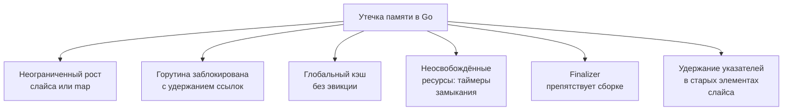

## Что такое утечка памяти в мире со сборщиком мусора

В [[5. pprof memory profile]] мы освоили инструменты для снятия срезов памяти — inuse_space и alloc_space. Теперь мы применим их к одной из самых коварных проблем: **утечкам памяти**. В языках с ручным управлением памятью утечка означает неосвобождённый `malloc`. В Go, где работает GC, классических утечек «потерянных указателей» быть не может: GC сам подчищает всё недостижимое. Но это не избавляет нас от утечек — они просто меняют природу.

**Утечка памяти в Go** — это ситуация, когда программа удерживает ссылки на объекты, которые ей больше не нужны, и GC не может их собрать. В результате куча неограниченно растёт, растут паузы GC ([[6. GC pause и latency]]), падает throughput и в конечном счёте приложение падает по OOM. Senior-инженер обязан уметь находить и устранять такие утечки, опираясь на профили и трассировку.

В этой статье мы разберём типичные сценарии утечек, методологию их обнаружения через pprof и `GODEBUG`, связь с моделью памяти ([[1. Memory model Go]]) и влияние на эффективность кэша.

## Типы утечек памяти в Go

Все утечки в Go сводятся к одному: **ненужная достижимость**. Объект достижим из корней GC (глобальные переменные, стеки горутин, регистры), значит, он жив и будет расти. Классифицируем по механизму возникновения.



### 1. Неограниченный рост слайса или map

Самый частый вид утечки. Данные добавляются в слайс или мапу, но никогда не удаляются, а программа рассчитана на долгую работу.

```go
var cache = make(map[string][]byte)

func handler(w http.ResponseWriter, r *http.Request) {
    key := r.URL.Query().Get("key")
    data := fetchData(key)
    cache[key] = data // утечка: никогда не чистится
}
```

Память растёт линейно с количеством уникальных ключей. GC не может собрать `data`, потому что оно достижимо через глобальную `cache`.

**Диагностика:** `inuse_space` профиль покажет гигантский `cache` или `runtime.mapassign`. Сравнение двух профилей, снятых с интервалом, покажет рост.

### 2. Горутина, заблокированная с удержанием ссылок

Горутина зависает на канале, мьютексе или системном вызове и держит в своём стеке или замыкании крупные объекты. Сама горутина — это тоже память (стек + структура `g`).

```go
func startWorker() {
    ch := make(chan *LargeStruct)
    go func() {
        data := &LargeStruct{...}
        ch <- data // никто не читает из ch — горутина навсегда зависла
    }()
}
```

Горутина не завершается, канал и структура остаются живыми.

**Диагностика:** профиль горутин (`/debug/pprof/goroutine?debug=2`) покажет зависшие горутины с полным стеком. `inuse_space` покажет удержанные объекты.

### 3. Глобальный кэш без эвикции

Любой самодельный кэш (map, sync.Map) без политики удаления старых записей — потенциальная утечка. Даже при использовании `sync.Pool` ([[2. sync Pool]]) утечки нет, потому что GC может очищать пул, но если объекты из пула куда-то сохраняются, они утекают.

### 4. Неосвобождённые ресурсы: таймеры, замыкания

`time.Ticker` и `time.Timer` должны быть остановлены (`Stop()`), иначе они удерживают ссылки и не собираются. Замыкания, захватившие переменные, могут продлевать жизнь этим переменным дольше ожидаемого.

```go
func periodic() {
    ticker := time.NewTicker(time.Second)
    // забыли ticker.Stop() — горутина тикера и связанные объекты живут вечно
}
```

### 5. Finalizer, блокирующий сборку

Если на объект установлен финализатор (`runtime.SetFinalizer`), и этот объект становится недостижимым, GC помещает его в очередь финализаторов. Если финализатор никогда не выполняется (например, программа завершилась), объект может не быть освобождён. Но главное — финализатор может *воскресить* объект, сделав его снова достижимым, что порождает плавающую утечку.

### 6. Удержание указателей в «мёртвых» элементах слайса

Если слайс используется как кольцевой буфер, и старые элементы не затираются, они продолжают удерживать память, даже если логически удалены.

```go
buf := make([]*LargeStruct, 0, 1024)
for i := 0; i < 1024; i++ {
    buf = append(buf, &LargeStruct{})
}
// "удаляем" первые 1000, но не обнуляем
buf = buf[1000:] // underlying array ещё держит указатели на первые 1000
```

GC не соберёт эти структуры, потому что слайс всё ещё указывает на них через backing array.

**Исправление:** обнулять ссылки перед сдвигом: `for i := 0; i < 1000; i++ { buf[i] = nil }` или копировать хвост в новый слайс.

## Инструменты для поиска утечек

### pprof heap профиль с inuse_space

Основной метод: снять несколько inuse-профилей с интервалом (например, 10 минут) и сравнить их. Если `inuse_space` определённых функций неуклонно растёт — это утечка.

```bash
curl -o heap1.prof "http://localhost:6060/debug/pprof/heap"
# ждём 10 минут под нагрузкой
curl -o heap2.prof "http://localhost:6060/debug/pprof/heap"
go tool pprof -http=:8080 -diff_base=heap1.prof heap2.prof
```

На flamegraph или в таблице красным будут выделены функции, где память прибавилась. Проверяем `list FuncName` — видим строки, где создаются объекты.

> [!warning] Ловушка / Gotcha
> Профиль inuse_space отражает только живые объекты на момент снятия. Если утечка медленная и объекты периодически всё же умирают, разница может быть незаметной. Нужно снимать несколько профилей и анализировать тренд.

### GODEBUG=gctrace=1

Включение трассировки GC выводит в stderr строки вида:

```
gc 123 @45.123s 1%: 0.50+0.20+0.10 ms clock, ... -> 120->80->40 MB, 100 MB goal
```

Растущий `-> ... MB` после каждого цикла GC при стабильной нагрузке сигнализирует об утечке: куча не возвращается к исходному размеру.

### Профиль горутин

Утечки горутин легко обнаружить через `/debug/pprof/goroutine?debug=2`. Если число горутин монотонно растёт, и многие висят в одном и том же стеке — утечка горутин, а вместе с ними и памяти.

### runtime.ReadMemStats

В коде можно периодически снимать `runtime.ReadMemStats(&m)` и смотреть на `HeapInuse`, `HeapIdle`, `NumGC`. Растущий `HeapInuse` при стабильной нагрузке — признак утечки.

## Методика расследования утечки

1. **Подтвердить утечку.** Если метрики контейнера показывают неограниченный рост RSS, а GC не справляется и `GODEBUG=gctrace=1` показывает рост кучи — утечка есть.
2. **Снять inuse-профиль** дважды с интервалом. Определить функции-кандидаты, где память растёт.
3. **Проанализировать код** этих функций: есть ли глобальные map/slice, которые только растут; есть ли горутины, которые не завершаются.
4. **Проверить профиль горутин** на предмет зависших.
5. **Локально воспроизвести** под нагрузкой с `go test -memprofile` и `benchmem`.
6. **Устранить причину** и верифицировать повторным сравнением профилей.

## Пример расследования

Симптом: сервис на Go падает по OOM каждые 2 часа.

1. Включаем `GODEBUG=gctrace=1`, видим, что после каждого GC куча не уменьшается, а стабильно растёт на 50 МБ за минуту.
2. Снимаем inuse-профиль с интервалом 60 секунд:
   ```bash
   curl "http://localhost:6060/debug/pprof/heap?seconds=60" > heap1.prof
   sleep 300
   curl "http://localhost:6060/debug/pprof/heap?seconds=60" > heap2.prof
   ```
3. Открываем `go tool pprof -http=:8080 -diff_base=heap1.prof heap2.prof`. Видим, что `handler` увеличился на 200 МБ, внутри — `mapassign` в `cache`.
4. `list handler` показывает, что в map пишутся данные без удаления. Добавляем TTL или LRU.
5. После фикса — повторный мониторинг, утечка исчезла.

## Ловушки и неочевидные случаи

> [!warning] Ловушка / Gotcha
> **Кэш пакета `sync.Map` не растёт бесконечно, но может фрагментировать память.** Если вы используете `sync.Map` как кэш с удалением, старые записи освобождаются не сразу, а при следующем GC, который обнаружит, что они недостижимы. Но если ключи и значения содержат указатели на большие объекты, они могут утекать, если `sync.Map` используется неправильно (например, ключом является строка, которая строится динамически и нигде больше не хранится, GC её не соберёт, пока она в map).

> [!warning] Ловушка / Gotcha
> **Профиль может показывать не источник, а жертву.** Если вы видите рост памяти в `runtime.makeslice` или `runtime.growslice`, ищите, кто выделяет эти слайсы и сохраняет их навечно.

> [!warning] Ловушка / Gotcha
> **Временные утечки через замыкания.** Горутина с `time.AfterFunc` может захватить переменную и продлить ей жизнь. Всегда очищайте таймеры и используйте `defer` для `Stop()`.

> [!warning] Ловушка / Gotcha
> **Сборка мусора не мгновенна.** После удаления ссылки объект может жить до следующего GC. Краткосрочные всплески памяти не есть утечка.

## Mechanical Sympathy: как утечка убивает производительность

Утечка памяти — это не только угроза OOM. Каждый лишний живой объект:
- Увеличивает время mark-фазы GC ([[2. Tri color marking]]), так как граф достижимости растёт.
- Заставляет GC чаще запускаться (если утечка быстрая), увеличивая CPU overhead.
- Расширяет кучу, вызывая больше TLB-промахов и кэш-промахов, потому что рабочий набор выходит за пределы L3.
- Может привести к свопингу в ОС, что катастрофически замедляет всё приложение.

Поэтому борьба с утечками — это не только про память, но и про CPU и latency.

## Итог

- **Утечки памяти в Go** — это не потерянные указатели, а ненужная достижимость объектов, приводящая к неконтролируемому росту кучи.
- Основные типы: растущие map/slice, зависшие горутины, глобальные кэши без очистки, неостановленные таймеры, удержанные указатели в старых элементах слайса.
- Инструменты: pprof inuse_space с дифференциальным сравнением, `GODEBUG=gctrace=1`, профиль горутин, `runtime.ReadMemStats`.
- Методика: подтвердить рост кучи, снять и сравнить inuse-профили, найти удерживающий код, исправить, верифицировать.
- Утечки влияют не только на память, но и на производительность CPU и latency через нагрузку на GC и кэш.

После того как мы научились находить утечки, следующим шагом будет понимание того, как память, даже освобождённая, может быть неэффективно использована — [[7. Fragmentation]].