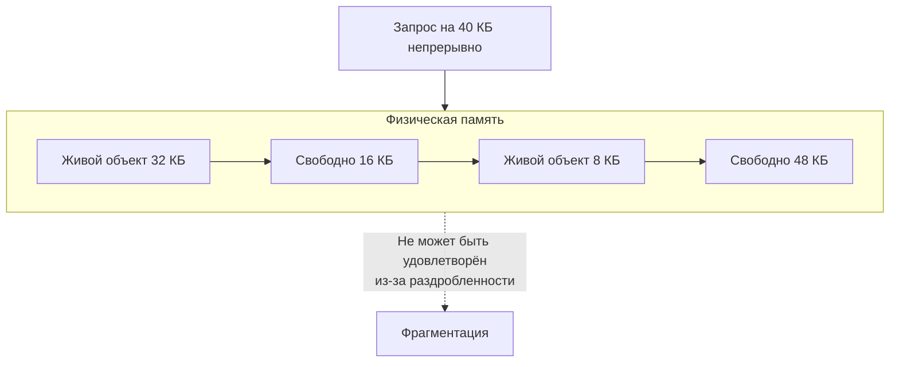

## Фрагментация: скрытая цена неограниченной свободы

В [[6. Утечки памяти]] мы разобрались, как неосвобождённые объекты ведут к безграничному росту кучи. Но даже если утечек нет, и сборщик мусора исправно подчищает мусор, память может использоваться неэффективно. Это явление называется **фрагментацией** — когда свободное пространство кучи раздроблено на множество мелких, разрозненных фрагментов, неспособных удовлетворить запросы на выделение крупных объектов.

Фрагментация напрямую не вызывает OOM (хотя может), но увеличивает RSS процесса, повышает давление на TLB и кэш процессора, замедляет аллокации и, в конечном счёте, ухудшает throughput и latency. Понимание фрагментации и умение с ней бороться — обязательный навык Senior Go-инженера, настраивающего высоконагруженный сервис.

В этой статье мы разберём виды фрагментации в Go, как их обнаружить, свяжем с внутренним устройством аллокатора ([[1. Memory model Go]]) и предложим стратегии минимизации, включая `sync.Pool` ([[2. sync Pool]]), предвыделение ([[4. Предвыделение памяти]]) и тюнинг GC ([[7. GOGC и tuning]]).

## Два лица фрагментации: внутренняя и внешняя

В управляемых языках, таких как Go, фрагментацию разделяют на два уровня.

### Внутренняя фрагментация (internal fragmentation)

Возникает из-за того, что аллокатор выделяет память блоками фиксированных размеров (классами, size classes). Объект, запрашивающий 33 байта, будет округлён до 48 байт (ближайший класс). 15 байт внутри этого блока пропадают — это и есть внутренняя фрагментация. Она существует в каждом размере и принципиально не устранима, пока используется система классов размеров.

Классы размеров в Go (актуально для Go 1.21+):
- 8, 16, 24, 32, 48, 64, 80, 96, 112, 128, 144, 160, 176, 192, 208, 224, 240, 256, ...
- Максимальный класс — 32768 байт (32 КБ).
- Объекты больше 32 КБ выделяются напрямую из куч (large objects) с кратностью страниц (8 КБ), где фрагментация внешняя.

Внутренняя фрагментация — плата за скорость. Без классов размеров пришлось бы искать подходящий свободный блок сложными алгоритмами (best-fit, TLSF), что добавляло бы задержек и блокировок. Go выбрал быстрые аллокации ценой некоторой потери памяти.

> [!info] Под капотом
> Конкретные потери от внутренней фрагментации зависят от распределения размеров объектов. Приложение, создающее много структур по 40 байт, будет платить 20% штрафа (округление до 48). Приложение, создающее объекты ровно по 32 байта, потерь не несёт. Инструментов прямого замера внутренней фрагментации в Go нет, но её можно оценить через `go tool pprof -sample_index=inuse_objects` и сравнение с `inuse_bytes`.

### Внешняя фрагментация (external fragmentation)

Возникает, когда между живыми объектами в куче появляются промежутки свободной памяти, слишком мелкие, чтобы удовлетворить новый запрос, или расположенные на разных страницах. В сумме свободной памяти много, но непрерывного блока нужного размера нет.

В Go, благодаря использованию спанов (mspan), каждый спан содержит объекты одного размера и либо полностью занят, либо полностью свободен. Это сводит внешнюю фрагментацию для мелких объектов почти к нулю: свободные ячейки внутри спана однородны и легко заполняются. Однако для **крупных объектов** (более 32 КБ) и **метаданных рантайма** внешняя фрагментация существует и может быть значительной.

Крупные объекты выделяются напрямую из арен (arena) целыми страницами. Если программа чередует выделение больших и маленьких объектов, и большие освобождаются, между освободившимися страницами могут оставаться занятые блоки, мешающие выделению следующего большого объекта. Это и есть классическая внешняя фрагментация.



## Причины фрагментации в Go

### 1. Смешанное время жизни объектов
Объекты, выделенные в разное время, и с разным временем жизни, размещаются вперемешку. Когда краткоживущие освобождаются, остаются «дыры», окружённые долгоживущими. Спаны, содержащие только один размер, решают проблему для мелких, но для больших объектов и для самих спанов (как метаданных) фрагментация возможна.

### 2. Неравномерное давление аллокаций
Пиковые нагрузки создают множество временных объектов, потом они освобождают память, но куча не обязательно возвращает её ОС немедленно. Некоторое время удерживается большой объём `HeapIdle` — свободной, но не возвращённой ОС памяти. Это не фрагментация в чистом виде, но эффект похож: RSS раздут.

### 3. Возврат памяти ОС и `MADV_FREE`
С версии Go 1.16 на Linux куча использует `MADV_FREE` вместо `MADV_DONTNEED` для возврата свободных страниц. Память помечается как доступная для переиспользования, но не вычитается из RSS, пока система не испытывает недостаток памяти. Это выглядит как раздутый RSS, но не есть фрагментация. Однако может маскировать реальную фрагментацию. Управляется через `GODEBUG=madvdontneed=1`.

> [!warning] Ловушка / Gotcha
> После перехода на `MADV_FREE` вы можете видеть, что RSS сервиса остаётся высоким даже после падения нагрузки. Это нормально, пока память не нужна системе. Но если мониторинг алертит по RSS, можно переключиться на `madvdontneed=1`, хотя это может незначительно увеличить CPU.

## Как измерять фрагментацию в Go

Прямых метрик «уровня фрагментации» в Go нет. Диагностика — по косвенным признакам.

### 1. GODEBUG=gctrace=1
Вывод GC-циклов содержит размер кучи до и после:

```
gc 1 @0.001s 0%: 0.015+0.13+0.007 ms clock, ... -> 1.1->1.1->1.0 MB, 4 MB goal, ...
gc 2 @0.002s 0%: ... -> 1.0->1.5->1.5 MB, 2 MB goal, ...
```

Параметр `-> ... MB` — это `HeapInuse` после GC. Если `HeapInuse` стабильно растёт при постоянной нагрузке — либо утечка, либо накопление долгоживущих объектов, либо фрагментация, мешающая вернуть память.

### 2. runtime.ReadMemStats
Структура `MemStats` содержит ключевые поля:
- `HeapInuse` — память, занятая живыми объектами (включая фрагментацию внутри спанов).
- `HeapIdle` — свободная память, удерживаемая рантаймом, но не возвращённая ОС.
- `HeapReleased` — память, возвращённая ОС.
- `HeapAlloc` — чисто байты в живых объектах.
- `StackInuse` — память под стеки горутин.
- `TotalAlloc` — кумулятивные аллокации.

Если `HeapIdle` велик, а `HeapReleased` мал, куча не отдаёт память (возможно, из-за фрагментации, мешающей освободить целые арены). Если `HeapInuse` значительно больше `HeapAlloc` — велика внутренняя фрагментация.

### 3. pprof heap профиль
Инструмент показывает `inuse_space` — живые объекты. Если топ-функции по объёму используют мелкие объекты, которые на самом деле занимают больше памяти (из-за внутренней фрагментации), это можно заподозрить, сравнив `inuse_objects` с ожидаемым количеством. Но для точного анализа нужны дополнительные утилиты.

### 4. Linux /proc/pid/maps и perf
Просмотр карты памяти процесса (`cat /proc/<pid>/maps` или `pmap -x <pid>`) показывает, сколько памяти под кучу выделено и сколько из неё активно. `perf trace -e 'syscalls:sys_enter_madvise*'` покажет, когда рантайм вызывает `madvise`.

## Стратегии минимизации фрагментации

### 1. Использовать sync.Pool для горячих временных объектов
`sync.Pool` ([[2. sync Pool]]) переиспользует объекты вместо того, чтобы освобождать и заново выделять. Это напрямую снижает количество аллокаций и, следовательно, фрагментацию спанов, потому что слоты внутри спана не освобождаются в произвольном порядке.

### 2. Предвыделять слайсы и мапы
Когда известен ожидаемый размер, `make([]T, 0, cap)` и `make(map[K]V, cap)` уменьшают число последующих `growslice` и эвакуаций, каждая из которых оставляет после себя мусор и способствует фрагментации ([[4. Предвыделение памяти]]).

### 3. Агрегировать аллокации в батчи
Вместо тысяч отдельных маленьких объектов выделить один крупный слайс и нарезать внутри (arena allocation). Это не только снижает фрагментацию, но и улучшает cache friendliness ([[8. Cache friendliness]]). Пример — сам Go-рантайм с аренами.

### 4. Избегать перемежающихся выделений больших и малых объектов
Если возможно, пулить большие объекты (large buffers) и переиспользовать их.

### 5. Ограничивать пиковые аллокации через rate limiting
Если сервис под нагрузкой создаёт массу временных структур, которые затем освобождаются, это расширяет кучу. Применение семафоров, ограничивающих число одновременно обрабатываемых запросов, сглаживает пики.

### 6. Тюнинг GOGC и GOMEMLIMIT
`GOGC` ([[7. GOGC и tuning]]) управляет целевым размером кучи относительно размера живых объектов. Низкое `GOGC` чаще запускает GC и компактнее держит кучу, уменьшая холостую память, но повышая CPU. `GOMEMLIMIT` ([[8. GOMEMLIMIT]]) позволяет установить мягкий лимит памяти, при приближении к которому GC становится агрессивнее, что также сдерживает раздувание кучи и фрагментацию.

### 7. Для критических участков — предварительно выделять и никогда не освобождать
В системах, где пиковая память допустима, можно выделить глобальный буфер нужного размера на старте и использовать его с ручным управлением слотами (ring buffer, slab allocator). Это полностью исключает фрагментацию, но требует осторожного кода.

## Компактизация: почему её нет в Go

Некоторые сборщики мусора (например, JVM Shenandoah, ZGC) выполняют компактизацию — перемещение живых объектов для слипания свободного пространства в один блок. В Go GC не компактизирует: он использует неперемещающий сборщик. Объекты остаются на месте, спаны либо полностью заняты, либо полностью освобождаются (для классов). Компактизация больших объектов не производится.

Причины: Go нацелен на низкую latency, компактизация требует остановки или сложных барьеров (как в C4). Отсутствие компактизации означает, что внешняя фрагментация для крупных объектов неизбежна, и единственный способ борьбы — пулинг и агрегация.

> [!tip] Собеседование
> **Вопрос:** Есть ли в Go сборщик мусора с компактизацией? Если нет, как бороться с фрагментацией?
> **Ответ:** Нет, GC в Go — mark-sweep некомпактизирующий. Для борьбы с фрагментацией применяют sync.Pool, предвыделение, ручное управление памятью через арены, тюнинг GOGC/GOMEMLIMIT и агрегацию мелких объектов в крупные блоки.

## Mechanical Sympathy: фрагментация и процессор

Фрагментированная куча не только тратит память. Она:
- **Увеличивает TLB misses**: живые объекты размазаны по большому количеству страниц. Таблица трансляции виртуальной памяти в физическую ограничена. Каждый новый доступ к объекту с высокой вероятностью вызывает промах TLB, который стоит 10-20 нс.
- **Ухудшает кэш-эффективность**: разреженные данные хуже поддаются предвыборке (prefetching) ([[8. Cache friendliness]]).
- **Замедляет аллокации**: аллокатору приходится искать подходящий спан, возможно, запрашивать новую аренду у ОС, если свободные раздроблены.
- **Увеличивает паузы GC**: большее количество спанов и арен для сканирования метаданных.

Таким образом, уменьшение фрагментации — это часть комплексной оптимизации производительности, тесно связанная с [[5. Mechanical sympathy в backend разработке]].

## Итог

- **Фрагментация памяти** в Go — это не классическая «потеря байтов», а раздробленность свободного пространства, мешающая эффективно использовать RAM.
- Внутренняя фрагментация — плата за классы размеров; внешняя — за отсутствие компактизации для больших объектов.
- Диагностируется косвенно: `HeapIdle` vs `HeapReleased`, `GODEBUG=gctrace=1`, `pprof` и карта памяти.
- Борьба: `sync.Pool`, предвыделение, пулы больших объектов, агрегация, тюнинг GC.
- Фрагментация влияет не только на память, но и на CPU через TLB и кэш-промахи, и на latency через замедление аллокаций.

Понимая, как «дырявится» куча, мы можем перейти к тому, как долго живут объекты и как это влияет на все аспекты производительности: [[8. Object lifetime]].