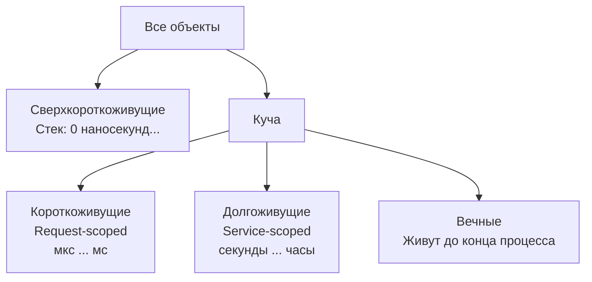

## Почему время жизни объекта — это не только про GC

В предыдущих статьях подраздела мы разобрали, где живут объекты ([[2. Heap vs stack]]), почему они попадают в кучу ([[3. Escape analysis]]), как измерять аллокации ([[4. Allocation profiling]], [[5. pprof memory profile]]) и диагностировать утечки ([[6. Утечки памяти]]) и фрагментацию ([[7. Fragmentation]]). Все эти аспекты завязаны на одну фундаментальную характеристику — **время жизни объекта** (object lifetime). Сколько тактов процессора пройдёт от выделения памяти до момента, когда объект станет мусором, напрямую определяет нагрузку на GC, эффективность кэша и даже фрагментацию кучи.

В мире Go, где нет поколений (generational GC) и все объекты проходят полный цикл mark-sweep, время жизни объекта влияет на производительность иначе, чем в JVM или .NET. Senior Go-инженер должен уметь оценивать и осознанно управлять временем жизни, чтобы держать GC под контролем ([[7. GOGC и tuning]]), минимизировать latency и максимизировать throughput. Эта статья завершает подраздел Memory profiling, подводя итог всему, что мы узнали о памяти.

## Классификация объектов по времени жизни

В типичном Go-приложении можно выделить четыре категории:

1. **Сверхкороткоживущие (Stack-bound):** живут в пределах одного вызова функции, никогда не попадают в кучу. Время жизни — несколько десятков наносекунд. GC не видят. Пример: локальные переменные, которые не убегают.
2. **Короткоживущие (Request-scoped):** живут в пределах обработки одного запроса или итерации. Выделяются в куче, используются и быстро умирают (до следующего GC или в течение 1-2 циклов). Пример: временные буферы, `strings.Builder`, распарсенный JSON.
3. **Долгоживущие (Session/Connection/Service-scoped):** существуют минуты, часы или всю жизнь процесса. Пример: кэши, конфигурации, пулы соединений, структуры, удерживаемые в глобальных переменных.
4. **Вечные (Immortal):** глобальные переменные, инициализированные при старте и никогда не освобождаемые.

Границы размыты, но классификация полезна для выбора стратегии оптимизации: короткоживущие нагружают аллокатор и sweep, долгоживущие — mark-фазу, а вечные просто занимают память, но не создают работы для GC после старта.

## Как время жизни влияет на сборщик мусора

В отличие от JVM HotSpot с generational GC (где молодые объекты собираются быстрее и дешевле), сборщик мусора Go — **одноуровневый mark-sweep** без поколений. Все объекты в куче равны: и те, что прожили микросекунду, и те, что живут сутки, проходят полный цикл mark.

### Короткоживущие объекты

- **Mark-фаза:** GC вынужден сканировать все живые объекты. Если объект умирает до начала mark, он просто не посещается. Но объект, родившийся и умерший между циклами, всё равно был аллоцирован (затрачены такты на выделение) и оставил след в span. При sweep его ячейка просто возвращается в пул свободных. Короткоживущие, пережившие один цикл, маркируются наравне со всеми, но потом быстро умирают и на следующем цикле sweep освобождаются дёшево — часто весь span опустошается и возвращается ОС.
- **Sweep-фаза:** span, целиком состоящий из мёртвых объектов, освобождается целиком (быстро). Если span частично жив, GC обходит его ячейки.
- **Аллокационная нагрузка:** короткоживущие объекты — основной драйвер частоты GC-циклов. Если аллокации идут быстро, `HeapInuse` быстро достигает `GOGC`-цели, и GC запускается. Снижая количество короткоживущих аллокаций, мы напрямую уменьшаем частоту GC ([[1. Уменьшение аллокаций]]).

### Долгоживущие объекты

- Эти объекты участвуют в каждом mark-цикле и никогда не освобождаются. Они добавляют постоянную работу по сканированию указателей ([[2. Tri color marking]]).
- Write barrier ([[5. Write barriers]]) активируется при каждой записи указателя в такой объект, что добавляет такты даже после того, как объект давно выделен.
- Удержание большого количества долгоживущих объектов раздувает размер кучи (HeapInuse), что заставляет GC реже запускаться (поскольку цель = GOGC * живые байты), но каждый цикл становится дороже из-за большего объёма маркируемых данных.
- Если долгоживущие объекты содержат много указателей, они могут рассеивать кучу и влиять на TLB.

> [!info] Под капотом
> В Go нет поколений, но есть оптимизация: аллокатор старается размещать объекты одного размера в пределах одного спана. Короткоживущие объекты, выделенные вместе, часто вместе и умирают. Это даёт эффект, напоминающий generational GC: спаны, заполненные временными объектами запроса, быстро освобождаются целиком, что дёшево.

## Время жизни и кэш-память процессора

С точки зрения механической эмпатии ([[5. Mechanical sympathy в backend разработке]]) время жизни непосредственно влияет на то, успеет ли объект прогреться в кэше.

- **Сверхкороткоживущие на стеке:** живут в L1, L2 — идеально.
- **Короткоживущие в куче:** выделяются, заполняются данными и быстро освобождаются. За свою короткую жизнь могут не успеть загрузиться в L3 (если объект не очень велик). Но сам факт аллокации создаёт трафик в кэш: обнуление памяти (`memclr`) пишет в кэш-линии, потенциально вытесняя полезные данные. Если таких объектов много, они "загрязняют" кэш (cache pollution), вытесняя долгоживущие структуры, которые потом приходится загружать из RAM.
- **Долгоживущие:** имеют шанс прогреться и оставаться в кэше, если активно используются. Но если они разбросаны по куче и не помещаются в L3, доступ к ним вызывает постоянные промахи вплоть до RAM.
- **Вечные:** идеально прогреты. Поэтому глобальные переменные, конфиги, FAQ-данные стоит размещать так, чтобы они были компактны и дружественны кэшу ([[6. Cache friendly структуры]]).

Таким образом, управление временем жизни — это не только про снижение нагрузки на GC, но и про удержание рабочего набора данных в пределах L3-кэша процессора.

## Инструменты для оценки времени жизни объектов

В Go нет прямого профайлера времени жизни объектов. Но есть косвенные методы.

1. **`GODEBUG=gctrace=1`** — показывает объём живых объектов до и после каждого цикла GC и целевой размер кучи. Если после каждого цикла куча возвращается к стабильному уровню — преобладают короткоживущие. Если куча неуклонно растёт — накапливаются долгоживущие (или утечка).

2. **Execution tracer** (`go tool trace`, [[3. execution tracer]]) — записывает события выделения памяти (`runtime/alloc`), сборки мусора (`gcStart`, `gcFinish`) и показывает, в какие моменты создаются объекты. Можно визуально оценить, живут ли объекты между запросами или умирают сразу.

3. **`runtime.ReadMemStats`** — поле `TotalAlloc` показывает суммарный выделенный объём. Если он растёт быстро при стабильном `HeapInuse` — доминируют короткоживущие.

4. **pprof heap профиль** — сравнение нескольких inuse-профилей во времени ([[6. Утечки памяти]]) позволяет найти объекты, живущие аномально долго.

5. **Бенчмарки с `-benchmem`** — показывают allocs/op, что характеризует короткоживущие аллокации на единицу работы.

> [!tip] Собеседование
> **Вопрос:** Как определить, какие объекты живут дольше одного GC-цикла?
> **Ответ:** Сравнить `inuse_space` профили до и после GC (например, сразу после принудительного `runtime.GC()`). Объекты, оставшиеся после GC, — долгоживущие. Также смотреть `GODEBUG=gctrace=1` и анализировать тренд HeapInuse.

## Как управлять временем жизни для производительности

### 1. Укорачивать жизнь ненужных объектов
- Не держать ссылки в глобальных структурах без необходимости.
- Использовать слайсы с обнулением старых элементов (как в кольцевых буферах).
- Явно закрывать ресурсы (`Close`, `Stop`), чтобы связанные объекты становились недостижимыми.

### 2. Переиспользовать объекты через `sync.Pool`
Для горячих короткоживущих объектов `sync.Pool` ([[2. sync Pool]]) позволяет не убивать их, а возвращать в пул, избегая аллокаций и GC-нагрузки. Но важно, чтобы объекты не жили в пуле вечно — GC очищает пул, если объекты не используются.

### 3. Превращать короткоживущие в долгоживущие осознанно
Если объект дорого создавать (парсинг конфига, инициализация большого кэша), его имеет смысл сделать глобальным и никогда не освобождать. Это убирает нагрузку на аллокатор и GC.

### 4. Размещать на стеке всё, что можно
Escape analysis ([[3. Escape analysis]]) — главный инструмент. Избегайте возврата указателей, боксинга в интерфейсы, захвата в замыкания в горячих путях. Это делает объекты сверхкороткоживущими и полностью исключает их из кучи.

### 5. Предвыделение и агрегация
Вместо миллионов короткоживущих объектов — один большой объект (слайс, арена) и нарезка внутри ([[4. Предвыделение памяти]]). Это сокращает количество аллокаций и делает время жизни равным времени жизни агрегата (например, запроса).

### 6. Тюнинг GOGC и GOMEMLIMIT
Если короткоживущих объектов очень много, и GC не успевает, можно повысить `GOGC`, чтобы дать куче больше места и снизить частоту циклов. Если долгоживущие объекты раздувают память, `GOMEMLIMIT` ([[8. GOMEMLIMIT]]) ограничит общее потребление.

## Ловушки и антипаттерны

> [!warning] Ловушка / Gotcha
> **«Чем короче время жизни, тем лучше».** Это не всегда так. Если объект создаётся и умирает в горячем цикле, пул может дать больший выигрыш, чем постоянные аллокации. Но пул добавляет накладные расходы на синхронизацию и может удерживать память, которая могла бы быть освобождена. Всегда измеряйте.

> [!warning] Ловушка / Gotcha
> **Неявное продление жизни через замыкания.** Горутина с `time.AfterFunc` или `defer` с замыканием может захватить указатель и продлить жизнь объекта на неопределённое время. Это частая причина скрытых утечек.

> [!warning] Ловушка / Gotcha
> **Кэширование без TTL.** Превращение короткоживущего объекта в долгоживущий через кэш без эвикции ведёт к неконтролируемому росту кучи. Всегда устанавливайте политику замещения.

## Mechanical Sympathy: идеальный профиль времени жизни

С точки зрения "железа", идеальное приложение:
- Максимально использует стек (L1/L2).
- Имеет небольшой набор долгоживущих структур, которые помещаются в L3 и активно переиспользуются.
- Избегает массового создания короткоживущих кусочков мусора, которые вымывают кэш и дёргают GC.

Этот баланс достигается архитектурными решениями: выбором между value/pointer, пулами, буферами, гранулярностью структур данных. Senior Go-инженер видит за кодом не только логику, но и кривую выживаемости объектов.

## Итог

- **Время жизни объекта** — фундаментальная характеристика, определяющая нагрузку на GC, кэш и аллокатор.
- В Go все объекты проходят полный mark-sweep, но короткоживущие дешевле в sweep, а долгоживущие добавляют постоянную нагрузку на mark и write barrier.
- Инструменты: `GODEBUG=gctrace=1`, execution tracer, pprof, `ReadMemStats`. Прямого профайлера времени жизни нет, используются косвенные методы.
- Управление временем жизни через escape analysis, пулы, предвыделение, грамотное кэширование и тюнинг GC — ключ к высокой производительности.
- Оптимизация времени жизни — это не только про память, но и про кэш, TLB и стабильность latency.

На этом мы завершаем подраздел «Memory profiling». Мы прошли путь от модели памяти Go до времени жизни объектов. Теперь мы готовы погрузиться в самое сердце управления памятью — сборщик мусора. Следующая статья: [[1. GC в Go. Обзор]].