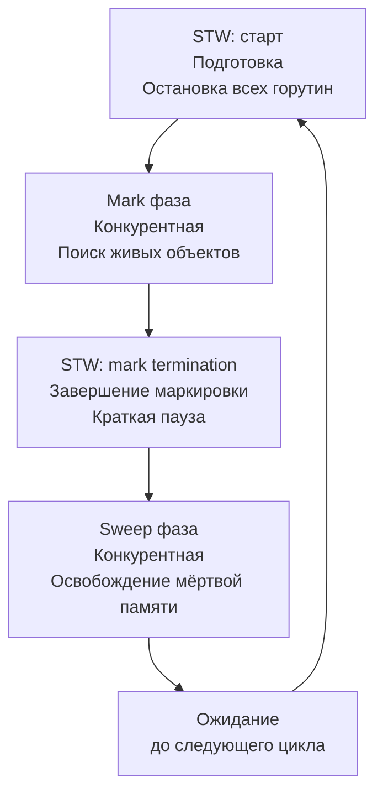

## Почему сборщик мусора — центральный элемент рантайма

В предыдущем подразделе мы детально разобрали управление памятью в Go: где живут переменные ([[2. Heap vs stack]]), как компилятор решает их судьбу ([[3. Escape analysis]]) и как измерять аллокации ([[4. Allocation profiling]], [[5. pprof memory profile]]). Все эти темы сходятся в одной точке — **сборщике мусора** (Garbage Collector, GC). Именно GC отвечает за автоматическое освобождение памяти в куче, позволяя разработчику не думать о `free()`. Но за это удобство приходится платить процессорным временем, паузами и усложнением рантайма.

Go GC — это не классический stop-the-world сборщик, который замораживает приложение на сотни миллисекунд. Начиная с версии 1.5, Go использует **конкурентный mark-sweep** с короткими паузами, нацеленный на минимальную latency даже под высокой нагрузкой. Понимание его устройства — обязательный навык Senior-инженера, позволяющий настраивать сервис ([[7. GOGC и tuning]], [[8. GOMEMLIMIT]]), диагностировать хвостовые задержки ([[7. Tail latency и почему она важна]]) и принимать архитектурные решения, снижающие нагрузку на GC ([[1. Уменьшение аллокаций]], [[9. Zero allocation подход]]).

Эта статья открывает подраздел «Garbage Collector» обзором фундаментальных концепций: зачем нужен GC, как он устроен на высоком уровне, как влияет на производительность и какими метриками измеряется. Детали фаз ([[2. Tri color marking]], [[3. Stop the world]], [[4. Concurrent GC]]), механизмов ([[5. Write barriers]]) и тюнинга будут раскрыты в последующих статьях.

## Философия GC в Go: низкая latency как приоритет

Создатели Go проектировали сборщик мусора с чёткой целью: **минимальные паузы для интерактивных сервисов**. Типичное веб-приложение обрабатывает тысячи запросов в секунду, и даже 10-миллисекундная остановка всех горутин может испортить p99 latency. Поэтому Go GC жертвует пиковой пропускной способностью (throughput) ради низкой и предсказуемой задержки.

Ключевые принципы:
- **Конкурентность.** Mark-фаза выполняется одновременно с рабочими горутинами (mutator), не блокируя их.
- **Короткие stop-the-world.** Только начальная настройка и финальная очистка требуют глобальной паузы, которая обычно измеряется микросекундами (подробнее в [[3. Stop the world]]).
- **Отсутствие поколений.** В отличие от JVM HotSpot, Go GC не разделяет объекты на молодые и старые. Все объекты проходят полный цикл mark-sweep. Это упрощает рантайм и исключает паузы, связанные с эвакуацией поколений.
- **Автоматический тюнинг.** Целевой размер кучи задаётся через `GOGC` (по умолчанию 100), и GC сам решает, когда запускаться, основываясь на темпе аллокаций.
- **Помощь мутатора (assist).** Если горутина выделяет память слишком быстро, она принудительно помогает GC маркировать объекты, предотвращая неконтролируемый рост кучи.

## Основные фазы GC: Mark и Sweep

Упрощённо, жизненный цикл Go GC состоит из двух больших фаз — **Mark** и **Sweep**, плюс вспомогательные паузы.



### Mark (маркировка)
Цель — найти все объекты, которые ещё достижимы из корней GC (глобальные переменные, стеки горутин, регистры). Алгоритм называется **триколорный маркинг** ([[2. Tri color marking]]). Объекты помечаются как белые (не посещённые), серые (посещённые, но потомки не проверены), чёрные (посещён полностью). В конце живые объекты — чёрные, мёртвые — белые и будут удалены.

Маркировка конкурентна: она идёт параллельно с работой приложения. Однако мутатор может менять граф объектов, поэтому используется **write barrier** ([[5. Write barriers]]) — небольшой кусочек кода, который срабатывает при каждой записи указателя и гарантирует, что GC не пропустит живой объект.

### Sweep (очистка)
После завершения mark GC знает, какие объекты мусор. Фаза sweep освобождает память и возвращает её в списки свободных спанов. Sweep тоже выполняется конкурентно и может быть ленивым: память освобождается не сразу, а по мере необходимости (при следующей аллокации). Это амортизирует затраты.

### Stop-the-world паузы
Несмотря на конкурентность, два момента требуют глобальной остановки:
1. **Mark setup** в начале цикла — подготовка структур, включение write barrier.
2. **Mark termination** — завершение маркировки, проверка очередей, выключение write barrier.

Длительность этих пауз в хорошо настроенном приложении составляет единицы-десятки микросекунд. Именно они ограничивают минимальную задержку ([[6. GC pause и latency]]).

## Эволюция GC в Go: от STW к конкурентному

Понимание истории помогает оценить текущий дизайн.

- **Go 1.0 – 1.4:** Классический mark-sweep с полной остановкой мира на всё время GC. Паузы достигали сотен миллисекунд, что исключало использование Go в latency-чувствительных системах.
- **Go 1.5:** Революция. Внедрён конкурентный mark и sweep с короткими STW. Паузы уменьшились до единиц миллисекунд.
- **Go 1.6 – 1.8:** Улучшение алгоритмов, добавление write barrier (Dijkstra + Yuasa), ассистентов (assist), настройка планировщика GC.
- **Go 1.12:** Введение `GOMEMLIMIT` в экспериментальном режиме, улучшение обработки больших куч.
- **Go 1.19:** Стабилизация `GOMEMLIMIT`, ставшего ключевым инструментом контроля памяти.

Сегодня Go GC — зрелый, низколатентный сборщик, способный обслуживать кучи в десятки гигабайт с паузами менее 100 микросекунд.

## Ключевые термины и действующие лица

- **Mutator (мутатор)** — ваши горутины, которые выделяют память и меняют граф объектов (пишут в указатели). GC работает на фоне, пока мутатор продолжает выполнение.
- **Collector (сборщик)** — горутины самого GC, выполняющие mark и sweep.
- **Write barrier (барьер записи)** — инструкции, вставляемые компилятором при записи указателей в кучу. Оповещают GC, что объект мог измениться, и он должен быть перепроверен.
- **Mark assist (помощь мутатора)** — когда горутина выделяет память, а GC не успевает за ней, горутина принудительно помогает маркировать объекты, замедляя себя, но предотвращая безграничный рост кучи.
- **STW (stop-the-world)** — моменты, когда все горутины приостанавливаются для выполнения критической фазы GC.

## Как GC влияет на производительность приложения

GC не бесплатен. Его влияние многогранно:

1. **CPU overhead.** Конкурентный mark потребляет ядра процессора. Если GC работает на том же физическом ядре, что и горячая горутина, throughput сервиса снижается.
2. **Паузы.** STW-фазы добавляют микроскопические остановки, которые напрямую ухудшают p99 latency. При плохом тюнинге или огромной куче эти паузы могут выходить за рамки SLO.
3. **Write barrier cost.** Каждая запись указателя в кучу слегка дороже из-за барьера. Это увеличивает `ns/op` для мутатора, даже когда GC не активен.
4. **Mark assist замедляет аллокации.** Если приложение аллоцирует быстрее, чем GC успевает освобождать, горутины-аллокаторы принудительно тратят своё время на маркировку, что ощущается как внезапное замедление.
5. **Вымывание кэша.** GC сканирует огромные объёмы памяти, загружая их в кэш и вытесняя полезные данные мутатора. После GC производительность может временно просесть, пока рабочий набор снова прогреется ([[5. Mechanical sympathy в backend разработке]]).

## Метрики GC: как заглянуть внутрь

### 1. GODEBUG=gctrace=1

Самый простой способ увидеть работу GC. При запуске приложения с этой переменной в stderr выводятся строки каждого цикла:

```
gc 1 @0.001s 0%: 0.015+0.13+0.007 ms clock, 0.12+0.10/0.13/0.05+0.05 ms cpu, 1->1->1 MB, 4 MB goal, 8 P
```

Расшифровка (упрощённо):
- `gc 1` — номер цикла.
- `@0.001s` — время от старта.
- `0.015+0.13+0.007 ms clock` — время STW-mark, concurrent mark, STW-mark termination в миллисекундах процессорного времени.
- `1->1->1 MB` — размер кучи до GC, после GC, размер живых объектов.
- `4 MB goal` — целевой размер кучи, после которого запустится следующий GC.
- `8 P` — количество логических процессоров.

Растущий goal при стабильной нагрузке сигнализирует об утечке ([[6. Утечки памяти]]) или необходимости тюнинга.

### 2. /debug/pprof/
Эндпоинт `http://localhost:6060/debug/pprof/gc` показывает историю GC-циклов и затраты. Полезно для корреляции с latency.

### 3. runtime.ReadMemStats()
Структура `MemStats` содержит детальную информацию: `NumGC`, `PauseTotalNs`, `PauseNs` (циклический буфер последних пауз), `GCCPUFraction` и другие. Подходит для экспорта в метрики.

### 4. Prometheus + client_golang
Стандартный подход для production: экспорт метрик через `promhttp`. Ключевые:
- `go_gc_duration_seconds` — гистограмма длительности GC-циклов.
- `go_memstats_heap_alloc_bytes` — текущий размер кучи.
- `go_memstats_gc_cpu_fraction` — доля CPU, потраченная на GC.
- `go_memstats_heap_objects` — количество живых объектов.

Эти метрики критичны для дашбордов и алертов ([[8. Observability и performance]]).

## Тюнинг GC: основные рычаги

Go предоставляет два главных параметра, управляемых окружением:

- **GOGC** (по умолчанию 100) — процентный порог. Если живых объектов X, GC запустится, когда куча достигнет X * (1 + GOGC/100). Увеличение GOGC (например, 200) означает, что GC будет реже запускаться, куча будет больше, но паузы реже. Уменьшение (например, 50) — чаще, куча меньше, но больше CPU на GC. Подробнее в [[7. GOGC и tuning]].
- **GOMEMLIMIT** (появился в Go 1.19, стабилен с 1.21) — мягкий лимит на общий размер кучи в байтах. Если куча приближается к лимиту, GC становится агрессивнее, включая дополнительные циклы, чтобы не превысить лимит. Это критично для контейнеров с ограниченной памятью и предотвращения OOM. Подробнее в [[8. GOMEMLIMIT]].

Третий, косвенный рычаг — **уменьшение аллокаций**. Каждый избежанный байт в куче снижает давление на GC ([[1. Уменьшение аллокаций]], [[9. Zero allocation подход]]).

## Mechanical Sympathy: GC и иерархия памяти

Сборщик мусора активно взаимодействует с кэш-памятью и TLB:
- Во время mark фазы GC сканирует живые объекты. Это приводит к массовым загрузкам кэш-линий. Полезные данные мутатора вытесняются, вызывая cache miss после GC.
- Write barrier при каждой записи в указатель добавляет инструкции, которые могут трогать глобальный буфер GC. Этот буфер, скорее всего, будет в L3 или RAM, вызывая промахи.
- Большая куча в сотни гигабайт приводит к TLB промахам, так как число страниц превышает ёмкость TLB. GC, обходящий эту кучу, платит огромную цену за каждую непопавшую страницу.
- Поэтому оптимизация памяти — это не только про меньшее потребление RAM, но и про уменьшение работы GC и улучшение локальности данных.

> [!tip] Собеседование
> **Вопрос:** Объясните, как конкурентный GC в Go может вызвать увеличение p99 latency, даже если STW-паузы микроскопичны.
> **Ответ:** Конкурентный mark потребляет CPU, конкурируя с горутинами за ядра. Это замедляет обработку запросов. Write barrier добавляет такты при каждой записи указателя. Mark assist при агрессивных аллокациях заставляет горутину тратить время на помощь GC. Кроме того, после GC кэш процессора вымывается, и запросы временно испытывают больше cache miss. Всё вместе расширяет хвост распределения задержек.

## Итог

- **Go GC** — конкурентный mark-sweep с упором на низкую latency. Основные фазы: Mark (поиск живых объектов) и Sweep (освобождение мусора), с короткими STW-паузами.
- Ключевые механизмы: триколорный маркинг, write barrier, mark assist. Они детализируются в следующих статьях.
- GC потребляет CPU, создаёт паузы, влияет на кэш и требует тюнинга через GOGC и GOMEMLIMIT.
- Диагностика через GODEBUG, pprof и Prometheus метрики — обязательный инструментарий Senior-инженера.
- Понимание работы GC необходимо для достижения целевых SLO по latency и throughput.

Теперь, разобрав общую картину, мы погрузимся в детали алгоритма, который лежит в основе mark-фазы. Следующая статья: [[2. Tri color marking]].