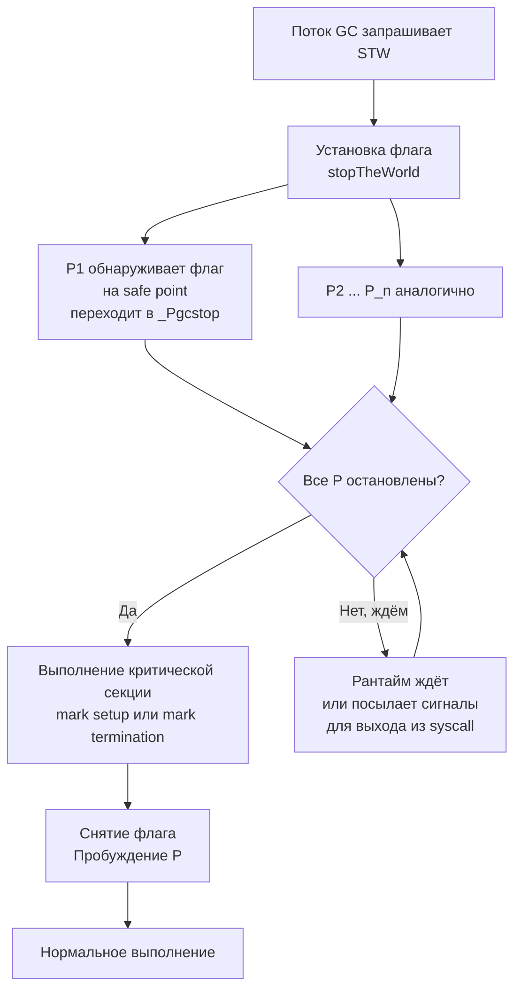

## Почему мир всё ещё останавливается

В [[1. GC в Go. Обзор]] мы определили Go GC как конкурентный сборщик с низкими паузами. В [[2. Tri color marking]] разобрали алгоритм, позволяющий маркировать живые объекты без остановки мутатора. Однако полностью избавиться от глобальных пауз не удалось — **Stop The World (STW)** остаётся неотъемлемой частью цикла сборки мусора.

STW в Go — это не баг и не пережиток прошлого, а осознанная инженерная необходимость. Без кратких точек полной согласованности невозможно инициализировать конкурентный обход, финализировать маркировку и обеспечить корректность write barrier. Задача Senior-инженера — понимать, когда и почему происходят эти паузы, как измерять их длительность и как минимизировать их влияние на p99 latency ([[7. Tail latency и почему она важна]]).

Эта статья вскрывает механику STW: что происходит с горутинами, как рантайм добивается глобальной остановки, как паузы зависят от параметров кучи и как на них реагирует планировщик. Мы свяжем теорию с метриками (`GODEBUG=gctrace=1`, execution tracer, `runtime.ReadMemStats`) и подведём к практическому тюнингу в [[7. GOGC и tuning]] и [[8. GOMEMLIMIT]].

## Что такое Stop The World в Go

**Stop The World** — это глобальная пауза, во время которой **все горутины** останавливаются, и рантайм выполняет критическую секцию, не опасаясь изменений со стороны мутатора. В этот момент:

- Ни одна горутина не исполняет пользовательский код.
- Все P (логические процессоры) приостановлены, новые горутины не планируются.
- Системные вызовы, которые были в процессе, завершаются или перехватываются.

STW не следует путать с обычной блокировкой горутины на мьютексе или канале — это глобальное событие уровня рантайма, затрагивающее всю программу.

В современном Go GC (начиная с 1.5) STW используется точечно, а не на весь период сборки. Основные точки:

1. **Mark setup** — подготовка к конкурентной mark-фазе.
2. **Mark termination** — завершение mark, обработка очередей write barrier, выключение барьеров.

Ранее существовал **sweep termination**, но сейчас sweep полностью конкурентный и ленивый, не требующий STW.

Длительность этих пауз, как правило, измеряется микросекундами, но может возрастать при неблагоприятных условиях (огромная куча, миллионы горутин).

## Как рантайм останавливает мир

Механика STW в Go — элегантный пример взаимодействия планировщика и ОС. Процесс реализован в `runtime/proc.go` функцией `stopTheWorldWithSema` (внутренняя). Упрощённо:

1. Поток, запросивший STW (обычно GC worker), устанавливает глобальный флаг `stopTheWorld`.
2. Каждый P, когда достигает точки безопасной остановки (safe point), видит флаг и переходит в состояние `_Pgcstop`.
3. Safe points — это места, где планировщик проверяет флаги: вызов функций, переходы в каналах, выделение памяти. Горутина, выполняющая длительный syscall, не достигает safe point быстро; тогда рантайм посылает сигнал, чтобы вывести её из syscall.
4. Когда все P остановлены, STW началась. Выполняется критическая работа (mark setup, mark termination).
5. После завершения флаг снимается, P пробуждаются, горутины продолжают выполнение.



> [!info] Под капотом
> Ключевые структуры: `sched.stopwait` — счётчик P, которые ещё не остановлены; `sched.stopnote` — sleep/wake механизм (futex) для ожидания. Safe points расставлены компилятором в прологах функций и перед некоторыми операциями. Без них остановка была бы асинхронной и опасной (прерывание в середине записи).

## Mark setup STW: подготовка маркировки

Эта пауза происходит перед началом конкурентной mark-фазы. Её задачи:

- Сбросить состояние mark-битов (цветов) для всех объектов в куче (массово обнулить битовые карты).
- Инициализировать рабочие очереди GC (пулы горутин-маркеров).
- Включить write barrier ([[5. Write barriers]]) — теперь любая запись указателя будет уведомлять GC.
- Установить флаг `worldStopped` и подготовить стеки горутин к сканированию (корни).

Длительность mark setup зависит от:
- Размера кучи (количества спанов, для которых нужно сбросить биты).
- Количества горутин (у каждой нужно сохранить стек как корень).
- Количества P (нужно синхронизировать остановку).

Типичная длительность: от единиц до сотен микросекунд.

## Mark termination STW: финализация маркировки

Вторая пауза — **mark termination** — наступает, когда конкурентный маркинг считает, что серых объектов не осталось, но требуется глобальная проверка. Задачи:

- Убедиться, что очереди маркеров пусты (drain all work queues).
- Обработать оставшиеся буферы write barrier ([[5. Write barriers]]) — те указатели, которые были записаны мутатором в последние мгновения.
- Выключить write barrier.
- Вычислить статистику (размер живых объектов, цель для следующего GC).
- Подготовиться к sweep-фазе (освобождению мусора).

Mark termination обычно дороже setup, так как требует опорожнения всех очередей. Длительность также измеряется микросекундами, но может возрастать при большом количестве указателей, накопленных в буфере барьеров.

## Факторы, влияющие на продолжительность STW

1. **Размер кучи.** Больше спанов → дольше сброс бит в setup и сканирование метаданных в termination.
2. **Количество горутин.** Каждая горутина — это стек, который нужно просканировать как корень. Стеки растут при глубоких рекурсиях и крупных фреймах, увеличивая время STW.
3. **Количество указателей в объектах.** Чем больше ссылочная структура, тем больше работы у write barrier, и тем объёмнее буферы для обработки в termination.
4. **Настройка `GOMAXPROCS`.** Большее число P может ускорить параллельную часть STW (некоторые вещи делаются конкурентно даже в STW), но увеличивает время на синхронизацию остановки и старта.
5. **Системные вызовы.** Горутины, застрявшие в долгом syscall без safe point, задерживают остановку, пока рантайм не вытащит их сигналом.
6. **Особенности платформы и ОС:** прерывания, планировщик ОС, частота таймера.

## Измерение STW: метрики и инструменты

### GODEBUG=gctrace=1

Каждый цикл GC выводит строку:

```
gc 1 @0.001s 0%: 0.015+0.13+0.007 ms clock, 0.12+0.10/0.13/0.05+0.05 ms cpu, ...
```

- `0.015` — STW mark setup (clock time, ms).
- `0.13` — конкурентный mark (clock time, wall clock — время, пока шёл mark, но не STW).
- `0.007` — STW mark termination (clock time, ms).

То есть паузы — это первое и третье числа. Сумма типично < 100 микросекунд для хорошо настроенного приложения.

### execution tracer

`go tool trace` ([[3. execution tracer]]) показывает временную диаграмму, где STW-участки выделены красным. Можно увидеть, в какой момент произошла пауза и как долго она длилась.

### runtime.ReadMemStats

`MemStats.PauseNs` — циклический буфер последних пауз (последние 256 циклов). `PauseEnd` — временные метки окончания пауз. Это можно экспортировать в Prometheus для мониторинга (см. [[8. Observability и performance]]).

### pprof

Эндпоинт `/debug/pprof/trace?seconds=5` позволяет снять трассу, содержащую GC-события, для последующего анализа.

> [!tip] Собеседование
> **Вопрос:** Как узнать длительность последней STW-паузы в работающем Go-приложении без остановки?
> **Ответ:** Использовать `runtime.ReadMemStats(&m)` и посмотреть `m.PauseNs[(m.NumGC-1)%256]`. Это покажет последнюю паузу в наносекундах.

## Влияние STW на производительность

Микросекундные паузы могут казаться незначительными, но их эффект накапливается:

- **Прямое увеличение latency.** Все запросы, обрабатываемые в момент STW, задерживаются на длительность паузы. Для p50 это незаметно, но p99 чувствует каждую паузу.
- **Каскадный эффект в цепочках вызовов.** Если сервис A ждёт ответа от B, который в момент STW замер, общая задержка растёт ([[7. Tail latency и почему она важна]]).
- **Пропуск heartbeats.** Системы координации (etcd, consul) могут счесть узел мёртвым при паузе > нескольких миллисекунд.
- **Снижение throughput.** Пока мир остановлен, ни один запрос не обрабатывается. Частые паузы (при агрессивном GC) снижают общую пропускную способность.

Современный Go GC нацелен на паузы < 100 мкс для большинства приложений. Однако при кучах > 100 ГБ и миллионах горутин паузы могут превышать 1 мс, что требует ручного тюнинга.

## Как уменьшить STW-паузы

1. **Уменьшить размер кучи и количество живых объектов.** Меньше данных → быстрее mark termination. Достигается через [[1. Уменьшение аллокаций]], [[2. sync Pool]], [[4. Предвыделение памяти]].
2. **Снизить количество горутин.** Каждая горутина добавляет стек для сканирования. Паттерны с фиксированным пулом воркеров вместо неограниченных горутин помогают.
3. **Избегать глубоких стеков.** Рекурсии и большие фреймы увеличивают стоимость сканирования стека. Переписывайте на итеративные алгоритмы.
4. **Тюнинг `GOGC` и `GOMEMLIMIT`.** Повышение `GOGC` даёт реже паузы, но кучу больше. `GOMEMLIMIT` предотвращает неконтролируемый рост, делая паузы более предсказуемыми ([[7. GOGC и tuning]], [[8. GOMEMLIMIT]]).
5. **Уменьшать ссылочность структур.** Меньше указателей → меньше работы write barrier и меньше буферов в termination. Value-embedding вместо указателей в горячих структурах ([[6. Cache friendly структуры]]).

> [!warning] Ловушка / Gotcha
> **«Конкурентный GC = нет пауз».**
> Маркетинговый миф. Конкурентный GC — это GC с *конкурентной mark-фазой*, но STW-паузы присутствуют всегда. Их длительность может быть пренебрежимо мала, но игнорировать их нельзя.

> [!warning] Ловушка / Gotcha
> **Блокировка в unsafe-коде или CGO.**
> Горутина, выполняющая код без safe points (например, C-функцию без co-operative многозадачности), может задержать STW. Рантайм посылает сигнал для прерывания, но это добавляет задержку.

## Mechanical Sympathy: остановка и процессор

STW не только задерживает логику, но и разрушает микроархитектурное состояние. После возобновления мира:

- Кэш-память частично вымыта работой GC (маркировка, сброс бит).
- TLB мог быть частично сброшен (если GC затрагивал много страниц).
- Предсказатель ветвлений сброшен (новый контекст исполнения после паузы).
- Планировщик ОС мог мигрировать горутины на другие ядра.

Всё это приводит к временному снижению производительности сразу после STW, пока кэши прогреваются заново. Это ещё одна причина минимизировать как длительность, так и частоту STW-пауз.

## Итог

- **STW** — обязательные точки глобальной остановки в Go GC: mark setup и mark termination, обеспечивающие корректную инициализацию и финализацию конкурентной маркировки.
- Остановка осуществляется через safe points в планировщике и занимает от единиц до сотен микросекунд.
- Длительность зависит от размера кучи, числа горутин, глубины их стеков и объёма указателей.
- Паузы измеряются через `GODEBUG=gctrace=1`, execution tracer и `runtime.ReadMemStats`.
- Уменьшение STW — это уменьшение аллокаций, числа горутин и ссылочности, а также грамотный тюнинг `GOGC`/`GOMEMLIMIT`.
- STW влияет на p99 latency и общую пропускную способность, а также на микроархитектурное состояние процессора.

Теперь, понимая моменты остановки, мы готовы разобрать, как именно GC выполняет свою работу, не мешая приложению, и какие механизмы обеспечивают конкурентность: [[4. Concurrent GC]].