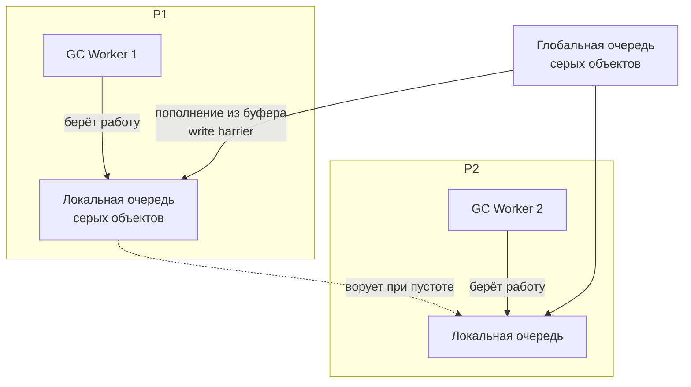

## Конкурентный GC: как Go совмещает сборку мусора и полезную работу

В [[1. GC в Go. Обзор]] мы обозначили, что Go GC нацелен на минимальные паузы. В [[2. Tri color marking]] разобрали алгоритм маркировки, а в [[3. Stop the world]] — неизбежные точки глобальной остановки. Однако главная «магия», делающая Go пригодным для низколатентных сервисов, заключена в слове **конкурентный**. Именно способность GC выполнять маркировку и очистку параллельно с работающими горутинами (мутатором) позволяет удерживать паузы в пределах микросекунд, а не миллисекунд.

**Конкурентный GC** означает, что фазы mark и sweep перекрываются во времени с исполнением пользовательского кода. Это не просто многопоточность — это синхронизированное сосуществование двух миров: мутатора, меняющего граф объектов, и сборщика, обходящего этот граф. Цена такой конкурентности — накладные расходы на write barrier ([[5. Write barriers]]), механизм mark assist и неизбежная конкуренция за процессорные ресурсы и кэш.

В этой статье мы детально разберём, как рантайм Go организует конкурентный mark и sweep, откуда берутся GC worker'ы, как работает mark assist и почему конкурентность не означает «бесплатно». Знание этих механизмов позволяет Senior-инженеру интерпретировать метрики GC ([[6. GC pause и latency]]), настраивать `GOGC` ([[7. GOGC и tuning]]) и понимать, почему p99 latency иногда «плывёт» даже при микросекундных STW ([[7. Tail latency и почему она важна]]).

## Архитектура конкурентного цикла

Полный цикл GC в Go включает четыре фазы, из которых две — с остановкой мира, а две — конкурентные.

```mermaid
gantt
    title "Цикл GC: чередование STW и конкурентных фаз"
    dateFormat  X
    axisFormat  %s
    
    section Мутатор
    Работает               :active, mut1, 0, 3
    Остановлен             :crit, stw1, 3, 5
    Работает конкурентно   :active, mut2, 5, 12
    Остановлен             :crit, stw2, 12, 14
    Работает конкурентно   :active, mut3, 14, 20

    section GC Mark
    Ждёт                   :done, gcw1, 0, 3
    STW: Setup             :crit, setup, 3, 5
    Конкурентная маркировка :active, concMark, 5, 12
    STW: Termination       :crit, term, 12, 14

    section GC Sweep
    Ждёт                   :done, gcs1, 0, 14
    Конкурентная очистка    :active, concSweep, 14, 20
```

- **Mark setup (STW)** — подготовка: сброс mark-битов, включение write barrier, подготовка корней.
- **Concurrent mark** — основная работа: горутины GC worker'ов параллельно с мутатором обходят граф живых объектов. Мутатор продолжает выделять память и менять указатели.
- **Mark termination (STW)** — финализация: опорожнение очередей, обработка буферов write barrier, выключение барьера.
- **Concurrent sweep** — освобождение памяти, занятой мёртвыми объектами. Sweep ленивый: спаны освобождаются либо по мере необходимости (при аллокациях), либо фоновыми горутинами.

Таким образом, мутатор останавливается только на две короткие паузы setup и termination ([[3. Stop the world]]). Всё остальное время он работает одновременно с GC.

## Конкурентная маркировка: кто и как маркирует

Конкурентная mark-фаза начинается сразу после mark setup STW. В этот момент рантайм запускает пул **GC worker'ов** — специальных горутин, которые только и делают, что обходят граф объектов и переносят их из белого в серый и чёрный ([[2. Tri color marking]]). Число worker'ов ограничено: по умолчанию до 25% от `GOMAXPROCS`. Это гарантирует, что GC не захватит все ядра, оставляя ресурсы мутатору.

Координация между worker'ами построена на work stealing ([[3. Work stealing]]), аналогично воровству горутин планировщиком ([[1. Scheduler Go. G-M-P модель]]). У каждого P есть локальная очередь серых объектов. Если локальная очередь пуста, worker может украсть работу из глобальной очереди или у другого P. Это обеспечивает балансировку нагрузки и не даёт отдельным потокам простаивать.



> [!info] Под капотом
> В исходном коде `runtime/mgc.go` GC worker'ы запускаются через `runtime.gcBgMarkWorker`. Каждый worker привязан к P и работает в режиме без вытеснения (preemption), пока не истощит работу. Объекты, которые становятся серыми из-за write barrier, помещаются в глобальную очередь или в буфер конкретного P.

### Mark assist: когда мутатор должен помогать

Конкурентная маркировка хороша, но она не мгновенна. Если мутатор выделяет память быстрее, чем GC worker'ы маркируют, куча может неконтролируемо расти. Чтобы предотвратить это, в Go реализован **mark assist**.

Каждая аллокация проверяет, не отстаёт ли GC. Если куча приближается к целевому размеру (`GOGC`), горутина, выполняющая аллокацию, принудительно включается в процесс маркировки. Она забирает порцию серых объектов из очереди и помогает их обработать, прежде чем продолжить свою основную работу. Это **backpressure**: чем агрессивнее аллоцируешь, тем больше помогаешь GC.

Mark assist может занимать значительное время в приложениях с высоким темпом аллокаций. В профилях CPU это отражается как `runtime.gcAssistAlloc` или `runtime.gcDrain`. Этот механизм напрямую связывает производительность мутатора и GC, превращая аллокации из «бесплатных» в потенциальный bottleneck.

> [!warning] Ловушка / Gotcha
> Mark assist — одна из главных причин, почему микросекундные STW не гарантируют отсутствия влияния GC на latency. Если ваша горутина внезапно начинает тратить 50% времени на помощь GC, это напрямую увеличивает время обработки запроса, даже если мир формально не остановлен.

## Конкурентный sweep: ленивая и фоновая очистка

После mark termination STW все мёртвые объекты идентифицированы, но память ещё не освобождена. Этим занимается sweep-фаза, которая полностью конкурентна и **не требует STW**.

Sweep в Go ленивый:
- Когда мутатор выделяет новый объект, аллокатор перед выделением может попытаться освободить несколько спанов мёртвых объектов. Это называется **lazy sweep** — очистка по требованию.
- Кроме того, существует фоновый sweeper (`runtime.bgScavenge` и `runtime.sweepone`), который постепенно подчищает спаны в фоне, когда нет активных аллокаций.

Таким образом, стоимость sweep амортизируется: вместо одной долгой паузы получаем множество крошечных работ, распределённых во времени. Это идеально вписывается в философию низкой latency.

С точки зрения мутатора, sweep практически прозрачен. Исключение — когда темп аллокаций настолько высок, что lazy sweep не успевает, и аллокатор вынужден самостоятельно подчищать большие объёмы, что может замедлить конкретную операцию.

## Роль P и потоков ОС в конкурентном GC

GC worker'ы — это обычные горутины, но с особым статусом. Они работают на тех же M (потоках ОС), что и пользовательские горутины, и привязаны к P. Планировщик Go не создаёт отдельных ядер для GC — он разделяет время между мутатором и GC worker'ами на общем пуле P.

Балансировка такова:
- Во время конкурентной маркировки часть P может быть занята GC worker'ами (до 25%).
- Остальные P обслуживают горутины приложения.
- Если мутатор простаивает (нет готовых горутин), планировщик может отдать больше P под GC, ускоряя цикл.

Механическая эмпатия ([[5. Mechanical sympathy в backend разработке]]) подсказывает: GC worker'ы конкурируют с мутатором не только за CPU-такты, но и за пропускную способность кэша и памяти. Worker обходит огромные объёмы памяти, вытесняя полезные данные мутатора из L1/L2/L3. После активной маркировки производительность приложения может временно снижаться из-за возросшего числа cache miss.

## Взаимодействие с write barrier

Конкурентный GC был бы невозможен без write barrier (подробно в [[5. Write barriers]]). Именно барьер, вставляемый компилятором при каждой записи указателя в кучу, гарантирует, что мутатор не спрячет живые объекты от сборщика во время конкурентного mark.

Однако барьер не бесплатен. Каждая запись указателя теперь включает:
- Проверку, является ли объект чёрным.
- Если да — добавление записываемого указателя в буфер для последующей обработки GC.

Этот буфер периодически опустошается и сливается в глобальные очереди серых объектов, которые затем подхватывают GC worker'ы. В результате write barrier создаёт дополнительный трафик между ядрами (при работе с глобальной очередью) и увеличивает давление на кэш.

## Измерение конкурентной маркировки

Основной источник информации — `GODEBUG=gctrace=1`:

```
gc 1 @0.001s 0%: 0.015+0.13+0.007 ms clock, ...
```

Где второе число (0.13) — это wall-clock время конкурентной маркировки. Это не пауза, а общее время, которое mark-фаза была активна. Время внутри скобок CPU (например, `0.10/0.13/0.05`) показывает, сколько процессорного времени реально ушло на mark разными способами.

Execution tracer ([[3. execution tracer]]) визуализирует конкурентную маркировку: GC worker'ы видны как отдельные горутины с пометкой `MARK`, их активность чередуется с работой мутатора.

Доля CPU, потраченная на GC (включая конкурентный mark, mark assist и sweep), отображается в метрике `go_gc_cpu_fraction` и может быть получена из `runtime.ReadMemStats()`.

## Как уменьшить влияние конкурентного GC на производительность

1. **Снизить темп аллокаций** ([[1. Уменьшение аллокаций]], [[2. sync Pool]]). Меньше аллокаций → реже GC → меньше суммарного времени mark assist и конкурентного mark.
2. **Предвыделение** ([[4. Предвыделение памяти]]) сокращает число отдельных аллокаций и рост слайсов, каждая из которых может вызвать mark assist.
3. **Уменьшить количество указателей** в горячих структурах (value embedding, [[6. Cache friendly структуры]]). Меньше указателей → меньше работы для write barrier и маркировки.
4. **Поднять `GOGC`** ([[7. GOGC и tuning]]). Увеличение `GOGC` (например, 200) даёт куче больше свободы, GC запускается реже, что снижает частоту конкурентной маркировки, хотя и увеличивает пиковый размер кучи.
5. **Установить `GOMEMLIMIT`** ([[8. GOMEMLIMIT]]), чтобы ограничить максимальный размер кучи и избежать внезапных всплесков GC-активности при приближении к лимитам контейнера.

## Итог

- **Конкурентный GC** — ключевая особенность Go, позволяющая выполнять mark и sweep параллельно с работой мутатора, сокращая STW-паузы до микросекунд.
- Конкурентная маркировка осуществляется пулом GC worker'ов, координируемых через work stealing, и дополняется **mark assist** — принудительной помощью от горутин, активно выделяющих память.
- Конкурентный sweep ленив и амортизирует затраты на освобождение памяти, не требуя глобальных остановок.
- Цена конкурентности: накладные расходы write barrier, конкуренция за CPU и кэш, возможность значительного замедления мутатора при mark assist.
- Измерение: `GODEBUG=gctrace=1`, execution tracer, `go_gc_cpu_fraction`.
- Оптимизация сводится к уменьшению аллокаций, снижению ссылочности и тюнингу `GOGC`/`GOMEMLIMIT`.

Теперь, понимая, как GC работает параллельно, мы готовы углубиться в механизм, который обеспечивает корректность этой конкурентности — [[5. Write barriers]].