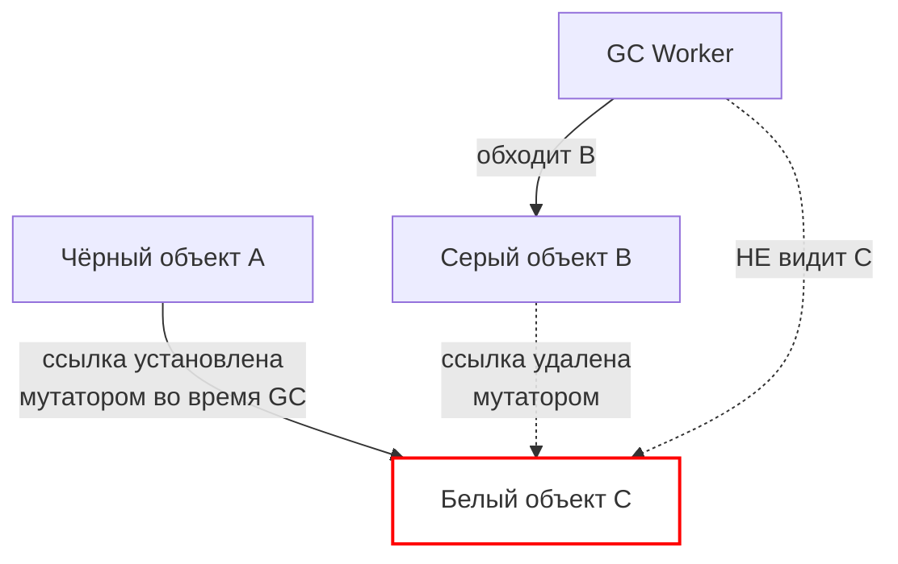
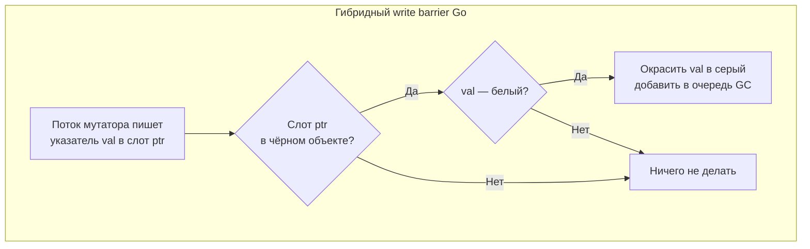

## Write barrier: невидимый страж конкурентного GC

В [[4. Concurrent GC]] мы разобрали, как Go GC выполняет маркировку и очистку параллельно с работающим приложением. Мы упомянули, что ключевую роль в предотвращении потери живых объектов играет **write barrier** (барьер записи). Без него конкурентный триколорный маркинг ([[2. Tri color marking]]) был бы некорректен, и GC неизбежно требовал бы полной остановки мира на всё время mark-фазы.

Write barrier — это небольшой, но постоянный налог на каждую операцию записи указателя в кучу. Он добавляет такты, конкурирует за кэш и влияет на производительность даже когда GC не активен. Понимание его устройства и стоимости — обязательный элемент профиля Senior Go-инженера, позволяющий объяснить, почему «безобидный» код иногда проседает по latency, и как структуры данных влияют на нагрузку GC ([[5. Mechanical sympathy в backend разработке]]).

Эта статья детально раскрывает реализацию write barrier в Go, связывает теорию триколорного маркинга с практическими последствиями и готовит почву для метрик GC-пауз ([[6. GC pause и latency]]) и тюнинга ([[7. GOGC и tuning]], [[8. GOMEMLIMIT]]).

## Зачем нужен write barrier: проблема «пропавшего объекта»

При конкурентной маркировке мутатор (приложение) и GC worker'ы работают одновременно. GC обходит граф объектов, перекрашивая их из белого в серый и чёрный. Но мутатор в это же время **меняет указатели**. Если не предпринять мер, может возникнуть критическая ситуация:

1. Чёрный объект A содержит указатель на белый объект C.
2. Серый объект B, на который GC ещё не заглядывал, перестаёт ссылаться на C из-за мутатора.
3. GC завершает обход B (не увидев C) и считает, что C — белый мусор, хотя C всё ещё достижим через чёрный A. Объект C будет освобождён — **катастрофа**.

Эта ситуация называется «потерянный объект» (lost object problem). Чтобы её предотвратить, приложение должно уведомлять GC о каждой записи указателя. Именно это делает write barrier.

## Типы write barrier: Dijkstra, Yuasa и гибрид

В теории сборки мусора существует несколько форм write barrier, каждая со своими гарантиями.

### Барьер Дейкстры (Dijkstra write barrier)

Принцип: **при записи указателя в чёрный объект**, если записываемый указатель ведёт на белый объект, этот белый объект немедленно окрашивается в серый. Это гарантирует, что чёрные объекты не могут указывать на белые.

Недостаток: барьер Дейкстры требует, чтобы все объекты, на которые указывает стек (и другие корни), были серыми на старте, что усложняет сканирование стека. Кроме того, он допускает "floating garbage" — объекты, ставшие мусором, но не освобождённые в этом цикле (что для Go допустимо, sweep всё подчистит).

### Барьер Юасы (Yuasa write barrier)

Принцип: **при удалении указателя из серого или чёрного объекта**, если удаляемый указатель указывает на белый объект, этот белый объект красится в серый. Это страхует от потери ссылки во время обхода, но само по себе не предотвращает появления белых объектов в чёрном (для этого нужен дополнительный механизм).

### Гибридный барьер Go

Начиная с Go 1.8, используется **гибридный write barrier**, совмещающий сильные стороны Дейкстры и Юасы. В исходном коде (`runtime/mwbbuf.go`) он описан как "Dijkstra-style barrier with a Yuasa-style backup". Конкретно:

- При записи указателя вызывается `gcWriteBarrier(ptr, val)`.
- Если целевой слот (ptr) находится в чёрном объекте, а записываемое значение (val) — белое, val красится в серый.
- Дополнительно, для страховки, если удаляемое значение (старое значение слота) — белое, оно тоже окрашивается в серый (это аналог барьера Юасы).

Это гарантирует корректность без необходимости пересканировать стеки всех горутин в STW, что сильно сокращает паузы ([[3. Stop the world]]).

## Реализация в рантайме Go

Write barrier в Go — это не одна функция, а целый набор механизмов, расставленных компилятором.

### Вставка барьера компилятором

Компилятор Go (SSA backend) для каждой операции записи указателя в кучу (запись поля структуры, элемента слайса, интерфейса и т.д.) вставляет вызов `runtime.gcWriteBarrier`. Это быстрый inline-вызов, который работает так:

1. Проверяет, находится ли слот (адрес, куда пишем) в куче (а не на стеке). Если на стеке — барьер не нужен.
2. Проверяет биты цвета объекта, содержащего слот (через `heapBitsForAddr`).
3. Если объект чёрный, а значение белое, вызывает `gcMarkSpanForBarrier` и помещает указатель в буфер.

Буфер write barrier — это локальная для P (логического процессора) циклическая очередь, куда складываются серые объекты. Когда буфер заполняется, он сбрасывается в глобальную очередь GC worker'ов.

> [!info] Под капотом
> В `runtime/mbitmap.go` битовая карта цвета объектов хранится в `mspan.gcmarkBits`. Барьер обращается к этим битам через `heapBits`. Для ускорения код написан на ассемблере для некоторых архитектур (например, `runtime/asm_amd64.s` содержит `gcWriteBarrier`).

### Write barrier и стек

Стековые переменные не имеют барьеров. Если запись происходит в объект на стеке (например, замыкание, локальная переменная-указатель), барьер не активируется. Это одна из причин, почему размещение переменных на стеке ([[3. Escape analysis]]) так выгодно не только для GC, но и для "налога" write barrier.

## Стоимость write barrier

Барьер записи работает **всегда**, даже когда GC не выполняет mark-фазу. Хотя основная логика проверок быстра (несколько инструкций), она имеет измеримое влияние:

- **Прямые такты.** Проверка цвета слота — чтение памяти (вероятно, cache miss). При частой записи указателей (например, копирование слайса указателей) накладные расходы барьера могут стать существенными.
- **Загрязнение кэша.** Буфер барьера пишется глобально (или в кэш P), что вытесняет полезные строки кэша (cache pollution).
- **Contention.** При сбросе буфера в глобальную очередь требуется атомарная операция, что может вызывать false sharing ([[8. False sharing]]), если несколько P одновременно сбрасывают буферы.
- **Влияние на инлайнинг.** Раньше функции с write barrier не инлайнились, но современный Go умеет инлайнить их при определённых условиях (см. [[5. Inline и влияние на performance]]). Однако сложный барьер всё же может мешать инлайнингу.

**Практический вывод:** код, интенсивно модифицирующий указатели в куче (например, `sync.Map` с указателями, деревья, графы), платит больше.

## Измерение влияния write barrier

Прямого профиля "write barrier overhead" в pprof нет. Но косвенно его можно оценить:

- **CPU-профиль** ([[2. CPU profiling в Go]]) может показать `runtime.gcWriteBarrier` или `runtime.wbBufFlush`, если они стали горячими.
- **Execution tracer** ([[3. execution tracer]]) показывает моменты сброса буферов в глобальную очередь.
- **Бенчмарки** с `-benchmem` и сравнением двух версий кода (с указателями и без) позволяют изолировать эффект. Например, структура с `*int` против `int` в горячем цикле покажет разницу, часть которой — write barrier.
- **Сравнение с отключённым GC** (невозможно в продуктивном режиме, но можно через `GODEBUG=gctrace=1` и анализ числа циклов) не даёт выделить именно барьер.

> [!tip] Собеседование
> **Вопрос:** Почему запись в поле структуры, содержащей указатель, медленнее, чем запись в обычное поле, даже когда GC не активен?
> **Ответ:** Потому что компилятор вставляет write barrier, который проверяет цвет объекта и, если объект чёрный, записывает уведомление в буфер GC. Эти инструкции добавляют такты и могут вызывать cache miss.

## Write barrier и Mechanical Sympathy

С точки зрения процессора write barrier — это тонкий инструмент с микроархитектурными последствиями:

- **Чтение битов цвета** (из `mspan.gcmarkBits`) — это промах в кэш, если спан давно не трогали. Эти биты расположены отдельно от данных.
- **Буфер P** для барьера — это маленькая область памяти (около 256 байт), которая активно пишется. Она нагрета в кэше, но при сбросе порождает записи в глобальную очередь, которые могут вытесняться.
- **Трафик инвалидации.** При сбросе буфера и модификации глобальной очереди другими P происходит обмен сообщениями когерентности кэша (MESI), что снижает пропускную способность.

Поэтому Senior, проектируя горячие структуры ([[6. Cache friendly структуры]]), не только избегает указателей ради уменьшения аллокаций, но и ради снижения налога write barrier.

## Ловушки и ограничения

> [!warning] Ловушка / Gotcha
> **Барьер только для кучи.** Записи в стек не барьеризируются. Если вы работаете со слайсом указателей, убедитесь, что он не убегает в кучу ([[3. Escape analysis]]). Иначе все записи в него будут проходить через барьер.

> [!warning] Ловушка / Gotcha
> **Атомарные записи и барьер.** Атомарные операции с указателями (`atomic.StorePointer`) не используют write barrier, так как работают напрямую с памятью. Это требует особой осторожности при использовании атомиков в GC-чувствительном коде.

> [!warning] Ловушка / Gotcha
> **Write barrier в CGO.** Go-код, вызывающий C-функции, не отслеживает записи в кучу из C. Поэтому рантайм на время CGO-вызова открепляет P от M (см. [[1. Scheduler Go. G-M-P модель]]), и GC обрабатывает этот случай особым образом.

## Итог

- **Write barrier** — механизм, вставляемый компилятором при каждой записи указателя в кучу, обеспечивающий корректность конкурентного триколорного маркинга.
- Go применяет гибридный барьер (Dijkstra + Yuasa), реализованный в `runtime.gcWriteBarrier` с локальными буферами P.
- Барьер работает всегда, добавляя такты и влияя на кэш, даже когда mark-фаза не активна.
- Интенсивная модификация указателей в куче может стать скрытым узким местом, видимым в CPU-профиле как `gcWriteBarrier`.
- Понимание write barrier необходимо для осознанного проектирования структур данных и интерпретации производительности конкурентных программ.

Следующая статья сосредоточится на том, как измерить и минимизировать главное видимое последствие всей этой работы: [[6. GC pause и latency]].