## Почему GC-паузы определяют судьбу p99

В предыдущих статьях мы разобрали архитектуру конкурентного GC ([[4. Concurrent GC]]), алгоритм триколорного маркинга ([[2. Tri color marking]]) и механизм write barrier ([[5. Write barriers]]), который обеспечивает корректность при параллельной работе. Мы знаем, что Go GC проводит большую часть времени конкурентно, останавливая мир лишь на короткие STW-фазы ([[3. Stop the world]]). Однако даже микросекундные паузы, а также менее очевидные эффекты вроде mark assist, напрямую формируют **хвостовые задержки** (tail latency) — тот самый p99, о котором мы говорили в [[7. Tail latency и почему она важна]].

GC pause — это не просто техническая деталь рантайма. Это главный фактор, который может разрушить SLO высоконагруженного сервиса, особенно в микросервисной архитектуре, где задержки накапливаются. Senior Go-инженер обязан понимать, из чего складывается время, потерянное приложением из-за GC, как измерять эти потери, и как минимизировать их влияние на пользователей.

В этой статье мы соединим метрики GC с метриками latency, разберём, почему mark assist «крадёт» микросекунды у запросов, и выработаем стратегию удержания GC-пауз в рамках бюджета.

## Что считать GC-паузой: явное и неявное

Традиционно под **GC pause** понимают время, когда все горутины остановлены (STW). Но с точки зрения latency отдельного запроса важны все моменты, когда его обработка задерживается из-за деятельности GC:

1. **STW-паузы** — mark setup и mark termination. Глобальны, затрагивают все горутины. Длительность — от единиц до сотен микросекунд.
2. **Mark assist** — не глобальная пауза, но конкретная горутина, выделяющая память, принудительно тратит время на помощь GC. Это напрямую увеличивает время ответа на конкретный запрос.
3. **Конкурентный mark** — не останавливает приложение, но потребляет CPU и пропускную способность памяти. Если GC worker'ы работают на тех же ядрах, что и hot-горутины, последние замедляются, что эквивалентно увеличению latency.
4. **Sweep** — ленивая очистка, редко заметна, но при агрессивных аллокациях может блокировать конкретную операцию выделения.

Следовательно, «влияние GC на latency» — понятие шире, чем просто STW. Оно охватывает любые задержки, вызванные работой сборщика.

```mermaid
gantt
    title "Обработка запроса и активность GC"
    dateFormat  X
    axisFormat  %s
    
    section Запрос 1
    Обработка            :active, req1, 0, 3
    Ожидание STW         :crit, stw1, 3, 4
    Продолжение          :active, req1b, 4, 6

    section Запрос 2
    Обработка            :active, req2, 0, 2
    Mark Assist           :crit, assist, 2, 4
    Завершение           :active, req2b, 4, 5

    section GC
    STW Setup            :crit, setup, 3, 4
    Конкурентный Mark    :done, mark, 4, 6
```



## Измерение GC-пауз и их влияния на latency

### 1. GODEBUG=gctrace=1

Базовая трассировка каждого GC-цикла:

```
gc 1 @0.001s 0%: 0.015+0.13+0.007 ms clock, 0.12+0.10/0.13/0.05+0.05 ms cpu, 1->1->1 MB, 4 MB goal, 8 P
```

- `0.015 ms` — STW setup.
- `0.007 ms` — STW termination.
- `0.13 ms` — wall-clock конкурентной маркировки (не пауза, но активность).

Сумма STW пауз — 22 микросекунды. Это неплохо. Но если каждая такая пауза совпадает с пиком запросов, p99 может вырасти.

### 2. Prometheus метрики

Стандартный пакет `client_golang` экспортирует:
- `go_gc_duration_seconds` — гистограмма длительности GC-циклов (включая конкурентные фазы, но там есть метки `quantile` для STW).
- `go_memstats_gc_cpu_fraction` — доля CPU на GC (чем выше, тем больше latency отнимается у запросов).

Настройка алертов на `go_gc_duration_seconds` с квантилями позволяет видеть, когда паузы выходят за SLO.

### 3. Execution tracer

`go tool trace` ([[3. execution tracer]]) визуализирует STW как красные полосы, а mark assist — как промежутки, когда горутина помечена `MARK ASSIST`. Это лучший инструмент для расследования аномалий.

### 4. runtime.ReadMemStats

`m.PauseNs` — массив длительностей последних 256 STW-пауз. `m.NumGC` — общее число циклов. Удобно для кастомных метрик.

### 5. Бенчмарки с `-benchmem` и `GODEBUG`

Для изоляции влияния GC на конкретный код можно запускать бенчмарк с разными `GOGC` и смотреть на `ns/op` и `allocs/op`. Например, снижение `GOGC` до 1 вызовет частые GC, и если latency сильно растёт — код чувствителен к GC.

## Факторы, влияющие на длительность GC-пауз

### 1. Размер кучи и количество живых объектов
Чем больше живых объектов, тем дольше mark termination, т.к. нужно обработать все буферы write barrier и проверить очереди. Куча в 100 ГБ с миллиардами объектов может давать паузы в миллисекунды даже на конкурентном GC.

### 2. Количество горутин
Каждая горутина — это стек (минимум 2 КБ), который нужно просканировать как корень. При миллионе горутин это серьёзная работа для STW.

### 3. Сложность графа объектов (количество указателей)
Много указателей → много работы write barrier → большие буферы для обработки в termination.

### 4. Частота GC
При агрессивных аллокациях GC запускается чаще. Хотя каждая пауза мала, их суммарное влияние на latency растёт. Mark assist включается чаще, отнимая время у запросов.

### 5. GOMAXPROCS и планировщик
Если GC worker'ы конкурируют с хот-горутинами за ядра, latency запросов растёт даже без STW. Особенно заметно при `GOMAXPROCS` меньше числа ядер.

## Mark assist: скрытый убийца latency

Mark assist — это механизм, при котором горутина, выделяющая память, помогает GC маркировать объекты, если GC не успевает за темпом аллокаций. Это не глобальная пауза, но **время assist добавляется непосредственно к времени выполнения запроса**. Если аллокаций много, а GC отстаёт, горутина может потратить на помощь GC больше времени, чем на саму бизнес-логику.

В CPU-профиле это выглядит как `runtime.gcAssistAlloc` или `runtime.gcDrain`. Если они в топе — ваш сервис страдает от mark assist. Это прямой сигнал уменьшать аллокации или повышать `GOGC`.

> [!warning] Ловушка / Gotcha
> Разработчик видит, что STW-паузы микросекундные, и считает, что GC не влияет на latency. Но mark assist может добавлять миллисекунды к отдельным запросам, и это не видно в `gctrace`. Только execution tracer и CPU-профиль вскрывают проблему.

## Как GC-паузы влияют на распределение задержек

Рассмотрим сервис с p50 = 5 мс, p99 = 20 мс, STW = 50 мкс. Казалось бы, паузы незначительны. Но:
- STW происходит каждые несколько секунд, замораживая все горутины. Запросы, которые в этот момент находились в обработке, получают +50 мкс. Для большинства это незаметно, но если в системе тысячи одновременных запросов, несколько из них могут испытать наложение: один запрос попал на STW + mark assist + конкуренцию за CPU, и его latency вырастает до 30-40 мс, расширяя хвост.
- В микросервисной цепочке из 10 вызовов вероятность попасть хотя бы на одну GC-паузу увеличивается. Tail latency возрастает мультипликативно ([[7. Tail latency и почему она важна]]).

## Mechanical Sympathy: что происходит с процессором после паузы

STW-пауза не только приостанавливает логику, но и разрушает микроархитектурное состояние:
- **Кэш-промахи.** Сброс бит и сканирование стека загружают в кэш данные GC, вытесняя полезные данные запросов. После возобновления мира первые обращения к данным идут в RAM.
- **TLB-промахи.** Если GC трогал много страниц, часть записей TLB может быть вытеснена.
- **Предсказатель.** После смены контекста (особенно если горутина мигрировала на другое ядро) branch predictor и BTB сброшены, вызывая дополнительные ошибки предсказания.

Всё это означает, что даже короткая STW-пауза может иметь «хвост» из микросекунд неоптимальной производительности после неё.

## Стратегии минимизации влияния GC на latency

1. **Уменьшение аллокаций** ([[1. Уменьшение аллокаций]], [[2. sync Pool]], [[9. Zero allocation подход]]). Меньше аллокаций → реже GC → реже паузы и mark assist.
2. **Предвыделение памяти** ([[4. Предвыделение памяти]]) сокращает количество отдельных выделений.
3. **Снижение количества указателей** в горячих структурах (value-embedding, [[6. Cache friendly структуры]]). Это уменьшает работу write barrier и, как следствие, длительность mark termination.
4. **Ограничение числа горутин** (пул воркеров вместо spawn на каждый запрос). Меньше стеков для сканирования.
5. **Тюнинг GOGC** ([[7. GOGC и tuning]]). Повышение `GOGC` даёт куче больше места, GC реже запускается, но куча больше. Это trade-off между памятью и latency.
6. **Установка GOMEMLIMIT** ([[8. GOMEMLIMIT]]). Позволяет задать жёсткий лимит памяти, при приближении к которому GC становится агрессивнее. Это защищает от OOM, но может участить паузы. Правильная настройка балансирует потребление памяти и latency.
7. **Изоляция GC от критических запросов.** В экстремальных случаях можно использовать `runtime.GC()` в периоды низкой нагрузки, чтобы «подчистить» кучу заранее, но это редко применяется.

## Практический пример: анализ влияния GC на p99

Сервис Go обрабатывает 10k RPS, p99 = 50 мс. Снимаем execution tracer, видим:
- STW-паузы 20 мкс каждые 2 секунды.
- Но в моменты пиковой нагрузки после GC p99 подскакивает до 80 мс.
- CPU-профиль показывает `runtime.gcAssistAlloc` с заметной долей.

Вывод: не сами STW-паузы, а mark assist и конкуренция за CPU во время конкурентной маркировки расширяют хвост.

Решение:
- Профилируем память ([[4. Allocation profiling]]), находим горячие аллокации в JSON-сериализации.
- Внедряем `sync.Pool` для переиспользования буферов, аллокации падают на 60%.
- Поднимаем `GOGC` до 200, чтобы GC запускался реже.
- Повторяем тест — p99 снижается до 45 мс, и шлейф после GC исчезает.

## Итог

- GC-паузы в Go — это не только STW, но и mark assist, и конкуренция за ресурсы во время конкурентных фаз.
- Микросекундные STW-паузы могут быть незаметны для p50, но накапливаться в p99, особенно в цепочках микросервисов.
- Основные инструменты диагностики: `GODEBUG=gctrace`, execution tracer, Prometheus метрики (`go_gc_duration_seconds`), `runtime.ReadMemStats`.
- Mark assist — коварный механизм, напрямую замедляющий запросы при высоком темпе аллокаций; требует профилирования CPU и памяти.
- Стратегии снижения влияния: уменьшение аллокаций, сокращение указателей, тюнинг `GOGC`/`GOMEMLIMIT`, ограничение числа горутин.
- После STW-пауз процессор испытывает cache и TLB промахи, добавляя скрытые задержки.

Понимание того, как GC формирует задержки, подводит нас к практическому вопросу: как настроить `GOGC` и `GOMEMLIMIT`, чтобы достичь компромисса между памятью и latency. Следующая статья: [[7. GOGC и tuning]].