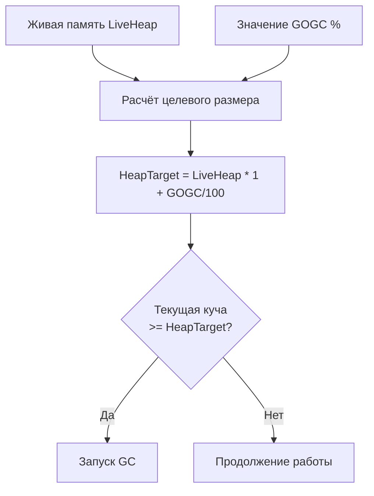

## GOGC: главный рычаг управления сборщиком мусора

В [[1. GC в Go. Обзор]] мы определили, что Go GC автоматически запускается при достижении определённого размера кучи. В [[6. GC pause и latency]] разобрали, как паузы и mark assist влияют на хвостовые задержки. Теперь мы переходим к практическому инструменту, который позволяет управлять этим балансом — **GOGC**.

GOGC (Garbage Collection Goal Percentage) — это переменная окружения и настройка рантайма, которая задаёт **целевой размер кучи** относительно объёма живых объектов. Это основной рычаг, с помощью которого Senior-инженер настраивает компромисс между расходом памяти и нагрузкой на процессор от GC. Не существует «правильного» GOGC для всех случаев — только осознанный выбор, опирающийся на метрики и понимание механизмов.

В этой статье мы разберём, как именно GOGC управляет циклами GC, как выбрать значение для типичных сценариев, как измерить эффект и как не наделать ошибок. Вместе с [[8. GOMEMLIMIT]] эти два параметра составляют полный набор для управления памятью в Go.

## Как работает GOGC: формула целевого размера кучи

Параметр GOGC определяет, во сколько раз куча может превысить размер живых объектов до того, как запустится следующий цикл GC. Формально:

```
HeapTarget = LiveHeap * (1 + GOGC / 100)
```

Где:
- `LiveHeap` — объём памяти, занятой живыми объектами (то, что осталось после предыдущего GC).
- `GOGC` — целое число (процент). По умолчанию `GOGC=100`.
- `HeapTarget` — размер кучи, при достижении которого запускается новый цикл GC.

При `GOGC=100` куча может вырасти вдвое относительно живых объектов. Если живых объектов 100 МБ, GC запустится, когда куча достигнет 200 МБ. При `GOGC=200` цель будет 100 МБ * 3 = 300 МБ. При `GOGC=50` — 150 МБ.



На практике GC может запуститься чуть раньше из-за упреждающей логики или чуть позже из-за задержек в конкурентных фазах, но в среднем ориентир именно такой.

## Влияние GOGC на частоту GC, CPU и память

### Низкий GOGC (например, 25–50)

- **Память:** куча держится компактной, близкой к объёму живых объектов. Подходит для контейнеров с жёсткими лимитами.
- **Частота GC:** высокая, потому что куча быстро достигает цели.
- **CPU:** больше процессорного времени тратится на GC (конкурентная маркировка, mark assist, sweep).
- **Latency:** частые циклы увеличивают вероятность попадания запроса под mark assist или STW, что может ухудшить p99, хотя каждая отдельная пауза мала.

### Высокий GOGC (например, 200–400)

- **Память:** куча может значительно превышать объём живых объектов. RSS растёт, возможен выход за лимиты контейнера.
- **Частота GC:** низкая, циклы редкие.
- **CPU:** меньше суммарных затрат на GC.
- **Latency:** паузы реже, но каждая может быть чуть длиннее из-за большего объёма маркируемых данных. Тем не менее mark assist возникает реже, и хвостовые задержки часто улучшаются.

### Отключение GC (GOGC=off)

Установка `GOGC=off` или `GOGC=-1` полностью отключает автоматический GC (с версии Go 1.16). Ручной вызов `runtime.GC()` всё ещё работает. Это экстремальный режим для программ с ручным управлением памятью или короткоживущих утилит, где можно позволить себе не собирать мусор до завершения.

> [!warning] Ловушка / Gotcha
> Отключение GC без периодического ручного `runtime.GC()` в долгоживущем сервисе приведёт к неограниченному росту кучи и OOM. Использовать `GOGC=off` можно только в строго контролируемых сценариях.

## Как выбрать значение GOGC: компромисс память vs CPU

Универсального ответа нет. Выбор зависит от характера приложения и инфраструктуры.

### Стратегия 1: Низкий GOGC для жёстких лимитов памяти

В контейнерах Kubernetes с лимитами памяти (например, `resources.limits.memory: 512Mi`) важно, чтобы куча не превышала лимит, иначе OOMKill. Здесь обычно снижают GOGC до 25–50, чтобы куча росла медленно. Также обязательно устанавливают `GOMEMLIMIT` ([[8. GOMEMLIMIT]]), который даёт более прямой контроль.

### Стратегия 2: Высокий GOGC для CPU-интенсивных сервисов

Если памяти достаточно (выделенный сервер или большие контейнеры), а критичен CPU, выгодно повысить GOGC до 200–400. Это снизит частоту GC и mark assist, увеличивая пропускную способность и снижая p99. Плата — повышенный расход памяти, но если её хватает, это оправдано.

### Стратегия 3: Динамический тюнинг

В некоторых случаях меняют GOGC на лету через `debug.SetGCPercent()` в ответ на изменение нагрузки. Например, при пиковой нагрузке временно повышают GOGC, чтобы GC не мешал, а на спаде снижают, чтобы освободить память. Это сложный, но гибкий подход.

### Оценка текущей эффективности

Перед изменением GOGC соберите метрики:

- `GODEBUG=gctrace=1` — смотрите на частоту циклов и размер кучи.
- Prometheus: `go_memstats_heap_alloc_bytes`, `go_gc_duration_seconds`, `go_memstats_gc_cpu_fraction`.
- CPU-профиль — доля `runtime.gcAssistAlloc` и `runtime.gcBgMarkWorker`.
- Нагрузочное тестирование с разными GOGC: сравнивайте p95/p99 latency и throughput.

Увеличивайте GOGC, если видите, что GC-активность забирает >5-10% CPU, а память используется не полностью. Уменьшайте, если куча растёт до опасных пределов.

## Практические примеры настройки GOGC

### Пример 1: REST API с интенсивными JSON-аллокациями

Приложение обрабатывает 5000 RPS, каждый запрос парсит JSON, создавая много временных объектов. По умолчанию GOGC=100 GC запускается каждые 2 секунды, mark assist отъедает до 15% CPU на горячих горутинах, p99 плавает.

**Решение:** Увеличить GOGC до 200. Куча вырастает с 400 МБ до 700 МБ, но циклы GC происходят раз в 5 секунд. CPU на GC падает до 5%, p99 становится стабильнее. Памяти на сервере достаточно.

### Пример 2: Микросервис в контейнере с лимитом 256 МБ

Приложение стабильно держит 150 МБ живых объектов. С GOGC=100 куча может достигать 300 МБ, что превышает лимит и вызывает OOMKill.

**Решение:** Установить `GOGC=50` и `GOMEMLIMIT=230MiB` (оставив запас). Куча будет расти до ~225 МБ, GC станет чаще, но уложится в лимит. Если CPU на GC становится чрезмерным, можно попытаться снизить аллокации через [[1. Уменьшение аллокаций]] и [[2. sync Pool]].

## Инструменты для проверки эффекта от изменения GOGC

- **GODEBUG=gctrace=1** — строка `... -> ... -> ... MB, ... MB goal` показывает цель (goal). Если goal близок к лимиту памяти, GOGC нужно уменьшить.
- **pprof memory profile** ([[5. pprof memory profile]]) и аллокационный профиль ([[4. Allocation profiling]]) — показывают, сколько памяти занимают живые объекты, и где создаются временные. Помогает оценить LiveHeap.
- **Нагрузочное тестирование** с записью метрик `go_gc_duration_seconds` — стройте графики пауз до и после изменения GOGC.
- **Использование `debug.SetGCPercent`** в runtime позволяет экспериментировать без перезапуска.

## Mechanical Sympathy: GOGC и процессор

Изменение GOGC меняет не только частоту запуска GC, но и поведение памяти и кэша:

- **При низком GOGC:** частые циклы GC интенсивнее вымывают кэш процессора ([[8. Cache friendliness]]). После каждого цикла рабочий набор данных должен заново прогреваться, что увеличивает долю cache miss и снижает instantaneous throughput.
- **При высоком GOGC:** куча больше, что может привести к большему количеству TLB-промахов, так как живые объекты распределены по большему числу страниц. Но частота вымывания кэша ниже, и в среднем локальность может быть выше.
- **Mark assist** при низком GOGC возникает чаще, заставляя горутины тратить время на обход чужих объектов, что ухудшает latency.

Выбор GOGC — это выбор между «частыми маленькими помехами» и «редкими, но более заметными событиями» для процессора. Senior-инженер, вооружённый mechanical sympathy, выбирает тот режим, который лучше соответствует паттернам доступа к данным в его приложении.

## Ловушки и неочевидные моменты

> [!warning] Ловушка / Gotcha
> **GOGC влияет только на автоматический GC.** Ручной вызов `runtime.GC()` всегда выполняется полностью и не зависит от GOGC. Если вы вызываете GC вручную в критических секциях, GOGC на это не влияет.

> [!warning] Ловушка / Gotcha
> **Изменение GOGC не меняет размер живых объектов.** Если у вас утечка ([[6. Утечки памяти]]), повышение GOGC только отсрочит OOM, но не решит проблему. Сначала устраните утечку, потом настраивайте GOGC.

> [!warning] Ловушка / Gotcha
> **GOGC=0 не означает «без GC».** До Go 1.18 `GOGC=0` включало GC при каждом выделении, что фактически было эквивалентно `GOGC=1`. Сейчас `GOGC=0` считается устаревшим, рекомендуется использовать `GOGC=off`.

## Связь с GOMEMLIMIT

GOGC — это относительная цель, привязанная к живой памяти. GOMEMLIMIT — это абсолютный лимит. Вместе они работают так:

- GOGC определяет обычный ритм сборок.
- Если куча приближается к GOMEMLIMIT, GC игнорирует GOGC и запускает сборку раньше, чтобы не превысить лимит.

Таким образом, GOMEMLIMIT страхует от выхода за пределы выделенной памяти даже при высоком GOGC. Это делает настройку более гибкой: можно держать GOGC высоким для экономии CPU, а GOMEMLIMIT задать по границе контейнера минус запас.

Подробнее взаимодействие разберём в следующей статье: [[8. GOMEMLIMIT]].

## Итог

- **GOGC** — переменная, определяющая целевой размер кучи как `LiveHeap * (1 + GOGC/100)`. По умолчанию 100.
- Низкий GOGC экономит память, но повышает CPU на GC и может ухудшить latency из-за частых циклов и mark assist.
- Высокий GOGC снижает нагрузку на GC, улучшая CPU и p99, ценой большего расхода памяти.
- Выбор значения требует измерения метрик (`GODEBUG=gctrace=1`, Prometheus, pprof) и нагрузочного тестирования.
- В контейнерах часто комбинируют пониженный GOGC с GOMEMLIMIT, чтобы вписаться в лимиты.
- Mechanical sympathy: частота GC влияет на кэш и TLB, что необходимо учитывать при настройке.
- `GOGC=off` отключает автоматический GC, но допустим лишь в исключительных случаях.

Теперь, освоив GOGC, мы готовы рассмотреть второй, не менее важный рычаг управления памятью — абсолютный лимит: [[8. GOMEMLIMIT]].