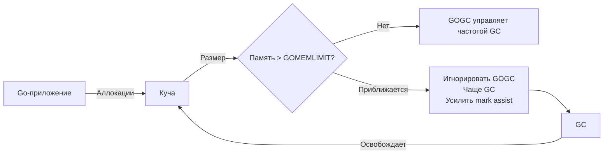

## GOMEMLIMIT: мягкий лимит для жёстких ограничений

В [[7. GOGC и tuning]] мы освоили управление частотой GC через относительный целевой размер кучи. Однако в эпоху контейнеров и оркестраторов одного GOGC недостаточно. Процессу в контейнере выделен жёсткий лимит памяти, и если куча превысит его, последует OOMKill. GOGC лишь откладывает следующий цикл GC, но не гарантирует, что пиковое потребление не выйдет за границу. Для решения этой проблемы в Go 1.19 появился **GOMEMLIMIT** — мягкий лимит, который заставляет GC активизироваться при приближении к заданному потолку.

GOMEMLIMIT не заменяет GOGC, а дополняет его. Вместе они образуют полную систему управления памятью, позволяющую балансировать между использованием CPU, пиковым размером кучи и риском OOM. Senior Go-инженер обязан уметь выставлять этот лимит, понимать его механику и интерпретировать метрики, чтобы контейнеризированные сервисы работали стабильно и предсказуемо.

## Что такое GOMEMLIMIT

**GOMEMLIMIT** — это переменная, задающая мягкий лимит на общий объём памяти, занятой Go-кучей. Устанавливается через окружение `GOMEMLIMIT=<bytes>` или в коде через `debug.SetMemoryLimit(limit int64)`. Значение указывается в байтах; можно использовать суффиксы KiB, MiB, GiB (например, `GOMEMLIMIT=200MiB`).

В отличие от cgroups-лимита, который является жёстким и при превышении вызывает OOMKill, GOMEMLIMIT — это **рекомендательный порог** для рантайма. При приближении к нему GC:

- Чаще запускает циклы сборки, игнорируя обычную цель `GOGC`.
- Усиливает mark assist, чтобы сдержать рост кучи.
- Может временно ограничить темп аллокаций (backpressure).

Таким образом, GOMEMLIMIT позволяет «мягко» удерживать кучу в пределах, не доводя до аварийного завершения.



## Почему одного GOGC недостаточно в контейнерах

GOGC формулирует цель относительно живых объектов. Если LiveHeap стабилен, куча тоже стабильна, и лимит не нужен. Но в реальном приложении LiveHeap может изменяться:

- На пике нагрузки создаётся больше объектов, LiveHeap растёт, соответственно растёт и HeapTarget, что может превысить лимит контейнера.
- После GC память не всегда возвращается ОС немедленно из-за `MADV_FREE` ([[7. Fragmentation]]), RSS может оставаться высоким, что опасно при жёстком лимите.
- Внешние факторы (cgo, mmap) могут потреблять память помимо кучи, и GOGC об этом не знает.

GOMEMLIMIT решает эту проблему, устанавливая абсолютный потолок, на который ориентируется рантайм. Он не отменяет GOGC, но действует как предохранительный клапан: если куча приближается к лимиту, GC начинает работать усерднее, даже если по GOGC ещё рано.

## Как GOMEMLIMIT взаимодействует с GOGC

Логика управления GC с учётом обоих параметров (упрощённо) такова:

1. Рантайм непрерывно отслеживает `heap_marked` (объём живых объектов после последнего GC) и текущий размер кучи `heap_inuse`.
2. Рассчитывается цель по GOGC: `goal_gc = heap_marked * (1 + GOGC/100)`.
3. Рассчитывается цель по GOMEMLIMIT: если `GOMEMLIMIT` установлен, рантайм определяет `goal_mem = GOMEMLIMIT - non_heap_memory` (не-куча память, оценка).
4. Если `goal_mem` меньше `goal_gc`, то GC запускается раньше — используется `goal_mem`.
5. При приближении к GOMEMLIMIT также включается дополнительный **throttle** — даже между GC-циклами аллокации могут замедляться, если темп роста кучи слишком высок.

Таким образом, **GOMEMLIMIT имеет приоритет**: когда памяти мало, GC игнорирует GOGC и учащает циклы. Когда памяти достаточно, действует обычная логика GOGC.

> [!info] Под капотом
> В исходном коде `runtime/mgcpacer.go` функция `gcController.revise` пересчитывает цель для GC на основе `gcPercent` (GOGC) и `memoryLimit`. Если `memoryLimit` включён, вычисляется `heapGoalFromMemoryLimit`, и если он ниже обычного `heapGoal`, он становится новым целевым размером. Также есть механизм `gcCPULimiter`, который приостанавливает аллокации (через вспомогательные задержки), если GC не справляется даже при повышенной частоте.

## Как выбрать значение GOMEMLIMIT

Самый распространённый сценарий — контейнер с лимитом памяти. Общая рекомендация:

```
GOMEMLIMIT = ContainerLimit - 10–20%
```

Почему запас? Потому что GOMEMLIMIT контролирует только Go-кучу. Помимо неё память потребляют:

- Стеки горутин (растут динамически).
- Код и данные, загруженные ОС (бинарник, библиотеки).
- Память, выделенная через cgo / mmap.
- Метаданные рантайма (структуры G, M, P, спаны, битовые карты GC).
- Нативный memory overhead ОС.

Если задать `GOMEMLIMIT` равным лимиту контейнера, куча может занять почти весь лимит, а остальные компоненты выйдут за границу, и OOMKill случится несмотря на мягкий лимит.

На практике для сервиса с лимитом 512 МБ можно установить `GOMEMLIMIT=400MiB`, оставляя 112 МБ на накладные расходы. Точный запас подбирается экспериментально по метрикам.

## Метрики и мониторинг GOMEMLIMIT

Рантайм предоставляет метрики в пакете `runtime/metrics` (и через Prometheus при использовании `client_golang`):

- `/gc/memory/limit:bytes` — значение GOMEMLIMIT, известное рантайму.
- `/gc/memory/bytes:total-hwm` (High Water Mark) — максимальный размер кучи, достигнутый с начала работы (или с момента сброса).
- `/memory/classes/heap/unused:bytes` — свободная память в куче, удерживаемая рантаймом.
- `/memory/classes/heap/released:bytes` — память, возвращённая ОС.

Отслеживание `total-hwm` в сравнении с GOMEMLIMIT показывает, насколько близко сервис подходил к лимиту. Если High Water Mark регулярно приближается к лимиту, запас стоит увеличить, либо уменьшить аллокации.

Также `runtime.ReadMemStats` возвращает `HeapSys` (общий размер кучи от ОС) и `HeapInuse` (используемая память). Разница `HeapSys - HeapInuse` — свободная, но не возвращённая память.

```go
var m runtime.MemStats
runtime.ReadMemStats(&m)
fmt.Printf("HeapInuse: %d MB, HeapSys: %d MB\n", m.HeapInuse>>20, m.HeapSys>>20)
```

## Пример: настройка GOMEMLIMIT для контейнера с 256 МБ

Дано: микросервис, упакованный в контейнер с лимитом 256 МБ. Стабильное потребление живых объектов — около 80 МБ. При GOGC=100 пиковая куча может достигать 160 МБ, но в моменты всплесков наблюдаются эпизодические OOMKill.

Решение:

```
GOMEMLIMIT=210MiB
GOGC=100
```

Запас 46 МБ оставлен на стеки, код и прочее. Рантайм теперь будет следить, чтобы куча не превысила 210 МБ. Если при всплеске аллокаций куча начнёт приближаться к этому значению, GC участится, и рост замедлится. В мониторинге показатель `/gc/memory/limit:bytes` = 210 МБ, High Water Mark будет плавать около 200 МБ, не достигая 256 МБ. OOMKill прекратились.

## Пример: высокий GOGC с GOMEMLIMIT для экономии CPU

Сервис на dedicated-сервере с 16 ГБ RAM. GOGC=400 для снижения частоты GC и экономии CPU. Но есть риск, что при росте LiveHeap до 2 ГБ куча может скакнуть до 10 ГБ и вызвать проблемы с соседними процессами.

Устанавливаем `GOMEMLIMIT=12GiB`. Теперь GC будет редко срабатывать по GOGC, но если куча вдруг устремится к 12 ГБ, GOMEMLIMIT включит агрессивный режим и удержит её в пределах. Это даёт лучший баланс между производительностью и безопасностью.

## Потенциальные проблемы и ловушки

> [!warning] Ловушка / Gotcha
> **GOMEMLIMIT не замена оптимизации аллокаций.** Если приложение генерирует огромное количество мусора, низкий лимит приведёт к чрезмерно частым GC, mark assist захватит всё процессорное время, latency деградирует вплоть до неработоспособности. GOMEMLIMIT — страховка, а не лекарство. Основной путь — снижение аллокаций ([[1. Уменьшение аллокаций]], [[2. sync Pool]]).

> [!warning] Ловушка / Gotcha
> **Слишком низкий лимит вызывает GC-шторм.** При очень малом GOMEMLIMIT куча практически не может расти, GC запускается почти непрерывно, throughput катастрофически падает. Всегда оставляйте достаточно места для рабочего набора (минимум 1.2–1.5 × LiveHeap).

> [!warning] Ловушка / Gotcha
> **GOMEMLIMIT не контролирует не-кучу.** Стеки горутин, cgo-память, mmap-файлы — всё это вне лимита. Если у вас миллион горутин, даже пустых, они займут 2 ГБ стековой памяти, что может превысить контейнерный лимит без ведома GOMEMLIMIT. Мониторьте `StackInuse` и общее RSS.

> [!warning] Ловушка / Gotcha
> **Не со всеми версиями Go.** GOMEMLIMIT появился в Go 1.19 как `runtime/debug.SetMemoryLimit`, стабилизирован в 1.21. На старых версиях не работает.

## Mechanical Sympathy: как GOMEMLIMIT влияет на процессор

При срабатывании GOMEMLIMIT GC учащается. Это означает:
- Больше конкурентных mark-фаз, больше вымывания кэша ([[8. Cache friendliness]]).
- Частые mark assist заставляют горутины чаще помогать GC, что ухудшает их собственную производительность.
- Возможен burst-режим: куча подходит под лимит, GC резко активизируется, затем отпускает; такие всплески вносят нестабильность в latency.

С точки зрения механической эмпатии, GOMEMLIMIT следует настраивать так, чтобы он активировался только в исключительных ситуациях, а не работал постоянно. Основной ритм должен задаваться GOGC. Тогда процессорные кэши большую часть времени остаются «прогретыми» для приложения, и лишь эпизодические всплески GC не разрушают стабильность.

## Интеграция с оркестраторами и Infrastructure as Code

В Kubernetes можно задавать GOMEMLIMIT через переменную окружения, вычисленную от ресурсных лимитов. Например, с использованием Downward API:

```yaml
env:
- name: GOMEMLIMIT
  valueFrom:
    resourceFieldRef:
      resource: limits.memory
      divisor: "0"
```

К сожалению, GOMEMLIMIT ожидает абсолютное значение в байтах, а лимит подаётся в Mi/Gi, поэтому часто используют скрипты-обёртки (entrypoint), которые вычисляют 80% от лимита и выставляют GOMEMLIMIT.

Другой подход — выставлять GOMEMLIMIT прямо в коде при старте, анализируя `/sys/fs/cgroup/memory/memory.limit_in_bytes` (cgroups v1) или `/sys/fs/cgroup/memory.max` (cgroups v2).

```go
func init() {
    if data, err := os.ReadFile("/sys/fs/cgroup/memory.max"); err == nil {
        limit := strings.TrimSpace(string(data))
        if limit != "max" {
            if bytes, err := strconv.ParseInt(limit, 10, 64); err == nil {
                target := int64(float64(bytes) * 0.8)
                debug.SetMemoryLimit(target)
            }
        }
    }
}
```

Это автоматизирует настройку и уменьшает вероятность ошибки.

## Динамическое изменение GOMEMLIMIT

Функция `debug.SetMemoryLimit` позволяет менять лимит на лету. Это можно использовать:
- Для адаптации к изменению лимитов контейнера.
- Для временного повышения лимита в периоды пиковой нагрузки, если известно, что пик пройдёт.
- Для плавного уменьшения лимита перед ожидаемым снижением памяти.

Однако резкие изменения могут спровоцировать внезапный всплеск GC. Динамический тюнинг требует аккуратности и мониторинга.

## Итог

- **GOMEMLIMIT** — мягкий лимит на размер Go-кучи, заставляющий GC учащаться при приближении к заданному значению, предотвращая превышение жёстких лимитов памяти.
- Устанавливается через `GOMEMLIMIT` окружение или `debug.SetMemoryLimit`; обычно задаётся как 80-90% от лимита контейнера.
- Взаимодействует с GOGC: в нормальном режиме управляет GOGC, а GOMEMLIMIT — предохранитель, активирующийся при угрозе превышения.
- Запас необходим, так как GOMEMLIMIT не контролирует стеки, cgo, метаданные и прочую память вне кучи.
- Мониторинг через метрики `/gc/memory/limit:bytes` и High Water Mark.
- Не заменяет оптимизацию аллокаций; слишком низкий лимит вызывает GC-шторм и деградацию производительности.
- Mechanical sympathy: частое срабатывание GOMEMLIMIT ведёт к вымыванию кэша, учащению mark assist и нестабильности latency.

Правильно настроенный GOMEMLIMIT в паре с GOGC даёт уверенность, что сервис не упадёт по OOM, сохраняя приемлемую производительность. Мы завершаем раздел тюнинга GC и переходим к диагностике ситуации, когда даже при правильных настройках GC становится узким местом: [[9. Когда GC становится bottleneck]].