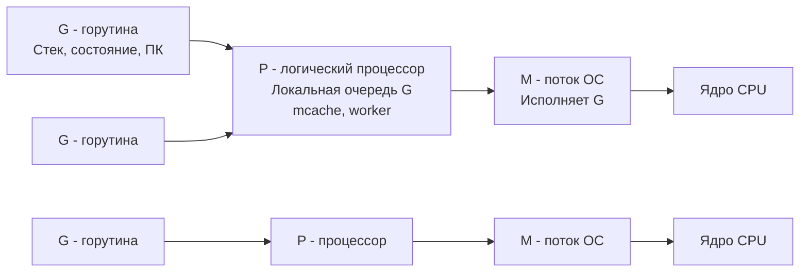
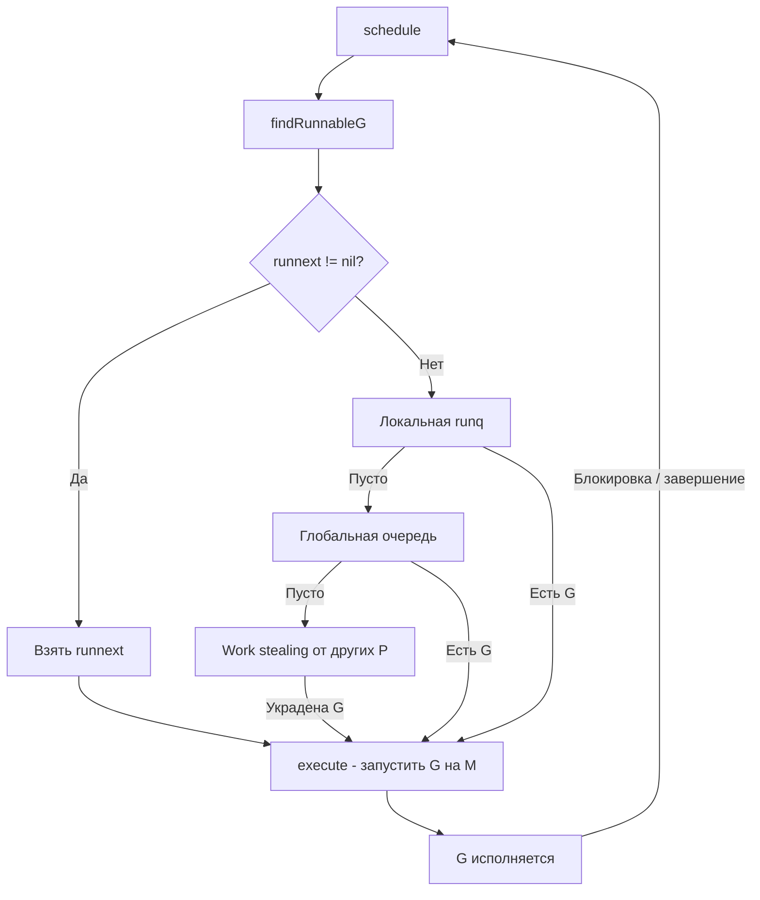

## Scheduler Go: модель G-M-P — фундамент конкурентности

В предыдущих разделах мы исследовали память ([[1. Memory model Go]], [[2. Heap vs stack]], [[3. Escape analysis]]) и сборщик мусора ([[1. GC в Go. Обзор]]). Мы видели, как рантайм управляет кучей, стеками и временем жизни объектов. Теперь мы переходим к третьему столпу производительности Go — **планировщику горутин**. Именно он определяет, какой код и когда получит процессорное время, превращая тысячи легковесных горутин в эффективную конкурентную программу.

В отличие от традиционных потоков ОС, горутины не отображаются один-к-одному на ядра. Go использует модель **G-M-P**, которая абстрагирует потоки и процессоры, позволяя рантайму самостоятельно принимать решения о распределении работы. Понимание этой модели — ключ к расшифровке поведения программы под нагрузкой, диагностике конкуренции за ресурсы и устранению узких мест, связанных с планированием ([[4. Контекстные переключения]], [[7. Contention и lock profiling]]).

Эта статья открывает подраздел «Конкурентность» детальным разбором планировщика. Мы изучим все три сущности, их жизненный цикл, очереди и ключевые функции в исходном коде. В последующих статьях мы углубимся в [[2. Goroutines под капотом]], [[3. Work stealing]] и [[5. Sync primitives и их стоимость]].

## Три буквы, управляющие конкурентностью

Планировщик Go оперирует тремя основными типами объектов:

- **G (goroutine)** — сама горутина. Содержит стек, указатель на выполняемую функцию, состояние (runnable, running, waiting, dead) и другую метаинформацию.
- **M (machine)** — поток операционной системы (OS thread). Именно M исполняет код горутины, делает системные вызовы и взаимодействует с ядром ОС.
- **P (processor)** — логический процессор, контекст для выполнения. P владеет локальной очередью горутин, кэшем аллокатора (`mcache`) и другими ресурсами. Количество P равно `GOMAXPROCS` (по умолчанию числу ядер) и определяет, сколько горутин могут исполняться одновременно.

Отношение между ними: **M должен захватить P, чтобы выполнять G**. Без P поток M не может исполнять пользовательский код и уходит в парковку (спящий режим).



Упрощённый жизненный цикл:

1. Создаётся `G` (через `go func()`), помещается в локальную очередь `P` (или в глобальную, если локальная переполнена).
2. `P` ищет `G` для выполнения: сначала локальная очередь, потом глобальная, потом крадёт у других `P` ([[3. Work stealing]]).
3. `M`, владеющий `P`, начинает исполнять выбранную `G`.
4. Если `G` блокируется (syscall, канал, мьютекс), `M` отделяется от `P` (или паркуется), и `P` может быть передан другому `M`.

## Зачем нужна такая модель

Прямая модель «поток на горутину» привела бы к созданию тысяч потоков ОС, каждый из которых потребляет ~1 МБ стека и дорого переключается. Модель G-M-P позволяет:

- **Мультиплексировать** множество горутин на малое число потоков (обычно по числу ядер).
- **Изолировать** планирование от ОС: рантайм сам решает, когда переключить горутину, оптимизируя под кооперативную многозадачность.
- **Масштабироваться** на десятки и сотни тысяч горутин без деградации.

## Структуры данных: что внутри G, M, P

> [!info] Под капотом
> В исходном коде Go (`runtime/runtime2.go`) определены структуры `g`, `m`, `p`. Их поля — внутренние детали, но важно знать ключевые.

### G (горутина)

```go
type g struct {
    stack       stack   // где начинается и заканчивается стек
    sched       gobuf   // сохранённый контекст (PC, SP)
    atomicstatus atomic.Uint32 // состояние: _Gidle, _Grunnable, _Grunning, _Gwaiting, _Gdead
    goid        int64   // уникальный идентификатор
    m           *m      // текущий M (если выполняется)
    lockedm     *m      // если привязана через LockOSThread
    ...
}
```

Состояния:
- `_Gidle` — только что создана.
- `_Grunnable` — готова к исполнению, находится в очереди.
- `_Grunning` — выполняется на M.
- `_Gwaiting` — заблокирована (канал, syscall).
- `_Gdead` — завершена, стек освобождён.

### M (машинный поток)

```go
type m struct {
    g0      *g      // специальная горутина для системных задач (например, GC)
    curg    *g      // текущая пользовательская горутина
    p       *p      // текущий процессор P (если есть)
    nextp   *p      // ожидающий P
    spinning bool   // крутится в поисках работы
    locks   int32   // счётчик блокировок (если > 0, не может быть прерван)
    ...
}
```

### P (логический процессор)

```go
type p struct {
    id          int32
    m           *m      // текущий M (если есть)
    runq        [256]guintptr // локальная очередь горутин (кольцевой буфер)
    runnext     guintptr // следующая горутина (приоритет)
    gFree       struct { ... } // список свободных G для переиспользования
    mcache      *mcache // локальный кэш аллокатора
    ...
}
```

Локальная очередь `runq` — это lock-free кольцевой буфер на 256 элементов. Большинство операций (добавление новой G, извлечение) выполняются без блокировок. Если очередь переполняется, половина её содержимого перемещается в глобальную очередь.

## Поток управления: от `schedule` до переключения

Сердцем планировщика является функция `schedule()` (`runtime/proc.go`). Упрощённый алгоритм:

1. Найти G для выполнения (`findRunnableG`):
   - Проверить `runnext` у P.
   - Изымать из локальной очереди `runq`.
   - Проверить глобальную очередь.
   - Попытаться украсть у другого P ([[3. Work stealing]]).
   - Если ничего не найдено, проверить netpoller ([[4. epoll, kqueue и netpoller]]).
2. Если G найдена, выполнить `execute(g)`:
   - Установить `m.curg = g`.
   - Переключить контекст (ассемблерная магия `gogo`), передав управление коду G.
3. Когда G завершается или блокируется, она возвращается в планировщик через `goexit` или `gopark`, и цикл повторяется.



## Когда и почему горутина переключается

Горутина не может быть прервана асинхронно в любой момент (нет вытесняющей многозадачности в классическом смысле). Переключение происходит в **safe points** — кооперативно:

- Вызов функции (пролог).
- Выделение памяти (через `mallocgc`).
- Операции с каналами и мьютексами.
- Системные вызовы (хотя M может парковаться, пока P передаётся другому M).

С Go 1.14 добавлена **асинхронная преемпция** (asynchronous preemption) на основе сигналов: рантайм может послать `SIGURG`, чтобы вынудить долго работающую без вызовов горутину переключиться. Это не даёт CPU-bound горутине «захватывать» P навсегда.

## Связь с системными вызовами и парковка M

Когда горутина делает блокирующий системный вызов (например, `read` из файла), происходит следующее:

1. Рантайм вызывает `entersyscallblock`.
2. M помечается как блокированный, P открепляется от M.
3. P ищет другой M (из пула или создаёт новый) и продолжает выполнять другие горутины.
4. Когда syscall завершается, M пытается снова захватить свой P или встать в очередь.

Для неблокирующего сетевого ввода-вывода используется netpoller ([[4. epoll, kqueue и netpoller]]), который интегрирован в планировщик: горутина паркуется, а когда сокет готов, netpoller помечает её как runnable.

> [!warning] Ловушка / Gotcha
> Если в коде много горутин, блокирующихся на syscall'ах (например, файловый I/O, вызовы C), рантайм может создать большое количество потоков ОС, что увеличит накладные расходы и может ухудшить производительность. Мониторьте `runtime.NumThread()` через метрики.

## Инструменты наблюдения за планировщиком

### Execution tracer

`go tool trace` ([[3. execution tracer]]) — лучший способ увидеть работу планировщика в динамике. Он показывает, как горутины переходят между состояниями (Runnable, Running, Waiting), как P распределяют работу и когда происходит воровство.

### GODEBUG=schedtrace

Установка `GODEBUG=schedtrace=1000` выводит каждые 1000 мс состояние планировщика:

```
SCHED 1000ms: gomaxprocs=8 idleprocs=4 threads=12 spinningthreads=1 idlethreads=5 runqueue=128 [0 0 0 0 0 0 0 0]
```

- `gomaxprocs` — текущее значение GOMAXPROCS.
- `idleprocs` — сколько P простаивают.
- `threads` — общее число потоков M.
- `spinningthreads` — потоки, активно ищущие работу.
- `runqueue` — глобальная очередь горутин.
- `[...]` — локальные очереди каждого P.

Эта трассировка незаменима для обнаружения дисбаланса: если глобальная очередь растёт, а некоторые P простаивают, возможно, проблема с воровством или все горутины заблокированы.

### pprof горутин

Эндпоинт `/debug/pprof/goroutine?debug=2` (или вызов `pprof.Lookup("goroutine").WriteTo(...)`) показывает все горутины с их стеками и состояниями. Это первое, что нужно использовать при подозрении на утечку горутин или аномальное число заблокированных.

## Mechanical Sympathy: планировщик и «железо»

Работа планировщика Go тесно связана с микроархитектурой процессора:

- **Локальные очереди P** дружественны кэшу: P привязан к конкретному M и, как следствие, к ядру CPU. Runq находится в L1/L2 этого ядра, операции с ней быстры.
- **Work stealing**, наоборот, нарушает локальность. Когда P2 ворует горутину у P1, её стек и данные, вероятно, находятся в кэше первого ядра. Второму ядру придётся загружать их через общий L3 или шину, что вызывает cache miss и задержки.
- **Переключение контекста** ([[4. Контекстные переключения]]) между горутинами на одном P дёшево (сохранение/восстановление нескольких регистров), но активация нового M (потока ОС) стоит дорого — сброс TLB, потеря прогретого кэша.
- **Асинхронная преемпция** через сигнал `SIGURG` вынуждает процессор прервать конвейер, обработать сигнал и передать управление планировщику. Это добавляет несколько тактов каждый раз, но предотвращает «зависание» горутин.

Поэтому Senior, проектируя высоконагруженную систему, стремится:
- Держать число активных горутин на P управляемым.
- Избегать ложного разделения кэша ([[8. False sharing]]) при конкурентном доступе к данным, обрабатываемым разными P.
- Минимизировать системные вызовы, ведущие к парковке и созданию новых M.

## Связь с производительностью приложения

Планировщик — не магия. Его поведение прямо отражается на latency и throughput:

- Если все 8 P заняты CPU-bound горутинами, новая горутина может провести миллисекунды в очереди, прежде чем получить шанс на исполнение. Это напрямую увеличивает latency.
- Если горутины часто блокируются на каналах, P простаивают, но M могут накапливаться, повышая нагрузку на планировщик ОС.
- При большом `GOMAXPROCS` (например, 64 на 8-ядерной машине) планировщик Go искусственно увеличивает конкуренцию за реальные ядра, что парадоксально снижает throughput из-за большего числа переключений контекста и давления на кэш.

> [!tip] Собеседование
> **Вопрос:** Объясните, что произойдёт с производительностью, если `GOMAXPROCS` установлен значительно меньше числа ядер.
> **Ожидаемый ответ:** Часть ядер CPU будет простаивать, не используясь Go-рантаймом. Программа не сможет загрузить все аппаратные ресурсы, throughput упадёт. Однако latency может улучшиться для отдельных горутин, так как конкуренция за кэш и блокировки снизятся. Обычно `GOMAXPROCS` оставляют равным числу ядер или немного меньше, если нужно оставить ядро для других процессов.

## Итог

- Планировщик Go базируется на модели **G-M-P**: G — горутина, M — поток ОС, P — логический процессор.
- P владеет локальной очередью горутин и определяет степень параллелизма (`GOMAXPROCS`).
- Планирование кооперативное (с асинхронной преемпцией), переключения происходят в safe points.
- При блокирующих syscall'ах M открепляется от P, что позволяет не простаивать другим горутинам.
- Work stealing балансирует очереди между P, но нарушает локальность кэша.
- Инструменты: `GODEBUG=schedtrace`, execution tracer, профиль горутин.
- Понимание планировщика необходимо для диагностики проблем с масштабированием, хвостовыми задержками и утечками горутин.

Следующая статья углубляется в жизненный цикл и внутреннее устройство самой горутины: [[2. Goroutines под капотом]].