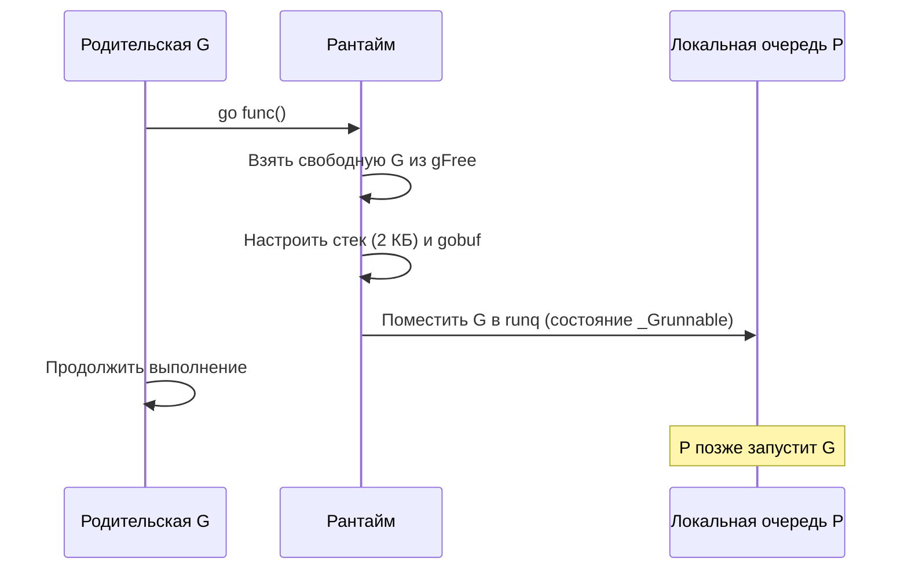
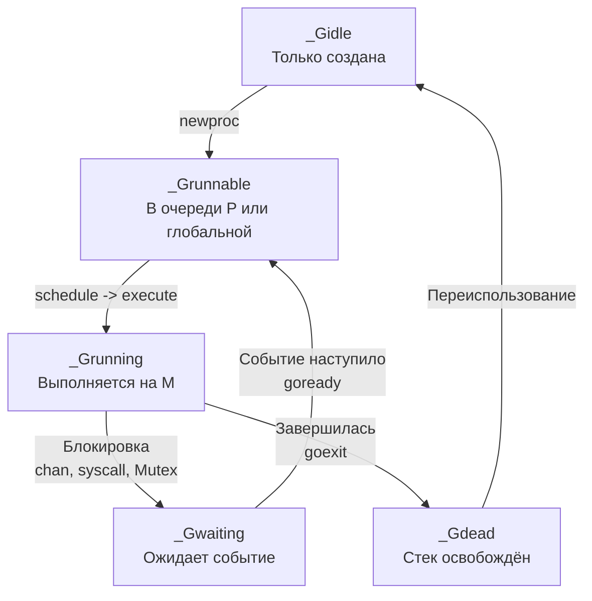

## Как устроена горутина: от старта до завершения

В [[1. Scheduler Go. G M P модель]] мы разобрали три ключевые сущности планировщика: G, M и P. Мы узнали, что P — логический процессор, M — поток ОС, а G — сама горутина. Но что именно представляет собой G? Как она запускается, как устроен её стек, как происходит переключение контекста и почему миллион горутин потребляют меньше ресурсов, чем тысяча потоков ОС?

Ответы на эти вопросы раскрывают механическую симпатию к рантайму: понимая, сколько тактов стоит запуск `go func()`, почему стек горутины растёт и как работает преемпция, Senior-инженер может проектировать эффективные конкурентные паттерны и избегать скрытых узких мест. Эта статья — погружение «под капот» горутины, от структуры `g` в исходниках до её жизненного цикла, с прицелом на практические выводы для производительности.

## Структура `g`: что внутри горутины

Горутина в Go — это не поток ОС и не зелёный поток в классическом понимании. Это структура `g`, определённая в `runtime/runtime2.go`. Вот её ключевые поля (упрощённо):

```go
type g struct {
    stack       stack   // lo, hi — границы стека
    sched       gobuf   // сохранённый контекст выполнения (SP, PC, BP...)
    atomicstatus atomic.Uint32 // состояние: _Gidle, _Grunnable, _Grunning, _Gwaiting, _Gdead
    goid        int64   // уникальный идентификатор
    m           *m      // поток M, на котором выполняется (если _Grunning)
    lockedm     *m      // если привязана через runtime.LockOSThread
    gopc        uintptr // адрес инструкции go, которая породила горутину
    parent      *g      // горутина-родитель (для профилирования)
    ...
}
```

- **`stack`** — границы непрерывного участка виртуальной памяти, выделенного под стек. Начальный размер — 2 КБ.
- **`sched`** — gobuf, сохраняющий регистры процессора в момент остановки горутины. Именно через него планировщик «запоминает», где горутина была прервана, и «восстанавливает» её при следующем запуске.
- **`atomicstatus`** — атомарное состояние, которое меняется по ходу жизни: `_Gidle` (только создана), `_Grunnable` (ждёт в очереди), `_Grunning` (активна на M), `_Gwaiting` (заблокирована), `_Gdead` (завершена, стек освобождён).

> [!info] Под капотом
> `gobuf` — это структура, сохраняемая в `g.sched`. В ней лежат значения регистров SP (stack pointer), PC (program counter), BP (base pointer) и других, специфичных для архитектуры. Когда планировщик выполняет `gogo(g)`, он загружает эти регистры из `g.sched` в реальные регистры процессора, и выполнение продолжается ровно с того места, где горутина была приостановлена. Это классический механизм переключения контекста в userspace, без дорогих syscall'ов.

## Создание горутины: что происходит при `go func()`

Когда компилятор встречает ключевое слово `go`, он преобразует вызов в обращение к `runtime.newproc`. Упрощённая цепочка:

1. **Получить G.** Рантайм пытается взять свободную `g` из списка переиспользования (`p.gFree`). Если список пуст, выделяется новая через `malg` с начальным стеком 2 КБ.
2. **Настроить стек и gobuf.** В стеке резервируется место для аргументов функции, которые копируются туда (аргументы «убегают» в кучу горутины). В `g.sched.pc` записывается адрес функции-обёртки `runtime.goexit`, которая гарантирует, что после завершения пользовательской функции горутина корректно завершится (перейдёт в `_Gdead`).
3. **Перевести в состояние `_Grunnable`.** Горутина помещается в локальную очередь P (`runq`), а если она переполнена — в глобальную очередь. В этот момент родительская горутина продолжает выполнение.

Всё это занимает десятки наносекунд — на порядки быстрее, чем создание потока ОС, которое требует системного вызова и выделения стека в 1-8 МБ.



> [!tip] Собеседование
> **Вопрос:** Сколько времени занимает запуск горутины в Go? Из чего складывается эта стоимость?
> **Ответ:** Порядка десятков наносекунд. Основные затраты: получение структуры `g` из пула свободных (или аллокация новой), настройка стека (2 КБ) и копирование аргументов, помещение в очередь. Создание потока ОС занимает микросекунды, поэтому горутины значительно легковеснее.

## Жизненный цикл: конечный автомат G

Горутина проходит через строго определённые состояния, управляемые атомарным полем `atomicstatus`. Переходы между состояниями — это и есть работа планировщика.



- **`_Gidle` → `_Grunnable`**: горутина готова, но ещё не выбрана планировщиком.
- **`_Grunnable` → `_Grunning`**: `execute(g)` переводит её на M, начинается исполнение.
- **`_Grunning` → `_Gwaiting`**: `gopark` вызывается при блокировке на канале, мьютексе, таймере, сетевом вызове. G отдаёт управление планировщику.
- **`_Gwaiting` → `_Grunnable`**: когда ожидаемое событие наступает (сообщение в канале, таймер сработал), `goready` помещает G обратно в очередь.
- **`_Grunning` → `_Gdead`**: функция завершилась, `goexit` освобождает стек и возвращает G в пул.

Состояния важны для профилирования: `/debug/pprof/goroutine?debug=2` показывает все горутины с их состояниями. Большое число `_Gwaiting` — нормально (ожидание сети), но тысячи `_Grunnable` при простаивающих P — сигнал проблемы (например, все горутины ждут глобальную блокировку).

## Стек горутины: непрерывный, растущий, копируемый

В отличие от потоков ОС со стеком фиксированного размера (обычно 1-8 МБ), стек горутины начинается с 2 КБ и растёт по необходимости. Реализовано это через **непрерывный стек** (contiguous stack) с копированием.

Когда горутина требует больше стека, чем доступно (например, глубокая рекурсия или крупный локальный фрейм), рантайм:

1. Выделяет новый стек удвоенного размера.
2. Копирует туда всё содержимое старого стека (фреймы вызовов, локальные переменные, gobuf).
3. Обновляет все указатели внутри горутины, ссылающиеся на старый стек (stack maps, сгенерированные компилятором, помогают найти эти указатели).
4. Освобождает старый стек.

Это копирование — тяжёлая операция (сотни наносекунд — микросекунды в зависимости от размера). Но происходит редко, обычно в первые миллисекунды жизни горутины, пока стек «разогревается» до рабочего размера. В хорошо спроектированной системе горутины не должны требовать гигантских стеков; для больших объёмов данных используют кучу.

Максимальный размер стека — 1 ГБ на 64-битных системах (управляется `runtime/debug.SetMaxStack`). Достижение этого предела вызывает `panic`, а не бесконечный рост.

> [!warning] Ловушка / Gotcha
> Рекурсивные функции без выхода или с очень глубокой рекурсией могут расти до максимума и вызывать панику. В production-коде всегда должна быть гарантия ограниченной глубины рекурсии или итеративная альтернатива.

## Переключение контекста: что сохраняется и восстанавливается

Переключение контекста между горутинами на одном P (и одном M) происходит через функции `gogo` и `gopark`, написанные на ассемблере для каждой архитектуры.

- **gogo(g)**: загружает регистры из `g.sched` в реальные регистры процессора и передаёт управление по адресу `PC`. Всё, что было сохранено в gobuf, восстанавливается.
- **gopark**: обратная операция. Сохраняет текущие регистры в `g.sched` и передаёт управление планировщику (`schedule`), который выберет следующую горутину.

Важно: переключение между горутинами происходит **в userspace**. Нет системного вызова, нет перехода в ядро, нет сброса TLB. Это делает переключение горутин чрезвычайно дёшевым — десятки наносекунд против микросекунд для потоков ОС.

Однако переключение всё же имеет стоимость:
- Сохранение/восстановление 10-15 регистров.
- Потенциальный cache miss при доступе к стеку новой горутины, если она была мигрирована с другого ядра.
- Накладные расходы на планировщик (поиск следующей G).

## Преемпция: как рантайм отбирает управление

Долгое время планировщик Go полагался исключительно на **кооперативную многозадачность**: горутина сама отдавала управление в safe points (вызов функций, операции с памятью). Это создавало проблемы: CPU-bound горутина без вызовов могла удерживать P бесконечно, вызывая starvation других горутин.

Начиная с Go 1.14, реализована **асинхронная преемпция** (asynchronous preemption). Механизм:
- Отдельный поток M (sysmon) мониторит, не застряла ли горутина в CPU-bound коде дольше определённого времени (обычно 10 мс).
- Если да, рантайм посылает сигнал `SIGURG` потоку M, исполняющему эту G.
- Обработчик сигнала сохраняет состояние горутины и вынуждает её войти в планировщик, где она может быть перепланирована.

Это гарантирует, что даже горутина в тесном цикле без вызовов не заблокирует P навсегда. Однако преемпция через сигнал стоит дороже, чем кооперативная (обработка сигнала — это десятки тактов плюс потенциальные cache и TLB сбросы). Поэтому код, часто попадающий под принудительную преемпцию, должен быть пересмотрен.

## Привязка к потоку ОС: LockOSThread

Иногда горутину необходимо жёстко привязать к потоку ОС. Например, при использовании графических библиотек (OpenGL), CGO-кода, который полагается на thread-local storage, или при взаимодействии с некоторыми системными вызовами.

`runtime.LockOSThread()` блокирует текущую горутину на текущем M. С этого момента:
- Только эта горутина может исполняться на этом M.
- Если горутина паркуется, M не может быть передан другой G.
- Когда горутина завершается, M может быть освобождён.

Цена привязки высока: M не может быть переиспользован для других горутин, что снижает гибкость планировщика и может привести к созданию лишних потоков ОС. Применять только в крайних случаях.

## Практические выводы и ловушки

> [!warning] Ловушка / Gotcha
> **Не путайте горутины с потоками.** Миллион горутин — это нормально для Go (около 2 ГБ стека, если все стартуют, но обычно меньше). Миллион потоков ОС убьёт систему. Однако миллион горутин, каждая из которых что-то ждёт, — это миллион стеков, потребляющих память. Следите за числом горутин через `/debug/pprof/goroutine`.

> [!warning] Ловушка / Gotcha
> **Горутины бесплатны, но не совсем.** Создание горутины стоит наносекунды, но её стек растёт, потребляя память и вызывая копирование. Переключение контекста стоит десятки тактов. Десятки тысяч горутин, активно работающих с CPU, могут создать измеримые накладные расходы.

> [!tip] Собеседование
> **Вопрос:** Что произойдёт, если запустить горутину, которая никогда не завершается и не блокируется?
> **Ответ:** Она будет бесконечно выполняться, не отдавая управление. До Go 1.14 это приводило к starvation других горутин на том же P. Сейчас планировщик асинхронно прервёт её через `SIGURG` и передаст управление другим горутинам. Однако это всё равно плохая практика, так как добавляет накладные расходы на преемпцию.

## Mechanical Sympathy: горутины и процессор

С точки зрения процессора, горутина — это поток инструкций, который то исполняется, то прерывается. Частые переключения между горутинами на одном ядре:

- **Вымывают L1/L2 кэш.** Данные и стек одной горутины вытесняют данные другой. Если переключения происходят слишком часто (микросекунды), постоянные cache miss могут существенно замедлить выполнение.
- **Нагружают предсказатель ветвлений.** Каждая горутина имеет свой паттерн исполнения. При переключении предсказатель должен заново «разогреваться».
- **Преемпция через сигнал** вызывает переключение в ядро и обратно, что стоит дороже кооперативного переключения.

Отсюда вывод: горутины следует проектировать так, чтобы они либо быстро завершались, либо блокировались на IO, оставляя CPU для небольшого количества вычислительных горутин. Для CPU-bound задач количество активных горутин не должно значительно превышать `GOMAXPROCS` (см. [[3. CPU bound vs IO bound задачи]]).

## Итог

- Горутина — это структура `g` с растущим стеком (начало 2 КБ), состоянием и сохранённым контекстом. Создаётся за наносекунды, живёт в userspace.
- Жизненный цикл: `_Gidle → _Grunnable → _Grunning → _Gwaiting → _Gdead`, с возможностью переиспользования.
- Стек непрерывный, растёт копированием (дорого, но редко). Максимальный размер — 1 ГБ.
- Переключение контекста между горутинами — чистый userspace, без syscall'ов, очень дёшево, но не бесплатно из-за кэша.
- Планировщик использует кооперативную многозадачность с асинхронной преемпцией (SIGURG) для предотвращения starvation.
- `LockOSThread` жёстко привязывает горутину к потоку, что дорого и редко нужно.
- Понимание внутренностей горутины необходимо для осознанного управления конкурентностью и диагностики производительности.

Теперь, разобрав, как горутины создаются и переключаются, мы переходим к механизму, который распределяет их между P — к **work stealing**. Следующая статья: [[3. Work stealing]].