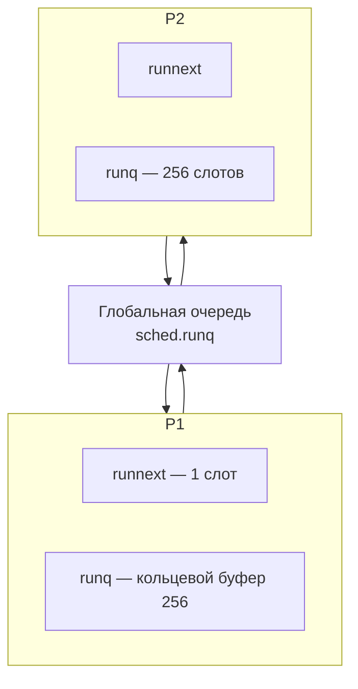
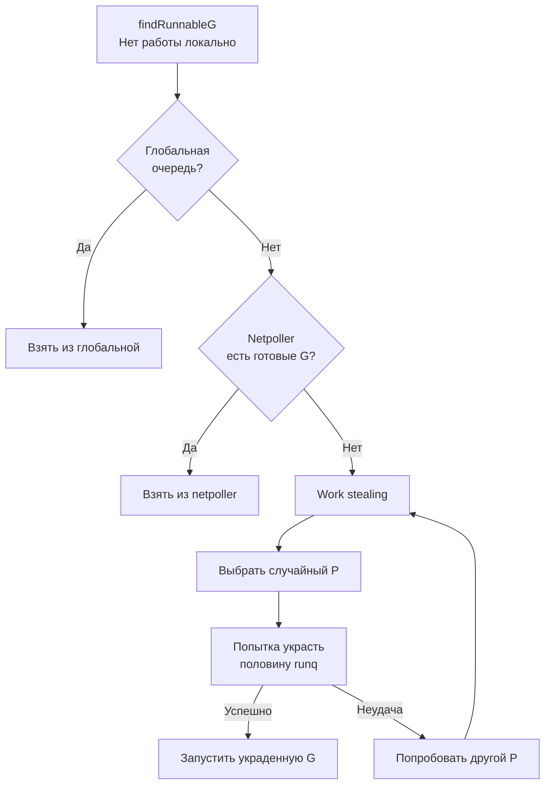

## Work stealing: балансировка нагрузки в планировщике Go

В [[1. Scheduler Go. G-M-P модель]] мы разобрали три сущности — G, M и P — и увидели, что у каждого P есть локальная очередь горутин (`runq`). В [[2. Goroutines под капотом]] мы узнали, как горутины создаются и попадают в очередь. Но остался открытым ключевой вопрос: что происходит, когда у одного P очередь переполнена, а другие P простаивают? Как планировщик гарантирует, что все ядра загружены равномерно?

Ответ — **work stealing** (воровство работы). Это алгоритм, с помощью которого простаивающие P «крадут» горутины у занятых, обеспечивая балансировку нагрузки без централизованного диспетчера. Work stealing — не уникальная идея Go; он используется во многих рантаймах (например, в Java ForkJoinPool, Intel TBB). Но в Go он реализован элегантно, с учётом особенностей блокирующих системных вызовов, сетевого поллера и асинхронной преемпции.

Понимание work stealing необходимо Senior-инженеру, чтобы диагностировать неравномерную загрузку ядер, избыточные миграции горутин, падение throughput из-за потери локальности кэша и другие трудноуловимые проблемы производительности. Эта статья разбирает алгоритм в деталях, от структур данных до ассемблерных нюансов кражи, и связывает теорию с практикой профилирования.

## Почему work stealing неизбежен

В идеальном мире каждая горутина попадает на P, который будет её исполнять, и очереди всегда сбалансированы. В реальности:

- Горутины создаются неравномерно: один обработчик HTTP может породить сотню дочерних горутин на своём P, пока другие P простаивают.
- Горутины могут надолго блокироваться (сетевой вызов, канал), оставляя P без работы.
- Системные вызовы открепляют M от P, и P нужно найти новую работу.

Без work stealing часть ядер бы простаивала, а на других скапливались бы очереди, что привело бы к деградации throughput и несправедливой latency.

## Три уровня очередей: где живут горутины

Перед тем как понять механизм кражи, нужно чётко представлять, куда горутины помещаются.



- **`runq`** — локальная очередь P, кольцевой буфер на 256 элементов. Работает без блокировок, доступна только своему P. Большинство операций (добавление, изъятие) выполняются за O(1) без CAS, так как нет конкуренции.
- **`runnext`** — особый слот для одной горутины, имеющей повышенный приоритет. Если `runnext` не пуст, планировщик всегда берёт горутину из него в первую очередь. Это позволяет реализовать своего рода LIFO для недавно созданных горутин, улучшая локальность (горячий стек, тёплый кэш).
- **Глобальная очередь** (`sched.runq`) — общая очередь для всех P, используется, когда локальная очередь переполняется или для редких операций. Доступ к ней защищён мьютексом (`sched.lock`), поэтому операции с глобальной очередью дороже.

Баланс между локальной и глобальной очередями ключевой: если горутины сразу падают в глобальную очередь, растёт contention на мьютексе и теряется локальность. Если всё держать в локальных, может возникнуть дисбаланс. Work stealing решает вторую проблему.

## Алгоритм воровства: кто, когда и как крадёт

Когда P исчерпал свою локальную работу (и `runnext`, и `runq` пусты), он входит в функцию `findRunnableG` (внутренняя часть `schedule`). Логика поиска работы:

1. Проверить `runnext`.
2. Изъять из `runq`.
3. Проверить глобальную очередь (с периодичностью, чтобы не флудить мьютексом).
4. Заглянуть в netpoller ([[4. epoll, kqueue и netpoller]]) — там могут быть горутины, ожидающие завершения сетевого ввода-вывода.
5. **Work stealing**: выбрать случайный P и попытаться украсть у него половину `runq`.



> [!info] Под капотом
> Функция кражи — `runqsteal` в `runtime/proc.go`. Она пытается украсть половину элементов из локальной очереди жертвы. Механика: оба P обращаются к `runq` жертвы (которая на 256 элементов), используя атомарные операции. Вор читает `head` и `tail`, вычисляет количество доступных элементов и пытается атомарно сдвинуть `head`. Если CAS проходит успешно, вор скопировал элементы в свою очередь. Жертва продолжает писать в свою очередь независимо, что реализовано через разделение `head` (читатель/вор) и `tail` (писатель/владелец). Это lock-free алгоритм, аналогичный work stealing в Cilk.

## Почему воруется половина, а не один элемент

Воровство одного элемента приводило бы к частым попыткам кражи, увеличивая contention на атомарных операциях и снижая эффективность. Воровство всей очереди лишало бы жертву возможности быстро возобновить работу после блокировки. Половина — компромисс, который обеспечивает амортизированно низкие накладные расходы и быструю балансировку.

## Влияние на локальность кэша: цена миграции

Work stealing решает проблему балансировки, но создаёт другую: **миграцию горутин между ядрами**. Когда P2 крадёт горутину у P1, стек и данные горутины, скорее всего, находятся в кэше L1/L2 ядра, на котором работал P1. P2, скорее всего, работает на другом ядре. Первое касание украденной горутины вызывает множество cache miss, пока её данные не перекочуют в локальный кэш нового ядра.

Это стоит десятки-сотни тактов, что для короткоживущей горутины может быть сопоставимо со временем её полезной работы. Планировщик слегка смягчает это:

- **`runnext`** — горутина в `runnext` с высокой вероятностью только что создана и ещё не выполнялась, её стек мог не успеть прогреться, так что миграция не так страшна.
- **Воровство половины очереди** — украденные горутины, скорее всего, ещё не исполнялись (лежат в очереди), так что их локальность минимальна.
- **Планировщик старается не красть, если есть глобальная работа** — глобальная очередь не привязана к ядру, так что её элементы нейтральны по кэшу.

Тем не менее, интенсивное воровство может вызывать общее снижение производительности из-за «кочующих» горутин и накладных расходов на атомарные операции. Поэтому Senior стремится проектировать систему так, чтобы загрузка P была равномерной изначально, без необходимости частого воровства.

## Взаимодействие с другими частями рантайма

### Netpoller
Горутины, ожидающие сетевого ввода-вывода, не находятся в очередях. Когда дескриптор становится готовым, netpoller ([[4. epoll, kqueue и netpoller]]) помещает горутину в глобальную очередь или в локальную очередь P, к которому она была ранее привязана (если P ещё существует). Таким образом, эти горутины тоже участвуют в балансировке через глобальную очередь или воровство.

### Системные вызовы
Когда горутина делает блокирующий системный вызов, P теряет M (см. [[1. Scheduler Go. G M P модель]]). P пытается найти новый M из пула. Если свободных M нет, создаётся новый. P продолжает выполнять оставшиеся горутины из своей локальной очереди. Но если локальная очередь пуста, P идёт воровать. Это объясняет, почему при большом количестве блокирующих syscall'ов число потоков (M) может расти, а вместе с ним и интенсивность воровства.

### Создание новой горутины
Когда на P создаётся новая горутина, она помещается в `runnext`. Если `runnext` уже занят, старая горутина из `runnext` вытесняется в `runq`. Если `runq` переполнена (256 элементов), половина `runq` перемещается в глобальную очередь (`sched.runq`). Это гарантирует, что локальные очереди не раздуваются бесконечно, а излишек становится доступен для глобального воровства.

## Инструменты для наблюдения за work stealing

### GODEBUG=schedtrace=1000

Вывод каждые 1000 мс:

```
SCHED 1000ms: gomaxprocs=8 idleprocs=2 threads=15 spinningthreads=1 idlethreads=6 runqueue=32 [15 0 23 8 0 14 0 5]
```

- `idleprocs=2` — два P простаивают (не нашли работу). Если это значение стабильно отлично от нуля при наличии общей очереди (`runqueue=32`), балансировка неэффективна.
- `runqueue=32` — глобальная очередь. Если она растёт, а P простаивают, возможно, P не успевают воровать, или что-то блокирует доступ к глобальной очереди.
- `[...]` — размер локальных очередей каждого P. Сильный разброс (например, 100, 0, 0, 0) сигнализирует о неравномерной загрузке и необходимости воровства.

### Execution tracer

`go tool trace` ([[3. execution tracer]]) визуализирует, когда горутины переходят между P. Можно увидеть моменты воровства как переход горутины с одного P на другой. Если трассировка показывает частые миграции, возможно, приложение порождает слишком много короткоживущих горутин на одном P, вынуждая другие P часто воровать.

### Профиль горутин

Если много горутин находятся в состоянии `_Grunnable` при простаивающих P, это может указывать на проблему с воровством или блокировкой глобальной очереди. Проверяется через `/debug/pprof/goroutine?debug=2`.

## Ловушки и лучшие практики

> [!warning] Ловушка / Gotcha
> **Чрезмерное использование `runtime.LockOSThread`** привязывает горутину к конкретному M и P. Если такие горутины блокируются, P простаивает, не имея возможности воровать, что создаёт дисбаланс.

> [!warning] Ловушка / Gotcha
> **Горутины, создаваемые в тесном цикле на одном P.** Если одна горутина в цикле порождает тысячи дочерних, все они сначала падают в `runq` этого P. Переполнение вызывает сброс половины в глобальную очередь, что сериализует воровство через глобальный мьютекс. Лучше ограничивать параллелизм через семафоры или worker pool.

> [!warning] Ловушка / Gotcha
> **Полагать, что горутины распределяются идеально.** Даже с work stealing возможен дисбаланс, особенно в переходных режимах (пик нагрузки, неравномерные тайминги). Мониторинг `schedtrace` в production-нагрузке помогает выявить проблемы.

## Mechanical Sympathy: как воровство взаимодействует с кэшем и шиной

С точки зрения процессора, операция воровства включает:

- Атомарный CAS на `runq.head` жертвы. Эта операция требует эксклюзивного доступа к кэш-линии, содержащей `head`. Протокол MESI переводит эту линию в состояние `Modified` на ядре вора и инвалидирует её на ядре жертвы. Если жертва в это же время пыталась писать в `tail` (который может быть в той же или соседней кэш-линии), возникает дополнительный трафик когерентности (false sharing на уровне планировщика!). Разработчики Go учли это, разнеся `head` и `tail` в структуре `p` так, чтобы они с большой вероятностью находились в разных кэш-линиях.

- После успешной кражи вор начинает исполнять горутину. Первое обращение к её стеку вызывает промах в L1/L2 и загрузку данных из L3 или RAM, что может занять до 100 тактов.

- Частое воровство также увеличивает трафик на шине QPI/Infinity Fabric, соединяющей ядра, что может стать узким местом в многоядерных системах.

Поэтому инженерный идеал — спроектировать приложение так, чтобы горутины были привязаны к P и выполнялись там до блокировки, а воровство оставалось редким страховочным механизмом.

## Итог

- **Work stealing** — lock-free алгоритм балансировки, с помощью которого простаивающие P крадут половину локальной очереди у случайного занятого P.
- Горутины распределены по трехуровневой системе: `runnext`, локальная `runq` (256 элементов), глобальная очередь.
- Механизм кражи (`runqsteal`) оперирует на атомарных операциях и специально устроен так, чтобы минимизировать contention и миграцию кэша.
- Воровство жизненно необходимо для равномерной загрузки ядер, но платой является потеря локальности кэша и накладные расходы на атомарные операции.
- Инструменты: `GODEBUG=schedtrace`, execution tracer, профиль горутин — позволяют наблюдать за дисбалансом и миграциями.
- Правильное проектирование конкурентного кода (равномерное порождение горутин, worker pool'ы) снижает необходимость в интенсивном воровстве и улучшает производительность.

Теперь, когда мы понимаем, как горутины распределяются по P, пора разобрать, что происходит, когда горутин больше, чем ядер, и как переключения между ними влияют на производительность: [[4. Контекстные переключения]].