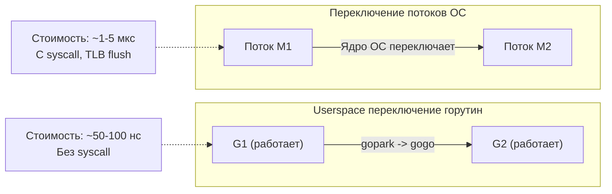

## Контекстные переключения: цена многозадачности

В предыдущих статьях подраздела мы заложили фундамент конкурентности Go: модель G-M-P ([[1. Scheduler Go. G M P модель]]), жизненный цикл горутины ([[2. Goroutines под капотом]]) и механизм балансировки — work stealing ([[3. Work stealing]]). Мы видели, что горутины создаются и планируются эффективно, а простаивающие P крадут работу у занятых. Но любое переключение с одной горутины на другую имеет цену. Эта цена — **контекстное переключение** (context switch) — прямо влияет на latency и throughput, особенно под высокой нагрузкой.

Контекстное переключение происходит на двух уровнях: **внутри рантайма Go** (смена горутины на том же потоке) и **в операционной системе** (смена потока на ядре). Оба уровня важны. Senior Go-инженер обязан понимать их механику, стоимость и способы минимизации, чтобы проектировать системы, которые не деградируют при росте числа горутин и потоков.

В этой статье мы разберём, что именно переключается, во сколько это обходится, как увидеть переключения в метриках и профилях, и как писать код, уменьшающий накладные расходы на переключения. Это подготовит нас к разбору стоимости примитивов синхронизации ([[5. Sync primitives и их стоимость]]), где те же эффекты проявляются в contention.

## Два вида контекстных переключений в Go

### 1. Переключение между горутинами (userspace context switch)

Это переключение, которое планировщик Go выполняет самостоятельно, без участия ядра ОС. Оно происходит в следующих случаях:

- Горутина добровольно уступает управление: вызывает `runtime.Gosched()`, блокируется на канале, мьютексе, таймере, сетевом вызове.
- Горутина завершается (`goexit`).
- Преемпция: планировщик принудительно снимает горутину с M через сигнал `SIGURG` (асинхронная преемпция, Go 1.14+).

Механика переключения:

1. Текущая горутина G1 сохраняет свой контекст (регистры SP, PC, BP и др.) в структуру `g.sched` (gobuf) — операция `gopark` или ассемблерный аналог.
2. Планировщик выбирает новую горутину G2 через `schedule()` → `findRunnableG()`.
3. Контекст G2 загружается из её `g.sched` в реальные регистры процессора — операция `gogo(g2)`.
4. Выполнение продолжается на том же M (потоке ОС), но с другим стеком и программным счётчиком.

Это **чисто userspace-операция**: нет системных вызовов, нет перехода Ring 3 → Ring 0, нет сброса TLB. Именно поэтому горутины переключаются в десятки раз быстрее потоков ОС.

### 2. Переключение потоков ОС (kernel-level context switch)

Происходит, когда планировщик ОС решает отдать ядро другому потоку. В Go это случается, когда:

- Поток M блокируется в системном вызове (например, файловый I/O), и ОС переключает его на другой поток.
- Потоков M больше, чем ядер, и ОС вынуждена чередовать их выполнение.
- Поток уходит в сон (futex) при ожидании блокировки.
- Прерывания, таймеры ОС, планировщик ядра вытесняют поток по истечении кванта времени.

Переключение потока ОС включает:

- Сохранение/восстановление всех регистров общего назначения, FPU, SIMD.
- Сохранение/восстановление контекста виртуальной памяти (CR3 на x86, TTBR на ARM), что ведёт к сбросу TLB (частичному или полному, в зависимости от архитектуры и использования PCID/ASID).
- Переход в ядро и обратно (Ring 0 ↔ Ring 3).
- Накладные расходы планировщика ядра.

Общая стоимость — порядка **1–5 микросекунд** против **десятков наносекунд** для горутин.



## Структура затрат: такты и кэш

### Userspace-переключение горутины

- Сохранение/восстановление ~10-15 регистров (включает FPU? не всегда, только если используется) — 15-20 тактов.
- Потенциальный **cache miss**: стек новой горутины может быть не в L1/L2 кэше текущего ядра, особенно если горутина была мигрирована в процессе work stealing. Первое обращение к стеку вызывает промах до L3 или RAM — ещё 50-200 тактов.
- Накладные расходы самого планировщика (поиск следующей G) — если очередь непуста, десятки тактов.
- Итого: **50-200 наносекунд** в типичных условиях.

### Kernel-переключение потока

- Сохранение/восстановление ~50+ регистров (включая системные, FPU, SIMD).
- Сброс TLB (частичный): потеря тепла виртуальной памяти, последующие TLB-промахи добавляют 10-20 нс на каждую промахнувшуюся страницу.
- Промахи в кэше инструкций и данных: поток мог быть неактивен миллисекунды, его рабочий набор полностью вымыт.
- Планировщик ядра (O(log n) по числу потоков) — 0.5-1 мкс.
- Системный вызов (переключение режимов) — 100-200 нс.
- Итого: **1-5 микросекунд**, часто больше при загруженной системе.

Эти цифры не высечены в камне (зависят от архитектуры, частоты, нагрузки), но порядок важен: **горутины переключаются на порядок быстрее потоков**. Поэтому Go способен обслуживать миллионы конкурентных задач на ограниченном числе ядер.

## Когда переключений становится слишком много

Переключения — полезный механизм, но их избыток ведёт к деградации:

1. **Прямой overhead.** Если на выполнение полезной работы уходит 1 мкс, а переключение стоит 100 нс, каждое десятое переключение съедает 1% CPU. При доле переключений в 10% от времени — это уже 10% потерянной пропускной способности.
2. **Вымывание кэша.** Каждая новая горутина или поток приносит свой рабочий набор (стек, данные). Частые переключения заставляют кэш постоянно перезагружаться, что увеличивает среднее время доступа к памяти и снижает IPC (instructions per cycle).
3. **Нарастание очередей.** Если горутин значительно больше ядер, они скапливаются в очередях `runq`. Время, проведённое в состоянии `_Grunnable`, напрямую добавляется к latency запроса. Это классический случай перегрузки CPU-bound задачами ([[3. CPU bound vs IO bound задачи]]).
4. **Увеличение числа потоков.** При большом количестве блокирующих системных вызовов рантайм создаёт дополнительные M. Если их станет больше ядер, ОС начнёт переключать их, что добавит дорогие kernel-переключения и полностью разрушит преимущество горутин.

> [!warning] Ловушка / Gotcha
> **Неограниченный spawn горутин.** Разработчик, привыкший к лёгкости горутин, может написать `for { go handle() }` без ограничения параллелизма. При 100 000 активных горутин на 8-ядерной машине планировщик будет тратить значительное время на их переключение и очереди, а latency резко возрастёт. Используйте семафоры или worker pool.

## Измерение контекстных переключений

### 1. GODEBUG=schedtrace

Трассировка планировщика (рассмотрена в [[1. Scheduler Go. G M P модель]]) показывает `idleprocs` и `runqueue`. Если `runqueue` стабильно растёт, а `idleprocs=0`, горутины стоят в очереди — налицо избыток переключений и нехватка CPU.

### 2. /debug/pprof/goroutine

Показывает все горутины с состояниями. Много горутин в `_Grunnable` при 100% занятости P = перегрузка, частые переключения.

### 3. Профилировщик блокировок и мьютексов

[[5. block profile]] и [[6. mutex profile]] показывают, где горутины ожидают, что является причиной переключений.

### 4. Execution tracer

`go tool trace` ([[3. execution tracer]]) — самый мощный инструмент. Он визуализирует:
- Переходы горутин между состояниями.
- Время, проведённое в `Runnable` (в очереди).
- Моменты преемпции (G вытеснена с P).
- Миграции горутин между P (следствие work stealing, которое увеличивает cache miss при переключениях).

### 5. Системные метрики ОС (Linux)

- `vmstat 1` или `sar -w 1` показывают `cs` (context switches per second) — общесистемные переключения потоков. Резкий рост cs при запуске Go-приложения может свидетельствовать о создании большого числа потоков M.
- `pidstat -w -p <pid> 1` — количество добровольных (`cswch/s`) и недобровольных (`nvcswch/s`) переключений потоков конкретного процесса. Добровольные — поток уступил CPU (futex, sleep), недобровольные — вытеснен планировщиком ОС по времени.

Высокое число недобровольных переключений при `GOMAXPROCS` > числа ядер или при избытке M говорит о том, что ОС борется за ресурсы, а приложение теряет производительность.

## Mechanical Sympathy: кэш и TLB при переключениях

С точки зрения «железа» переключение контекста — это «холодный старт» для нового потока инструкций:

- **L1/L2 кэш данных** заполнен данными предыдущей горутины. Новая горутина начинает с нуля — каждое обращение к стеку и локальным переменным сначала вызывает cache miss.
- **L1 кэш инструкций** также содержит код предыдущей горутины. Если новая горутина выполняет совершенно другой код, ей придётся загружать инструкции из L2/L3.
- **TLB** (трансляция виртуальных адресов в физические) для userspace-переключения горутин обычно не сбрасывается, так как процесс один и тот же. Но при переключении потоков ОС (если они принадлежат разным процессам или при смене CR3) TLB сбрасывается, что катастрофически дорого.
- **Предсказатель ветвлений** и **BTB** «настроены» на паттерны предыдущей горутины. Новой нужно время, чтобы их переобучить (десятки-сотни тактов).

Таким образом, частые переключения превращают даже CPU-bound код в memory-bound из-за постоянных промахов. Senior-инженер, понимая это, стремится к тому, чтобы:

- Активные горутины работали достаточно длинными квантами (минимизация преемпций и добровольных передач управления).
- Горутины, обрабатывающие связанные данные, по возможности оставались на одном P (чтобы сохранять кэш горячим).
- Число потоков M не превышало числа ядер без крайней необходимости (чтобы избежать переключений ОС).

## Стратегии минимизации накладных расходов на переключения

1. **Ограничение параллелизма.** Вместо `go handle()` на каждый запрос используйте фиксированный пул воркеров (`semaphore` через буферизованный канал). Это удерживает число активных горутин на разумном уровне и снижает давление на планировщик.
2. **Балансировка CPU и IO.** Для CPU-bound задач число горутин не должно превышать `GOMAXPROCS` ([[3. CPU bound vs IO bound задачи]]). Для IO-bound можно больше, но следить за числом потоков M.
3. **Избегайте частого `runtime.Gosched()`.** Это явная передача управления, которая полезна для кооперативной разгрузки, но злоупотребление увеличивает число переключений без полезной работы.
4. **Минимизация блокирующих системных вызовов.** Заменяйте файловые операции на асинхронные (где возможно), используйте `io_uring` (через сторонние пакеты), агрегируйте мелкие вызовы в один.
5. **Сокращайте время удержания блокировок.** Критические секции под `sync.Mutex` должны быть максимально короткими, чтобы горутины не скапливались в ожидании и не переключались зря ([[5. Sync primitives и их стоимость]]).
6. **Используйте `GOMAXPROCS` разумно.** Установка `GOMAXPROCS` равной числу ядер (по умолчанию) обычно оптимальна. Искусственное занижение снижает параллелизм, завышение — увеличивает конкуренцию и накладные расходы на переключения.

## Пример: влияние неограниченного spawn'а на переключения

Без пула:

```go
func handler(w http.ResponseWriter, r *http.Request) {
    go process(r) // каждый запрос — новая горутина
}
```

При 50k RPS создаётся 50k горутин в секунду. Планировщик перегружен, `schedtrace` показывает рост `runqueue`, latency улетает.

С пулом:

```go
var pool = make(chan struct{}, 1000) // семафор на 1000 одновременных обработок

func handler(w http.ResponseWriter, r *http.Request) {
    pool <- struct{}{}
    go func() {
        process(r)
        <-pool
    }()
}
```

Число горутин контролируется, планировщик справляется, переключения предсказуемы.

## Итог

- Контекстные переключения в Go бывают **userspace** (горутины, ~50-200 нс) и **kernel** (потоки ОС, ~1-5 мкс).
- Userspace-переключения дёшевы, но всё равно влияют на кэш и TLB; kernel-переключения дороги и разрушительны для локальности.
- Избыток переключений возникает при перегрузке CPU-bound горутинами, излишнем числе потоков M, частых блокирующих системных вызовах.
- Измеряются через `GODEBUG=schedtrace`, execution tracer, профиль горутин и системные `pidstat/vmstat`.
- Механическая эмпатия: переключения вымывают кэш и сбрасывают предсказатель, превращая вычислительный код в memory-bound.
- Контроль через пулы воркеров, ограничение параллелизма, минимизацию блокировок и разумное `GOMAXPROCS`.

Понимание стоимости переключений позволяет нам перейти к анализу того, из-за чего эти переключения чаще всего происходят — примитивам синхронизации. Следующая статья: [[5. Sync primitives и их стоимость]].