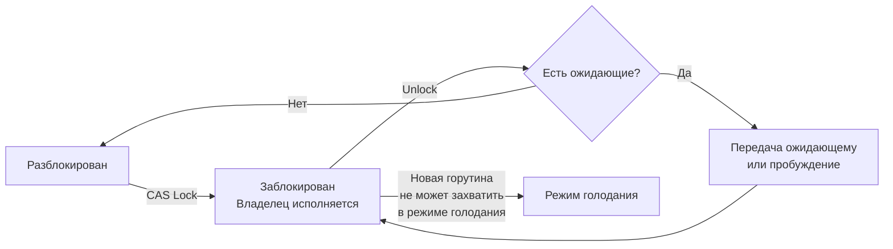

## Сравнительная стоимость примитивов синхронизации в Go

В [[4. Контекстные переключения]] мы выяснили, что каждое переключение горутины или потока ОС имеет измеримую цену — от десятков наносекунд до микросекунд. Теперь мы перейдём к первопричине многих переключений: **примитивам синхронизации**. Именно они заставляют горутины ожидать, пробуждаться и конкурировать за ресурсы.

В Go доступен богатый арсенал примитивов: `sync.Mutex`, `sync.RWMutex`, `sync/atomic`, каналы, `sync.WaitGroup`, `sync.Once`, `sync.Cond`. Выбор между ними часто сводится к интуитивному «мьютекс быстрее канала» или «atomic быстрее мьютекса», но Senior-инженер обязан знать точную цену, механизмы внутренней реализации и сценарии, в которых каждый примитив оптимален. Ошибка в выборе может стоить десятков микросекунд задержки или 30% пропускной способности под нагрузкой.

Эта статья даёт количественную и качественную оценку стоимости всех основных примитивов синхронизации, связывая их с моделью планировщика ([[1. Scheduler Go. G M P модель]]), контекстными переключениями ([[4. Контекстные переключения]]) и аппаратной механикой ([[5. Mechanical sympathy в backend разработке]]). Она готовит почву для конкретного сравнения мьютекса и канала ([[6. Mutex vs channel]]) и глубокого анализа contention ([[7. Contention и lock profiling]]).

## Mutex: быстрый путь, медленный путь и голодание

`sync.Mutex` — самый часто используемый примитив. Его внутренняя структура (упрощённо):

```go
type Mutex struct {
    state int32  // старший бит — locked, младшие — голодание, количество ожидающих
    sema  uint32 // семафор для futex (в Linux)
}
```

Мьютекс имеет два режима: **быстрый путь** (fast path) и **медленный путь** (slow path). Быстрый путь — это атомарный compare-and-swap (CAS) над полем `state` в userspace. Если мьютекс свободен, CAS переводит его в заблокированное состояние за 1 атомарную операцию. Стоимость: **порядка 10-20 нс** (цена CAS плюс несколько инструкций).

Если мьютекс занят, горутина переходит в медленный путь. Она:
1. Пытается некоторое время крутиться в spin-цикле (spinning), проверяя, не освободился ли мьютекс. Это позволяет избежать парковки горутины, если блокировка удерживается недолго.
2. Если spinning не помог, горутина паркуется через `runtime.semacquire` → системный вызов `futex(FUTEX_WAIT)` в Linux. Это переход в ядро и обратно с блокировкой потока M.
3. При освобождении мьютекса владелец вызывает `runtime.semrelease` → `futex(FUTEX_WAKE)`, что пробуждает ожидающие горутины.

При отсутствии contention (`GOMAXPROCS=1` или низкая конкурентность) мьютекс почти всегда идёт по быстрому пути и стоит **10-20 нс**. При высоком contention горутины паркуются, что добавляет затраты на context switch уровня планировщика Go и, возможно, ОС ([[4. Контекстные переключения]]). Время ожидания может достигать микросекунд и даже миллисекунд.

### Режим голодания (starvation mode)

С версии Go 1.9 мьютекс имеет защиту от голодания. Если горутина ждёт дольше 1 мс, мьютекс переходит в режим голодания. В этом режиме владелец не отдаёт мьютекс новым горутинам, а прямо передаёт его ожидающей голове очереди. Это гарантирует справедливость, но увеличивает накладные расходы на планирование.

### Состояния Mutex



> [!info] Под капотом
> Поле `state` хранит не только флаг блокировки, но и биты режима голодания и счётчик ожидающих горутин. Функция `runtime.mutex.Lock()` (внутренняя, не путать с `sync.Mutex.Lock()`) используется самим рантаймом и является более простой, без режимов. Пользовательский `sync.Mutex` реализован поверх `runtime.mutex` с дополнительной логикой справедливости.

## RWMutex: читатели и писатели

`sync.RWMutex` расширяет Mutex, позволяя множеству читателей одновременно удерживать блокировку. Писатель эксклюзивен.

Внутренне он устроен сложнее:

```go
type RWMutex struct {
    w           Mutex  // мьютекс для писателей
    writerSem   uint32 // семафор для ожидающих писателей
    readerSem   uint32 // семафор для ожидающих читателей
    readerCount int32  // количество активных читателей (+ ожидающие писатели, если отрицательное)
    readerWait  int32  // сколько читателей должны завершиться перед писателем
}
```

- **RLock / RUnlock**: быстрый путь — атомарное увеличение/уменьшение `readerCount`. Если нет ожидающих писателей, это практически бесплатно (атомарный инкремент, ~10 нс). Если есть ожидающий писатель, читатель паркуется.
- **Lock / Unlock писателя**: захватывает внутренний `w` (Mutex). Затем, если есть активные читатели (`readerCount > 0`), ждёт на `writerSem`, пока все читатели не выйдут (RUnlock).

Стоимость RLock без contention — **10-20 нс**. При наличии писателя может возрастать до блокировки. Писатель всегда дороже, так как требует координации с читателями. Поэтому для сценариев с частыми записями RWMutex может быть медленнее обычного Mutex, так как накладные расходы на управление читателями превышают выгоду от параллельного чтения.

> [!warning] Ловушка / Gotcha
> **Писатели могут голодать.** В ранних версиях Go читатели не пропускали писателей вперёд, что приводило к голоданию писателей при постоянном потоке читателей. Сейчас используется writer-preferred подход: при появлении писателя новые читатели блокируются, но уже активные дорабатывают.

## Atomic: самый дешёвый примитив

Операции пакета `sync/atomic` (`AddInt64`, `LoadInt64`, `StoreInt64`, `CompareAndSwapInt64` и др.) реализуются через аппаратные атомарные инструкции (LOCK ADD, XCHG, CMPXCHG на x86; LDREX/STREX на ARM). Они не требуют блокировок, не паркуют горутины и не взаимодействуют с планировщиком.

Стоимость:
- **Чтение (Load):** ~1-2 нс (может быть просто обычное чтение, если не нужно последовательное согласование).
- **Запись (Store):** ~2-5 нс.
- **CAS / Add:** ~5-15 нс.

С версии Go 1.19 добавлены типы `atomic.Int64`, `atomic.Pointer` и поддержка явного ordering (`memory.OrderRelaxed`, `memory.OrderAcqRel`, `memory.OrderSequentiallyConsistent`). По умолчанию атомики используют sequentially-consistent ordering — самый строгий, требующий полного барьера памяти (MFENCE на x86), что несколько дороже. Если требуется только атомарность без гарантий упорядочения, можно использовать relaxed-операции для экономии.

**Ограничения:** атомарные операции применимы только к ограниченному набору типов (целые, указатели, булевы через int32). Они не могут защитить составные структуры данных. Для сложных инвариантов нужен Mutex.

> [!tip] Собеседование
> **Вопрос:** Можно ли заменить Mutex на atomic, если нужно защитить счётчик?
> **Ответ:** Да, `atomic.AddInt64` для инкремента/декремента дешевле Mutex (5-10 нс против 20 нс), не вызывает блокировок и не заставляет горутины парковаться. Но если нужно атомарно изменить счётчик и проверить условие (например, счётчик > 0), потребуется CAS-цикл или Mutex для составной операции.

## Каналы: дороже, чем кажется

Канал (`chan`) — мощный, но относительно дорогой примитив. Его внутренняя структура `hchan` (из `runtime/chan.go`):

```go
type hchan struct {
    qcount   uint           // количество элементов в буфере
    dataqsiz uint           // размер буфера
    buf      unsafe.Pointer // кольцевой буфер
    elemsize uint16
    closed   uint32
    sendx    uint           // индекс для записи
    recvx    uint           // индекс для чтения
    recvq    waitq          // очередь ожидающих читателей (горутин)
    sendq    waitq          // очередь ожидающих отправителей
    lock     mutex          // защита структуры
}
```

Каждая операция send или recv:
1. Захватывает внутренний мьютекс `lock` (fast path — атомарный CAS, как у `sync.Mutex`).
2. Проверяет состояние буфера и очередей ожидающих.
3. Если есть прямой рандеву (небуферизированный канал и горутина-партнёр ждёт), копирует значение напрямую из стека отправителя в стек получателя (минуя буфер), затем пробуждает партнёра.
4. Если нет прямого рандеву, и буфер позволяет, копирует значение в буфер и отпускает мьютекс.
5. Если буфер заполнен (или пуст для recv), горутина паркуется в очередь `sendq` или `recvq`, отпускает мьютекс и ждёт пробуждения.

**Стоимость:**
- **Небуферизированный канал, успешное рандеву:** оба горутины активны, копирование значения, два lock/unlock (отправитель и получатель). ~100-300 нс.
- **Буферизированный канал, без блокировки:** копирование в буфер / из буфера, один lock/unlock. ~50-150 нс.
- **Блокирующая операция:** горутина паркуется → переключение контекста ([[4. Контекстные переключения]]) → пробуждение при появлении партнёра. Задержки от единиц до сотен микросекунд.

Таким образом, канал всегда дороже атомарной операции и часто дороже Mutex, даже на быстром пути, из-за внутреннего мьютекса и более сложной логики. Но канал предоставляет встроенную очередь ожидания и семантику передачи владения, что для многих сценариев (координация, передача данных между горутинами) незаменимо.

## WaitGroup, Once, Cond: специализированные примитивы

### sync.WaitGroup
Внутренне: `state` (atomic), счётчик и семафор. `Add` и `Done` — атомарное увеличение/уменьшение счётчика. `Wait` при ненулевом счётчике паркует горутину на внутреннем семафоре. Стоимость `Done`: **10 нс**. `Wait` с нулевым счётчиком — быстрая проверка, без блокировки. При ожидании — парковка.

### sync.Once
Гарантирует однократное выполнение. Внутри: Mutex и atomic-флаг. Быстрый путь (после первого вызова): атомарное чтение флага, ~**2 нс**. Первый вызов: захват Mutex, выполнение функции, сброс флага. Последующие — почти бесплатно.

### sync.Cond
Широковещательное или адресное пробуждение ожидающих горутин. Использует Mutex и список ожидающих. `Wait` атомарно освобождает Mutex и паркует горутину; `Signal`/`Broadcast` пробуждают одну или все. Редко используется напрямую; в основном применяется внутри других примитивов.

## Сравнительная таблица стоимости

Все цифры приблизительные, измерены на современном x86-64 CPU ~3 ГГц, при отсутствии contention.

| Операция | Стоимость (fast path) | Стоимость (slow path / contention) |
|----------|-----------------------|-----------------------------------|
| `atomic.Load` | 1-2 нс | — |
| `atomic.Store` | 2-5 нс | — |
| `atomic.Add` / `CAS` | 5-15 нс | — |
| `Mutex.Lock` (uncontended) | 10-20 нс | парковка: 1-10+ мкс |
| `Mutex.Unlock` | 5-10 нс | пробуждение: 1-5 мкс |
| `RWMutex.RLock` (uncontended) | 10-20 нс | при ожидании писателя: парковка |
| `RWMutex.RUnlock` | 5-10 нс | — |
| `Channel (buffered, no wait)` | 50-150 нс | блокировка: 1-100 мкс |
| `Channel (unbuffered rendezvous)` | 100-300 нс | — |
| `WaitGroup.Done` | ~10 нс | — |
| `WaitGroup.Wait` (waits) | парковка | 1-10 мкс |
| `Once.Do` (cached) | ~2 нс | — |

> [!info] Под капотом
> Все эти цифры — функция от тактовой частоты, архитектуры (x86 vs ARM), версии Go и уровня contention. Но порядки устойчивы: атомарные операции на порядок быстрее Mutex, Mutex на порядок быстрее канала. Главный фактор стоимости — не сами инструкции, а побочные эффекты: вытеснение кэша (cache line bouncing) и переключения контекста.

## Инструменты измерения стоимости синхронизации

### Mutex profile

`go test -mutexprofile=mutex.out` или установка `runtime.SetMutexProfileFraction(1)` в программе включает профилирование contention на мьютексах. Профиль показывает, какие мьютексы вызывают наибольшее время ожидания. Подробно в [[6. mutex profile]].

### Block profile

`go test -blockprofile=block.out` или `runtime.SetBlockProfileRate(1)` — для измерения ожиданий на каналах, мьютексах, syscall'ах. Подробно в [[5. block profile]].

### Execution tracer

Показывает, когда горутины блокируются на синхронизации, как долго ждут, и чем это вызвано. Незаменим для анализа tail latency от contention.

### Бенчмарки

Единственный способ определить точную стоимость в вашем конкретном коде — написать бенчмарк и запустить с `-benchmem -count=10`. Сравнивайте разные примитивы на реалистичных сценариях.

## Mechanical Sympathy: как синхронизация влияет на процессор и кэш

Когда горутины конкурируют за мьютекс или канал, происходит несколько аппаратных процессов:

- **Cache line bouncing.** Состояние мьютекса (`state`) — это 4 байта, лежащие в одной кэш-линии. Когда ядро А захватывает мьютекс, его кэш-контроллер переводит эту линию в состояние `Modified`. Ядро Б, пытающееся прочитать или записать в эту же линию, должно ждать, пока линия будет передана по протоколу когерентности (MESI). Это стоит десятки наносекунд на каждой попытке, даже без парковки. Если данные, защищаемые мьютексом, находятся в той же кэш-линии, возникает **false sharing** ([[8. False sharing]]), усугубляющий проблему.
- **Спекулятивное исполнение и барьеры памяти.** Атомарные операции и мьютексы используют барьеры памяти (LOCK prefix на x86, DMB на ARM), которые останавливают спекулятивное исполнение и «сливают» store-буфер. Это добавляет десятки тактов.
- **Переход в ядро (futex).** При парковке горутины мьютекс вызывает futex-системный вызов ([[1. Системные вызовы и их стоимость]]), что стоит ~100-200 нс накладных расходов плюс переключение в ядро и обратно. Массовая парковка/пробуждение создают лавину syscall'ов.
- **TLB и кэш после пробуждения.** Проснувшаяся горутина, вероятно, была мигрирована на другое ядро и потеряла локальность кэша и TLB. Её первый доступ к защищаемым данным будет медленным.

Вывод: синхронизация стоит не только времени, явно потраченного на ожидание, но и скрытых потерь от разрушения микроархитектурного состояния.

## Когда какой примитив выбирать

- **Atomic** — для простых флагов, счётчиков, ссылок, где не нужна защита нескольких полей. Самый дешёвый, не блокирует.
- **Mutex** — для защиты сложных структур данных (мапы, слайсы), составных операций, критических секций, которые длятся дольше нескольких наносекунд.
- **RWMutex** — когда чтений значительно больше записей, и критические секции относительно длинные (микросекунды). Если записи часты или секции короткие, оверхед RWMutex превышает выгоду.
- **Channel** — для передачи владения данными между горутинами, синхронизации, управления параллелизмом (семафоры). Не для защиты общей структуры от гонок.
- **WaitGroup** — для ожидания завершения группы горутин.
- **Once** — для однократной инициализации.

Подробнее сравнение Mutex и Channel будет в следующей статье: [[6. Mutex vs channel]].

## Итог

- Примитивы синхронизации в Go имеют широкий спектр стоимости: от ~1 нс (атомарное чтение) до микросекунд и более при contention.
- Mutex на быстром пути — ~10-20 нс, на медленном — переход в futex и парковка.
- RWMutex дороже Mutex, но даёт параллелизм читателей; выбор зависит от соотношения чтений/записей.
- Atomic — самый дешёвый, но ограниченный; идеален для счётчиков и флагов.
- Канал — самый дорогой из-за внутреннего мьютекса и очередей, но даёт мощную семантику передачи сообщений.
- Стоимость синхронизации измеряется профилями contention (mutex, block), execution tracer и бенчмарками.
- На уровне железа синхронизация вызывает cache line bouncing, барьеры памяти и переходы в ядро, разрушая локальность кэша и увеличивая latency.

Теперь, имея количественные оценки стоимости каждого примитива, мы можем перейти к центральному вопросу выбора между двумя главными инструментами Go: [[6. Mutex vs channel]].