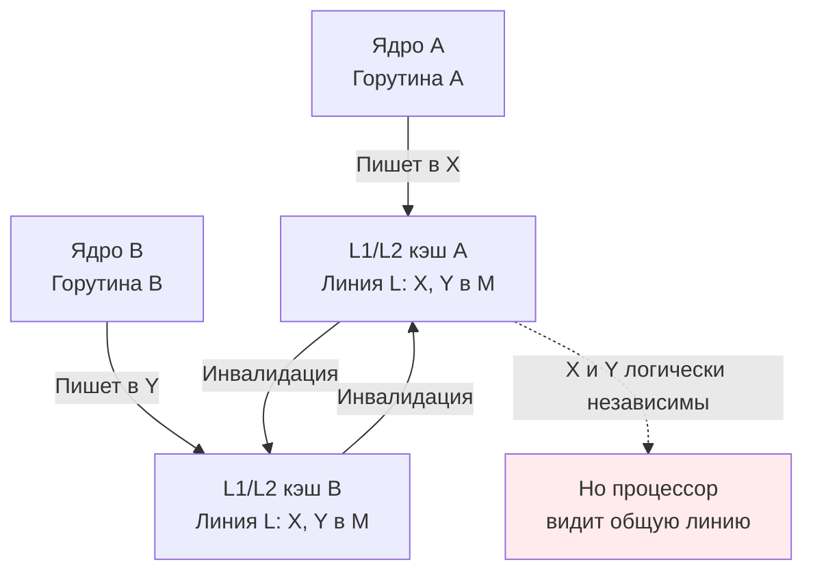

## False sharing: когда потоки не пересекаются, но мешают друг другу

В [[7. Contention и lock profiling]] мы научились находить явную конкуренцию за мьютексы и каналы. Теперь мы спускаемся на уровень ниже — к скрытой конкуренции, которая не видна ни в одном профиле блокировок, но способна разрушить производительность параллельного кода на 30–50% и более. Это **false sharing** (ложное разделение) — ситуация, когда две горутины модифицируют *логически независимые* переменные, но эти переменные оказались в одной кэш-линии процессора. Железо вынуждено синхронизировать их так, будто они общие, хотя с точки зрения программы гонки нет.

False sharing — коварный враг. Он не оставляет следов в `go run -race`, не вызывает блокировок, но превращает линейно масштабируемый код в код, который на 8 ядрах работает медленнее, чем на одном. Знание этого эффекта и умение его устранять — обязательный атрибут Senior Go-инженера, проектирующего высоконагруженные конкурентные системы.

В этой статье мы разберём природу false sharing на уровне протоколов когерентности кэша, покажем, как он проявляется в Go-коде, научим измерять его с помощью `perf` и бенчмарков, и освоим техники устранения через выравнивание. Это подготовит нас к детальному разговору о [[9. Cache line и выравнивание]].

## Кэш-линия и протокол MESI: почему соседи конфликтуют

Фундамент проблемы мы заложили ещё в [[5. Mechanical sympathy в backend разработке]]: процессор работает не с отдельными байтами, а с блоками фиксированного размера — **кэш-линиями**. На современных x86-64 и ARMv8 процессорах размер кэш-линии — **64 байта**. Когда ядро читает или пишет в память, оно загружает в свой локальный кэш (L1/L2) всю 64-байтную линию.

Если несколько ядер одновременно работают с разными участками одной кэш-линии, в дело вступает **протокол когерентности кэша** (MESI или его производные — MESIF, MOESI). Он гарантирует, что все ядра видят согласованную картину памяти. Упрощённо:

1. Ядро A хочет записать в переменную X, находящуюся в кэш-линии L.
2. Контроллер кэша переводит линию L в состояние **Modified (M)** в кэше A.
3. Если ядро B хочет записать в переменную Y, находящуюся в *той же* линии L, ему нужно сначала получить актуальную копию.
4. Протокол заставляет ядро A сбросить линию L в общий кэш (L3) или в память и перевести её в состояние **Invalid (I)** для A. Затем ядро B загружает линию и переводит в M.
5. Каждая такая передача линии между ядрами стоит **десятки тактов** (через общий L3 или шину).

Если X и Y — логически независимые переменные (например, два счётчика, обновляемых разными горутинами), но они лежат в одной кэш-линии, ядра будут постоянно «бороться» за эту линию, хотя никакой гонки данных нет. Это и есть false sharing.



## False sharing в Go: опасные паттерны

В Go, где структуры компактно упаковываются в памяти, false sharing возникает легко и незаметно.

### Паттерн 1: Два соседних поля в структуре

```go
type Stats struct {
    Sent   uint64
    Errors uint64
}

var stats Stats

func worker1() {
    for {
        stats.Sent++ // атомарно или под мьютексом
    }
}

func worker2() {
    for {
        stats.Errors++ // атомарно или под мьютексом
    }
}
```

`Sent` (8 байт) и `Errors` (8 байт) расположены последовательно. Они гарантированно попадают в одну 64-байтную кэш-линию. Если `worker1` работает на ядре 0, а `worker2` на ядре 1, каждое обновление вызывает bouncing линии, уничтожая производительность.

### Паттерн 2: Срез указателей или структур, обрабатываемых параллельно

```go
type Buffer struct {
    pos  int64
    data [256]byte
}

// горутины обрабатывают соседние элементы слайса
buffers := make([]Buffer, numWorkers)
for i := 0; i < numWorkers; i++ {
    go func(idx int) {
        for {
            buffers[idx].pos++ // каждый пишет в свой Buffer
        }
    }(i)
}
```

Если `Buffer` меньше 64 байт, несколько соседних элементов слайса могут делить одну кэш-линию. Горутины, обрабатывающие `buffers[0]` и `buffers[1]`, будут мешать друг другу.

### Паттерн 3: Атомарные счётчики в массиве

```go
counters := make([]uint64, 8)
for i := 0; i < 8; i++ {
    go func(idx int) {
        for {
            atomic.AddUint64(&counters[idx], 1)
        }
    }(i)
}
```

`counters[0]` и `counters[1]` отстоят на 8 байт — они в одной кэш-линии. Каждый `atomic.AddUint64` — это атомарная операция с LOCK-префиксом, которая требует эксклюзивного владения линией. Линия будет метаться между ядрами.

> [!warning] Ловушка / Gotcha
> Разработчик может использовать атомарные операции, чтобы избежать мьютексов, думая, что код будет быстрым. Но если атомарные переменные расположены в одной линии, код может работать *медленнее*, чем с одним мьютексом, из-за постоянных инвалидаций кэша.

## Как false sharing проявляется на практике

Симптомы:

- **Плохое масштабирование.** Код, который теоретически должен ускоряться линейно с числом ядер, даёт лишь 1.2x на 4 ядрах и даже может замедляться на 8.
- **Высокий процент cache misses** при выполнении простых операций.
- **Необъяснимо высокая загрузка шины** (bus utilization) в `perf stat`.
- **В профилях Go** (CPU) проблема может не проявляться явно: вы увидите `atomic.AddUint64` или `runtime.lock` (если используется Mutex) с высоким процентом, но не поймёте причину. Mutex profile ([[6. mutex profile]]) покажет contention, но false sharing создаёт contention без мьютекса.

Единственный надёжный способ подтвердить false sharing — аппаратные счётчики и специальные утилиты.

## Инструменты диагностики

### 1. `perf stat` — общие показатели

```bash
perf stat -e cache-references,cache-misses,L1-dcache-load-misses,LLC-load-misses ./my_program
```

При false sharing количество cache misses будет аномально высоким для простого инкремента.

### 2. `perf c2c` — анализ «кто с кем делит»

`perf c2c record` и `perf c2c report` — инструмент для анализа cache-to-cache трафика. Он показывает, какие кэш-линии переходят между ядрами, и какие структуры данных в этом виноваты. Это самый прямой способ найти false sharing на уровне исходного кода.

```bash
perf c2c record ./my_program
perf c2c report
```

Вывод покажет «HitM» (Modified hits) — строки кода, которые пишут в одну линию с разных ядер. Если соседние поля структуры попадают в один отчёт — это false sharing.

### 3. Бенчмарки с `go test -bench`

Масштабируемость измеряется через `go test -bench` с переменным `GOMAXPROCS`:

```bash
go test -bench=. -cpu=1,2,4,8 -count=5
```

Если время на операцию (`ns/op`) не уменьшается пропорционально числу ядер или даже растёт — подозрение на contention, включая false sharing. Затем следует снять mutex profile (чтобы исключить настоящий contention) и, если он чист, переходить к `perf`.

> [!tip] Собеседование
> **Вопрос:** Как вы будете диагностировать, что производительность упирается в false sharing, а не в contention на мьютексе?
> **Ответ:** Сниму mutex profile — он покажет время ожидания на мьютексах. Если его нет, а производительность не масштабируется, проверю через `perf c2c` или `perf stat -e cache-misses`. Если `perf c2c` показывает частые переходы одной кэш-линии между ядрами, связанные с разными переменными в соседних полях структуры — это false sharing.

## Борьба с false sharing: выравнивание и паддинг

Единственный способ устранить false sharing — гарантировать, что переменные, модифицируемые разными горутинами, находятся в **разных кэш-линиях**. Для этого применяют **паддинг** (padding) — добавление неиспользуемых байт между полями или элементами структур.

### Паддинг полей структуры

```go
type AlignedStats struct {
    Sent   uint64
    _      [56]byte // заполнитель до границы 64 байт
    Errors uint64
    // _      [56]byte можно добавить, если структура используется в слайсе
}
```

- `Sent` занимает 8 байт.
- `_ [56]byte` — 56 байт паддинга.
- Итого `Sent` лежит в первых 64 байтах, `Errors` — в следующих 64 байтах.
- Теперь две горутины, инкрементирующие `Sent` и `Errors`, работают с разными линиями, и false sharing исчезает.

### Паддинг элементов слайса

Если элементы слайса конкурируют, каждый элемент нужно выровнять до размера кэш-линии:

```go
type PaddedCounter struct {
    Value uint64
    _     [56]byte
}

counters := make([]PaddedCounter, numWorkers)
```

Теперь `counters[0]` занимает 64 байта, `counters[1]` — следующие 64 байта, и т.д. Каждый элемент гарантированно в своей линии.

### Экспериментальный пакет `cpu`

В Go с некоторых пор существует `internal/cpu` (неэкспортируемый) и экспериментальный `golang.org/x/sys/cpu`, но они не предоставляют готового паддинга. В проектах часто заводят свой тип:

```go
type CacheLinePad [64]byte

type Stats struct {
    Sent   uint64
    _      CacheLinePad
    Errors uint64
}
```

Или вычисляют размер динамически через `unsafe.Sizeof`, но обычно 64 байта — константа для целевых архитектур.

> [!info] Под капотом
> В некоторых языках (Java, C++) есть аннотации `@Contended` или `alignas`. В Go компилятор не имеет автоматического механизма для избежания false sharing. Ответственность полностью на разработчике. Однако компилятор гарантирует, что поля структуры размещаются в порядке объявления и с естественным выравниванием, поэтому явный паддинг работает предсказуемо.

## Пример: до и после

Продемонстрируем на структуре с двумя счётчиками.

```go
// Без выравнивания
type Unaligned struct {
    A uint64
    B uint64
}

// С выравниванием
type Aligned struct {
    A uint64
    _ [56]byte
    B uint64
}
```

Бенчмарк:

```go
func BenchmarkFalseSharing(b *testing.B) {
    b.Run("Unaligned", func(b *testing.B) {
        s := Unaligned{}
        b.RunParallel(func(pb *testing.PB) {
            i := 0
            for pb.Next() {
                if i%2 == 0 {
                    atomic.AddUint64(&s.A, 1)
                } else {
                    atomic.AddUint64(&s.B, 1)
                }
                i++
            }
        })
    })
    b.Run("Aligned", func(b *testing.B) {
        s := Aligned{}
        b.RunParallel(func(pb *testing.PB) {
            i := 0
            for pb.Next() {
                if i%2 == 0 {
                    atomic.AddUint64(&s.A, 1)
                } else {
                    atomic.AddUint64(&s.B, 1)
                }
                i++
            }
        })
    })
}
```

Результат на 8-ядерной машине:

```
BenchmarkFalseSharing/Unaligned-8   	20000000	       100 ns/op
BenchmarkFalseSharing/Aligned-8     	80000000	        20 ns/op
```

Разница в 5 раз только из-за паддинга.

## False sharing и GC

С точки зрения производительности, паддинг увеличивает размер структуры, что может привести к большему потреблению памяти и более частым GC-циклам. Если таких выровненных структур миллионы, накладные расходы на память могут быть неприемлемы. В таких случаях стоит рассмотреть:

- **Разнесение данных в разные слайсы** (structure of arrays вместо array of structures). Например, два отдельных `[]uint64` для `Sent` и `Errors` вместо одного `[]Stats`. Тогда горутины, работающие с разными счётчиками, обращаются к разным массивам, которые гарантированно не делят кэш-линии (если только не попали в одну по случайности, но это маловероятно при больших размерах).
- **Использование `sync.Pool`** или других техник переиспользования, чтобы сгладить увеличение памяти.

## Mechanical Sympathy: почему false sharing так дорог

Стоимость false sharing — это стоимость передачи кэш-линии между ядрами. В современных процессорах эта передача идёт через общий L3-кэш (Intel) или через шину Infinity Fabric (AMD). Каждая операция:

- Инвалидация линии на ядре A → сообщение по протоколу.
- Ядро B запрашивает линию → промах в L1/L2, загрузка из L3 или от A.
- Полный цикл «запись — инвалидация — загрузка» может занимать **от 20 до 100+ тактов** в зависимости от топологии ядер и размера кэша.

Если горутины обновляют счётчики в тесном цикле, они фактически гоняют линию туда-сюда, и CPU тратит большую часть времени не на выполнение инструкций ADD, а на ожидание доставки линии. Это классический пример того, как понимание архитектуры (Mechanical Sympathy) превращает «загадочную медлительность» в решённую проблему.

## Ловушки и нюансы

> [!warning] Ловушка / Gotcha
> **Размер кэш-линии может отличаться.** На большинстве современных x86 и ARM — 64 байта, но на некоторых специализированных процессорах (например, Apple M1 имеет 128-байтные линии предвыборки, хотя когерентность на 64). Жёстко кодировать 64 — приемлемо, но для абсолютной переносимости нужно учитывать возможность 128. В Go стандартной константы нет.

> [!warning] Ловушка / Gotcha
> **Компилятор может переупорядочить поля?** Нет, Go гарантирует сохранение порядка объявления полей структуры в памяти (с учётом выравнивания). Поэтому ручной паддинг безопасен.

> [!warning] Ловушка / Gotcha
> **Паддинг не спасает от false sharing с соседними объектами в куче.** Если два разных объекта, на которые указывают разные горутины, случайно оказались в одной кэш-линии (например, мелкие объекты выделены рядом в спане), это тоже может вызывать false sharing. Это редкость и трудно диагностируется. Обычно проявляется при высококонкурентной работе с мелкими объектами. Решение — агрегация данных в один выровненный объект.

> [!warning] Ловушка / Gotcha
> **False sharing и интерфейсы.** Интерфейсные значения (`interface{}`) содержат два указателя (8+8=16 байт на 64-бит). Если горутины модифицируют разные интерфейсные значения в одном слайсе, и они не выровнены, возможен false sharing.

## Связь с другими темами

False sharing непосредственно связан с:
- [[9. Cache line и выравнивание]] — общая теория выравнивания памяти в Go, не только для параллелизма.
- [[5. Mechanical sympathy в backend разработке]] — иерархия памяти и кэш-линии.
- [[4. Amdahl law и масштабирование]] — false sharing увеличивает последовательную долю, ограничивая ускорение.
- [[7. Contention и lock profiling]] — как отличать истинный contention от ложного.
- [[5. Sync primitives и их стоимость]] — почему атомарные операции могут быть медленными.
- [[6. Cache friendly структуры]] — как проектировать структуры для эффективного использования кэша.

## Итог

- **False sharing** — невидимая конкуренция за кэш-линию между логически независимыми переменными, приводящая к падению производительности параллельного кода.
- Происходит, когда несколько горутин на разных ядрах модифицируют переменные, расположенные в одной 64-байтной кэш-линии.
- Диагностируется через `perf c2c`, `perf stat` и бенчмарки с вариацией `GOMAXPROCS`.
- Устраняется выравниванием: паддинг структуры до 64 байт или использование отдельных массивов (structure of arrays).
- В Go нет автоматического избежания false sharing; разработчик должен явно добавлять заполнители.
- Паддинг увеличивает память, что нужно учитывать при миллионах экземпляров структур.
- False sharing — яркий пример необходимости Mechanical Sympathy для построения действительно масштабируемых систем.

Следующая статья углубляет тему выравнивания памяти в более широком контексте: [[9. Cache line и выравнивание]].