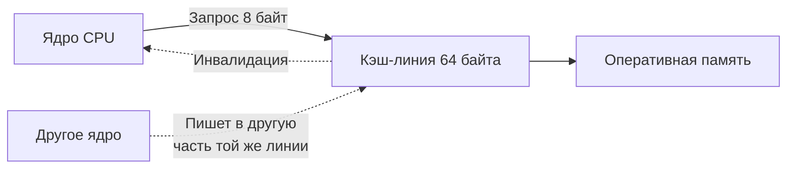

## Cache line и выравнивание: как память становится быстрой или медленной

В [[8. False sharing]] мы рассмотрели одну из самых коварных проблем конкурентности — ложное разделение кэш-линий, которое разрушает производительность без видимых гонок. Но cache line — это не только источник проблем, а фундаментальная единица работы процессора с памятью. **Выравнивание** (alignment) данных относительно границ cache line и естественного размера типов прямо определяет, сколько тактов потратит процессор на доступ к полю структуры, срез слайса или атомарную переменную.

В C/C++ разработчик привык управлять выравниванием явно (`alignas`, `__attribute__((aligned))`). В Go компилятор берёт эту обязанность на себя, но Senior-инженер должен понимать, как он это делает, чтобы не создавать структуры, которые занимают вдвое больше памяти, чем необходимо, или нечаянно порождают false sharing. Более того, от выравнивания зависит корректность атомарных операций и эффективность кэш-памяти.

Эта статья завершает подраздел «Конкурентность», объединяя знания о планировщике ([[1. Scheduler Go. G M P модель]]), стоимости синхронизации ([[5. Sync primitives и их стоимость]]) и устройстве процессора ([[5. Mechanical sympathy в backend разработке]]). Мы изучим правила выравнивания в Go, научимся измерять размеры и выравнивание структур, оптимизировать компоновку полей и избегать типичных ловушек.

## Что такое cache line и почему процессор читает память блоками

Современный процессор никогда не читает из оперативной памяти отдельные байты. Он всегда обращается блоками фиксированного размера — **кэш-линиями** (cache lines). На подавляющем большинстве современных x86-64 и ARMv8 процессоров размер кэш-линии составляет **64 байта**. Некоторые архитектуры (например, Apple M1/M2) используют 128-байтные линии для предвыборки данных, но когерентность кэша всё равно оперирует 64-байтными блоками.

Когда программа читает переменную, процессор загружает в свой локальный кэш (L1/L2) всю 64-байтную линию, содержащую эту переменную. Если следующая переменная, которая нужна программе, лежит в той же линии — она уже в кэше, и доступ стоит 1-2 такта. Если она в другой линии — может потребоваться ещё один промах (cache miss) и загрузка из L3 или RAM, что стоит десятки-сотни тактов.

Отсюда два фундаментальных следствия:
1. **Пространственная локальность** (spatial locality) — чем плотнее данные упакованы и чем более последовательно мы к ним обращаемся, тем лучше используется каждая загруженная линия.
2. **Ложное разделение** (false sharing) — если две независимые переменные попадают в одну линию, но обрабатываются разными ядрами, возникает трафик когерентности, разрушающий производительность ([[8. False sharing]]).



## Выравнивание в Go: что гарантирует компилятор

**Выравнивание** (alignment) определяет, по каким адресам в памяти могут располагаться переменные конкретного типа. Для каждого типа существует **естественное выравнивание** (natural alignment), обычно равное размеру типа:

- `bool`, `byte` — 1 байт.
- `int16`, `uint16` — 2 байта.
- `int32`, `uint32`, `float32` — 4 байта.
- `int64`, `uint64`, `float64` — 8 байт.
- Указатели, `map`, `chan`, `func` — 8 байт на 64-битных системах (размер машинного слова).
- Слайс — 8 байт (указатель), но его внутренняя структура — 24 байта; выравнивание самого слайса — 8 байт.
- Структура — выравнивание по самому строгому полю (максимальный alignment среди полей).

Компилятор Go гарантирует, что каждое поле структуры размещается по адресу, кратному его естественному выравниванию. Это может приводить к **паддингу** (padding) — вставке неиспользуемых байт между полями или в конце структуры.

```go
type Example struct {
    a bool   // 1 байт, адрес кратен 1
    b int64  // 8 байт, адрес должен быть кратен 8 → 7 байт паддинга
    c bool   // 1 байт, адрес кратен 1
}
// Размер: 1 + 7 (паддинг) + 8 + 1 + 7 (хвостовой паддинг до кратности 8) = 24 байта
```

> [!info] Под капотом
> В исходном коде компилятора (`cmd/compile/internal/types/align.go`) заданы правила выравнивания для всех типов. Для структур вычисляется `align = max(align полей)`. Размер структуры округляется вверх до кратности этому `align`, чтобы при размещении в массиве каждый элемент был выровнен правильно.

## Как измерять размер и выравнивание

В Go есть встроенные функции пакета `unsafe`:

- **`unsafe.Sizeof(v)`** — размер переменной в байтах (включая паддинг).
- **`unsafe.Alignof(v)`** — требуемое выравнивание типа переменной.
- **`unsafe.Offsetof(v.field)`** — смещение поля от начала структуры.

```go
type Example struct {
    a bool
    b int64
    c bool
}

func main() {
    var ex Example
    fmt.Println("Size:", unsafe.Sizeof(ex))   // 24
    fmt.Println("Align:", unsafe.Alignof(ex)) // 8
    fmt.Println("Offset a:", unsafe.Offsetof(ex.a)) // 0
    fmt.Println("Offset b:", unsafe.Offsetof(ex.b)) // 8
    fmt.Println("Offset c:", unsafe.Offsetof(ex.c)) // 16
}
```

Знание этих чисел позволяет вручную аудировать структуры и находить неоптимальную компоновку.

## Оптимизация компоновки полей (field ordering)

Порядок объявления полей в структуре напрямую влияет на её размер. Перестановка полей от наибольшего выравнивания к наименьшему минимизирует паддинг.

```go
// Плохо: 24 байта
type Bad struct {
    a bool
    b int64
    c bool
}

// Хорошо: 16 байт
type Good struct {
    b int64
    a bool
    c bool
}
```

В `Good` `b` занимает 8 байт, затем два `bool` — 2 байта, и хвостовой паддинг 6 байт до кратности 8. Итого 16 байт вместо 24. Экономия 33% памяти.

Для больших массивов структур это сокращает потребление памяти на гигабайты и увеличивает долю структур, помещающихся в кэш ([[6. Cache friendly структуры]]).

Автоматический линтер `fieldalignment` (из `golang.org/x/tools/go/analysis/passes/fieldalignment`) проверяет структуры и предлагает оптимальный порядок.

> [!tip] Собеседование
> **Вопрос:** Почему перестановка полей структуры может ускорить приложение?
> **Ответ:** Уменьшение размера структуры улучшает cache friendliness: больше структур помещается в кэш, меньше промахов при обходе массива. Также уменьшается потребление памяти и давление на GC.

## Выравнивание и слайсы, массивы

Элементы массива или слайса располагаются в памяти последовательно, с шагом (stride), равным размеру типа. Если тип имеет размер 24 байта, каждый следующий элемент будет смещён на 24 байта.

Если размер элемента не кратен размеру кэш-линии, возможны ситуации, когда соседние элементы частично перекрываются с разными линиями, что усложняет предвыборку (prefetching) и может вызвать неоптимальные паттерны доступа. Для высокопроизводительных структур иногда вручную выравнивают размер элемента до 64 байт, даже ценой паддинга (как в борьбе с false sharing, [[8. False sharing]]).

## Выравнивание и атомарные операции

Пакет `sync/atomic` накладывает строгое требование: операнд должен быть выровнен естественным образом. Для 64-битных типов это означает выравнивание на 8 байт. Компилятор автоматически гарантирует это для полей структур и глобальных переменных. Однако при ручном выделении памяти через `unsafe` или при кастинге произвольного слайса байт разработчик сам отвечает за выравнивание.

На x86-64 невыровненный доступ к атомарным операциям может работать, но медленнее (разбивается на несколько микроопераций). На ARM (включая Apple Silicon) невыровненный доступ к 64-битным атомарным операциям **вызывает panic** с сообщением `unaligned 64-bit atomic operation`. Это частая ловушка при написании кросс-платформенного кода.

```go
// Опасно: buf может быть не выровнен на 8
buf := make([]byte, 16)
ptr := (*int64)(unsafe.Pointer(&buf[1])) // смещение 1, не кратно 8
atomic.AddInt64(ptr, 1) // panic на ARM!
```

Решение: либо выделять память с гарантированным выравниванием (через `make` с типами, которые выровнены), либо использовать ручное выравнивание через округление адреса.

## Mechanical Sympathy: выравнивание, кэш и TLB

Выравнивание данных влияет не только на атомарность и размер, но и на фундаментальные механизмы процессора:

- **Кэш-линии и split access.** Если многобайтовое значение (например, `int64`) пересекает границу кэш-линии (начинается на последних байтах одной линии и продолжается в следующей), процессор выполняет **два доступа** к кэшу вместо одного. Это удваивает задержку. Естественное выравнивание предотвращает split access.
- **TLB и страницы памяти.** Плотная упаковка структур уменьшает общее количество страниц, которые занимает рабочий набор, что снижает количество TLB-промахов. Напротив, раздутые структуры увеличивают footprint и вытесняют записи из TLB.
- **Предвыборка (prefetching).** Аппаратный префетчер процессора замечает линейные паттерны доступа. Если структуры выровнены и идут последовательно, префетчер легко подгружает следующие линии. Если структуры разного размера и не выровнены, эффективность предвыборки падает.
- **Шина памяти и burst-транзакции.** Память работает эффективнее, когда запросы выровнены по границам кэш-линий. Невыровненный доступ может порождать дополнительные транзакции на шине.

Таким образом, выравнивание — это не только «правильно», но и «быстро» с точки зрения железа.

## Выравнивание структур для конкурентного доступа (cache line padding)

Возвращаясь к теме [[8. False sharing]], напомним, что для структур, поля которых интенсивно обновляются разными горутинами, может потребоваться принудительное выравнивание до размера кэш-линии (64 байта) с помощью паддинга:

```go
type SharedCounters struct {
    Sent   uint64
    _      [56]byte // cache line padding
    Errors uint64
    _      [56]byte
}
```

Это гарантирует, что каждое поле находится в своей кэш-линии, и ядра не мешают друг другу. Но платить за это приходится увеличенным потреблением памяти. Поэтому такой паддинг применяется только для «горячих» структур, доказанных профилированием ([[7. Contention и lock profiling]], `perf c2c`).

## Инструменты для анализа выравнивания

- **`unsafe.Sizeof`, `unsafe.Alignof`, `unsafe.Offsetof`** — базовый инструмент.
- **`golang.org/x/tools/go/analysis/passes/fieldalignment`** — автоматический анализатор неоптимальных структур.
- **`go vet`** с флагом `-fieldalignment` (начиная с Go 1.19 доступен как стандартный анализатор).
- **`structlayout`** (`github.com/ajstarks/svgo/structlayout-svg`, `honnef.co/go/tools/structlayout`) — визуализация раскладки структуры в памяти.
- **`perf`** и **`perf c2c`** — для диагностики проблем с false sharing на уровне кэш-линий.

## Ловушки и типичные ошибки

> [!warning] Ловушка / Gotcha
> **Порядок полей имеет значение только внутри структуры.** Компилятор не переставляет поля для оптимизации (в отличие от C/C++), поэтому вы сами отвечаете за порядок. Полагаться на то, что «компилятор всё оптимизирует» нельзя.

> [!warning] Ловушка / Gotcha
> **Невыровненные 64-битные атомарные операции на ARM.** На x86 это работает (медленно). На ARM вызывает панику. При тестировании на Macbook M1/M2 этот баг проявляется сразу.

> [!warning] Ловушка / Gotcha
> **Интерфейсы и выравнивание.** Интерфейсное значение (`interface{}`) занимает 16 байт на 64-битных системах (два указателя: на динамический тип и на значение). Если вы работаете с большим количеством интерфейсов, помните об их размере и выравнивании.

> [!warning] Ловушка / Gotcha
> **Паддинг в конце структуры для массивов.** Даже если вы оптимизировали поля, размер структуры всегда округляется до выравнивания. Это нужно для корректной работы массивов: каждый элемент должен начинаться с выровненного адреса.

## Связь с другими темами

- [[5. Mechanical sympathy в backend разработке]] — иерархия памяти, кэш-линии, локальность.
- [[8. False sharing]] — прямое применение cache line padding и причина, почему выравнивание критично в конкурентном коде.
- [[5. Sync primitives и их стоимость]] — атомарные операции требуют выравнивания.
- [[6. Cache friendly структуры]] — как проектировать структуры с учётом кэша.
- [[4. Allocation profiling]], [[5. pprof memory profile]] — как видеть размер структур и общий расход памяти.
- [[7. Fragmentation]] — паддинг влияет на внутреннюю фрагментацию.

## Итог

- **Кэш-линия** (64 байта) — базовый блок работы процессора с памятью. Пространственная локальность и выравнивание определяют эффективность использования кэша.
- **Естественное выравнивание** — каждая переменная должна располагаться по адресу, кратному её размеру. Go гарантирует это для полей структур, вставляя паддинг.
- **Порядок полей** влияет на размер структуры: от большего выравнивания к меньшему уменьшает паддинг. Инструменты (`unsafe`, `fieldalignment`) позволяют это контролировать.
- **Атомарные операции** требуют выравнивания; невыровненный доступ на ARM вызывает panic.
- **Кэш-линейный паддинг** (до 64 байт) предотвращает false sharing в горячих конкурентных структурах.
- Выравнивание влияет на производительность не только через размер, но и через split access, TLB-промахи, prefetching.
- Senior-инженер владеет как аналитическими инструментами, так и механической эмпатией, чтобы проектировать структуры данных, максимально дружественные процессору.

На этом мы завершаем подраздел «Конкурентность». Мы прошли путь от планировщика горутин до тонкостей выравнивания памяти. Теперь мы готовы перейти к тому, как Go взаимодействует с операционной системой на уровне системных вызовов и ввода-вывода. Следующая статья: [[1. Системные вызовы и их стоимость]].