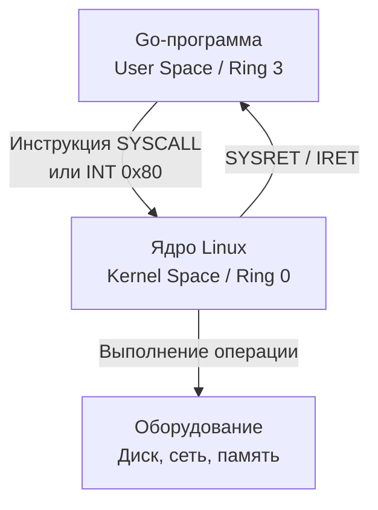
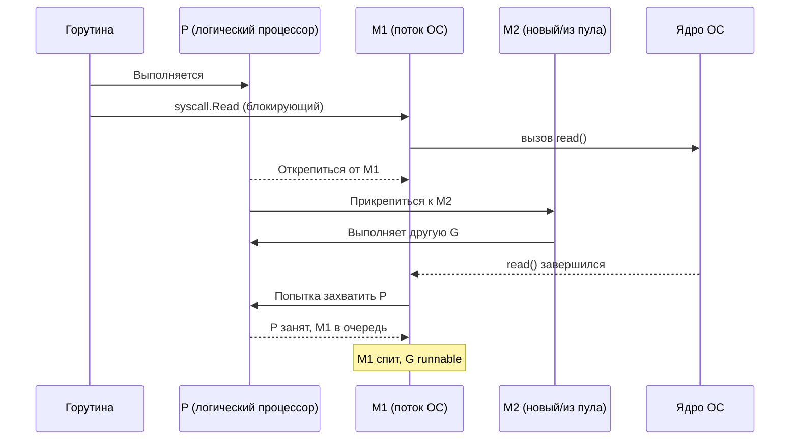

## Почему системные вызовы — главная плата за взаимодействие с ОС

До сих пор в разделе мы в основном говорили о том, что происходит внутри процесса: как работает CPU ([[2. CPU profiling в Go]]), как выделяется и собирается память ([[04. Memory profiling]], [[05. Garbage Collector]]), как планируются горутины ([[1. Scheduler Go. G M P модель]]). Но любое сетевое соединение, чтение файла, работа с часами или аллокация памяти, которая заставляет ОС расширить кучу, требуют **системного вызова** (system call, syscall) — контролируемого перехода из пространства пользователя (userspace) в пространство ядра (kernel space).

Системный вызов — это не просто функция. Это пересечение границы между мирами с разными привилегиями (Ring 3 → Ring 0 на x86), переключение стека, проверка аргументов, смена контекста в ядре и часто — ожидание завершения операции. Все эти шаги стоят **тысячи тактов процессора**. Понимание стоимости syscall'ов и того, как Go их обрабатывает, отделяет разработчика, который просто вызывает `os.ReadFile`, от Senior-инженера, способного объяснить, почему этот вызов может занять 100 микросекунд при пустом диске.

Эта статья открывает подраздел «IO и системный уровень». Мы разберём механику syscall от ассемблера до планировщика горутин, научимся измерять их стоимость и рассмотрим паттерны минимизации: буферизацию, пакетную обработку, zero-copy. Это фундамент для понимания [[2. IO bottlenecks]], [[4. epoll, kqueue и netpoller]] и [[5. Zero copy подходы]].

## Что такое системный вызов: архитектурный взгляд

### Два кольца: User Space и Kernel Space

Процессор x86-64 (и ARM в аналогичной модели) исполняет код в нескольких уровнях привилегий (protection rings). Ваша программа на Go работает в **Ring 3** — наименее привилегированном режиме. В этом режиме запрещено:

- Напрямую обращаться к оборудованию (диск, сеть).
- Изменять таблицы страниц памяти.
- Читать или писать память ядра.
- Выполнять привилегированные инструкции (HLT, IN, OUT, изменение CR3).

Ядро ОС работает в **Ring 0** — режиме полных привилегий. Когда программе нужно записать байт в файл или отправить пакет, она должна **попросить** ядро сделать это от её имени. Этот запрос и есть системный вызов.



### Анатомия syscall на x86-64 (Linux)

Современный syscall в Linux на x86-64 выполняется так:

1. **Подготовка аргументов.** Go-рантайм помещает номер системного вызова в регистр `RAX`, а аргументы — в `RDI`, `RSI`, `RDX`, `R10`, `R8`, `R9` (в порядке следования).
2. **Инструкция `SYSCALL`.** Процессор атомарно:
   - Переключает привилегии с Ring 3 на Ring 0.
   - Сохраняет адрес возврата пользователя в `RCX`, а текущий `RFLAGS` в `R11`.
   - Переходит по адресу, записанному в MSR-регистре `IA32_LSTAR` (заранее настроен ядром на обработчик `entry_SYSCALL_64`).
3. **Выполнение в ядре.** Обработчик сохраняет состояние пользовательского процесса, проверяет аргументы на валидность, вызывает конкретную функцию ядра (например, `ksys_write`), выполняет операцию и помещает результат в `RAX`.
4. **Инструкция `SYSRET` (или `IRET`).** Восстанавливает привилегии Ring 3, возвращает управление на следующую инструкцию после `SYSCALL`.

На ARM64 аналог — инструкция `SVC` (Supervisor Call), логика аналогична.

> [!info] Под капотом — рантайм Go
> В Go системные вызовы инкапсулированы в пакет `syscall` (и `golang.org/x/sys/unix` для Unix-специфичных). Функции вроде `syscall.Write` написаны на ассемблере (например, `src/syscall/asm_linux_amd64.s`). Они настраивают регистры и выполняют инструкцию `SYSCALL`. После возврата проверяют `RAX` на ошибку (отрицательное значение) и преобразуют результат в Go-типы. Внутренний слой `runtime` содержит обёртки (`runtime.write`, `runtime.open`), которые обрабатывают прерывания и взаимодействие с планировщиком.

## Стоимость системного вызова: от тактов до контекста

Стоимость syscall складывается из нескольких компонент.

### 1. Прямой CPU overhead: переход Ring 3 → Ring 0

- Сохранение/восстановление регистров.
- Смена стека (пользовательский → ядерный).
- Проверка прав и валидация аргументов.
- Кэш-промахи: код ядра, скорее всего, не в L1-кэше инструкций, потому что пользовательский код его вытеснил. Аналогично — стек ядра и данные ядра.
- Минимальная стоимость «пустого» syscall (например, `getpid()`) — **порядка 50-200 нс** (зависит от процессора и версии ядра). Более сложные вызовы (чтение из сокета) — сотни наносекунд.

### 2. Работа внутри ядра

Ядро может:

- Скопировать данные между буферами пользователя и ядра (`copy_from_user` / `copy_to_user`) — это обход страниц памяти, проверка доступности, запись.
- Заблокировать вызывающий поток, если операция не может быть завершена немедленно (дисковый ввод-вывод, ожидание сети). Тогда стоимость возрастает на порядки.
- Выполнить планирование внутри ядра (обработка очередей, ожидание на семафорах).

### 3. Побочные эффекты: вымывание кэша и TLB

- **Кэш инструкций и данных:** выполнение кода ядра загружает в L1/L2 кэш новые инструкции и данные, вытесняя «прогретые» данные пользовательской программы.
- **TLB (Translation Lookaside Buffer):** при переключении стека и доступе к страницам ядра могут потребоваться обновления TLB. Раньше при syscall сбрасывался весь TLB (очень дорого), современные процессоры используют PCID (Process Context Identifiers) и ASID (Address Space IDs) на ARM, чтобы изолировать TLB-записи ядра и пользователя.
- **Branch predictor:** код ядра имеет совершенно другой паттерн ветвлений, что сбивает предсказатель.

### 4. Влияние на планировщик Go: hand-off

Когда горутина делает блокирующий системный вызов (например, `read` из файла без O_NONBLOCK), рантайм Go предпринимает специальные шаги, чтобы не простаивать:

1. Перед входом в syscall вызывается `entersyscallblock` (или `entersyscall` для потенциально неблокирующих).
2. M (поток ОС) открепляется от P (логического процессора).
3. P ищет новый M (из пула или создаёт новый) и продолжает выполнять другие горутины.
4. Когда syscall завершается, M вызывает `exitsyscall`:
   - Пытается снова захватить свой старый P (если тот свободен).
   - Если нет — встаёт в очередь и ждёт.
   - Горушка становится runnable и может быть украдена другим P ([[3. Work stealing]]).

Этот механизм называется **hand-off**. Он позволяет сохранить параллелизм, но создаёт накладные расходы: создание/активация потоков ОС, потеря локальности кэша при миграции горутины на другой M, contention на структурах планировщика.



## Сетевые и дисковые syscall: разница и цена

### Сетевые вызовы (non-blocking I/O)

Go использует **epoll** (Linux) или **kqueue** (macOS/BSD) для сетевого ввода-вывода ([[4. epoll, kqueue и netpoller]]). Сокеты создаются в неблокирующем режиме. Когда горутина вызывает `conn.Read()`:

1. `syscall.Read` выполняется на сокете. Если данных нет, он возвращает `EAGAIN`.
2. Горутина **не блокируется** — она регистрирует файловый дескриптор в netpoller и паркуется (`gopark`).
3. Netpoller ждёт событий от `epoll_wait` и при готовности сокета делает горутину runnable.

Таким образом, сетевой syscall **не открепляет P** (потому что не блокирует M). Он стоит немного: сам вызов `read` ~100 нс + парковка/пробуждение. Это позволяет десяткам тысяч горутин ожидать сеть без создания потоков ОС.

### Дисковые вызовы (blocking I/O)

Традиционный файловый ввод-вывод (`os.ReadFile`, `os.Write`) выполняет блокирующие syscall'ы (`pread`/`pwrite`). Если файл не в page cache, операция блокирует M на миллисекунды — время дискового поиска. Здесь срабатывает hand-off, создаются новые потоки ОС. Поэтому файловый ввод-вывод в Go — это более тяжёлая операция.

С появлением **io_uring** в Linux (ядро 5.1+) ситуация меняется: можно выполнять дисковые операции асинхронно, без блокировки M. Существуют Go-пакеты (`github.com/iceber/iouring-go`, `github.com/Aaron945/iouring`), но стандартная библиотека пока не использует io_uring.

## Измерение стоимости syscall'ов в Go

### 1. `perf stat`

Запустите программу под `perf stat` и посмотрите на счётчик `syscalls:sys_enter_write` (или общий `raw_syscalls:sys_enter`):

```bash
perf stat -e 'syscalls:sys_enter_*' ./my_program
```

Увидите, сколько раз и какие именно syscall'ы вызываются.

### 2. `strace`

```bash
strace -c ./my_program
```

Показывает статистику: количество вызовов, суммарное время, ошибки. Позволяет обнаружить неожиданные syscall'ы (например, много `brk` из-за частых аллокаций).

### 3. `GODEBUG=schedtrace`

Показывает создание потоков M. Рост `threads` при выполнении IO — признак активного hand-off из-за блокирующих syscall'ов.

### 4. `go tool pprof` и execution tracer

CPU-профиль не покажет время, проведённое в ядре. Но execution tracer ([[3. execution tracer]]) визуализирует состояния горутин: если горутина долго в `syscall`, это будет отмечено.

## Паттерны минимизации стоимости системных вызовов

### 1. Буферизация

Каждый вызов `Write` на небуферизированный файл — это один syscall. Запись 4096 байт по одному байту сделает 4096 syscall'ов. Использование `bufio.Writer` объединяет их в один `write` с буфером, скажем, 4 КБ. Количество переключений Ring 3 → Ring 0 сокращается в тысячи раз.

```go
// Плохо: 4096 syscall'ов write
for _, b := range data {
    f.Write([]byte{b})
}

// Хорошо: 1 syscall write
w := bufio.NewWriter(f)
w.Write(data)
w.Flush()
```

То же верно для чтения: `bufio.Reader` выполняет большой `read` и дальше обслуживает запросы из памяти.

### 2. Пакетная обработка (Batching)

Для баз данных и очередей: вместо отправки 100 сообщений по одному, агрегируйте их и отправляйте одним вызовом (`sendmsg`, `writev`). В Go `net.Conn` не предоставляет `writev` из коробки, но можно использовать `syscall.Writev` через `x/sys/unix`.

### 3. Zero-copy подходы

Обычный syscall `write` копирует данные из пользовательского буфера в ядерный. `sendfile` и `splice` позволяют передать данные между файловым дескриптором и сокетом без копирования через userspace. В Go это доступно через `io.Copy` между TCP-соединением и файлом (некоторые реализации используют `sendfile`). Подробнее в [[5. Zero copy подходы]].

### 4. Использование неблокирующего ввода-вывода и netpoller

Для сетевых операций Go делает это автоматически. Для файлов — пока нет, приходится либо выносить файловые операции в отдельные горутины (ограниченный пул), либо использовать io_uring через внешние пакеты.

### 5. Memory-mapped файлы (mmap)

Вместо многократных `read`/`write` можно отобразить файл в память через `syscall.Mmap`. Тогда доступ к файлу превращается в обычные обращения к памяти (которые всё равно могут вызвать page fault и syscall, но ядро загружает данные страницами). Подходит для больших файлов и специфичных паттернов доступа.

## Сравнение с другими языками

- **C/C++:** Минимальный overhead — прямой вызов `syscall()` или обёртка. Но разработчик вручную управляет буферизацией. Цена syscall та же.
- **Java:** JVM делает вызов через JNI и ассемблерную обёртку. Стоимость сравнима с Go, но с дополнительным слоем из-за управления потоками (Java threads — это потоки ОС, hand-off не нужен, но блокировка дороже для планировщика JVM).
- **Python/Node.js:** Цена syscall теряется на фоне более высокого overhead интерпретатора. Но эти языки тоже используют epoll/kqueue для асинхронного IO.

Go уникален именно тем, что горутины интегрированы с планировщиком, и блокирующий syscall автоматически не вешает программу, а лишь создаёт новый поток — компромисс между простотой синхронного кода и производительностью.

## Mechanical Sympathy: что происходит на шине и в кэше

- **Шина QPI/Infinity Fabric:** При переключении контекста в ядро и обратно данные стека ядра и кода ядра загружаются из RAM. Это генерирует трафик на межъядерной шине, что может влиять на другие ядра.
- **Spectre/Meltdown митигации:** Современные ядра Linux при каждом syscall выполняют операции по защите от атак side-channel (например, инвалидация буферов предсказателя). Это добавляет **десятки-сотни наносекунд** к каждому syscall'у. В высоконагруженных системах это очень заметно.
- **Кэш-линии:** Буфер, который вы передаёте в `write`, будет прочитан ядром. Если он большой и не в кэше, процессор потратит такты на его загрузку перед копированием.

## Итог

- **Системный вызов** — переход из Ring 3 в Ring 0 для выполнения привилегированной операции. Минимальная стоимость — 50-200 нс, реальная (с работой в ядре) — сотни нс до мс.
- В Go сетевые syscall'ы неблокирующие (epoll), дисковые — блокирующие (с hand-off M и возможным созданием потоков ОС).
- Основные накладные расходы: переключение привилегий, вымывание кэша, TLB, влияние Spectre/Meltdown митигаций, потеря локальности.
- Минимизация: буферизация (`bufio`), пакетная обработка, zero-copy (`sendfile`), использование netpoller, mmap.
- Понимание стоимости syscall'ов необходимо для объяснения поведения IO-bound приложений и для оптимизации throughput ([[3. CPU bound vs IO bound задачи]]).

Следующая статья углубляется в то, куда уходит время при вводе-выводе: [[2. IO bottlenecks]].