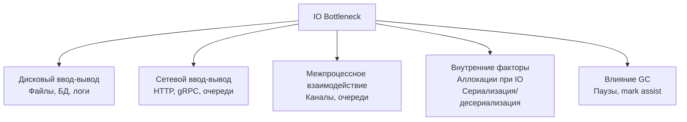

## IO Bottlenecks: почему ввод-вывод становится узким местом

В [[1. Системные вызовы и их стоимость]] мы установили, что даже минимальный переход в ядро стоит сотни наносекунд, а блокирующий ввод-вывод запускает каскад событий в планировщике Go: hand-off потоков, создание новых M, потеря локальности кэша. Теперь масштабируем это знание до уровня всей системы. **IO bottleneck** (бутылочное горлышко ввода-вывода) — это ситуация, когда пропускная способность или задержка подсистемы ввода-вывода (диск, сеть, межпроцессное взаимодействие) становится лимитирующим фактором, не давая процессору и горутинам работать с полной отдачей.

В бэкенде на Go IO-bound задачи доминируют: ожидание ответа от базы данных, чтение из очереди сообщений, запись логов, отправка HTTP-ответов. Знание типовых узких мест, их симптомов и методов устранения — обязательный инструмент Senior-инженера, позволяющий проектировать сервисы, которые не деградируют под нагрузкой.

Эта статья классифицирует IO bottleneck'и по источнику, связывает их с внутренностями Go (netpoller, планировщик, GC) и предоставляет диагностический инструментарий для их обнаружения. Мы будем опираться на [[2. Latency vs throughput]], [[3. CPU bound vs IO bound задачи]], [[1. Scheduler Go. G M P модель]] и подготовим почву для [[4. epoll, kqueue и netpoller]] и [[5. Zero copy подходы]].

## Классификация IO-бутылочных горлышек

Каждая категория имеет разную физическую природу и по-разному проявляется в метриках и профилях Go.

## Дисковый ввод-вывод: когда файлы и базы данных становятся преградой

### Физика дисковой задержки

Даже в эпоху NVMe-накопителей дисковый ввод-вывод остаётся на порядки медленнее оперативной памяти. Типичные значения задержки:

- L1-кэш процессора: ~1 нс
- Оперативная память: ~80-100 нс
- NVMe SSD (последовательное чтение): ~10-100 мкс
- SATA SSD: ~100-500 мкс
- HDD (механический): ~2-10 мс (в основном время поиска головки)

Один промах мимо page cache при чтении с NVMe диска стоит столько же, сколько 100 000 тактов процессора. За это время ядро могло бы обработать десятки тысяч HTTP-запросов.

### Как дисковая загрузка проявляется в Go

В Go стандартные файловые операции (`os.ReadFile`, `os.Write`, `os.Open`) выполняют **блокирующие системные вызовы**. Как мы видели в [[1. Системные вызовы и их стоимость]], это вызывает:

1. Открепление M от P.
2. Поиск или создание нового потока ОС.
3. Парковку горутины до завершения syscall.
4. После завершения — пробуждение горутины и её миграцию в очередь runnable.

При интенсивном файловом вводе-выводе эти шаги накапливаются:

- **Рост потоков ОС:** метрика `go_threads` растёт, `GODEBUG=schedtrace` показывает увеличение `threads`.
- **Повышенная latency:** время ответа отдельных запросов возрастает из-за ожидания пробуждения.
- **Фрагментированный throughput:** часть ядер простаивает, пока потоки ждут диск.

### Симптомы в инструментах Go

**Execution tracer** ([[3. execution tracer]]) покажет полосы `syscall` на горутинах, а также моменты открепления/прикрепления M. Если много горутин одновременно висят в `syscall` на файловом дескрипторе — это дисковый bottleneck.

**pprof** ([[2. CPU profiling в Go]]) не покажет время в ядре напрямую, но функции-обёртки вроде `os.(*File).Read` могут иметь высокий `cum` с дочерними `syscall.Read`. Косвенно — много `runtime.entersyscall` / `exitsyscall`.

**Системные инструменты:**
- `iostat -x 1` — показывает утилизацию диска (`%util`), среднее время запроса (`await`), длину очереди (`aqu-sz`). Если `%util` близок к 100%, а `await` высокий — диск перегружен.
- `strace -c -p <pid>` — статистика системных вызовов, количество и время в `pread`/`pwrite`.

### Стратегии устранения дисковых bottleneck

1. **Буферизация.** Использование `bufio.Reader`/`Writer` сокращает количество syscall'ов, объединяя мелкие операции в крупные. Каждый вызов `Flush` — один `write`.
2. **Асинхронный ввод-вывод.** `io_uring` в Linux позволяет выполнять дисковые операции асинхронно, без блокировки потоков. Стандартная библиотека пока не поддерживает `io_uring`, но существуют сторонние пакеты.
3. **Memory-mapped файлы (`mmap`).** Вместо `read`/`write` можно отобразить файл в память. Ядро само загружает страницы при доступе (page fault), но это всё ещё вызывает ожидание, просто скрытое.
4. **Перенос на внешние хранилища.** Вынос файлов в S3, MinIO, NFS с агрессивным кэшированием на уровне приложения.
5. **Разделение пулов горутин.** Ограничить количество горутин, работающих с диском, с помощью семафора, чтобы не плодить сотни потоков ОС одновременно.

## Сетевой ввод-вывод: задержки, потери и очереди

### Природа сетевых задержек

Сеть вносит задержки, несопоставимые с диском:

- Внутри datacenter: 0.1-1 мс RTT.
- Между зонами доступности: 1-10 мс.
- Через интернет: 10-300 мс.

Кроме того, сеть подвержена потерям пакетов, перегрузкам, jitter'у. В распределённых системах на Go эти задержки накапливаются ([[7. Tail latency и почему она важна]]), создавая хвосты в p99.

### Netpoller и его роль

Go использует **сетевой поллер** ([[4. epoll, kqueue и netpoller]]) для асинхронной обработки сетевых операций. Когда горутина вызывает `conn.Read()` на сокете без данных, она не блокирует M. Вместо этого:

- `syscall.Read` возвращает `EAGAIN`.
- Горутина паркуется (`gopark`) и регистрируется в netpoller.
- Netpoller ожидает события от `epoll_wait` и при готовности сокета пробуждает горутину.

Это позволяет десяткам тысяч горутин ожидать сеть на считанных потоках ОС. Однако сам netpoller может стать узким местом:

- Если одна горутина блокирует netpoller (например, из-за частых вызовов), другие могут задерживаться.
- При массовом пробуждении горутин (thundering herd) планировщик может быть перегружен.

### Диагностика сетевых bottleneck в Go

- **Block profile** ([[5. block profile]]): показывает время ожидания на каналах, мьютексах и **сетевых операциях**. Если `runtime.netpollblock` в топе — горутины много ждут сеть.
- **Execution tracer:** показывает состояния `Waiting` для сетевых горутин.
- **GODEBUG=schedtrace=1000:** если много `idleprocs` при наличии большого числа горутин, возможно, все ждут сеть.
- **Метрики приложения:** `http_client_request_duration_seconds` с разбивкой по статусам и тайм-аутам.

### Стратегии устранения сетевых bottleneck

1. **Connection pooling.** Переиспользование TCP-соединений (keep-alive, пул соединений для БД, `net/http` по умолчанию делает это). Повторное установление соединения добавляет TCP handshake и TLS-рукопожатие.
2. **Тайм-ауты и Circuit Breaker.** Быстрое прерывание медленных запросов предотвращает накопление ожидающих горутин.
3. **Сжатие и бинарные протоколы.** Protobuf/gRPC вместо JSON уменьшают объём передаваемых данных.
4. **Локальность данных.** Размещение сервисов в одной зоне доступности, использование кэшей.
5. **Балансировка нагрузки.** На стороне клиента — `gRPC` с client-side load balancing.

## Внутренние факторы: аллокации при IO и сериализация

Часто узкое место не в самом диске или сети, а в том, как Go-приложение обрабатывает данные до или после IO.

### Аллокации при чтении/записи

Каждый вызов `io.ReadAll` или `json.Unmarshal` создаёт новые слайсы и строки. При интенсивном IO (например, HTTP-запросы с большими JSON-телами) это вызывает:

- Высокий темп аллокаций → частые GC-циклы ([[9. Когда GC становится bottleneck]]).
- Mark assist замедляет обработку запросов.
- Потребление памяти растёт, может приблизиться к `GOMEMLIMIT` ([[8. GOMEMLIMIT]]).

**Диагностика:** pprof memory profile ([[5. pprof memory profile]]) покажет alloc_space в обработчиках запросов. CPU-профиль покажет `runtime.mallocgc` и `runtime.gcAssistAlloc`.

**Решение:** переиспользование буферов через `sync.Pool` ([[2. sync Pool]]), zero-copy парсинг ([[5. Zero copy подходы]]), предвыделение слайсов.

### Сериализация/десериализация

`encoding/json` в Go использует рефлексию и создаёт много аллокаций. Для high-throughput сервисов это частая причина IO bottleneck (процессор не успевает разбирать поток данных). Переход на `sonic` или `easyjson` может дать двукратный прирост пропускной способности.

## Влияние GC на IO

Сборщик мусора конкурирует с горутинами за CPU и пропускную способность памяти. Даже если IO-операции асинхронны, GC может замедлить их обработку:

- **STW-паузы** ([[3. Stop the world]]): на время паузы все горутины заморожены, включая тех, кто должен был отправить/получить данные.
- **Mark assist**: горутина, читающая из сети, может быть принуждена помогать GC, увеличивая задержку.
- **Вымывание кэша**: фаза конкурентной маркировки ([[4. Concurrent GC]]) загружает мусор в L1/L2, вытесняя сетевые буферы и данные запросов.

Поэтому тюнинг GC ([[7. GOGC и tuning]], [[8. GOMEMLIMIT]]) напрямую влияет на стабильность IO.

## Инструментарий диагностики IO bottleneck'ов

| Инструмент | Что показывает |
|-----------|----------------|
| `GODEBUG=schedtrace=1000` | Рост потоков M при блокирующих syscall |
| `go tool pprof --http` (CPU) | Косвенно: `syscall.Read`, `mallocgc`, `growslice` |
| `go tool pprof --http` (Memory) | Аллокации при IO |
| Block profile | Время ожидания на сети, каналах, мьютексах |
| Execution tracer | Длительность syscall'ов горутин, миграции M |
| `strace -c` | Количество и время системных вызовов |
| `iostat -x` | Утилизация диска, длина очереди |
| `netstat` / `ss` | Состояние TCP-соединений, очереди |
| `perf stat` | Кэш-промахи, инструкции, такты в ядре |

## Mechanical Sympathy: IO и процессор

На уровне «железа» IO bottleneck — это история о том, как данные проходят через чипсет и память.

- **DMA (Direct Memory Access):** Контроллер диска или сетевая карта пишут данные напрямую в оперативную память, минуя CPU. Когда данные готовы, устройство генерирует прерывание. Процессор обрабатывает прерывание, запуская код ядра, который пробуждает ожидающий процесс. Сам процессор не копирует пакет, но его кэши могут быть инвалидированы, если DMA записал в ту же область, которую процессор держал в L3.
- **IOMMU и виртуализация:** В облачных средах (AWS, GCP) IO-запросы проходят дополнительный уровень трансляции через IOMMU, добавляя задержки.
- **NUMA:** Сетевые карты и диски привязаны к определённым NUMA-узлам. Если горутина на ядре из другого узла обрабатывает данные оттуда, задержка доступа к памяти возрастает.
- **Cache line и буферы:** Сетевые буферы, выделенные в ядре, могут быть не в том же наборе кэша, что и пользовательские структуры. При копировании данных из ядра в userspace (`copy_to_user`) происходит активное перемещение кэш-линий.

Понимание этих механизмов позволяет Senior-инженеру принимать верные архитектурные решения: размещать сервисы ближе к данным, использовать zero-copy для избежания лишних перемещений, настраивать affinity горутин к NUMA-узлам (хотя это редко делается в Go).

## Итог

- **IO bottleneck** возникает, когда подсистема ввода-вывода не успевает за вычислительными мощностями, превращая приложение в IO-bound.
- Дисковые операции вызывают блокирующие syscall и hand-off потоков в Go, что ведёт к росту потоков ОС и повышенной latency.
- Сетевые операции не блокируют потоки благодаря netpoller, но задержки сети и очереди в самом netpoller могут создавать узкие места.
- Внутренние факторы — аллокации при IO и сериализация — часто маскируются под IO-проблему, хотя на деле упираются в CPU и GC.
- Диагностика: schedtrace, pprof, block/trace, strace, iostat.
- Mechanical sympathy связывает IO-задержки с кэш-памятью, DMA, NUMA и IOMMU, объясняя «невидимые» задержки.
- Устранение: буферизация, пуллинг соединений, асинхронный IO, zero-copy, тюнинг GC.