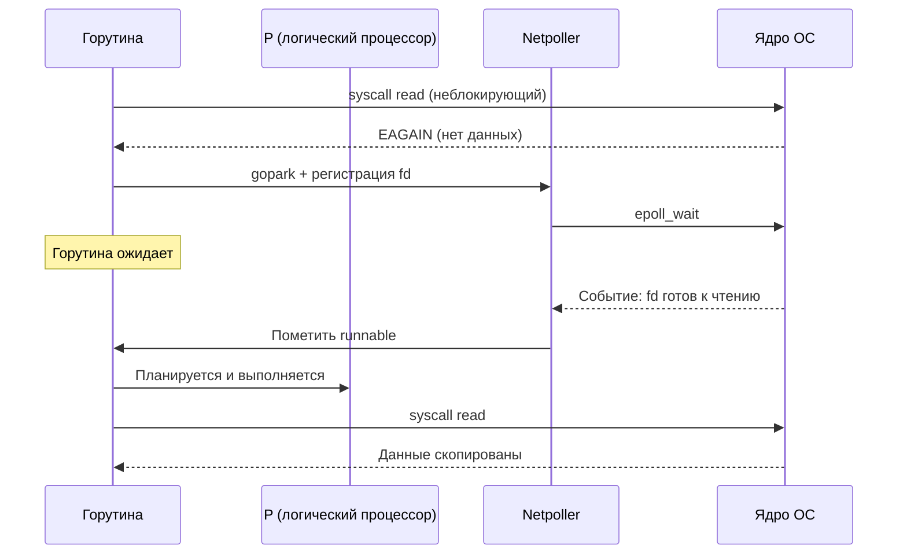

## Почему сетевая задержка — главный враг распределённых систем

В [[2. IO bottlenecks]] мы классифицировали узкие места ввода-вывода, рассмотрели дисковые и внутренние факторы. Теперь мы сосредотачиваемся на самой неизбежной и трудно контролируемой составляющей — **сетевой задержке** (network latency). В отличие от диска или CPU, сеть простирается за пределы сервера: она включает маршрутизаторы, коммутаторы, межсетевые экраны и физические линии связи на тысячи километров. Сетевая задержка определяется скоростью света, топологией и очередями, и никакой тюнинг Go-рантайма не заставит сигнал в оптоволокне двигаться быстрее.

Однако Senior Go-инженер способен спроектировать приложение так, чтобы оно **не ухудшало** ситуацию и, более того, минимизировало эффективную задержку, воспринимаемую пользователем. Для этого необходимо понимать природу сетевых задержек, их влияние на планировщик горутин и netpoller ([[4. epoll, kqueue и netpoller]]), а также типичные паттерны, превращающие миллисекунды в секунды ([[7. Tail latency и почему она важна]]).

В этой статье мы разложим сетевую задержку на составляющие, научимся измерять её на разных уровнях — от `ping` до distributed tracing, — и освоим техники снижения эффективной задержки в Go-сервисах: от keep-alive и пулов соединений до gRPC-стриминга.

## Из чего состоит сетевая задержка

Время, за которое байт доставляется от отправителя к получателю, складывается из нескольких компонент.


### Propagation delay (задержка распространения)

Определяется физическим расстоянием и скоростью распространения сигнала в среде (оптоволокно, медь). Скорость света в вакууме — 300 000 км/с, в оптоволокне — около 200 000 км/с. Межконтинентальная задержка Лондон–Нью-Йорк через трансатлантический кабель составляет ~40 мс в одну сторону. Это фундаментальный предел, не поддающийся оптимизации на уровне ПО.

### Transmission delay (задержка передачи)

Время, необходимое для помещения всех битов пакета в линию. Зависит от пропускной способности канала. Пакет в 1500 байт (MTU) на канале 100 Мбит/с передаётся ~120 мкс; на 10 Гбит/с — всего 1.2 мкс. В современных дата-центрах эта составляющая пренебрежимо мала.

### Processing delay (задержка обработки)

Каждый сетевой узел (маршрутизатор, коммутатор, файрвол) затрачивает время на анализ заголовков, принятие решения о маршрутизации, проверку контрольных сумм, NAT, фильтрацию. В хорошо спроектированной сети типичная задержка на хоп — 10–100 мкс.

### Queuing delay (задержка в очередях)

Самая изменчивая и коварная компонента. Когда пакет приходит на интерфейс быстрее, чем может быть отправлен, он встаёт в очередь. Заполненные буферы коммутаторов (bufferbloat) могут добавлять сотни миллисекунд задержки и вызывать потери. Это основная причина «рваной» latency в перегруженных сетях.

## Как Go взаимодействует с сетью: от горутины до провода

В Go работа с сетью начинается с вызова `conn.Read(b []byte)` (или `Write`). Последовательность событий:

1. Выполняется системный вызов `read` ([[1. Системные вызовы и их стоимость]]). Сокет заранее переведён в неблокирующий режим (`O_NONBLOCK`).
2. Если данные уже есть в буфере приёма ядра, они копируются в `b`, и вызов возвращается мгновенно (быстрый путь).
3. Если данных нет, ядро возвращает `EAGAIN`. Рантайм Go **не блокирует** поток M. Вместо этого горутина паркуется (`gopark`), а файловый дескриптор регистрируется в **netpoller** ([[4. epoll, kqueue и netpoller]]).
4. Netpoller ждёт событий от `epoll_wait` (Linux). Когда на сокете появляются данные, он помечает горутину как runnable. Планировщик в одном из следующих циклов запустит её.



Важно: пока горутина ожидает сеть, она **не занимает поток ОС**. Один и тот же поток может обслуживать тысячи горутин, находящихся в сетевом ожидании. Это ключевое преимущество Go перед моделями «поток на соединение».

> [!info] Под капотом
> Netpoller реализован в `runtime/netpoll.go`. Для Linux используется `epoll`, для macOS — `kqueue`. Рантайм поддерживает глобальный список ожидающих дескрипторов (`pollDesc`). Каждый дескриптор привязан к горутине. Когда `epoll_wait` возвращает готовые события, netpoller вызывает `netpollready`, который переводит соответствующую горутину из `_Gwaiting` в `_Grunnable` и помещает её в очередь runnable. Поиск горутины по дескриптору — O(1) через хеш-таблицу.

## Сетевая задержка и производительность Go-приложения

Даже если сам Go-сервис написан идеально, сетевая задержка определяет нижнюю границу времени ответа.

### Влияние на Latency

Обработка запроса может занимать микросекунды, но если запрос к базе данных или соседнему микросервису идёт 1 мс по сети, то минимальное время ответа составит 1 мс + время обработки. При последовательных вызовах (сервис A → сервис B → сервис C) задержки складываются. При параллельных — эффективная задержка определяется худшим из параллельных вызовов (fan-in). Если таких параллельных вызовов 10, и каждый имеет p99 = 50 мс, то вероятность, что хотя бы один будет в хвосте, высока, и общая p99 может быть значительно выше ([[7. Tail latency и почему она важна]]).

### Влияние на Throughput

Пока горутина ждёт сеть, она не потребляет CPU. Поэтому throughput сетевых приложений часто ограничен количеством одновременных соединений и пропускной способностью сети, а не CPU. Именно здесь раскрывается преимущество горутин: можно держать сотни тысяч открытых соединений, каждое в своей горутине, не создавая столько же потоков ОС.

Однако есть скрытая цена:
- **Память под стеки:** каждая ожидающая горутина потребляет минимум 2 КБ стека ([[2. Goroutines под капотом]]), а с ростом стека — больше. 100 000 горутин — это минимум 200 МБ памяти на стеки.
- **Переключения контекста:** при пробуждении горутины планировщик должен её запустить. Если одновременно просыпаются тысячи горутин, планировщику требуется время на их обработку ([[4. Контекстные переключения]]).

## Источники задержек: не всё — сеть

Нередко приложение само добавляет задержку, маскирующуюся под сетевую.

### 1. DNS-резолвинг

Первый же `net.Dial` выполняет DNS-запрос, который может занять 10–100 мс, особенно если DNS-сервер перегружен. В Go по умолчанию используется системный резолвер (cgo-режим на некоторых платформах) или чистый Go-резолвер. Кэширование результатов DNS — обязательная практика.

### 2. TCP handshake и TLS

Установка нового TCP-соединения требует трёхстороннего рукопожатия (SYN, SYN-ACK, ACK) — 1 RTT. Поверх — TLS-рукопожатие добавляет 2–3 RTT. Суммарно новое HTTPS-соединение может стоить 4 RTT (например, 4 * 1 мс = 4 мс в дата-центре или 200 мс через глобальный интернет). Keep-alive и пулы соединений устраняют эту цену для повторных запросов.

### 3. Алгоритм Нейгла (Nagle) и Delayed ACK

Алгоритм Нейгла задерживает отправку маленьких пакетов, ожидая либо заполнения MTU, либо получения ACK. Delayed ACK, в свою очередь, задерживает подтверждения. Вместе они могут добавить десятки миллисекунд к интерактивному трафику. В Go для TCP-соединений можно отключать алгоритм Нейгла через `tcpConn.SetNoDelay(true)` (эквивалент `TCP_NODELAY`). Это стоит делать для latency-чувствительных сервисов, платя небольшим увеличением overhead.

### 4. Перегрузка сети и bufferbloat

Как упоминалось, переполненные буферы коммутаторов добавляют непредсказуемую задержку и потери. Внешне это выглядит как периодические всплески p99. Диагностируется через `ping` с большими пакетами и мониторингом потерь.

## Инструменты измерения сетевой задержки

### На уровне ОС

- **`ping`** — базовая проверка RTT (ICMP). Полезна для оценки propagation delay.
- **`traceroute` / `mtr`** — показывает задержку до каждого хопа.
- **`ss -ti`** — состояние TCP-сокетов, включает `rtt` (smoothed RTT), `rto` (retransmission timeout), `cwnd` (congestion window).
- **`tcpdump` / `wireshark`** — захват пакетов и анализ временных меток. Позволяет увидеть точные задержки между SYN и SYN-ACK, между запросом и ответом.

### На уровне Go-приложения

- **Кастомные метрики.** Обёртка над `http.RoundTripper`, замеряющая время установления TCP, TLS, первого байта, полного чтения тела. Экспорт в Prometheus.
- **Распределённая трассировка** (OpenTelemetry, Jaeger). Показывает длительность каждого вызова по сети, включая сериализацию и передачу.
- **Block profile** ([[5. block profile]]). Отражает время ожидания на `runtime.netpollblock`, что косвенно указывает на время, проведённое в ожидании сетевых данных.
- **Execution tracer** ([[3. execution tracer]]). Визуализирует, как долго горутины находятся в состоянии `Waiting` из-за сети.

> [!tip] Собеседование
> **Вопрос:** Как вы будете измерять сетевую задержку конкретного gRPC-вызова в Go-сервисе?
> **Ответ:** Оберну gRPC-клиент в interceptor, который перед вызовом фиксирует `time.Now()`, после — вычисляет длительность, экспортирую гистограмму в Prometheus с метками метода и статуса. Для детализации добавлю OpenTelemetry, который автоматически инструментирует gRPC и покажет время на передачу по сети.

## Паттерны снижения эффективной сетевой задержки

### 1. Keep-alive и пулы соединений

Повторное использование TCP-соединений амортизирует стоимость рукопожатий. `net/http` в Go по умолчанию держит keep-alive и использует пул idle-соединений. Для gRPC пул управляется через `grpc.Dial`. Для баз данных — `database/sql` поддерживает пул. Важно настроить `MaxIdleConns` и `MaxOpenConns` адекватно нагрузке.

### 2. HTTP/2 и gRPC мультиплексирование

HTTP/1.1 использует одно соединение на запрос (или последовательные запросы с keep-alive). HTTP/2 и gRPC мультиплексируют множество потоков в одном TCP-соединении, устраняя head-of-line blocking на уровне соединений и экономя на рукопожатиях. В Go `net/http` поддерживает HTTP/2 с 1.6.

### 3. Сжатие данных

Уменьшение объёма передаваемых данных снижает transmission delay и, косвенно, вероятность попадания в очереди. Protobuf эффективнее JSON в 3–10 раз по размеру. Сжатие (gzip, snappy) на уровне HTTP/gRPC ещё сильнее сокращает трафик ценой CPU.

### 4. Локальность и кэширование

Размещение сервисов в одной зоне доступности (availability zone) снижает RTT с 1-10 мс до <1 мс. Кэширование (in-memory, Redis) результатов частых запросов устраняет сетевой вызов вовсе.

### 5. Тайм-ауты и fallback

Горутина не должна ждать сеть вечно. Каждый сетевой вызов должен иметь контекст с тайм-аутом:

```go
ctx, cancel := context.WithTimeout(r.Context(), 100*time.Millisecond)
defer cancel()
resp, err := client.Do(req.WithContext(ctx))
```

При недоступности назначения быстрый отказ экономит ресурсы и не даёт задержке накапливаться ([[7. Tail latency и почему она важна]]).

> [!warning] Ловушка / Gotcha
> **Слишком агрессивный тайм-аут.** Если тайм-аут меньше p99 задержки успешных запросов, вы будете отбрасывать легитимные запросы. Тайм-аут должен быть чуть выше целевого p99 плюс несколько RTT.

## Mechanical Sympathy: как процессор обрабатывает сетевые пакеты

Сетевая задержка — не только время в проводе. Это ещё и работа процессора по приёму/отправке.

- **Прерывания (IRQ).** Когда приходит пакет, сетевая карта генерирует прерывание. Ядро процессора прерывает текущую работу, сохраняет контекст и выполняет обработчик. При высоких скоростях (10+ Гбит/с) поток прерываний может нагружать ядро. Используются техники смягчения: NAPI (New API) отключает прерывания и переходит к опросу (polling).
- **DMA.** Контроллер DMA копирует данные пакета напрямую в память (буфер ядра), не нагружая CPU. Однако последующее копирование из буфера ядра в userspace (`copy_to_user`) выполняется процессором и нагружает кэш. Zero-copy подходы ([[5. Zero copy подходы]]) стремятся избежать этого копирования.
- **Кэширование.** Буферы сетевых пакетов (sk_buff в Linux) и данные приложения конкурируют за кэш. Активный сетевой трафик вымывает из L1/L2 полезные данные приложения, что может временно снизить производительность после обработки пакета.
- **Affinity и RSS.** Receive Side Scaling распределяет обработку пакетов по ядрам. Если горутина обрабатывает данные на ядре, отличном от того, которое обработало прерывание, возникают дополнительные задержки из-за передачи кэш-линий между ядрами.

## Сравнение с другими языками

- **C/C++:** Дают полный контроль: можно вручную управлять буферами, использовать `io_uring`, DPDK (kernel bypass). Но сложность синхронизации ложится на разработчика.
- **Java (Netty, Project Loom):** Netty эмулирует event loop, близко к epoll. Loom (виртуальные потоки) приближает Java к модели Go — синхронный код, асинхронное исполнение. Однако управление памятью и GC-паузы могут влиять на сетевую latency.
- **Rust (tokio, async/await):** Модель async/await близка к Go по производительности, но требует явного управления Future и часто более сложна в написании.
- **Go:** Сочетание лёгких горутин и прозрачного netpoller'a позволяет писать синхронный, легко читаемый код, который автоматически асинхронен. Цена — потеря тонкого контроля над аллокациями в пути ввода-вывода, но `sync.Pool` и буферизация решают большинство проблем.

## Практический пример: диагностика роста задержки

Сервис A вызывает сервис B по HTTP. Мониторинг показывает, что p99 вырос с 20 мс до 100 мс. Шаги диагностики:

1. **Метрики сервиса A:** `http_client_request_duration_seconds`. Разбивка показывает рост времени на этапе «получение первого байта», а не на обработке.
2. **Tracing (Jaeger):** В трейсе видно, что вызов к B занимает 90 мс.
3. **Метрики сервиса B:** p50 обработки запроса — 5 мс, p99 — 8 мс. Обработка быстрая. Значит, задержка в сети.
4. **Системные метрики:** `ss -ti` на сервере B показывает высокий `rto` и ретрансмиссии. `ping` от A к B показывает потери 2%.
5. **Вывод:** Сетевой сплит или перегрузка коммутатора вызывает потери и ретрансмиссии TCP, что увеличивает хвостовую задержку. Решение на уровне инфраструктуры.

## Итог

- **Сетевая задержка** — фундаментальный ограничитель распределённых систем, складывающийся из propagation, transmission, processing и queuing delay.
- Go благодаря неблокирующему вводу-выводу и netpoller'у позволяет эффективно ожидать сеть, но не устраняет саму задержку.
- Основные источники скрытых задержек: DNS, TCP/TLS handshake, алгоритмы Нейгла/Delayed ACK, перегрузка буферов.
- Измерение — на уровне ОС (`ping`, `ss`, `tcpdump`) и на уровне приложения (метрики, трейсинг, block profile).
- Снижение эффективной задержки: keep-alive, пулы соединений, HTTP/2 мультиплексирование, сжатие, тайм-ауты.
- Mechanical sympathy связывает сетевую задержку с прерываниями, DMA, RSS и влиянием на процессорный кэш.
- Понимание природы сетевой задержки — обязательный навык Senior-инженера, проектирующего микросервисы и распределённые системы.

Далее мы детально разберём главный механизм асинхронной работы Go с сетью: [[4. epoll, kqueue и netpoller]].