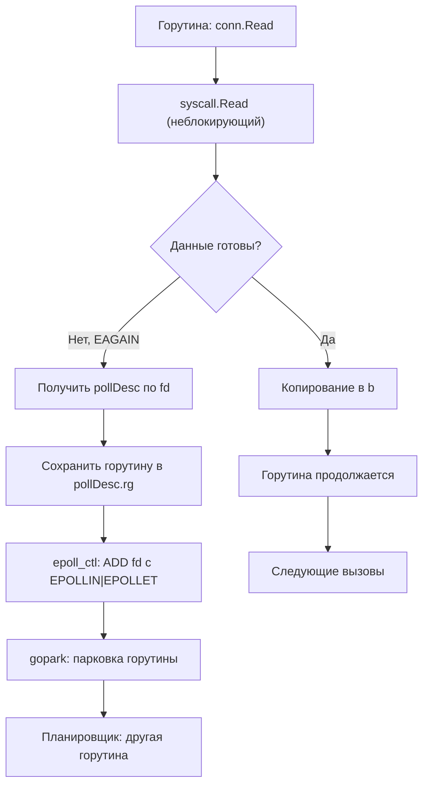
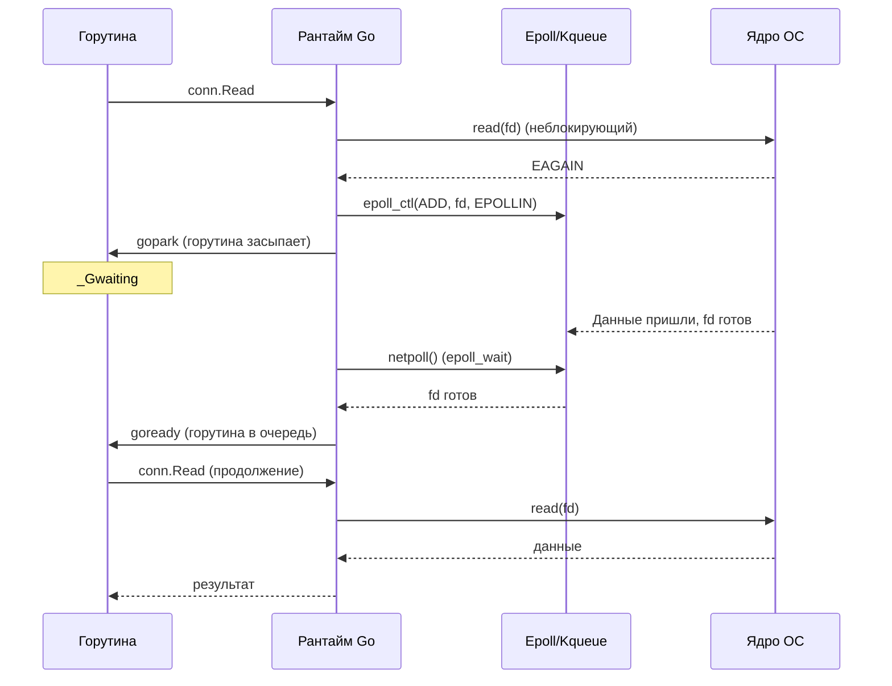

## Epoll, Kqueue и Netpoller: асинхронное сердце Go

В предыдущих статьях мы разобрали природу системных вызовов ([[1. Системные вызовы и их стоимость]]), классифицировали узкие места ввода-вывода ([[2. IO bottlenecks]]) и исследовали природу сетевой задержки ([[3. Network latency]]). Теперь настало время изучить механизм, который позволяет Go обрабатывать десятки тысяч сетевых соединений на нескольких потоках ОС. Этот механизм — **сетевой поллер** (netpoller), в основе которого лежат системные API: **epoll** в Linux и **kqueue** в macOS/BSD.

Без netpoller модель конкурентности Go была бы невозможна в её нынешнем виде. Каждая горутина, ожидающая сетевых данных, блокировала бы поток ОС, и для 10 000 одновременных соединений потребовалось бы 10 000 потоков. Вместо этого netpoller позволяет **одному потоку** обслуживать тысячи горутин, ожидающих сеть, — именно это превращает Go в идеальный инструмент для сетевых сервисов.

Эта статья — глубокое погружение в эпицикл асинхронного ввода-вывода: от системных вызовов ядра (`epoll_create`, `epoll_ctl`, `epoll_wait`) и их аналогов в BSD (`kqueue`, `kevent`) до внутреннего устройства netpoller в рантайме Go и его интеграции с планировщиком горутин ([[1. Scheduler Go. G M P модель]]).

## Зачем нужен epoll/kqueue: проблема select/poll

До появления epoll и kqueue основными механизмами мультиплексирования ввода-вывода были **select** и **poll**. Обе функции страдают от принципиального недостатка: они требуют передачи ядру полного списка отслеживаемых дескрипторов при **каждом вызове**. Ядро обходит весь список, проверяет готовность каждого, и возвращает результат. Сложность O(n) от числа дескрипторов делает их непригодными для тысяч соединений — CPU уходит на бессмысленное копирование и обход списков.

**Epoll** (Linux) и **kqueue** (BSD/macOS) решают эту проблему через **событийно-ориентированную модель с сохранением состояния в ядре**.

- Приложение **один раз** регистрирует интересующие дескрипторы и интересующие события (чтение, запись) через `epoll_ctl` (или `EV_SET` + `kevent` для регистрации в kqueue).
- Ядро сохраняет эти дескрипторы во внутренней структуре (красно-чёрное дерево для epoll).
- Последующие вызовы ожидания (`epoll_wait`, `kevent`) возвращают **только те** дескрипторы, которые реально готовы. Нет необходимости каждый раз передавать полный список.

Это снижает сложность ожидания до O(1) по количеству готовых событий, а не O(n) по количеству отслеживаемых.

Сравнительная таблица:

| Характеристика | select/poll | epoll | kqueue |
|----------------|-------------|-------|--------|
| Передача списка дескрипторов | Каждый вызов | Один раз при регистрации | Один раз |
| Сложность ожидания | O(n) | O(1) по готовым | O(1) |
| Поддержка одним процессом | Ограничена FD_SETSIZE (select) или ~не ограничена (poll) | До миллионов | До миллионов |
| Триггеры | Level-triggered | Level- и edge-triggered | Level- и edge-triggered |
| Платформа | Везде | Linux | macOS, BSD |

## Epoll в Linux: ядерная кухня

### Системные вызовы epoll

Epoll оперирует тремя основными вызовами:

1. **`epoll_create1(flags)`** — создаёт экземпляр epoll и возвращает файловый дескриптор, который будет использоваться для всех остальных операций. В ядре выделяется структура `eventpoll`, содержащая красно-чёрное дерево для всех отслеживаемых дескрипторов и двусвязный список готовых событий.

2. **`epoll_ctl(epfd, op, fd, event)`** — добавляет (`EPOLL_CTL_ADD`), модифицирует (`EPOLL_CTL_MOD`) или удаляет (`EPOLL_CTL_DEL`) файловый дескриптор `fd` из дерева экземпляра `epfd`. В `event` указываются интересующие события: `EPOLLIN` (готовность к чтению), `EPOLLOUT` (готовность к записи), `EPOLLERR`, `EPOLLHUP`. Можно установить флаг `EPOLLET` — edge-triggered режим.

3. **`epoll_wait(epfd, events, maxevents, timeout)`** — ожидает события на зарегистрированных дескрипторах. При наличии готовых событий копирует их в массив `events` и возвращает количество. При отсутствии блокируется (если `timeout` != 0).

### Edge-triggered vs Level-triggered

- **Level-triggered (LT):** `epoll_wait` будет возвращать дескриптор как «готовый» до тех пор, пока приложение не прочитает все доступные данные. Проще в использовании, но может приводить к лишним пробуждениям.
- **Edge-triggered (ET):** `epoll_wait` возвращает дескриптор **единожды**, когда он переходит из неготового состояния в готовое. После этого приложение должно читать до тех пор, пока не получит `EAGAIN`. Эффективнее, так как нет лишних событий, но сложнее: нужно аккуратно обрабатывать неблокирующее чтение.

**Go использует edge-triggered epoll** (начиная с ранних версий). Это позволяет минимизировать количество системных вызовов `epoll_wait` и избежать «шумных» событий, которые при LT требовали бы повторной проверки.

> [!info] Под капотом
> Когда данные приходят в сокет, сетевая карта генерирует прерывание, ядро обрабатывает пакет и через стек протоколов доставляет данные в буфер сокета. После этого вызывается callback-функция epoll, которая добавляет дескриптор в список готовых. При вызове `epoll_wait` этот список копируется в userspace. Список готовых — это двусвязный список, встроенный в структуру `epitem`. Вот почему выборка готова O(1).

## Kqueue в macOS и BSD

В Darwin (macOS, iOS) и BSD-системах аналогом epoll является **kqueue**. Интерфейс несколько отличается:

- **`kqueue()`** — создаёт очередь событий, возвращает файловый дескриптор.
- **`kevent(kq, changelist, nchanges, eventlist, nevents, timeout)`** — универсальная функция. Если `changelist` не NULL, регистрирует или модифицирует события (аналог `epoll_ctl`). Если `eventlist` не NULL, ожидает и возвращает готовые события (аналог `epoll_wait`). Два действия в одном вызове.

Kqueue поддерживает не только сокеты, но и файлы, процессы, таймеры и даже пользовательские события. Архитектурно он основан на фильтрах (EVFILT_READ, EVFILT_WRITE), которые ядро вызывает для проверки состояния. Внутренне использует хеш-таблицу для зарегистрированных дескрипторов, что также даёт O(1) при ожидании.

Go абстрагирует разницу между epoll и kqueue в пакете `runtime/netpoll.go`: для Linux используется `netpoll_epoll.go`, для macOS — `netpoll_kqueue.go`. Разработчик не замечает разницы.

## Архитектура netpoller в Go

Netpoller — это компонент рантайма Go, который связывает горутины, ожидающие сетевых операций, с epoll/kqueue. Он реализован в `runtime/netpoll.go` (общая часть) и платформо-специфичных файлах.

### Основные структуры данных

- **`pollDesc`** — дескриптор, ассоциированный с каждым сетевым файловым дескриптором (сокетом). Содержит указатели на ожидающие горутины (`rg` для читателя, `wg` для писателя), информацию о событиях и ссылку на сам файловый дескриптор. Хранится в глобальном кэше `pollCache`.
- **`pollCache`** — lock-free кэш для `pollDesc`, реализованный через сегментированную хеш-таблицу. Позволяет быстро найти `pollDesc` по fd.
- **`epfd`** (или `kq` для kqueue) — файловый дескриптор самого экземпляра epoll/kqueue, созданный при инициализации рантайма (в `runtime.netpollinit`).

### Инициализация

При старте рантайма вызывается `netpollinit()`. В Linux она делает `epoll_create1(EPOLL_CLOEXEC)`, в macOS — `kqueue()`. Созданный дескриптор сохраняется в глобальной переменной. Он будет использоваться всеми горутинами для регистрации ожиданий.

### Регистрация и ожидание: жизненный цикл горутины

Рассмотрим, что происходит, когда горутина вызывает `conn.Read(b)` на сокете, в котором пока нет данных.

Поясним шаги детальнее.

1. **Неблокирующий `read`.** Сокет, созданный через `net.Dial` или `net.Listen`, сразу переводится в неблокирующий режим (`syscall.SetNonblock(fd, true)`). Первый вызов `read` делается напрямую, без регистрации в epoll. Если данные есть, они копируются и горутина продолжается.

2. **Обработка `EAGAIN`.** Если `read` возвращает `EAGAIN`, значит, данных нет. Рантайм через `runtime.pollDesc` получает указатель на `pollDesc`, связанный с этим fd.

3. **Регистрация в epoll.** Вызывается `netpollopen(fd, pd)`:
   - В Linux: `epoll_ctl(epfd, EPOLL_CTL_ADD, fd, &ev)`, где `ev.events = EPOLLIN | EPOLLOUT | EPOLLRDHUP | EPOLLET` (edge-triggered).
   - В `pollDesc.rg` (reader goroutine) сохраняется указатель на текущую горутину.

4. **Парковка.** Вызывается `gopark`, горутина переходит в состояние `_Gwaiting` с причиной «IO wait». Поток M освобождается и может выполнять другие горутины.

5. **Пробуждение.** Когда данные приходят в сокет, ядро помечает дескриптор как готовый в списке epoll. При следующем вызове `netpoll()` (см. ниже) рантайм обнаружит это событие. Рантайм извлекает указатель на горутину из `pollDesc.rg` и вызывает `goready`, переводя горутину в состояние `_Grunnable`.

6. **Повторный вызов.** Когда горутина снова получает процессор, она заново вызывает `read`. На этот раз данные есть, и `read` успешно копирует их.

### Где вызывается `netpoll()`

Функция `netpoll()` (внутренняя, не путать с `runtime.netpoll`) вызывается из планировщика в двух местах:

1. **`findRunnable()`** — когда P ищет готовую горутину и все локальные/глобальные очереди пусты. Вызов `netpoll(false)` с таймаутом 0 проверяет, есть ли готовые сетевые события, и если да, возвращает список соответствующих горутин. Они немедленно ставятся в очередь `runq` и исполняются.

2. **Системный монитор (`sysmon`).** Фоновый поток, который в цикле следит за состоянием системы. Вызывает `netpoll(true)` с бесконечным таймаутом, чтобы пробуждать горутины, ожидающие сеть, даже когда все P заняты. Это гарантирует, что никакое сетевое событие не останется незамеченным.

Таким образом, даже если все P загружены CPU-bound горутинами, `sysmon` пробудит ожидающие сеть горутины, и планировщик вытеснит одну из CPU-горутин (через асинхронную преемпцию), чтобы запустить сетевую.

### Закрытие и ошибки

Когда сокет закрывается или происходит ошибка (`EPOLLERR`, `EPOLLHUP`, `EPOLLRDHUP`), epoll так же возвращает событие. Netpoller пробуждает ожидающую горутину. При повторном вызове `read` он возвращает 0 (EOF) или ошибку. Горутина обрабатывает это стандартным образом.

Важно, что `pollDesc` должен быть корректно очищен (`netpollclose`) при закрытии файлового дескриптора, чтобы избежать утечек памяти и висячих регистраций.

## Диагностика netpoller

### 1. Execution tracer

Трассировщик Go ([[3. execution tracer]]) — лучший инструмент для визуализации работы netpoller. В трассировке видно:
- Состояния горутин: `Waiting` с причиной `Network I/O`.
- Моменты пробуждения горутин после `netpoll`.
- Длительность нахождения в ожидании.

### 2. Block profile

Block profile ([[5. block profile]]) регистрирует время, проведённое горутинами в ожидании на каналах, мьютексах и **сетевых операциях**. Если `runtime.netpollblock` в топе — горутины много времени проводят в ожидании сети.

### 3. GODEBUG=schedtrace

Трассировка планировщика (`GODEBUG=schedtrace=1000`) показывает:
- Количество горутин в состоянии `waiting` (агрегированно).
- Работу `sysmon`, который вызывает `netpoll`.

### 4. Статистика ОС

- `ss -ti` — показывает `rtt`, `rto`, очереди send/recv.
- `netstat -s` — статистика TCP (ретрансмиссии, тайм-ауты).
- `perf` — может показать вызовы `epoll_wait` и их длительность.

## Преимущества и ограничения модели netpoller

### Преимущества

- **Эффективность.** Один поток может обслуживать тысячи горутин, ожидающих сеть. Нет необходимости в стеке потока на каждое соединение (экономия памяти и планирования ОС).
- **Простота кода.** Разработчик пишет синхронный `Read`/`Write`, как в однопоточном коде, а рантайм делает его асинхронным.
- **Интеграция с планировщиком.** Сетевые горутины не блокируют P, не вызывают hand-off и не создают новые M. Сохраняется локальность кэша.

### Ограничения

- **Не для всех типов ввода-вывода.** Дисковые операции (`os.File.Read`) блокируют M, потому что стандартная библиотека не использует epoll для файлов (epoll с обычными файлами возвращает `EPOLLIN` всегда, т.к. файл всегда «готов» — это не имеет смысла для реального асинхронного ожидания). Для этого нужен `io_uring`.
- **Кратковременные блокировки.** Сам вызов `epoll_wait` в `findRunnable` выполняется с нулевым таймаутом и не блокирует M. Но в `sysmon` используется бесконечный таймаут, что нормально для выделенного потока мониторинга.
- **Сложность edge-triggered.** Разработчики рантайма должны быть аккуратны, чтобы не пропустить события (читать до `EAGAIN`).

## Mechanical Sympathy: что внутри epoll и как это влияет на производительность

- **Память ядра.** Каждый зарегистрированный дескриптор занимает место в красно-чёрном дереве (порядка 100-200 байт). При 100 000 открытых сокетов это ~10-20 МБ в ядре. Это приемлемо, но при миллионах нужно следить.
- **Кэш.** Список готовых событий — это двусвязный список, который может быть холодным в кэше процессора при пробуждении. `epoll_wait` копирует структуры `epoll_event` в userspace, что также трогает кэш.
- **Прерывания и softirq.** При поступлении пакета выполняется обработчик прерывания (top half), который ставит softirq (bottom half). Softirq обрабатывает стек TCP/IP и, в конечном счёте, вызывает callback epoll для добавления дескриптора в готовый список. Эта работа выполняется на том же ядре, которое обработало прерывание. RSS (Receive Side Scaling) распределяет прерывания от сетевой карты по ядрам. Если горутина-читатель работает на другом ядре, ей придётся «дёргать» структуры epoll через межъядерный трафик. Знание NUMA и RSS помогает в оптимизации (хотя в Go это редко настраивают явно).

## Заключение

Netpoller — это элегантное связующее звено между легковесными горутинами Go и мощными механизмами ядра (epoll/kqueue). Он скрывает сложность асинхронного программирования, предоставляя разработчику иллюзию блокирующего ввода-вывода, одновременно обеспечивая производительность, близкую к ручному event loop. Понимание его работы необходимо Senior-инженеру, чтобы диагностировать проблемы с сетевым ожиданием, понимать, почему сетевые сервисы на Go такие лёгкие, и видеть границы применимости модели.

Далее мы перейдём к методам, которые позволяют ещё сильнее снизить накладные расходы при передаче данных, убирая лишние копирования между буферами: [[5. Zero copy подходы]].