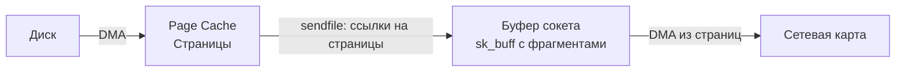

## Zero copy подходы: как передавать данные, не касаясь их

В предыдущих статьях мы разобрали стоимость системных вызовов ([[1. Системные вызовы и их стоимость]]), природу узких мест ввода-вывода ([[2. IO bottlenecks]]) и асинхронный движок Go — netpoller ([[4. epoll kqueue и netpoller]]). Все эти механизмы так или иначе крутятся вокруг одного действия: **данные перемещаются между буферами**. При традиционном вводе-выводе процессор занимается копированием байтов из kernel space в user space, из одного буфера в другой, тратя на это миллионы тактов и вымывая кэш.

**Zero copy** (нулевое копирование) — набор техник, позволяющих исключить эти лишние перекладывания данных. Для высоконагруженных Go-сервисов — файловых серверов, прокси, стриминговых платформ — применение zero copy может радикально снизить загрузку CPU и повысить пропускную способность, превращая сервер из «перекладчика байтов» в минималистичный мост между источником и приёмником.

В этой статье мы разберём фундаментальные механизмы zero copy в Linux (sendfile, splice, mmap), их реализацию в Go, влияние на процессорный кэш и DMA, и научимся применять их там, где это даёт измеримый выигрыш. Это подготовит нас к разговору о переиспользовании буферов ([[6. Buffer reuse]]) и специфике файлового ввода-вывода ([[7. File IO оптимизация]]).

## Почему банальное копирование — враг производительности

В обычной логике отправки файла через HTTP (без zero copy) путь данных выглядит так:


Каждая стрелка «CPU» — это системный вызов `read` или `write`, который запускает `memmove`-подобное копирование. Процессор:
- Загружает строки кэша из page cache (возможно, из RAM).
- Копирует байты на стек или в выделенный Go-буфер (аллокация).
- Снова загружает кэш-линии при записи в буфер сокета.
- Теряет такты и вымывает полезные данные из L1/L2/L3 ([[8. Cache friendliness]]).

Если файл велик, CPU может стать узким местом, даже если диск и сеть сами по себе не догружены. При этом сами данные приложению не нужны — оно всего лишь ретранслирует их. Zero copy как раз для таких сценариев.

## Что такое Zero Copy: философия и системные вызовы

Zero copy — это передача данных между дескрипторами (файлами и сокетами) **без прохождения через userspace**. Ядро перемещает страницы памяти напрямую из одного буфера в другой, используя механизмы управления страницами и DMA.

Ключевые системные вызовы в Linux:

- **`sendfile`** — передача данных из файла в сокет.
- **`splice`** — перемещение данных между двумя дескрипторами произвольных типов (через промежуточный pipe).
- **`mmap`** — отображение файла в память процесса, что позволяет избежать явных `read`.

В macOS/BSD есть аналог `sendfile`, но работающий иначе (принимает заголовки/трейлеры). `splice` отсутствует, вместо него — `sendfile` между файлом и сокетом.

## sendfile: классика для файлового ввода-вывода

Системный вызов `sendfile(out_fd, in_fd, offset, count)` передаёт данные из `in_fd` (обычный файл) в `out_fd` (сокет) без копирования в userspace. Типичный сценарий — отдача статических файлов HTTP-сервером.

### Как работает sendfile под капотом

1. Ядро проверяет, что `in_fd` — это файл, поддерживающий `mmap` (т.е. имеющий отображение в page cache).
2. Находит страницы page cache, соответствующие запрашиваемому диапазону. Если страницы не в памяти, они загружаются с диска через DMA.
3. Для каждой страницы создаётся структура sk_buff (буфер сокета), которая **ссылается на ту же физическую страницу**, а не копирует данные. Это достигается через механизм **скаттер-гатер** (scatter-gather) — sk_buff указывает на фрагменты страниц.
4. После этого страницы помечаются как занятые (увеличивается счётчик ссылок), чтобы они не были вытеснены из page cache до завершения отправки.
5. DMA-контроллер сетевой карты читает данные непосредственно из этих страниц (с возможной помощью DDIO — Data Direct I/O от Intel, когда данные проходят через кэш процессора, но не копируются CPU).



Обратите внимание: CPU вообще не касается данных. Он только настраивает DMA-дескрипторы и обрабатывает прерывания.

> [!info] Под капотом
> В ядре Linux `sendfile` реализован в `fs/read_write.c` и `fs/splice.c`. Он основан на механизме `sendpage`, который вызывает `splice_to_pipe` или напрямую передаёт страницы в TCP-стек с помощью `tcp_sendpage`. В старых ядрах использовался специальный буфер, сейчас — передача страниц через `pipe` (внутренний механизм), что фактически делает `sendfile` специализацией `splice`.

## splice: универсальная магистраль

`splice(fd_in, off_in, fd_out, off_out, len, flags)` перемещает данные между двумя файловыми дескрипторами **через канал** (pipe), опять же не копируя в userspace. В отличие от `sendfile`, `fd_in` или `fd_out` может быть любым типом (сокет, файл, даже другой pipe), но **ровно один из них должен быть pipe**.

На практике это означает двойной вызов:
1. `splice(socket_fd, NULL, pipe_write_fd, NULL, len, SPLICE_F_MOVE | SPLICE_F_MORE)` — переместить данные из сокета в pipe.
2. `splice(pipe_read_fd, NULL, file_fd, NULL, len, SPLICE_F_MOVE | SPLICE_F_MORE)` — переместить из pipe в файл.

Или наоборот, для передачи от файла к сокету.


### Как splice работает внутри

Внутренне `splice` оперирует **указателями на страницы памяти** (page references). Когда данные перемещаются из сокета в pipe, ядро извлекает страницы из буфера сокета и помещает их в кольцевой буфер pipe'а, **не копируя байты**. Приёмная сторона (`splice` из pipe в файл) делает обратную операцию. Это напоминает передачу владения страницами (page flipping).

Для работы `splice` требуется, чтобы хотя бы один из дескрипторов поддерживал `splice_read`/`splice_write`. Сокеты поддерживают, обычные файлы — тоже (через page cache).

## mmap: доступ к файлу как к памяти

`mmap` отображает содержимое файла в виртуальное адресное пространство процесса. Теперь Go-программа может читать этот файл как обычный слайс байт. Это устраняет явный системный вызов `read` и копирование `read` → userspace. Однако при записи этого слайса в сокет всё равно происходит копирование userspace → socket, если не применять `sendfile` (но `sendfile` уже сам берёт данные из page cache). Тем не менее, `mmap` полезен, когда нужно обрабатывать данные на месте (парсинг, сжатие) или если ядро может более эффективно загружать страницы по требованию (page fault).

В Go можно использовать `syscall.Mmap`:

```go
f, _ := os.Open("file.bin")
defer f.Close()
fi, _ := f.Stat()
data, err := syscall.Mmap(int(f.Fd()), 0, int(fi.Size()),
    syscall.PROT_READ, syscall.MAP_SHARED)
```

`data` — это `[]byte`, напрямую указывающий на page cache. При чтении `data[i]` может произойти page fault, ядро загрузит страницу с диска. При записи (если MAP_SHARED) изменения синхронизируются с файлом. Но для сетевой передачи без копирования лучше использовать `sendfile`.

> [!warning] Ловушка / Gotcha
> `mmap` отображает файл в виртуальную память процесса. Если забыть `Munmap`, большие файлы могут занять адресное пространство (что не так страшно на 64-бит), но главное — процесс будет удерживать page cache страницы, не позволяя ядру эффективно управлять памятью.

## Zero Copy в Go: стандартная библиотека

Стандартная библиотека Go автоматически использует zero-copy оптимизации в тех случаях, где это возможно и прозрачно для разработчика. Детали реализации платформозависимы и находятся в пакете `net`.

### sendfile в Go

Если `io.Copy` копирует данные из `*os.File` в `*net.TCPConn`, Go вызывает внутреннюю функцию `sendFile` (файл `net/sendfile_linux.go`), которая в Linux делает системный вызов `sendfile`. Это происходит автоматически, без участия разработчика.

То же касается `http.ServeFile`, `http.FileServer` и других файловых обработчиков: они используют `sendfile`, если ответ — это файл, а соединение — TCP.

Исходный код (`net/splice_linux.go`):
```go
// sendFile copies the contents of src to dst.
// It tries to use sendfile when possible.
func sendFile(dst *TCPConn, src *os.File) (written int64, err error) {
    ...
    n, err = syscall.Sendfile(dst.fd, src.Fd(), nil, int(remain))
    ...
}
```

### splice в Go

Если оба конца `io.Copy` — это TCP-соединения (сокет в сокет, типичный случай для прокси), Go в Linux пробует использовать `splice`. Реализация в `net/splice_linux.go`:

```go
func splice(dst *TCPConn, src *TCPConn) (int64, error) {
    // создаётся pipe
    // splice src -> pipe
    // splice pipe -> dst
}
```

Однако `splice` менее стабилен и поддерживается не на всех ядрах. Go проверяет доступность на старте (`attemptSplice`), и в случае неудачи прозрачно откатывается к обычному `ReadFrom`/`WriteTo` с буфером.

### Как узнать, что zero-copy сработало

Проще всего — запустить программу под `strace` и увидеть системные вызовы. Если копирование идёт через `sendfile` или `splice`, вы не увидите бесконечных `read` и `write`, а один вызов на большую порцию. Также можно поставить брейкпойнт в `runtime.sendfile` (через Delve).

## Практический пример: прокси и статический файловый сервер

### Простейший HTTP-прокси с io.Copy

```go
func proxyHandler(w http.ResponseWriter, r *http.Request) {
    // предположим, у нас есть клиентское соединение
    upstream, _ := net.Dial("tcp", "backend:8080")
    defer upstream.Close()
    
    // Проксируем запрос
    r.Write(upstream)
    
    // Проксируем ответ — здесь io.Copy может использовать splice
    if response, err := http.ReadResponse(bufio.NewReader(upstream), r); err == nil {
        defer response.Body.Close()
        copyHeader(w.Header(), response.Header)
        w.WriteHeader(response.StatusCode)
        io.Copy(w, response.Body) // w — это http.ResponseWriter, под капотом *net.TCPConn
        // При splice: скопировано без userspace
    }
}
```

`io.Copy` внутри вызывает `ReadFrom` у `TCPConn`, если источник поддерживает `WriteTo`. Это запускает `sendfile`/`splice`.

### Статический файловый сервер

```go
http.Handle("/", http.FileServer(http.Dir("/var/www")))
```

`FileServer` при запросе файла вызывает `serveFile`, которая на Linux использует `sendFile`. Проверить можно `strace -e sendfile` — будут видны вызовы `sendfile`.

## Когда zero copy не работает: ограничения и подводные камни

### 1. Трансформация данных

Если вам нужно изменить данные перед отправкой (добавить заголовок, сжать, зашифровать), zero copy невозможна. Вам придётся скопировать данные в userspace для обработки, заплатив CPU. Это особенно важно для HTTPS: шифрование TLS полностью разрушает zero copy, так как данные должны быть зашифрованы в userspace (если не используется kernel TLS — kTLS, который тоже ограничен).

### 2. Платформенная зависимость

Zero copy в Go реализован только на Linux, в меньшей степени на macOS (sendfile с заголовками), и слабо на Windows. Код должен корректно деградировать до обычного `io.Copy`.

### 3. Размеры буферов и управление памятью

При использовании `splice` данные временно живут в pipe. Размер pipe ограничен (по умолчанию 16 страниц, т.е. 64 КБ). Если передаваемый объём превышает этот размер, `splice` выполняется частями, что добавляет накладные расходы. `sendfile` также работает порциями до 2 ГБ.

### 4. Edge-triggered поведение

При использовании `splice` с сокетами необходимо аккуратно обрабатывать `EAGAIN` и повторять вызовы, чтобы не потерять событие готовности. Рантайм Go делает это внутри.

### 5. Контроль за временем жизни страниц

Если страница передана в сокет через `sendfile`, она удерживается до тех пор, пока TCP-стек не подтвердит отправку (ACK). Это может задерживать освобождение page cache памяти, что при большом трафике влияет на доступную память.

## Mechanical Sympathy: кэш, DMA и CPU

На первый взгляд, zero copy полностью избавляет процессор от работы. Но есть нюансы:

- **Data Direct I/O (DDIO).** В процессорах Intel начиная с Xeon E5 данные, передаваемые DMA, могут загружаться в L3-кэш процессора, минуя основную память. Это ускоряет последующую обработку, но также означает, что даже при zero copy данные «касаются» кэша, потенциально вымывая полезные данные приложения. Однако сам CPU не тратит такты на `memmove`.
- **TLB и метаданные.** Ядро должно настраивать дескрипторы страниц, таблицы трансляции, обновлять счётчики. Это работа CPU, хоть и небольшая.
- **Стоимость syscall.** `sendfile` и `splice` — это системные вызовы, каждый со своей ценой ([[1. Системные вызовы и их стоимость]]). Если нужно отправить много маленьких файлов, накладные расходы на syscall могут превысить выгоду от избегания копирования. Буферизация и агрегация всё ещё важны.

Для Senior-инженера ключевой навык — **измерять**. Профилировщик CPU (`runtime/pprof`) покажет, исчезли ли `memmove` и `read/write` из горячих точек. `perf stat` покажет снижение cache misses и увеличение throughput.

## Сравнение с другими языками

- **C/C++:** Прямой доступ к `sendfile`/`splice`, но разработчик сам управляет буферами и асинхронностью.
- **Java:** NIO предоставляет `FileChannel.transferTo/transferFrom`, которые под капотом вызывают `sendfile`/`splice`. Эффективность сравнима, но модель синхронизации сложнее (до Loom).
- **Rust (tokio, async-std):** Аналогичные zero-copy примитивы. Благодаря контролю памяти аллокации минимальны.
- **Go:** Zero copy встроен прозрачно, но не всегда очевиден. Разработчик получает его автоматически, но теряет тонкий контроль.

## Итог

- **Zero copy** — это семейство техник (`sendfile`, `splice`, `mmap`), позволяющих передавать данные между файлами и сокетами без промежуточного копирования через userspace.
- В Linux `sendfile` передаёт данные из файла в сокет через page cache и указатели; `splice` — универсальный двусторонний мост через pipe.
- Стандартная библиотека Go автоматически применяет zero copy в `io.Copy`, `http.ServeFile` и прокси через `TCPConn.ReadFrom`/`WriteTo`, если условия позволяют.
- Zero copy исключает CPU из уравнения, но не отменяет накладные расходы на системные вызовы, удержание страниц и влияние на кэш (DDIO).
- Трансформация данных (TLS, сжатие) разрушает zero copy; для HTTP/2 и gRPC данные всё равно копируются в userspace.
- Понимание zero copy и умение его включать/диагностировать (через `strace`, профили) — часть арсенала Senior-инженера, строящего высоконагруженные бэкенды.

Теперь, зная, как избежать лишних копирований, мы готовы рассмотреть следующий уровень — грамотное переиспользование буферов, чтобы даже при вынужденном копировании не порождать лавину аллокаций: [[6. Buffer reuse]].