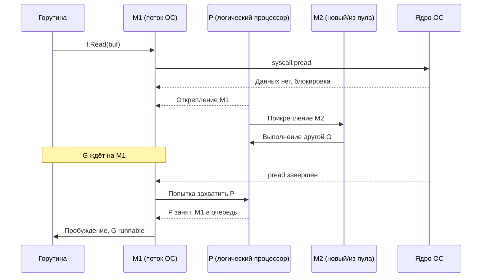

## File IO оптимизация: когда диск становится узким местом рантайма

В предыдущих статьях подраздела мы разобрали природу системных вызовов ([[1. Системные вызовы и их стоимость]]), классифицировали бутылочные горлышки ввода-вывода ([[2. IO bottlenecks]]), изучили сетевую подсистему и netpoller ([[3. Network latency]], [[4. epoll kqueue и netpoller]]), освоили zero-copy ([[5. Zero copy подходы]]) и переиспользование буферов ([[6. Buffer reuse]]). Теперь мы фокусируемся на **файловом вводе-выводе** — области, где философия Go («синхронный код, асинхронное исполнение») сталкивается с суровой реальностью: файловые операции блокируют потоки ОС, вызывают hand-off в планировщике и могут порождать десятки лишних тредов.

В отличие от сетевых сокетов, которые Go ловко мультиплексирует через epoll/kqueue, файлы (даже открытые с флагом `O_NONBLOCK`) в Linux всегда готовы к чтению/записи с точки зрения `epoll` — `epoll_wait` на файловом дескрипторе возвращает `EPOLLIN` немедленно, независимо от того, есть ли данные в page cache. Поэтому netpoller для обычных файлов не работает, и каждая операция, которая упирается в реальный диск, **блокирует M** (поток ОС). Это фундаментальное ограничение, которое Senior Go-инженер должен не просто знать, а учитывать в архитектуре.

В этой статье мы детально разберём механику файловых операций в Go, их влияние на планировщик, техники оптимизации (буферизация, mmap, прямой ввод-вывод, io_uring) и свяжем это с механической эмпатией: как page cache ядра, планировщик ввода-вывода CFQ/bfq и прерывания влияют на производительность.

## Почему файловый ввод-вывод блокирует поток ОС

Когда горутина вызывает `f.Read(buf)`:

1. Вызывается системный вызов `pread` (или `read`).
2. Ядро проверяет, есть ли запрошенные страницы в **page cache** (буферном кэше ядра).
3. Если данные в page cache — они копируются в `buf` (CPU выполняет `copy_to_user`), и горутина продолжается **без блокировки M** (быстрый путь, ~1-10 мкс).
4. Если данных нет (cache miss), ядро помещает поток в состояние `TASK_UNINTERRUPTIBLE` (сон), ставит запрос в очередь планировщика ввода-вывода (blk-mq), и поток **блокируется** до завершения чтения с диска (медленный путь, от десятков микросекунд до миллисекунд).

В этот момент рантайм Go делает **hand-off** (описанный в [[1. Системные вызовы и их стоимость]]):
- M (заблокированный поток) открепляется от P.
- P ищет другой M (из пула или создаёт новый).
- Горутина остаётся привязанной к заблокированному M.

Когда `pread` завершается, M выходит из ядра, вызывает `exitsyscall` и пытается вернуть себе P или встаёт в очередь. Горутина становится runnable.



### Последствия для производительности

- **Создание потоков ОС.** Если тысячи горутин одновременно делают файловый ввод-вывод, рантайм может создать сотни или тысячи потоков M. Каждый поток ОС потребляет память (~8 КБ на стек ядра + структуры), а главное — переключения между ними ([[4. Контекстные переключения]]) добавляют микросекундные задержки и вымывают кэш.
- **Миграция горутин.** После пробуждения M горутина может быть украдена другим P ([[3. Work stealing]]), теряя локальность кэша.
- **Непредсказуемая latency.** Время блокировки зависит от планировщика ввода-вывода ядра, очереди запросов и состояния диска.

## Page Cache: главный союзник

Page cache — это область оперативной памяти, управляемая ядром, в которой кэшируются страницы файлов. При повторном чтении одних и тех же блоков данные берутся из page cache, а не с диска. Именно page cache делает возможным быстрый путь `pread`.

**Как это использовать в Go:**
- **Локальность обращений.** Если файл читается многократно, он почти наверняка будет в page cache, и операции будут быстрыми.
- **Readahead.** Ядро предзагружает следующие блоки файла при последовательном чтении. Это значит, что даже первый проход по большому файлу может частично обходиться без ожидания диска — ядро читает вперёд.
- **Вытеснение.** Если система под нагрузкой и page cache вытесняется другими процессами или самой программой (большие аллокации в Go), эффективность падает.

Для Go-приложения мониторинг page cache возможен через `/proc/meminfo` (Cached, Dirty) и `vmstat`.

## Буферизация: bufio как обязательный стандарт

Стандартный вызов `f.Read(buf)` выполняет один системный вызов. Если читать файл побайтово, количество syscall'ов будет равно количеству байт, и производительность упадёт катастрофически. Решение — `bufio.Reader`:

```go
f, _ := os.Open("large.json")
r := bufio.NewReaderSize(f, 64*1024) // 64 КБ буфер
data, _ := r.ReadBytes('\n')
```

`bufio.Reader` выполняет крупный `Read` в свой внутренний буфер (например, 64 КБ), а затем обслуживает запросы пользовательского кода из этого буфера. При исчерпании буфера — ещё один крупный `Read`. Число syscall'ов сокращается в сотни раз.

Аналогично для записи: `bufio.Writer` накапливает данные и отправляет их одним `Write`. Обязательно вызывать `Flush()` при завершении.

> [!info] Под капотом
> `bufio.Reader` не просто вызывает `Read`. Он взаимодействует с `io.Reader` напрямую. Для `*os.File` это фактически `syscall.Read`. Размер буфера влияет на производительность: слишком маленький — много syscall'ов, слишком большой — трата памяти и вымывание кэша. Эмпирически оптимальный размер — 32-128 КБ. Для SSD иногда полезно 256 КБ. Обязательно проверять бенчмарками.

## Direct I/O: в обход page cache

В некоторых сценариях page cache вреден:
- Приложение само управляет кэшированием (базы данных).
- Данные читаются/пишутся однократно, и засорять page cache нет смысла.
- Необходима гарантированная запись на диск (fsync + O_DIRECT).

Флаг `O_DIRECT` при открытии файла (`syscall.O_DIRECT`) заставляет ядро выполнять ввод-вывод напрямую с диском, минуя page cache. Это накладывает ограничения:
- Буфер должен быть **выровнен** по размеру сектора (обычно 512 или 4096 байт) и по адресу.
- Размер передачи должен быть кратен размеру блока.
- Производительность может быть как выше (для больших последовательных операций), так и ниже (для мелких случайных).

В Go прямой ввод-вывод не встроен в `os`, но доступен через `syscall.Open` + ручное управление буферами. Для высокопроизводительных хранилищ это оправдано.

## mmap: альтернативный способ чтения

Вместо `read`/`write` можно отобразить файл в память процесса через `syscall.Mmap`. После этого содержимое файла доступно как `[]byte`. Преимущества:
- Нет явных системных вызовов при доступе (но могут быть page fault'ы при первой загрузке страницы).
- Ядро само решает, когда загружать и выгружать страницы.
- Удобно для больших файлов, которые нужно обрабатывать частями.

Недостатки:
- Трудно контролировать, когда данные попадают на диск (нужен `msync`).
- Файл занимает виртуальное адресное пространство.
- Нет асинхронности — page fault блокирует поток так же, как `read`.

```go
data, err := syscall.Mmap(int(f.Fd()), 0, int(fi.Size()),
    syscall.PROT_READ, syscall.MAP_SHARED)
// data — []byte, напрямую указывающий на страницы файла
```

В Go `mmap` часто используют библиотеки для работы с колоночными данными (Apache Arrow, Parquet) и embed-файловыми системами.

## io_uring: будущее асинхронного файлового ввода-вывода в Go

Начиная с ядра Linux 5.1, доступен **io_uring** — новый интерфейс асинхронного ввода-вывода, позволяющий выполнять файловые (и не только) операции без блокировки потоков. Модель: приложение и ядро разделяют два кольцевых буфера (submission queue, completion queue) в разделяемой памяти. Приложение помещает запросы в SQ, ядро их обрабатывает, результаты пишутся в CQ. Нет системных вызовов на каждую операцию, нет блокировок.

Для Go это означало бы:
- Файловый ввод-вывод перестал бы блокировать M, как сейчас сетевой.
- Не было бы hand-off и создания лишних потоков.
- Эффективная производительность файловых операций приблизилась бы к сетевой.

На данный момент стандартная библиотека Go не поддерживает io_uring. Существуют сторонние пакеты (например, `github.com/iceber/iouring-go`), но их использование ограничено. Вероятно, в будущих версиях Go появится экспериментальная поддержка. Senior-инженер должен следить за этим, так как io_uring способен радикально изменить дизайн высоконагруженных файловых сервисов на Go.

## fsync, O_SYNC и задержки записи

При записи данных через `os.File.Write` данные попадают в page cache, но не сразу на диск. Чтобы гарантировать сохранность (например, WAL в базе данных), нужно вызывать `f.Sync()` (системный вызов `fsync`). `fsync` сбрасывает все «грязные» страницы файла на диск и **блокирует** поток до завершения. На HDD это может занимать миллисекунды, на NVMe — десятки-сотни микросекунд.

Ошибки, связанные с fsync:
- Частые вызовы `fsync` убивают производительность (каждая запись ждёт диск).
- `fsync` на большом файле может сбрасывать гигабайты данных, вызывая длительную блокировку.
- Некоторые диски (особенно consumer SSD) могут обманывать `fsync`, сообщая о завершении до реальной записи. От этого защищают enterprise-диски с защитой питания.

Альтернативы: `O_SYNC` (каждый `write` эквивалентен `write` + `fsync` — медленно), `O_DSYNC` (синхронизируются только данные, без метаданных), пакетная запись с одним `fsync` в конце.

## Диагностика файлового ввода-вывода в Go

### strace

Показывает реальные системные вызовы, их длительность и ошибки:

```bash
strace -c -p $(pgrep myapp)   # статистика
strace -T -e trace=read,write,pread,pwrite,fsync -p $(pgrep myapp)  # детально с таймингом
```

### iostat

Утилизация диска, длина очереди, задержки:

```bash
iostat -x 1
```

Ключевые поля: `%util` (загрузка диска), `await` (среднее время запроса), `aqu-sz` (длина очереди). Если `%util` близка к 100%, диск перегружен.

### GODEBUG=schedtrace

Показывает рост потоков (`threads`) при интенсивном файловом вводе-выводе. Если `threads` в десятки раз больше `GOMAXPROCS`, это признак того, что горутины массово блокируются на диске.

### Execution tracer

Визуализирует состояние горутин: полосы `syscall` показывают, сколько времени горутины проводят в системных вызовах.

## Выбор размера буфера и другие практические рекомендации

- **Размер буфера.** Для последовательного чтения оптимален 32-128 КБ. Для случайного доступа мелкими порциями — `bufio` не помогает, но лучше читать кратно размеру блока файловой системы (обычно 4 КБ).
- **Пулы соединений... к файлам?** В отличие от сетевых соединений, файловые дескрипторы обычно не переиспользуются (открыл, прочитал, закрыл). Но для журналов и long-lived файлов переиспользование дескриптора экономит на `open`/`close`.
- **Асинхронная запись логов.** Лучше писать логи через буферизированный writer с периодическим `Flush`, а не `fsync` на каждую строку. Для критичных логов — отдельный файл с `O_DSYNC` и батчингом.
- **Изоляция.** Если файловый ввод-вывод интенсивный, его стоит вынести в отдельный пул горутин (с ограниченным числом), чтобы не плодить избыточные потоки M в основном пуле.

## Mechanical Sympathy: как диск взаимодействует с процессором и памятью

- **DMA и прерывания.** Когда данные читаются с NVMe-диска, контроллер DMA пишет их напрямую в page cache. Процессор не участвует в копировании, но получает прерывание по завершении. Обработчик прерывания (softirq) завершает запрос и пробуждает заблокированный поток.
- **Кэш-память.** При пробуждении потока его стек и буферы, вероятно, холодны. Первое обращение к данным в буфере вызовет cache miss. Частично это компенсируется DDIO (Data Direct I/O) на серверных Intel: данные с DMA могут быть помещены в L3-кэш, и тогда пробуждённый поток может найти их там.
- **Планировщик ввода-вывода.** Ядро использует планировщик (mq-deadline, bfq, kyber), который переупорядочивает запросы для минимизации поисков (на HDD) или обеспечения справедливости (на SSD). Это добавляет непредсказуемость к задержкам. Для latency-чувствительных приложений можно настраивать планировщик или использовать `io_uring` с флагами приоритетов.

## Итог

- **Файловый ввод-вывод в Go блокирует потоки ОС**, вызывая hand-off в планировщике и потенциально создавая множество потоков M.
- **Page cache** — ключевой механизм, ускоряющий повторные чтения и последовательное чтение за счёт readahead. Промахи мимо page cache стоят микросекунд-миллисекунд.
- **Буферизация (`bufio`)** сокращает количество системных вызовов в сотни раз; выбор размера буфера важен.
- **`mmap`** — альтернатива явным вызовам, удобная для больших файлов, но не решающая проблему блокировок (page fault).
- **`O_DIRECT`** позволяет обойти page cache ценой выравнивания и ручного управления.
- **`io_uring`** — самый перспективный путь к асинхронному файловому вводу-выводу, ждущий полноценной поддержки в Go.
- **`fsync`** и гарантии сохранности добавляют значительные задержки; батчинг и минимизация вызовов критичны.
- Инструменты диагностики: `strace`, `iostat`, `GODEBUG=schedtrace`, execution tracer.
- Mechanical sympathy связывает файловый ввод-вывод с DMA, прерываниями, планировщиком ввода-вывода и кэш-памятью процессора, объясняя скрытые задержки.

Понимание всех слоёв файлового ввода-вывода позволяет Senior-инженеру проектировать системы, которые не превращают диск в узкое место и не плодят бесконтрольно потоки ОС. Теперь мы переходим к финальной статье подраздела — [[8. Connection pooling]], где объединим идеи переиспользования (буферов и соединений) для построения эффективных сетевых сервисов.