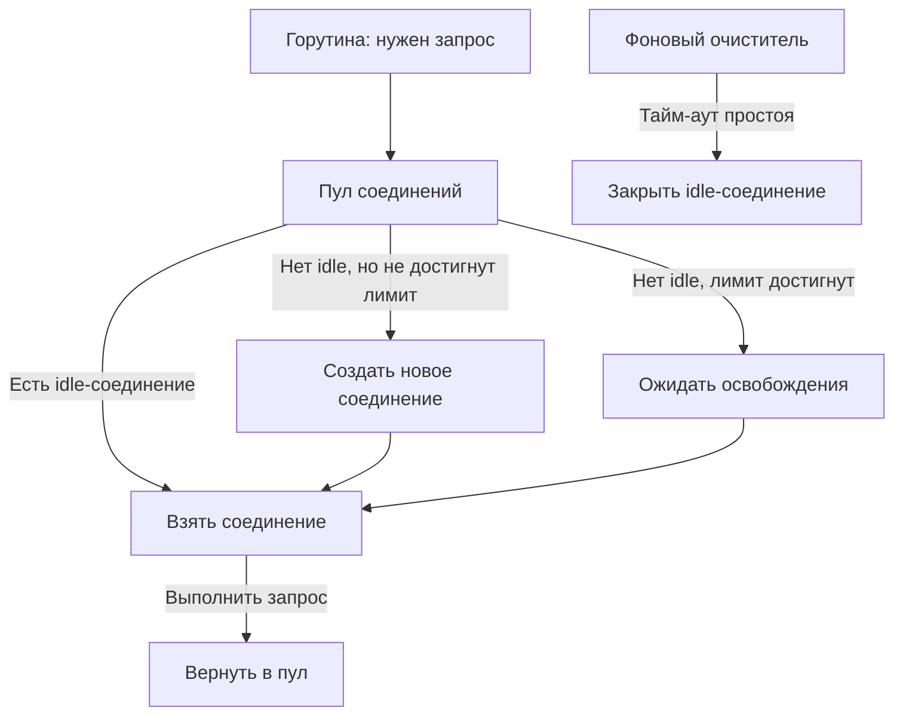
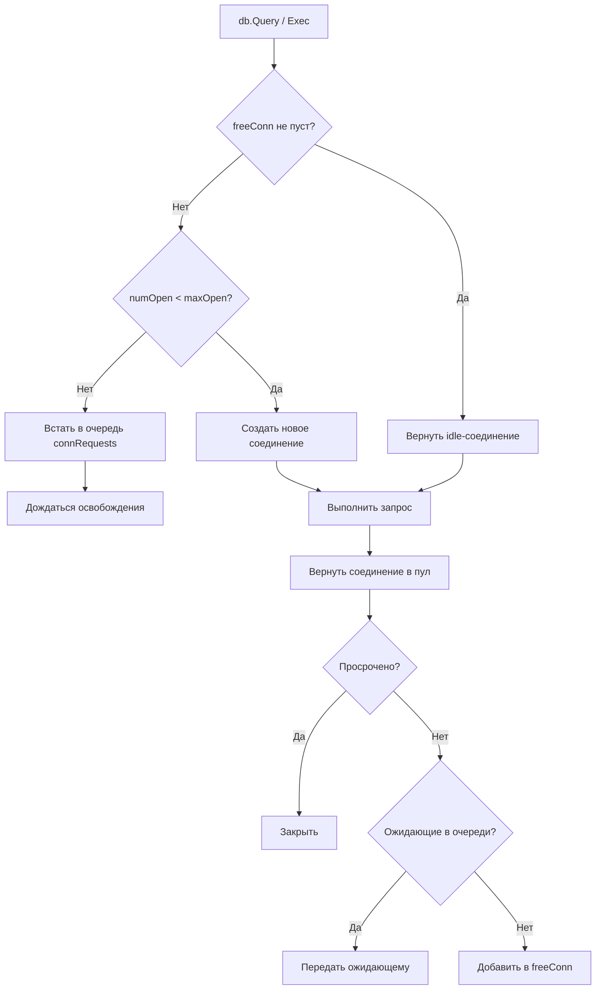

## Connection pooling: переиспользование соединений как основа эффективного ввода-вывода

В предыдущих статьях мы разобрали природу системных вызовов ([[1. Системные вызовы и их стоимость]]), бутылочные горлышки ввода-вывода ([[2. IO bottlenecks]]), сетевую задержку ([[3. Network latency]]) и асинхронный движок Go — netpoller ([[4. epoll kqueue и netpoller]]). Мы увидели, что установка нового TCP-соединения стоит 1 RTT (handshake), плюс 2–3 RTT для TLS, плюс системные вызовы на создание сокета и подключение. Для каждого исходящего HTTP-запроса или запроса к базе данных повторять этот ритуал — значит разбазаривать миллисекунды и ресурсы процессора на операции, не имеющие отношения к бизнес-логике.

**Connection pooling** (пул соединений) — это механизм переиспользования уже установленных соединений для выполнения множества последовательных запросов. Он амортизирует стоимость установления связи, сокращает задержку на целые RTT, экономит системные ресурсы (порты, буферы ядра) и предотвращает деградацию производительности при высоких нагрузках. В Go все стандартные клиенты (`net/http`, `database/sql`, `go-redis`) уже содержат встроенные пулы, но Senior-инженер обязан знать, как они устроены внутри, как их настраивать под нагрузку и как диагностировать проблемы, связанные с утечками или «протухшими» соединениями.

## Что такое connection pool и зачем он нужен

Установка нового TCP-соединения включает:

- Выделение порта (syscall `connect`).
- Трёхстороннее рукопожатие TCP (SYN, SYN-ACK, ACK) — 1 RTT.
- Согласование TLS (ClientHello, ServerHello, обмен ключами) — ещё 2-3 RTT (при TLS 1.3 может быть 1-2 RTT с предварительным обменом ключами).
- Выделение структур в ядре под сокет, буферы отправки/приёма.
- Переходы между userspace и kernel space на каждом системном вызове ([[1. Системные вызовы и их стоимость]]).

При повторном использовании уже установленного соединения все эти затраты исчезают. Остаётся только стоимость отправки/получения данных (один системный вызов `write` и ожидание ответа через `read`, которое обрабатывается netpoller'ом без блокировки потока).

Connection pool держит набор **idle-соединений** (простаивающих, но живых), и когда горутине нужно сделать запрос, она берёт соединение из пула, выполняет запрос и возвращает обратно. Если в пуле нет свободных соединений, создаётся новое (до лимита). Если соединение простаивает слишком долго, оно закрывается для экономии ресурсов.



## HTTP-клиент: пул в `http.Transport`

Стандартный HTTP-клиент Go (`net/http.Client`) по умолчанию использует глобальный `http.DefaultTransport`, который содержит пул TCP-соединений. Даже если вы создаёте новый `http.Client`, ему лучше передавать кастомный `http.Transport` с настроенным пулом.

### Как работает `http.Transport`

Внутри `http.Transport` (пакет `net/http/transport.go`) управляет пулом на основе двухуровневой карты:

- Ключ: `connectMethodKey` — комбинация схемы (http/https), адреса и порта назначения.
- Значение: `persistConn` — обёртка над TCP-соединением с дополнительными блокировками и состоянием.

Каждое `persistConn` может обрабатывать только один запрос одновременно (HTTP/1.1). Для HTTP/2 одно соединение мультиплексирует множество потоков, но это отдельная логика.

Алгоритм получения соединения:
1. Проверяется `idleConn` — список простаивающих соединений для данного хоста.
2. Если есть idle-соединение, оно извлекается, и на нём выполняется запрос.
3. Если idle-соединений нет, но количество активных соединений к хосту меньше `MaxConnsPerHost`, создаётся новое.
4. Если лимит достигнут, горутина блокируется в очереди `connsPerHostWait` до освобождения соединения.

После завершения запроса соединение возвращается в пул idle, если:
- Ответ не содержал заголовка `Connection: close`.
- Не превышен `MaxIdleConnsPerHost` (лимит idle-соединений).
- Соединение не разорвано.

Фоновый горутин (background goroutine) с периодичностью `IdleConnTimeout` проверяет idle-соединения и закрывает те, что простаивали дольше этого времени. По умолчанию `IdleConnTimeout = 90s`.

> [!info] Под капотом
> `persistConn` содержит внутренние каналы `writech` и `readLoop`/`writeLoop` горутины, которые обслуживают запись и чтение. Это позволяет `Transport` реализовать конвейерную обработку и корректно закрывать соединения. При возвращении в пул `persistConn` проверяется, не был ли он помечен как `broken` (разорванный), и если да, он уничтожается, а не возвращается.

### Ключевые настройки `http.Transport`

```go
tr := &http.Transport{
    MaxIdleConns:        100,              // общий лимит idle-соединений (по умолчанию 0 — без ограничений)
    MaxIdleConnsPerHost:  10,              // лимит idle-соединений на один хост (по умолчанию 2)
    MaxConnsPerHost:      20,              // лимит общего числа соединений на хост (0 — без ограничений)
    IdleConnTimeout:      90 * time.Second, // через сколько закрывать idle-соединение
    DisableKeepAlives:    false,           // если true, keep-alive отключен
}
```

Пример: если у вас 100 горутин одновременно вызывают один и тот же хост с `MaxConnsPerHost=10`, то 90 горутин будут стоять в очереди, ожидая освобождения соединений. Это может быть узким местом. В то же время слишком большой `MaxConnsPerHost` может перегрузить удалённый сервер.

> [!warning] Ловушка / Gotcha
> По умолчанию `MaxIdleConnsPerHost` = 2. Это означает, что при высоком RPS пул будет постоянно создавать и закрывать соединения, так как только 2 могут простаивать. Для высоконагруженных сервисов рекомендуется увеличить до 20-100. Если `MaxIdleConns` = 0 (без лимита), а `MaxIdleConnsPerHost` = 2, то ограничение всё равно действует на уровне хоста.

## gRPC и HTTP/2: почему пул «невидим», но всё равно важен

gRPC работает поверх HTTP/2, который мультиплексирует множество запросов в одном TCP-соединении. Поэтому для gRPC класс connection pool в классическом понимании не нужен: один `grpc.ClientConn` представляет одно TCP-соединение с возможностью одновременной отправки множества RPC через стримы.

Однако:
- **Несколько `grpc.ClientConn`.** Для балансировки нагрузки и избыточности можно создавать несколько соединений к разным экземплярам бэкенда (это делает client-side load balancing в gRPC).
- **Keepalive.** gRPC поддерживает keepalive-пинги (`keepalive.ClientParameters`), которые позволяют обнаруживать мёртвые соединения и автоматически переподключаться. Без этого протухшее соединение может надолго заморозить запросы.
- **Idle-соединения.** gRPC может закрывать idle-соединения (`IdleTimeout`).

Настройка keepalive критична для долгоживущих gRPC-соединений:

```go
conn, err := grpc.Dial("backend:50051",
    grpc.WithKeepaliveParams(keepalive.ClientParameters{
        Time:                10 * time.Second, // интервал пингов
        Timeout:             3 * time.Second,  // тайм-аут ответа на пинг
        PermitWithoutStream: true,             // пинговать даже без активных стримов
    }),
)
```

## Пул соединений к базам данных: `database/sql`

Встроенный пакет `database/sql` предоставляет общий интерфейс для SQL-драйверов и содержит продвинутый пул соединений. Драйверы (`go-sql-driver/mysql`, `jackc/pgx`, `mattn/go-sqlite3`) реализуют низкоуровневую работу.

### Внутреннее устройство пула `database/sql`

`sql.DB` содержит:
- `freeConn` — слайс простаивающих соединений (`[]*driverConn`).
- `connRequests` — очередь горутин, ожидающих соединение (канал с capacity = MaxOpenConns).
- `numOpen` — текущее количество открытых соединений.
- `maxOpen` — максимальное количество открытых.
- `maxIdle` — максимальное количество idle.
- `maxLifetime` — максимальное время жизни соединения (после чего оно закрывается).
- `maxIdleTime` — максимальное время простоя в пуле.

Алгоритм получения соединения (`db.conn`):
1. Проверить `freeConn` — если есть свободное, взять.
2. Если `numOpen < maxOpen`, создать новое соединение (вызвать драйвер).
3. Если достигнут лимит, встать в очередь `connRequests` и ждать освобождения или контекста.

Возврат соединения (`putConn`):
1. Проверить, не превышено ли `maxLifetime` или `maxIdleTime`. Если да — закрыть соединение.
2. Если в очереди `connRequests` есть ожидающие, передать соединение им.
3. Иначе — поместить в `freeConn`.
4. Если `len(freeConn) > maxIdle`, закрыть лишние.

Фоновый горутин `connectionCleaner` периодически проверяет idle-соединения на предмет `maxLifetime` и закрывает просроченные.



### Ключевые настройки

```go
db.SetMaxOpenConns(25)                 // максимум открытых соединений
db.SetMaxIdleConns(10)                 // максимум idle (по умолчанию 2)
db.SetConnMaxLifetime(5 * time.Minute) // время жизни соединения
db.SetConnMaxIdleTime(1 * time.Minute) // время простоя в idle
```

> [!tip] Собеседование
> **Вопрос:** Чем опасно большое `MaxIdleConns` и маленькое `MaxOpenConns`?
> **Ответ:** Маленькое `MaxOpenConns` ограничивает параллелизм запросов к базе — лишние горутины будут ждать в очереди, увеличивая latency. Слишком большое `MaxIdleConns` при маленьком `MaxOpenConns` не имеет смысла, так как idle не может превышать открытые. Большое `MaxOpenConns` без контроля может перегрузить БД. Большое `MaxIdleConns` держит много TCP-соединений открытыми к базе, потребляя память и ресурсы на keep-alive.

## Пул соединений к Redis, Kafka и другим системам

### Redis (go-redis)

Клиент `go-redis` использует пул на основе `sync.Pool`-подобной структуры с явным управлением соединениями. Настраивается через `redis.Options`:

```go
client := redis.NewClient(&redis.Options{
    Addr:        "localhost:6379",
    PoolSize:    20,               // максимальное количество соединений
    MinIdleConns: 5,               // поддерживать не менее N idle
    IdleTimeout:  5 * time.Minute, // тайм-аут простоя
})
```

`PoolSize` ограничивает общее число соединений. `MinIdleConns` заставляет пул держать определённое количество прогретых соединений, что снижает задержку при резких всплесках.

### Kafka (sarama, kafka-go)

В Sarama (`sarama.NewAsyncProducer` / `sarama.NewConsumer`) управление соединениями скрыто: клиент сам держит брокерные соединения и переиспользует их. Параметры `Net.MaxOpenRequests` и `Net.DialTimeout` управляют поведением.

В `kafka-go` (segmentio) пул соединений явный. Можно настраивать `MaxAttempts`, `QueueCapacity`, `BatchSize`.

Общий принцип: пул соединений к брокерам сообщений экономит на установлении TCP, но важнее всего — не превысить лимиты, установленные брокером (например, `max.connections.per.ip` в Kafka).

## Проблемы и ловушки connection pooling

> [!warning] Ловушка / Gotcha
> **Stale connections (протухшие соединения).** Сервер может закрыть соединение по тайм-ауту, а клиент ещё не знает об этом. Следующая операция на этом соединении вернёт ошибку `connection reset` или `broken pipe`. В Go `database/sql` и `net/http` частично защищаются от этого (проверка перед возвратом из пула, повтор запроса в случае определённых ошибок). Но при долгом простое лучше устанавливать `MaxLifetime`/`IdleTimeout` меньше, чем тайм-аут на стороне сервера/балансировщика.

> [!warning] Ловушка / Gotcha
> **Утечки соединений.** Если горутина взяла соединение, но не закрыла `rows.Close()` или не дочитала тело ответа (`resp.Body.Close()`), соединение не возвращается в пул. `database/sql` имеет защиту: если `Rows` не закрыты, при следующем запросе может быть попытка закрыть их принудительно, но лучше всегда использовать `defer`. В `net/http` тело ответа **обязательно** должно быть прочитано до EOF и закрыто, иначе соединение не будет возвращено в пул.

> [!warning] Ловушка / Gotcha
> **Недостаток idle-соединений.** Если `MaxIdleConns` слишком мал, а `MaxOpenConns` велик, соединения будут постоянно создаваться и закрываться, теряя смысл пула. Всплески задержки на установку соединений будут заметны в p99.

> [!warning] Ловушка / Gotcha
> **Ограничения на стороне ОС (порты).** При большом количестве соединений на локальной машине может закончиться диапазон эфемерных портов (`net.ipv4.ip_local_port_range`). Пул помогает, ограничивая общее количество открытых сокетов.

## Mechanical Sympathy: connection pool и система

С точки зрения механической эмпатии переиспользование соединений снижает нагрузку на ядро ОС и сохраняет локальность кэша процессора:

- **Сокет — это структура в ядре.** Каждый вызов `socket()` + `connect()` создаёт сокет, выделяя память в ядерном адресном пространстве, регистрирует его в таблицах протокола TCP, назначает буферы (~16-64 КБ на приём и отправку). При разрушении сокета эти ресурсы освобождаются. Пул предотвращает этот цикл.
- **Буферы сокета в page cache.** Установленное TCP-соединение имеет «прогретые» буферы, которые находятся в page cache. При повторном использовании они, скорее всего, всё ещё в кэше процессора (если соединение не простаивало слишком долго).
- **RSS и обработка прерываний.** Сетевые карты распределяют пакеты по ядрам (Receive Side Scaling). Если соединение переиспользуется на том же P (что вероятно благодаря локальности пула `sync.Pool`-подобных структур), обработка прерывания и данные сокета могут оставаться на одном NUMA-узле, улучшая локальность.
- **Экономия RTT.** Пул экономит до 4 RTT (TCP + TLS) на запрос, что при задержке даже в 1 мс внутри дата-центра превращается в ощутимое улучшение latency.

## Мониторинг и диагностика пулов

### database/sql

Пакет предоставляет `db.Stats()`:

```go
stats := db.Stats()
fmt.Printf("Open: %d, InUse: %d, Idle: %d, WaitCount: %d, WaitDuration: %s\n",
    stats.OpenConnections, stats.InUse, stats.Idle,
    stats.WaitCount, stats.WaitDuration)
```

- `WaitCount` — сколько раз горутины ждали освобождения соединения. Высокое значение → мало `MaxOpenConns`.
- `WaitDuration` — суммарное время ожидания. Большое → запросы тормозят.
- `Idle` vs `InUse` — баланс простаивающих и занятых.

### net/http.Transport

Прямых метрик нет, но можно:
- Использовать `net/http/httptrace` для трассировки получения/возврата соединения.
- Слушать события `GotConn`, `ConnectDone` и измерять долю переиспользованных соединений.
- Использовать внешние метрики (Prometheus `http_client_*`) для анализа задержек.

### Системные утилиты

- `ss -tanop` или `netstat -anp` — посмотреть состояние TCP-соединений (ESTABLISHED, TIME_WAIT, CLOSE_WAIT). Много соединений в `TIME_WAIT` может говорить о частом закрытии.
- `perf top` / `strace -c` — если много времени уходит в `connect`/`tcp_connect`, пул работает неэффективно.

## Итог

- **Connection pooling** — ключевая техника сокращения задержек и ресурсов при вводе-выводе, амортизирующая стоимость TCP/TLS рукопожатий.
- В Go пулы встроены в стандартные клиенты: `net/http.Transport`, `database/sql`, клиенты для Redis/Kafka.
- HTTP-пул управляет `persistConn` с лимитами на хост, idle и общее количество. gRPC использует одно мультиплексированное соединение, но важны keepalive-настройки.
- `database/sql` реализует расширенный пул с лимитами, временем жизни, очередью ожидающих.
- Проблемы пулов: протухшие соединения, утечки при незакрытых ответах, недостаток idle-слотов — лечатся правильной настройкой таймаутов и строгой дисциплиной работы с ресурсами (defer close).
- На уровне ОС и процессора пул сохраняет ресурсы ядра, прогретые буферы и минимизирует межъядерный трафик.
- Мониторинг через `DB.Stats()`, `httptrace` и системные утилиты (`ss`) позволяет видеть эффективность пула и вовремя реагировать на деградацию.

Умение настраивать и диагностировать пулы соединений — один из маркеров Senior Go-инженера, напрямую влияющий на стабильность и производительность сервиса под нагрузкой. На этом мы завершаем подраздел «IO и системный уровень» и переходим к следующему разделу.