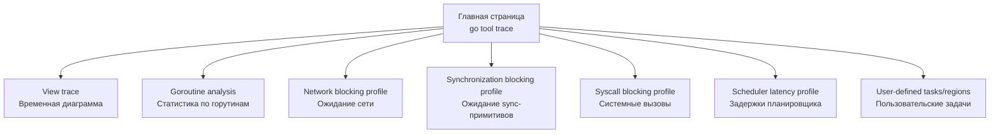
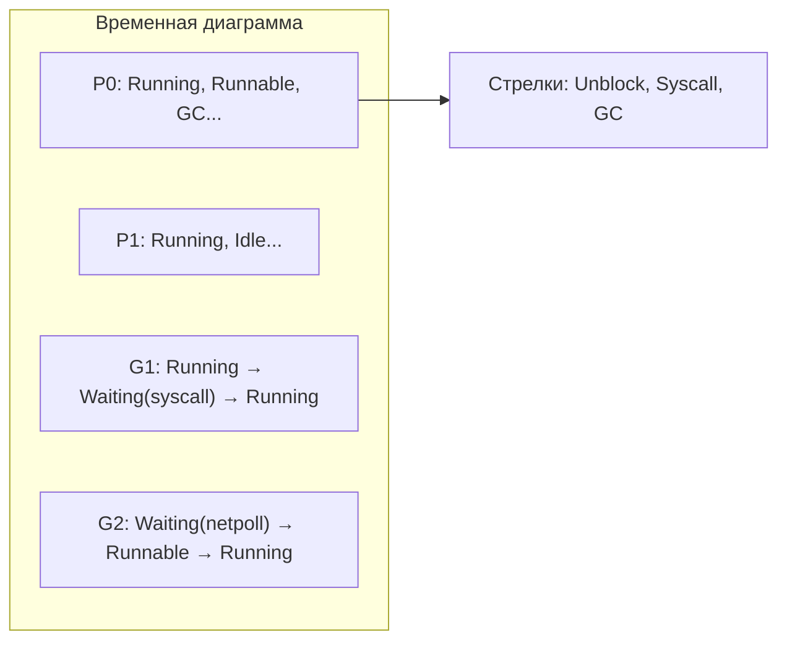

## `go tool trace` — визуализация временной шкалы рантайма

Профилировщики CPU ([[2. CPU profiling в Go]]) и памяти ([[5. pprof memory profile]]) показывают агрегированную картину: где программа провела больше всего тактов или байт. Но они не отвечают на вопрос «почему горутина висела 50 мс, если CPU пустовал?» — потому что профили не сохраняют временную шкалу. Ответ даёт **трассировка исполнения** (execution trace) и инструмент для её анализа — `go tool trace`.

`go tool trace` — это CLI и веб-приложение, входящее в состав Go, которое визуализирует события рантайма в хронологическом порядке. В отличие от pprof, который сэмплирует состояние, трассировка записывает конкретные события: запуск и остановка горутин, блокировка на каналах, системные вызовы, GC-циклы, миграция между P. Это позволяет расследовать инциденты, связанные с задержками планировщика, contention на синхронизации, утечками горутин и неоптимальной работой GC.

Понимание `go tool trace` обязательно для Senior-инженера, так как именно этот инструмент превращает «странные тормоза» в точную последовательность причин и следствий.

## Что такое трассировка исполнения в Go

Трассировка исполнения (execution tracer) — это подсистема рантайма, которая записывает события в бинарный файл. Пакет `runtime/trace` (детально рассмотрен в [[3. execution tracer]]) управляет записью. Файл трассировки содержит:

- **События горутин:** создание, запуск, блокировка, разблокировка, завершение, изменение состояния.
- **События планировщика:** переключение P на новую G, миграция G между P, воровство работы ([[3. Work stealing]]).
- **События GC:** начало и конец фаз mark/sweep, STW-паузы ([[3. Stop the world]]), активность GC-воркеров.
- **События сети:** блокировка и разблокировка на netpoller ([[4. epoll kqueue и netpoller]]).
- **Системные вызовы:** вход и выход из syscall.
- **Пользовательские события:** задачи (tasks), регионы (regions), логические метки.

`go tool trace` принимает этот файл и отображает его в интерактивном веб-интерфейсе.

## Как получить трассировку

### 1. Из production-сервиса через HTTP

Самый распространённый способ — эндпоинт `/debug/pprof/trace`, который становится доступен при импорте `_ "net/http/pprof"`:

```bash
curl -o trace.out "http://localhost:6060/debug/pprof/trace?seconds=5"
```

Параметр `seconds` задаёт длительность записи. Трассировка активна указанное время, после чего возвращается файл. Важно: сервис должен находиться под нагрузкой в момент записи, иначе трассировка покажет idle.

### 2. Из кода с помощью `runtime/trace`

```go
f, _ := os.Create("trace.out")
trace.Start(f)
defer trace.Stop()
// работа
```

Это удобно для CLI-утилит, тестов или изолированных функций.

> [!warning] Ловушка / Gotcha
> Overhead трассировки значительно выше, чем у профилировщиков. Запись событий рантайма добавляет примерно 10–30% накладных расходов по CPU и заметно увеличивает потребление памяти (буферизация событий). В production-среде длительные трассировки (>10 секунд) могут исказить поведение приложения. Используйте короткие интервалы (3–10 секунд) и только во время диагностики.

## Запуск `go tool trace`

После получения файла `trace.out`:

```bash
go tool trace trace.out
```

Откроется веб-браузер с адресом `http://127.0.0.1:PORT`. Интерфейс содержит несколько разделов. Рассмотрим ключевые.



## View trace: хронологическая карта рантайма

Это главное окно трассировки — интерактивная временная диаграмма, показывающая всё, что происходило в программе.

### Горизонтальная ось: время

Временная шкала разбита на микросекунды/миллисекунды. Можно масштабировать, захватывая область, и перемещаться по времени.

### Вертикальные секции

Сверху вниз:

- **Stats:** количество горутин (`Goroutines`), занятость кучи (`Heap`), количество потоков (`Threads`), активность GC.
- **Procs (P):** полосы для каждого логического процессора. Каждая полоса — это последовательность участков разного цвета:
    - **Зелёный (Running):** P выполняет горутину.
    - **Серый (Runnable):** горутина ожидает запуска (готова, но нет свободного P).
    - **Белый (Idle):** P простаивает.
    - **Красный (GC):** P занят маркировкой для GC.
- **Горутины (Goroutines):** можно выбрать конкретную горутину и увидеть её состояния во времени: Running (зелёный), Runnable (серый), Waiting (синий — сеть, жёлтый — sync, красный — syscall). Видно, на каком P она работала и куда мигрировала.
- **События:** ниже отображаются специфические события: стрелки между горутинами (разблокировка), STW-паузы (красные полосы), GC-фазы, syscall-переходы.



### Как читать диаграмму для диагностики

- **Много серого (Runnable).** Если на полосах P много серого, а белого мало, значит, горутины готовы к выполнению, но не хватает P (процессорных ресурсов). Увеличивайте `GOMAXPROCS` (если есть свободные ядра) или оптимизируйте CPU-bound код.
- **Много синего/жёлтого (Waiting).** Горутины долго ожидают сеть или синхронизацию. Это норма для IO-bound, но если паузы длинные — ищите медленный бэкенд, переполненные каналы или contention на мьютексах.
- **Красные полосы GC.** Длинные блоки `GC` на P говорят о высокой активности GC. Коррелируйте с `Heap` на графике Stats: если куча растёт и GC-фазы длинные, нужно снижать аллокации ([[1. Уменьшение аллокаций]]).
- **STW-паузы.** Отображаются как вертикальные красные линии, пересекающие все P. Их длительность можно измерить выделением.
- **Миграции горутин.** В трассировке горутины видно, как она перемещается между P. Частые миграции (особенно для CPU-bound горутин) говорят о неоптимальной балансировке ([[3. Work stealing]]) и могут указывать на потерю локальности кэша.

## Goroutine analysis: статистика по горутинам

Этот раздел показывает таблицу всех горутин с разбивкой времени по состояниям:

- **Execution Time:** сколько тактов горутина была в состоянии Running.
- **Network Wait:** время ожидания сети.
- **Sync Block:** ожидание на каналах, мьютексах.
- **Syscall:** время в системных вызовах.
- **Scheduler Wait:** время в состоянии Runnable (ожидание P).
- **GC Time:** время, потраченное на помощь GC (mark assist).

Сортировка по столбцам позволяет быстро найти:
- Горутины с аномально большим `Scheduler Wait` (нехватка CPU).
- Горутины, которые много времени проводят в syscall (файловый ввод-вывод без netpoller).
- Утёкшие горутины (бесконечно висят в Waiting).

## Профили блокировок внутри трассировки

`go tool trace` автоматически строит производные профили на основе записанных событий:

- **Network blocking profile:** сколько времени горутины ждали сетевых операций, с группировкой по стеку вызовов. Аналог block profile ([[5. block profile]]), но собранный из трассировки.
- **Synchronization blocking profile:** аналогично для ожидания на каналах, `sync.Mutex`, `sync.WaitGroup`.
- **Syscall blocking profile:** для блокирующих системных вызовов.
- **Scheduler latency profile:** сколько времени горутины провели в очереди runnable, ожидая, пока планировщик выделит им P. Это прямой индикатор перегрузки планировщика.

Эти профили полезны для поиска «виновников» долгих ожиданий без необходимости отдельно включать block/mutex профили.

## Пользовательские задачи и регионы

Пакет `runtime/trace` позволяет внедрять в трассировку пользовательские аннотации — задачи (`trace.NewTask`) и регионы (`trace.StartRegion`). В `go tool trace` они появляются в разделе **User-defined tasks**. Это позволяет визуально выделить обработку конкретного запроса на временной шкале, измерить её длительность и разложить по компонентам.

```go
ctx, task := trace.NewTask(context.Background(), "processOrder")
defer task.End()
region := trace.StartRegion(ctx, "validatePayment")
// ...
region.End()
```

Для распределённых систем кастомные задачи — способ связать трассировку одного сервиса с Correlation ID ([[7. Correlation ID]]), но без распределённой трассировки это работает только локально.

## Практический пример: расследование всплеска задержки

Симптомы: p99 latency сервиса выросла с 50 мс до 300 мс. Нагрузка не изменилась. CPU-профиль ([[2. CPU profiling в Go]]) не показывает явных горячих точек, время в `runtime.mallocgc` умеренное.

1. Снимаем трассировку на 5 секунд в период проблемы:
   ```bash
   curl -o trace.out "http://localhost:6060/debug/pprof/trace?seconds=5"
   ```
2. Открываем `go tool trace trace.out`, переходим в **View trace**.
3. Видим, что каждые ~1 секунду происходит длинная красная полоса GC, пересекающая все P. Это STW-пауза ([[3. Stop the world]]). Длительность пауз — около 1-2 мс, но они регулярные.
4. Смотрим на график Heap: он волнообразен, но живых объектов немного. Паузы вызваны не объёмом живых объектов, а частыми циклами GC.
5. В **Goroutine analysis** видим, что несколько горутин-обработчиков имеют большое `GC Time` (mark assist). Они аллоцируют много краткоживущих объектов.
6. Вывод: высокий темп аллокаций заставляет GC частить. Временное решение — повысить `GOGC` ([[7. GOGC и tuning]]) с 100 до 200, чтобы снизить частоту циклов. Фундаментальное — добавить `sync.Pool` ([[2. sync Pool]]) для переиспользования буферов.
7. Повторяем трассировку после изменений: STW-паузы стали реже, p99 вернулась к 50 мс.

## Mechanical Sympathy: что под капотом у трассировки

Трассировка записывает события в кольцевой буфер в памяти, используя атомарные операции и локальные буферы P для минимизации contention ([[7. Contention и lock profiling]]). При высоких нагрузках (миллионы событий в секунду) запись может сама по себе создавать contention на этих буферах.

Каждое событие трассировки — это несколько байт в памяти. При просмотре `go tool trace` парсит бинарный формат и строит визуализацию на JavaScript (используется веб-интерфейс). При открытии больших трасс (сотни мегабайт) браузер может тормозить. Рекомендуется ограничивать длительность трассировки или фильтровать события через `go tool trace -trace` с параметрами (если поддерживается).

С точки зрения процессора, включённая трассировка:
- Добавляет инструкции в критические пути рантайма (блокировки, планировщик).
- Увеличивает количество cache miss, так как данные событий пишутся в память и вытесняют рабочий набор.
- Может исказить поведение GC, так как сами события аллоцируют память (буфер трассировки), создавая дополнительную работу для GC.

Поэтому данные трассировки следует интерпретировать с поправкой на overhead, и для точных замеров лучше использовать продакшен-метрики и pprof.

## Связь с execution tracer

`go tool trace` — это клиент для данных, сгенерированных пакетом `runtime/trace`. Сам пакет и его внутреннее устройство, включая форматы событий, механизмы включения и отключения, детально рассмотрены в следующей статье [[3. execution tracer]].

## Итог

- `go tool trace` — мощный инструмент для визуализации хронологии событий рантайма: горутин, планировщика, GC, сети и системных вызовов.
- Позволяет диагностировать проблемы, невидимые в агрегированных профилях: задержки планировщика, GC-паузы, contention, утечки горутин.
- Основные разделы: View trace (временная диаграмма), Goroutine analysis (статистика состояний), производные профили блокировок.
- Трассировка включается через `/debug/pprof/trace` или `runtime/trace`, имеет значительный overhead, используется кратковременно и только для диагностики.
- Интеграция с пользовательскими задачами (tasks/regions) позволяет привязать трассировку к бизнес-логике.
- Навык чтения trace-диаграмм — один из ключевых для Senior-инженера, расследующего инциденты производительности.

Теперь, освоив инструмент анализа трассировки, мы готовы погрузиться в то, как именно работает генератор этих данных — [[3. execution tracer]].