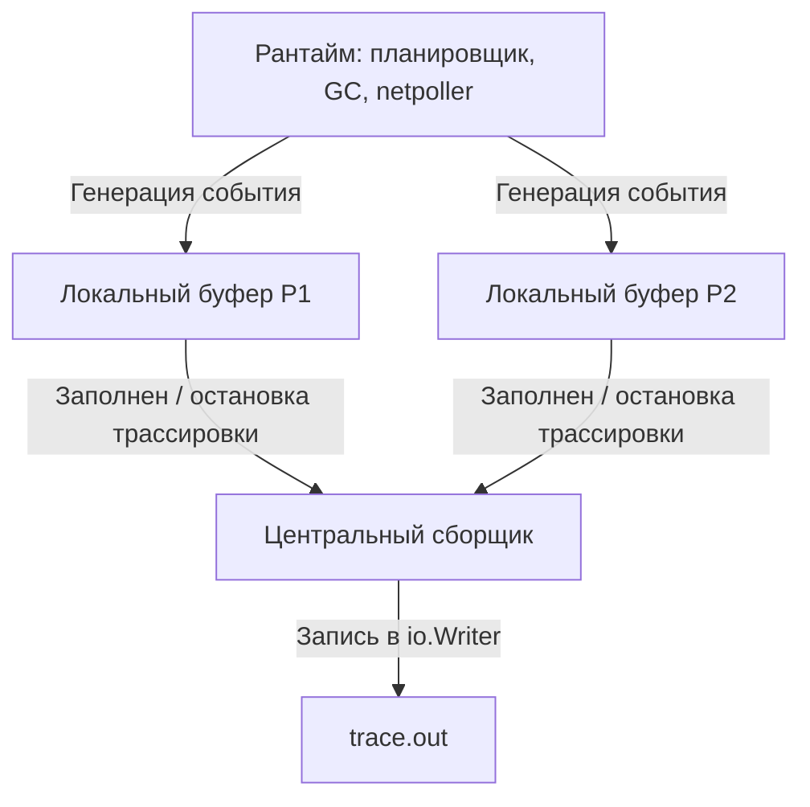

## Execution Tracer: событийная летопись рантайма

В предыдущей статье мы освоили **`go tool trace`** — инструмент для визуализации трассировки исполнения ([[2. trace tool]]). Но сама трассировка рождается глубже: в недрах рантайма, где каждый запуск горутины, каждая блокировка на канале и каждый GC-цикл «записываются» в поток событий. Пакет **`runtime/trace`** и стоящий за ним **execution tracer** (трассировщик исполнения) — это та самая машина, которая порождает файл `trace.out`.

В отличие от `pprof`, который сэмплирует состояние ([[1. pprof. Введение]]), execution tracer **записывает события во времени**. Он не усредняет, а сохраняет хронологию, что делает его идеальным для расследования недетерминированных проблем: «почему горутина висела 20 мс, хотя CPU был свободен?». Но эта мощь имеет цену: трассировка нагружает рантайм сильнее любого другого профилировщика, а её вывод требует глубокого понимания внутренних структур.

В этой статье мы вскроем инженерные детали execution tracer: как он генерирует события, взаимодействуя с планировщиком G-M-P ([[1. Scheduler Go. G M P модель]]), сборщиком мусора ([[1. GC в Go. Обзор]]) и сетевым поллером ([[4. epoll kqueue и netpoller]]); как устроен кольцевой буфер; почему overhead достигает 30% и как с ним работать. Статья — прямой мост к практике: без этого знания невозможно интерпретировать артефакты на графе **View trace** и отличать реальные задержки от шума трассировщика.

## Архитектура трассировщика: от события до protobuf

Execution tracer — это не одна горутина-наблюдатель, а распределённый по P механизм сбора. Его архитектура отражает главный принцип Go: минимизация блокировок за счёт локальности.

### Генерация событий на каждом P

Когда трассировка включена, каждый P (логический процессор) владеет **локальным кольцевым буфером** (`trace.buf`), размером ~32 КБ. Все события, связанные с горутинами, исполняющимися на этом P, пишутся в этот буфер без блокировок — только через atomic-операции. События бывают:

- **Состояние горутины**: `EvGoCreate`, `EvGoStart`, `EvGoEnd`, `EvGoBlock`, `EvGoUnblock`.
- **Планировщик**: `EvGoSched`, `EvGoPreempt`.
- **GC**: `EvGCSweepBegin`, `EvGCMarkAssistStart`, `EvGCMarkAssistDone`.
- **Системные вызовы**: `EvGoSyscall`, `EvGoSyscallEnd`.
- **Пользовательские**: `EvUserTaskCreate`, `EvUserRegionBegin`.

Каждое событие — это пара (тип, временная метка, идентификатор горутины/потока/P, дополнительные данные). Временная метка снимается с монотонным счётчиком `runtime.nanotime()` (быстрый вызов, обёртка над `clock_gettime`), что даёт наносекундную точность.



Локальный буфер устроен просто: массив байт, указатели `head`/`tail`. Запись очередного события — это сериализация в байты (вручную, без рефлексии) и продвижение `head`. Когда буфер заполняется, P сбрасывает его в центральный сборщик и получает новый.

### Центральный сборщик и сведение потоков

Фоновая горутина-сборщик (trace goroutine) читает заполненные буферы от всех P и сериализует их в выходной поток (`io.Writer`, переданный в `trace.Start`). Формат выходного файла — бинарный protobuf (своя схема, не стандартный `proto`), оптимизированный под компактность. Каждое событие занимает от 1 до десятков байт, в зависимости от сложности.

При остановке трассировки (`trace.Stop()`) все оставшиеся буферы P принудительно сбрасываются, и выходной поток закрывается. `go tool trace` потом парсит этот файл, восстанавливает временные шкалы и строит визуализацию.

## Типы событий и их связь с G-M-P

Execution tracer — это по сути летописец модели G-M-P. Каждый переход горутины между состояниями ([[2. Goroutines под капотом]]) порождает событие. Вот ключевые события и их роль в диагностике.

| Событие | Когда происходит | Что диагностируется |
|---------|-----------------|---------------------|
| `EvGoCreate` | Создание новой горутины (`go func()`) | Всплески создания, утечки |
| `EvGoStart` | Горутина начала исполнение на P | Миграция, задержка запуска |
| `EvGoEnd` | Горутина завершилась | Утечки, досрочное завершение |
| `EvGoBlock` / `EvGoUnblock` | Блокировка/разблокировка на канале, мьютексе | Contention, долгое ожидание |
| `EvGoSyscall` / `EvGoSyscallEnd` | Вход/выход из системного вызова | Файловый IO, задержки ядра |
| `EvGoSched` | Горутина добровольно уступила P | Кооперативная многозадачность |
| `EvGoPreempt` | Асинхронная преемпция | Долгие CPU-участки |
| `EvGCMarkAssistStart` | Горутина начала помогать GC | Давление GC, mark assist bottleneck |
| `EvUserRegionBegin` | Пользовательский регион (см. ниже) | Разметка бизнес-логики |

Каждое событие несёт идентификатор горутины (`goid`), P и M. Это позволяет `go tool trace` восстановить хронологию: на каком ядре работала горутина, куда мигрировала, из-за чего была вытеснена. Визуализация `View trace` ([[2. trace tool]]) строит из этих событий цветные полосы.

## Включение трассировки и её цена

Трассировка включается вызовом `trace.Start(w io.Writer)` и выключается `trace.Stop()`. Стандартный HTTP-эндпоинт `/debug/pprof/trace?seconds=N` просто оборачивает этот механизм.

**Overhead трассировки значителен** — 10–30% CPU и десятки мегабайт памяти на запись событий. Причины:

1. **Безусловная запись событий.** В отличие от pprof, который сэмплирует с частотой 100 Гц и имеет небольшой постоянный overhead, трассировщик пишет событие на **каждое** переключение горутины, на каждый вход в syscall, на каждую GC-операцию. На насыщенном сервере это могут быть миллионы событий в секунду.
2. **Аллокации буферов.** Каждый P периодически выделяет новый буфер (если старый ушёл на сброс). Это добавляет работу GC, что искажает картину.
3. **Синхронизация при сбросе.** При передаче заполненного буфера центральному сборщику используется блокировка (мьютекс), что создаёт микро-contention, особенно при большом числе P.

> [!warning] Ловушка / Gotcha
> Запуск трассировки на 30 секунд в продакшене под высокой нагрузкой может **удвоить latency** и исказить метрики GC, потому что сам трассировщик генерирует аллокации. Всегда ограничивайтесь 3–10 секундами и коррелируйте данные с продакшен-метриками, снятыми без трассировки.

## Механика записи в критических секциях рантайма

Самые интересные события — те, что записываются в горячих путях планировщика и синхронизации. Рассмотрим, как это реализовано.

### Планировщик и горутины

Функция `execute(g, m, p)` в `runtime/proc.go`, запускающая горутину на P, вызывает `traceGoStart(g)`. Эта функция проверяет, включена ли трассировка, и если да — атомарно пишет `EvGoStart`, `goid`, временную метку в локальный буфер P. Аналогично `goexit`, `gopark`, `goready` генерируют соответствующие события.

Преемпция (асинхронная, через `SIGURG`) порождает `EvGoPreempt` с указанием причины (тайм-аут). Это позволяет увидеть в `View trace`, что горутина была снята не по своей воле.

### Сетевой поллер

Netpoller ([[4. epoll kqueue и netpoller]]) интегрирован в трассировку: когда горутина паркуется в ожидании сети (`netpollblock`), записывается `EvGoBlock` с причиной "network". При пробуждении — `EvGoUnblock`. Это даёт разделение времени ожидания на сеть и на другие причины (каналы, мьютексы) в Goroutine analysis.

### GC и mark assist

Фазы GC ([[4. Concurrent GC]]) инструментированы событиями `EvGCStart`, `EvGCSweepBegin`, `EvGCMarkAssistStart` и другими. Mark assist, когда горутина-мутатор помогает маркировке, отображается как `EvGCMarkAssistStart`/`Done`, что позволяет измерить его вклад в задержку обработки запроса.

## Пользовательские задачи и регионы

Одних системных событий часто недостаточно, чтобы понять, какому запросу принадлежит задержка. Для этого `runtime/trace` предоставляет **задачи (tasks)** и **регионы (regions)**.

- **Task** (`trace.NewTask(ctx, "name")`) создаёт логическую единицу работы с уникальным идентификатором. Все последующие регионы, созданные с этим контекстом, будут привязаны к задаче. В интерфейсе `go tool trace` можно выбрать задачу и увидеть её временную шкалу.
- **Region** (`trace.StartRegion(ctx, "name")`) — именованный отрезок внутри задачи. На диаграмме он отображается как полоса, что позволяет измерить длительность бизнес-операции ("парсинг JSON", "запрос к БД") и сравнить её с системными событиями.

```go
ctx, task := trace.NewTask(context.Background(), "handleOrder")
defer task.End()
region := trace.StartRegion(ctx, "queryInventory")
// ...
region.End()
```

Эти аннотации добавляют небольшие накладные расходы (несколько десятков наносекунд каждая), но их также можно селективно включать только для процентного количества запросов.

> [!tip] Собеседование
> **Вопрос:** Как вы будете расследовать, что 1% запросов обрабатывается в 10 раз дольше остальных?
> **Ответ:** Включу execution tracer на короткий интервал, добавив пользовательские регионы вокруг ключевых этапов обработки. В `goroutine analysis` найду горутины с максимальным `Scheduler Wait` или `Sync Block`. По `User-defined tasks` определю, какой этап вызвал задержку, и сопоставлю с GC-активностью или ожиданием сети.

## Сравнение с другими инструментами

| Инструмент | Что показывает | Overhead | Когда применять |
|------------|----------------|----------|-----------------|
| **pprof CPU** | Агрегированное время по функциям | ~1-3% | Поиск горячих функций |
| **pprof memory** | Аллокации / живая память | ~1-5% | Утечки памяти, источники мусора |
| **block/mutex profile** | Ожидание на синхронизации | ~1-5% (при rate>1) | Contention на мьютексах |
| **execution tracer** | Хронология событий G-M-P, GC, сети | 10-30% | Динамика задержек, миграция горутин, GC-паузы |
| **strace** | Системные вызовы процесса | Низкий-средний | Отладка взаимодействия с ОС |
| **perf sched** | Планирование потоков ядром | Низкий | Проблемы на уровне потоков ОС |

Execution tracer — комплементарен pprof, а не заменяет его. pprof отвечает «где жжёт CPU», tracer — «почему горутина ждала, хотя CPU свободен».

## Ловушки и ограничения

> [!warning] Ловушка / Gotcha
> **Переполнение буфера.** Если темп генерации событий превышает пропускную способность записи в `io.Writer` (например, медленный диск), буферы накапливаются, и рантайм начинает терять события. Внешне это проявляется как «пропуски» на диаграмме и сообщения в stderr: `trace: buffer overflow`. Решение: уменьшить длительность трассировки, увеличить буфер (неэкспортируемый параметр) или писать в память (`bytes.Buffer`).

> [!warning] Ловушка / Gotcha
> **Трассировка меняет поведение.** Из-за значительного overhead'а трассировка может скрыть или, наоборот, создать проблемы: замедлить обработку, заставить GC чаще срабатывать, изменить порядок исполнения горутин. Никогда не делайте выводы только по трассировке — проверяйте гипотезу отключением трассировки и сравнением бизнес-метрик.

> [!warning] Ловушка / Gotcha
> **Неверная интерпретация `Scheduler Wait`.** Высокое время в этом состоянии может означать как нехватку CPU, так и занятость P другими горутинами. Смотрите на совокупность: если Idle-процессов нет — CPU перегружен; если Idle есть, а Scheduler Wait высок — возможно, горутины ждут конкретный P из-за `LockOSThread`.

## Mechanical Sympathy: трассировщик и «железо»

Локальные буферы P созданы так, чтобы минимизировать межъядерный трафик. Запись в буфер — это обычная инструкция `MOV` в память, которая попадает в L1-кэш данного ядра. При сбросе буфера центральному сборщику данные приходится передавать через L3 (или через QPI/Infinity Fabric), что вызывает cache line bouncing ([[8. False sharing]]). Поэтому сброс делается не на каждом событии, а пачками (при заполнении буфера или при остановке).

Также `nanotime()` — это `clock_gettime(CLOCK_MONOTONIC)` (системный вызов), который стоит несколько десятков тактов. При миллионах событий в секунду это накапливается. Именно поэтому трассировка так заметно замедляет программу.

## Итог

- **Execution tracer** (`runtime/trace`) — это подсистема рантайма Go, записывающая хронологию событий (горутины, планировщик, GC, сеть, syscall) в бинарный файл для последующего анализа `go tool trace`.
- События генерируются в критических точках рантайма (планировщик, netpoller, GC) и пишутся в локальные кольцевые буферы P без блокировок, затем объединяются центральным сборщиком.
- Ключевые события: `EvGoStart`, `EvGoBlock`, `EvGoSyscall`, `EvGCStart`, `EvUserRegionBegin`.
- Пользовательские задачи и регионы (`trace.NewTask`, `trace.StartRegion`) позволяют размечать бизнес-логику и связывать задержки с конкретными запросами.
- Overhead трассировки значителен (10-30% CPU), поэтому она применяется кратковременно, только для диагностики динамических проблем.
- Трассировка дополняет pprof, а не заменяет: она вскрывает временную структуру, невидимую в агрегированных профилях.
- Правильное чтение трассировки — навык Senior-инженера, позволяющий преобразовывать «плавающие тормоза» в конкретные цепочки событий.

Теперь, понимая, как устроена трассировка исполнения, мы перейдём к более приземлённому, но не менее важному инструменту анализа состояния приложения в конкретный момент — [[4. goroutine dump]].