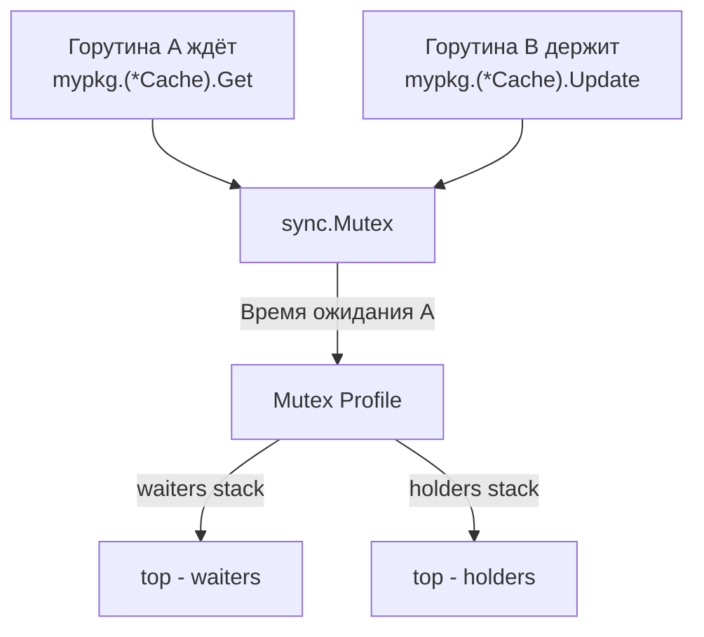

## Mutex Profile: кто держит блокировку и сколько мы ждём

В предыдущей статье мы освоили **block profile** ([[5. block profile]]) — инструмент для измерения времени, которое горутины проводят в ожидании на каналах, мьютексах, сети и системных вызовах. Block profile показывает _сколько_ времени потеряно, но для мьютексов он не говорит _кто_ стал причиной ожидания. Ответ на этот вопрос даёт **mutex profile** — специализированный профиль contention на мьютексах.

Mutex profile регистрирует не просто факт блокировки, а **конкуренцию**: момент, когда горутина пытается захватить `sync.Mutex` или `sync.RWMutex`, но он уже занят _другой_ горутиной. Для каждого такого события сохраняются два стека: кто ждал (contender) и кто удерживал (holder). Это превращает профиль в мощнейший инструмент для поиска «горячих» мьютексов и архитектурных проблем конкурентности, которые разрушают масштабируемость.

Senior-инженер применяет mutex profile, когда приложение упирается в contention на мьютексах ([[7. Contention и lock profiling]]), когда метрики p99 деградируют без видимого роста CPU ([[2. CPU profiling в Go]]), а block profile показывает высокую долю ожидания на `sync.(*Mutex).Lock`. Mutex profile завершает диагностическую триаду: CPU + Memory + Contention.

## Что измеряет mutex profile

### Contention, а не просто ожидание

Block profile фиксирует **каждую блокировку** горутины на мьютексе, независимо от того, был ли мьютекс свободен и горутина сразу его захватила (чего почти не бывает), или ей пришлось ждать. Mutex profile, напротив, срабатывает только в момент **contention** — когда горутина **обнаруживает**, что мьютекс занят, и переходит в режим ожидания.

Таким образом, mutex profile отвечает на вопросы:
- На каком мьютексе происходит наибольшее количество конфликтов?
- Сколько суммарного времени горутины провели в ожидании именно этого мьютекса?
- Какая горутина (и какой код) удерживала мьютекс, пока другая ждала?

### Двойной стек

В момент contention рантайм записывает:
1. **Стек ожидающей горутины** — где был вызван `Lock()`.
2. **Стек горутины-владельца** — где был вызван предыдущий `Lock()`, который ещё не освобождён.

Это уникальная возможность: в `go tool pprof` можно переключаться между представлениями «waiters» и «holders» и видеть вторую сторону конфликта.

## Включение mutex profile

По умолчанию mutex profile **отключён**. Включается через `runtime.SetMutexProfileFraction(rate int)`.

- **`rate`** — частота записи событий contention. Аналогично block profile: `rate=1` — записывать каждый конфликт, `rate=1000` — каждый тысячный.
- При `rate > 0` рантайм начинает накапливать статистику в хеш-таблице профиля.

### Способы включения

1. **В коде при старте:**
   ```go
   func main() {
       runtime.SetMutexProfileFraction(1) // записывать все contention
       // ...
   }
   ```

2. **Через HTTP pprof:**
   Сам эндпоинт `/debug/pprof/mutex` доступен всегда, но данные появятся только после установки `SetMutexProfileFraction`.

3. **В тестах и бенчмарках:**
   ```bash
   go test -mutexprofile=mutex.out -bench=.
   ```
   При этом фреймворк тестов автоматически включает `SetMutexProfileFraction(1)`.

> [!warning] Ловушка / Gotcha
> `SetMutexProfileFraction` должна быть вызвана до того, как начнутся интересующие нас contention. Если мьютексы активно захватываются в `init()`-функциях, профиль может недосчитаться этих событий. В production-сервисах обычно устанавливают в `main` раньше всех `go func()`.

## Сбор и анализ профиля

### Сбор

```bash
curl -o mutex.prof http://localhost:6060/debug/pprof/mutex
```

### Анализ через `go tool pprof`

```bash
go tool pprof mutex.prof
```

Интерактивные команды:

- **`top`** — показывает функции с наибольшим суммарным временем ожидания (в наносекундах/микросекундах), где произошла блокировка. Это _стек ожидающего_.
- **`list FuncName`** — построчно, сколько времени потрачено на ожидание конкретного вызова `Lock`.
- **`web`** / **`-http=:8080`** — визуализация графа вызовов. Важнейшая опция: переключение между `waiters` и `holders` (в веб-интерфейсе — вкладка «Source» или «Graph», и выбор «show»).

Пример вывода `top`:

```
(pprof) top
Showing nodes accounting for 4.80s, 90% of 5.33s total
      flat  flat%   sum%        cum   cum%
     2.00s 37.52% 37.52%      2.00s 37.52%  sync.(*Mutex).Lock
     1.50s 28.14% 65.66%      1.50s 28.14%  mypkg.(*Cache).Get
     1.00s 18.76% 84.42%      1.00s 18.76%  mypkg.(*Stats).Increment
     0.30s  5.63% 90.05%      0.30s  5.63%  runtime.semacquire1
```

Здесь `sync.(*Mutex).Lock` — стандартная точка входа. Реальный интерес представляет `mypkg.(*Cache).Get` — горутины ждали именно при попытке захватить мьютекс внутри метода `Get`.

Команда `list Cache.Get` покажет строку с `mu.Lock()`, на которую пришлись ожидания.

### Просмотр удерживающих горутин (holders)

В веб-интерфейсе (`go tool pprof -http=:8080 mutex.prof`) нужно выбрать меню **VIEW** → **Flamegraph** или **Graph**, затем в верхнем поле **«show»** выбрать **`holders`**. Отобразится граф, в котором стеки — это места, где мьютекс был **захвачен и удерживался** в моменты, когда другие горутины ждали.

Это позволяет найти «виновника»: например, `holder` показывает, что мьютекс удерживался долгой операцией в `Cache.Update`, которая выполняется под блокировкой, хотя могла бы быть вне критической секции.



> [!info] Под капотом
> При возникновении contention (медленный путь `sync.Mutex.Lock`) вызывается `runtime.semacquire1`. Именно в этот момент, если `mutexProfileFraction > 0`, рантайм вызывает `saveMutexProfileEvent`. Она получает стек текущей горутины (`callers`), вычисляет адрес мьютекса, ищет в хеш-таблице запись для этого мьютекса и сохраняет стек удерживающей горутины, который был ранее записан в `m.holder` при успешном захвате мьютекса. Таким образом, `holder`-стек фиксируется в момент `Unlock()`? Нет, в момент `Lock()` владелец устанавливает `m.holder` (внутреннее поле структуры `sync.Mutex`) на свой стек. При contention вызывается `saveMutexProfileEvent`, которая копирует стек из `m.holder` и записывает его вместе со стеком ожидающего. Поэтому `holder` — это стек, который был активен **на момент предыдущего успешного `Lock()`**.

## Отличие от block profile

| Характеристика | Block profile | Mutex profile |
|----------------|---------------|---------------|
| Событие | Любая блокировка (включая мьютексы) | Только contention на мьютексах |
| Измерение | Время ожидания (от `gopark` до `goready`) | Время ожидания + стек удерживающего |
| Применение | Широкий поиск ожиданий (каналы, сеть) | Анализ конфликтов на конкретных мьютексах |
| Overhead | Средний | Средний (обычно ниже, т.к. события реже) |

Block profile можно использовать как первый индикатор: увидели большое время в `sync.(*Mutex).Lock` → включаем mutex profile для точного выяснения, какой код держит блокировку.

## Практический пример: деградация p99 под нагрузкой

Симптомы: при 1000 RPS сервис держит p99 = 10 мс, при 2000 RPS — 100 мс. CPU-профиль ([[2. CPU profiling в Go]]) не показывает горячих точек, ядра простаивают.

1. Включаем block profile ([[5. block profile]]), видим `sync.(*Mutex).Lock` с большим временем ожидания.
2. Включаем mutex profile: `runtime.SetMutexProfileFraction(1)`.
3. Снимаем `curl -o mutex.prof http://localhost:6060/debug/pprof/mutex`.
4. `go tool pprof -http=:8080 mutex.prof`.
5. В `waiters` видим, что большинство ожиданий приходится на `(*Metrics).Record` с вызовом `mu.Lock`.
6. Переключаемся на `holders` — видим, что `mu.Lock` удерживается в `(*Metrics).Export`, который пишет данные в файл и делает это под тем же мьютексом!
7. Решение: разделить мьютекс для записи метрик и их экспорта, либо выполнять экспорт вне критической секции, либо использовать `sync.RWMutex`, так как `Record` — это запись, а `Export` — чтение.

Mutex profile напрямую указал на проблемный дизайн.

## Mechanical Sympathy: contention и кэш-линии

Когда несколько горутин на разных ядрах конкурируют за один `sync.Mutex`, их борьба идёт на уровне протокола когерентности кэша ([[8. False sharing]], [[9. Cache line и выравнивание]]). Состояние мьютекса (`state` и `sema`) лежит в одной кэш-линии. Каждая попытка CAS-захвата или вызов `futex` вызывает передачу этой линии между ядрами, уничтожая локальность. Mutex profile показывает **время ожидания** — это прямой индикатор того, что кэш-линия мьютекса «скачет» между ядрами, а горутины простаивают в очереди на `futex` или в spinning.

Если contention высок, даже быстрый `Unlock` не спасёт — стоимость будет приходить из потери кэша. Именно поэтому Senior-инженер, глядя на mutex profile, думает не только о разделении критических секций, но и о выравнивании данных (padding) и переходе на lock-free структуры (`sync/atomic`).

## Ловушки и частые ошибки

> [!warning] Ловушка / Gotcha
> **Mutex profile не включает RWMutex в полной мере.** contention для `RUnlock` редко записывается, так как `RUnlock` не является точкой contention (читатели не конкурируют). Но ожидание писателя фиксируется. При анализе RWMutex нужно отдельно смотреть на операции `Lock` и `Unlock`.

> [!warning] Ловушка / Gotcha
> **Переустановка `SetMutexProfileFraction` сбрасывает статистику.** При изменении `rate` хеш-таблица профиля очищается. Если нужно накопить данные за долгий период, устанавливайте `rate` один раз при старте.

> [!warning] Ловушка / Gotcha
> **Mutex profile показывает только contention, но не время удержания.** Если мьютекс часто захватывается, но никогда не вызывает contention (всегда свободен при подходе), он не появится в профиле. То есть профиль не заменит аудит критических секций.

## Интеграция с CI и observability

Mutex profile можно периодически снимать в production (с осторожностью) или при нагрузочном тестировании. Автоматическое сравнение профилей через `go tool pprof -diff_base` помогает отлавливать регрессии contention в CI ([[5. Performance regression detection]]).

Метрики из `runtime/metrics` (`/sync/mutex/wait/total:seconds`) позволяют получить суммарное время ожидания без снятия профиля — это триггер для начала расследования с mutex profile.

## Итог

- **Mutex profile** — специализированный инструмент для анализа contention на мьютексах, записывающий стеки ожидающих и удерживающих горутин в момент конфликта.
- Включается через `runtime.SetMutexProfileFraction(rate)` и доступен через `/debug/pprof/mutex`.
- `go tool pprof` позволяет переключаться между `waiters` (кто ждал) и `holders` (кто держал), что даёт двустороннюю картину.
- Применяется для поиска горячих мьютексов, длительных критических секций, неоптимального дизайна блокировок.
- Дополняет block profile (время ожиданий) и CPU-профиль (процессорные такты).
- С точки зрения «железа», contention разрушает когерентность кэша и масштабируемость; mutex profile — ключ к его устранению.

Освоив анализ contention на мьютексах, мы теперь готовы заглянуть в ещё более тонкие механизмы рантайма — как планировщик Go распределяет горутины во времени, и как его решения влияют на latency. Следующая статья: [[7. scheduler trace]].