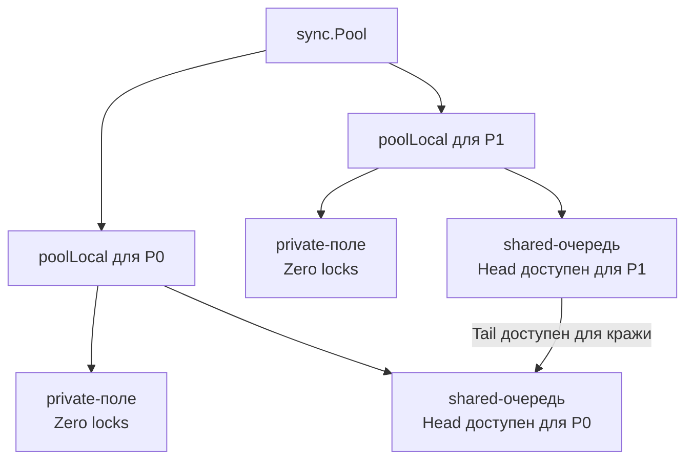

В прошлой статье [[1. Уменьшение аллокаций]] мы разобрали, как заставить компилятор оставлять объекты на стеке и почему аллокации в куче так сильно бьют по производительности. Но в реальном высоконагруженном бэкенде избежать выделения памяти в куче полностью невозможно. Чтение JSON-запросов, формирование HTTP-ответов, буферизация данных из БД — всё это требует динамической памяти.

Если мы не можем избавиться от объектов, мы должны перестать создавать их заново и начать переиспользовать. И здесь на сцену выходит главный инструмент Go-разработчика для борьбы с нагрузкой на Garbage Collector — `sync.Pool`.

## Что такое sync.Pool?

**`sync.Pool`** — это потокобезопасный пул временных объектов, встроенный в стандартную библиотеку. Его главная цель — кэшировать выделенную, но уже не используемую память, чтобы избавить GC от необходимости её убирать, а аллокатор — от необходимости выделять новую.

В отличие от классических пулов в C# или Java (где часто используют Thread-Local Storage или блокировки), `sync.Pool` тесно интегрирован с рантаймом Go, планировщиком горутин (G-M-P) и сборщиком мусора.

### Базовое использование

```go
package main

import (
	"bytes"
	"sync"
)

// Создаем пул на уровне пакета
var bufPool = sync.Pool{
	New: func() any {
		// Эта функция вызывается ТОЛЬКО если пул пуст
		// Предвыделяем буфер на 1 КБ, чтобы избежать реаллокаций
		return bytes.NewBuffer(make([]byte, 0, 1024))
	},
}

func handleRequest(data []byte) {
	// Берем объект из пула (быстрая операция)
	buf := bufPool.Get().(*bytes.Buffer)
	
	// ВАЖНО: Сбрасываем состояние объекта перед использованием!
	buf.Reset()
	
	// Гарантируем возврат объекта в пул после завершения
	defer bufPool.Put(buf)
	
	// Полезная работа
	buf.Write(data)
	_ = buf.Bytes()
}
```

Казалось бы, всё просто. Но настоящая магия `sync.Pool` скрыта "под капотом". Если вы метите на позицию Senior/Lead, вы обязаны понимать механику его работы, иначе пул может стать причиной деградации производительности.

---

## Mechanical Sympathy: Как sync.Pool избегает блокировок?

В конкурентной среде, когда тысячи горутин одновременно пытаются взять или положить объект в единый пул, классический `sync.Mutex` мгновенно стал бы узким местом (Bottleneck). Возник бы колоссальный Lock Contention.

Рантайм Go решает эту проблему за счет знания о текущем процессоре (P) из модели [[1. Scheduler Go. G-M-P модель]].

> [!info] Под капотом
> Внутри `sync.Pool` представляет собой не единую корзину, а массив локальных пулов `poolLocal`, размер которого равен `GOMAXPROCS` (количеству `P`). 
> 
> Когда горутина вызывает `Get()` или `Put()`, рантайм:
> 1. Вызывает `runtime_procPin()`. Эта функция привязывает текущую горутину к ее `P` и временно **запрещает вытеснение** (preemption). Это гарантирует, что пока горутина работает с пулом, ее не прервут и не перенесут на другой поток ОС.
> 2. Обращается к `poolLocal` конкретного `P`.
> 3. Вызывает `runtime_procUnpin()`, возвращая горутине обычный режим работы.

Каждый локальный пул (`poolLocal`) состоит из двух частей:
1. **`private`**: Одиночный объект. Доступ к нему имеет **только** текущий `P`. Это значит, что операции чтения и записи в `private` не требуют *вообще никаких* механизмов синхронизации или атомарных инструкций. Это буквально скорость работы с локальной переменной.
2. **`shared`**: Двусторонняя очередь (lock-free deque). Если `private` занят, объекты кладутся сюда. К `shared` текущего `P` могут обращаться *другие* `P` (механизм Work-stealing).

### Алгоритм работы bufPool.Get():
1. Горутина "прибивается" к текущему `P`.
2. Проверяется поле `private`. Если там есть объект, он забирается (мгновенно, без блокировок).
3. Если `private` пуст, проверяется локальная очередь `shared`.
4. Если `shared` тоже пуста, горутина пытается **украсть** (Steal) объект из хвоста очереди `shared` у *других* `P`.
5. И только если все остальные пулы пусты (или это первый вызов), вызывается функция `New()`.



Благодаря этой архитектуре, `sync.Pool` невероятно кэш-френдли. В большинстве случаев горутина получает память, которая недавно использовалась на этом же ядре процессора, а значит данные всё еще лежат в горячем L1/L2 кэше CPU!

---

## Взаимодействие с Garbage Collector (Victim Cache)

Самый частый вопрос на собеседованиях: *"Сколько живут объекты в sync.Pool?"*
Ответ: Их жизненный цикл строго контролируется сборщиком мусора (см. [[1. GC в Go. Обзор]]).

Если бы объекты в пуле жили вечно, это привело бы к утечке памяти (Memory Leak) — приложение накапливало бы память под пиковую нагрузку и никогда не отдавало её ОС.

До Go 1.13 пул полностью очищался перед каждым циклом работы GC (во время фазы Stop-The-World `poolCleanup`). Это вызывало проблему: если приложение генерировало мало мусора и GC запускался редко, пул был полезен. Но под высокой нагрузкой GC мог запускаться каждую секунду, сбрасывая все кэши пула в ноль и заставляя приложение снова аллоцировать память, что еще сильнее нагружало GC (получалась спираль смерти).

**В Go 1.13 механику изменили, внедрив понятие Victim Cache:**
Внутри пула появилось два массива: `local` (основной) и `victim` (жертвенный).
1. При запуске `poolCleanup` (перед GC) текущий массив `local` не удаляется, а копируется в массив `victim`. Основной `local` очищается.
2. При вызове `Get()`, если `local` пуст, пул пытается найти объект в `victim`.
3. При следующем цикле GC, старый `victim` очищается полностью, а новый `local` снова переходит в `victim`.

**Следствие:** Объект, положенный в `sync.Pool`, гарантированно переживет как минимум **один** цикл сборки мусора (если его не заберут раньше). Это сглаживает скачки нагрузки и не позволяет пулу "обнуляться" мгновенно.

---

> [!warning] Ловушка / Gotcha
> **Утечка памяти через Capacity больших слайсов**
> Представьте, что вы кэшируете `[]byte`. Большинство запросов весят 1 КБ, и буферы имеют `capacity` = 1024. Но вдруг приходит аномальный запрос размером 50 МБ.
> `append` расширит буфер до 50 МБ. После обработки запроса вы вызываете `buf.Reset()` (который сбрасывает `len` в 0, но оставляет `capacity` 50MB!) и делаете `Put()`.
> Теперь в вашем пуле лежит огромный кусок памяти, который никогда не вернется в ОС.
> 
> **Решение:** Всегда ограничивайте максимальный размер объекта при возврате в пул.
> ```go
> defer func() {
>     // Возвращаем в пул только если буфер не раздуло до неприличных размеров
>     if buf.Cap() <= 64*1024 { // 64 KB limit
>         bufPool.Put(buf)
>     }
> }()
> ```

---

## Паттерны и Антипаттерны

> [!tip] Собеседование
> **Вопрос:** Можно ли использовать `sync.Pool` для хранения TCP-соединений или подключений к БД (Database Connection Pool)?
> **Ответ:** КАТЕГОРИЧЕСКИ НЕТ! `sync.Pool` хранит объекты без гарантии их существования. В любой момент (при сборке мусора) объекты могут быть удалены рантаймом в произвольном порядке. Если вы положите туда TCP-сокет, GC его уничтожит, соединение оборвется некорректно, а вы даже не сможете вызвать у него `Close()`. Для соединений используйте специализированные пулы, блокируемые мьютексами или каналами.

### Когда использовать:
* Переиспользование байтовых буферов (`bytes.Buffer`, `[]byte`) для ввода/вывода (парсинг JSON, HTTP-тела).
* Переиспользование тяжелых, но stateless структур (например, контекстов парсеров, энкодеров/декодеров).
* Использование в высоконагруженных хендлерах, где профилировщик показывает значительное время, уходящее на `runtime.mallocgc`.

### Когда НЕ использовать:
* Для короткоживущих, мелких объектов. Накладные расходы на вызов `Get()` и `Put()` (атомарные операции, вызовы рантайма) могут оказаться дороже, чем простая аллокация на стеке.
* Для stateful-сущностей (сетевые соединения, открытые файлы, транзакции БД).
* Если вы не профилировали код. (См. [[1. Почему нельзя оптимизировать без измерений]]).

## Итог

Встраивание `sync.Pool` — это мощная оптимизация, которая на уровне рантайма использует все преимущества G-M-P архитектуры и локальности кэшей процессора. Однако это не серебряная пуля. Пул полезен только тогда, когда вы точно знаете, что объекты "утекают" в кучу (Heap) и создают высокое давление на GC.

В следующей статье мы поговорим о том, как применять эти знания на практике при проектировании структур данных и рассмотрим другие способы повторного использования памяти без пулов: [[3. Reuse объектов]].