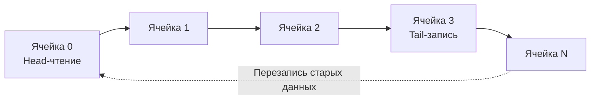

В прошлой статье мы разобрали [[2. sync Pool]] — универсальный, потокобезопасный инструмент рантайма для кэширования объектов. Однако использование `sync.Pool` — это лишь вершина айсберга под названием «переиспользование памяти». 

Архитектурный подход **Object Reuse (Переиспользование объектов)** — это фундаментальный майндсет (mindset), при котором вы проектируете структуры данных и API таким образом, чтобы минимизировать саму *потребность* в выделении новой памяти. В отличие от языков вроде PHP или Python, где разработчик привык к концепции «создал -> отдал Garbage Collector-у», в Go мы стремимся к паттерну «взял -> использовал -> очистил -> использовал снова».

В этой статье мы рассмотрим техники переиспользования памяти на уровне архитектуры приложения, структур данных и контрактов, которые позволят вашему бэкенду держать стабильный latency без скачков нагрузки на GC.

## 1. Дизайн интерфейсов: Паттерн In-place мутации

Вся стандартная библиотека Go пропитана идеей переиспользования. Самый яркий пример — интерфейс `io.Reader`.

```go
type Reader interface {
    Read(p []byte) (n int, err error)
}
```

Вместо того чтобы метод возвращал новый слайс байт при каждом чтении (как это сделано, например, в методе `stream_get_contents` в PHP или `read()` в Python), `io.Reader` **принимает** буфер извне. Это перекладывает контроль за аллокациями на вызывающую сторону (caller).

Вызывающая сторона может аллоцировать буфер один раз и переиспользовать его в цикле:

```go
// ХОРОШО: Буфер создается один раз
func processStream(r io.Reader) error {
    buf := make([]byte, 32*1024) // 32 KB на стеке (если не утекает) или в куче
    for {
        n, err := r.Read(buf)
        if n > 0 {
            // Обрабатываем ТОЛЬКО прочитанные байты: buf[:n]
            handleData(buf[:n]) 
        }
        if err == io.EOF {
            break
        }
        if err != nil {
            return err
        }
    }
    return nil
}
```

> [!tip] Собеседование
> **Вопрос:** Почему при передаче слайса `buf` в функцию `handleData(buf[:n])` мы не боимся, что старые данные (от предыдущих итераций) помешают логике?
> **Ответ:** Потому что мы ограничиваем длину (len) слайса до `n` (количества реально прочитанных байт). За пределами `len`, но в пределах `capacity` лежат "грязные" данные с прошлой итерации, но идиоматичный Go-код никогда не читает за пределами `len`. Мы перезаписываем память "поверх" (in-place).

При проектировании собственных API микросервисов старайтесь следовать этому паттерну: передавайте структуры для заполнения по указателю, вместо того чтобы возвращать новые инстансы.

## 2. Локальные пулы и Free Lists (Списки свободных блоков)

Как мы выяснили в [[2. sync Pool]], стандартный пул использует атомарные операции и привязку к G-M-P для обеспечения потокобезопасности. Но что, если мы находимся в контексте одной горутины (например, обрабатываем длинный TCP-стрим клиента или пишем игровой цикл)? Использование `sync.Pool` здесь будет оверхедом (из-за boxing'а в `interface{}` и лишней логики рантайма).

В таких случаях мы можем использовать классический **Free List** (Список свободных блоков) — паттерн из C/C++, реализованный прямо внутри наших структур.

Представим систему, которая постоянно создает и удаляет узлы графа или задачи:

```go
type Node struct {
    Data int64
    next *Node // используется как указатель в списке свободных узлов
}

type NodeManager struct {
    freeList *Node
}

// Запрашиваем узел (O-от-1, без блокировок)
func (m *NodeManager) GetNode() *Node {
    if m.freeList != nil {
        n := m.freeList
        m.freeList = n.next // сдвигаем head
        n.next = nil        // очищаем состояние
        return n
    }
    return &Node{} // Аллокация только если пул пуст
}

// Возвращаем узел (O-от-1, без блокировок)
func (m *NodeManager) PutNode(n *Node) {
    // Вставляем освобожденный узел в начало списка
    n.next = m.freeList
    m.freeList = n
}
```

Этот подход дает **Zero-allocation** профиль работы и выполняется за несколько процессорных инструкций, так как не содержит мьютексов и работает локально в кэше ядра CPU.

## 3. Ring Buffers (Кольцевые буферы)

Когда мы работаем с непрерывным потоком данных (например, агрегация метрик, буферизация логов для батч-отправки в ClickHouse, стриминг видео), аллокация объектов под каждое сообщение убьет производительность.

Идеальная структура для переиспользования в таких системах — **Ring Buffer**. Это массив фиксированного размера, который логически замкнут в кольцо. Когда мы доходим до конца, мы просто начинаем перезаписывать старые данные с начала.



**Преимущества Ring Buffer:**
1. **Единоразовая аллокация**: Мы один раз выделяем память при старте приложения (например, `make([]Event, 100000)`).
2. **Сверхбыстрый доступ**: Вычисление индекса ячейки происходит через битовое "И" (если размер массива — степень двойки: `index = counter & (size - 1)`), что выполняется за 1 такт CPU.
3. **Отсутствие фрагментации**: Вся память лежит одним непрерывным блоком, что максимально дружелюбно к префетчеру процессора (Prefetcher).

> [!warning] Ловушка / Gotcha
> При реализации кольцевых буферов (да и вообще при переиспользовании структур) обязательно обнуляйте указатели на вложенные объекты перед перезаписью ячейки! 
> Если структура содержит указатель (например, `Data *Payload`), и вы просто перезаписываете индекс кольцевого буфера, старый `Payload` останется в памяти, так как кольцевой буфер всё еще будет держать на него ссылку. Это приведет к катастрофической утечке памяти (Memory Leak).
> Обнуляйте явно: `buffer[i].Data = nil`.

## Mechanical Sympathy: Реиспользование указателей vs Плоских данных

Важно понимать, *что именно* вы переиспользуете, так как это напрямую влияет на работу сборщика мусора и производительность CPU.

С точки зрения рантайма Go, есть огромная разница между слайсом байт `[]byte` и слайсом указателей `[]*User`.
Когда мы переиспользуем память плоских данных (числа, байты, структуры без указателей), GC эту память просто игнорирует. При фазе Mark сборщик мусора видит тип `[]byte` и понимает, что внутри сканировать нечего.

Но если вы переиспользуете структуры, содержащие указатели:
1. GC вынужден сканировать весь ваш кэш/пул, чтобы построить граф достижимости. Чем больше ваш Free List, тем дольше длится сканирование.
2. При каждой перезаписи указателя внутри вашей переиспользуемой структуры рантайм вызывает специальный механизм (подробнее в [[5. Write barriers]]). Этот барьер записи добавляет накладные расходы к каждой операции присваивания, чтобы гарантировать корректность работы конкурентного сборщика мусора.

**Правило хардкорной инженерии:** Лучший объект для переиспользования — это плоский кусок памяти (`[]byte` или структуры из простых типов). Если вам нужно создать пул сложных объектов — старайтесь "расплющить" их, избавившись от вложенных указателей (используйте ID или индексы массивов вместо указателей на другие структуры).

## 4. Память Арен (Memory Arenas) — Эксперимент Go 1.20+

> [!info] Под капотом
> Для радикального решения проблемы переиспользования памяти, в Go 1.20 был представлен (в экспериментальном режиме) пакет `arena`. 
> Арена (Region-based memory management) — это подход, при котором память выделяется огромным куском (регионом). Все объекты внутри запроса (например, HTTP-запроса) аллоцируются строго внутри этой арены (быстрым сдвигом указателя, почти как на стеке). 
> А когда запрос завершается, вся Арена освобождается *целиком* одним вызовом `arena.Free()`. GC в этом процессе вообще не участвует! Это полностью убирает накладные расходы на фазы Mark & Sweep для этих объектов.
> *На данный момент функционал требует включения флага `GOEXPERIMENT=arenas`, так как может привести к панике при обращении к освобожденной памяти (Use-After-Free).*

## Итог

Переиспользование объектов — это не просто вызов пула. Это архитектурное решение.
1. Проектируйте API так, чтобы caller передавал буфер для записи (паттерн `io.Reader`).
2. Для структур внутри одного потока/горутины используйте легковесные списки свободных блоков (Free Lists) вместо `sync.Pool`.
3. Для потоковых данных используйте Ring Buffers, чтобы избежать аллокаций в принципе.
4. Помните про обнуление указателей в структурах при их переиспользовании, чтобы не обмануть GC и не создать утечку памяти.

Мы разобрали, как переиспользовать память, чтобы минимизировать аллокации. В следующей статье мы рассмотрим логичное продолжение этой темы — как правильно запрашивать память у рантайма и ОС изначально, чтобы её в принципе было что переиспользовать и мы не тратили время на ресайзинг: [[4. Предвыделение памяти]].