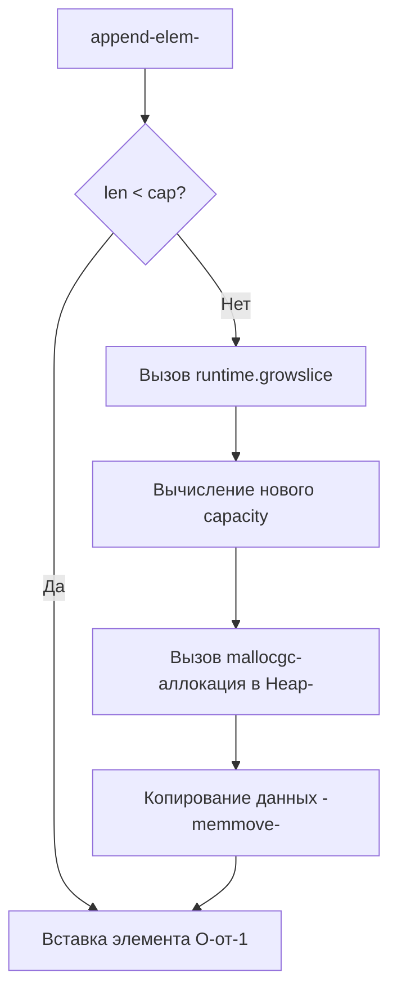

В предыдущей статье [[3. Reuse объектов]] мы говорили о том, как переиспользовать уже выделенную память. Но прежде чем что-то переиспользовать, эту память нужно правильно запросить у операционной системы и рантайма. 

Главный враг предсказуемой производительности (и причина резких скачков Tail Latency) — это **динамическое изменение размеров структур данных** (Dynamic Resizing) в процессе работы приложения. 

В языках высокого уровня (PHP, Python, JS) разработчики привыкли "просто добавлять" элементы в массив или словарь, не задумываясь о том, как это работает. В Go, если вы целитесь на уровень Senior/Lead, вы обязаны понимать механику роста коллекций и использовать **Предвыделение памяти (Preallocation)** везде, где максимальный размер данных известен или может быть предсказан.

## Mechanical Sympathy: Цена динамического роста

Когда вы добавляете элемент в массив, под капотом которого нет свободного места, процессор не может просто "докинуть" байты в конец. Память за пределами массива может быть уже занята другими объектами.

Чтобы коллекция выросла, рантайм должен:
1. Вызвать аллокатор `runtime.mallocgc` для выделения нового, более крупного непрерывного куска памяти.
2. Использовать низкоуровневую функцию `memmove` для побайтового копирования старых данных в новый блок.
3. Оставить старый блок памяти "умирать", создавая работу для фазы Mark сборщика мусора.
4. **Уничтожить кэш-линии (Cache invalidation):** CPU уже загрузил старый массив в L1/L2 кэш. Перемещение данных в новую область памяти означает, что следующие операции чтения приведут к кэш-промахам (Cache Misses).

Рассмотрим, как это происходит в главных встроенных типах Go.

---

## 1. Слайсы и коварство runtime.growslice

Слайс в Go — это структура из трех полей (24 байта на x64): указатель на базовый массив `array`, текущая длина `len` и вместимость `cap`.

При вызове `append`, рантайм проверяет: `len < cap`. Если это так, элемент просто записывается в ячейку памяти по смещению, а `len` инкрементируется. Это операция $O(1)$, стоящая пару тактов процессора.

Но если `len == cap`, компилятор вставляет вызов функции `runtime.growslice`.



> [!info] Под капотом
> До версии Go 1.18 алгоритм роста был жестким: если элементов меньше 1024, `cap` удваивается (x2). Если больше — растет на 25% (x1.25). 
> **Начиная с Go 1.18** алгоритм сделали более плавным (функция `nextslicecap`). Переход от x2 к x1.25 стал постепенным для размеров от 256 элементов. Это было сделано, чтобы уменьшить фрагментацию и перерасход памяти (Over-allocation) при создании больших слайсов.

**Как применять:**
Если вы знаете итоговый размер (например, делаете `map` по слайсу пользователей), **всегда** указывайте `capacity`.

```go
// ПЛОХО: O-от-N аллокаций и копирований
func getUserIDs(users []User) []int64 {
    var ids []int64
    for _, u := range users {
        ids = append(ids, u.ID) // Скрытые аллокации здесь!
    }
    return ids
}

// ХОРОШО: 1 аллокация, 0 копирований массивов
func getUserIDs(users []User) []int64 {
    ids := make([]int64, 0, len(users)) // Предвыделение cap
    for _, u := range users {
        ids = append(ids, u.ID)
    }
    return ids
}
```

> [!warning] Ловушка / Gotcha
> Одна из самых частых ошибок на код-ревью — перепутать `len` и `cap` при предвыделении.
> ```go
> // ОШИБКА:
> ids := make([]int64, len(users)) // создает слайс, где len И cap равны N. Все элементы = 0.
> for _, u := range users {
>     ids = append(ids, u.ID) // append добавит элементы В КОНЕЦ, начиная с индекса N!
> }
> ```
> Вы получите слайс длиной `2 * N`, где первая половина — нули. Правильно: `make([]T, 0, expectedCapacity)` для `append`, или `make([]T, expectedLen)` если вы пишете по индексам `ids[i] = u.ID`. Писать по индексам, кстати, чуть-чуть быстрее, чем `append`, так как убираются проверки границ (bounds checking).

---

## 2. Мапы (Maps) и дорогая эвакуация

Структура `map` в Go (внутри это `hmap`) — это хеш-таблица, массив "бакетов" (`bmap`), каждый из которых вмещает до 8 пар ключ-значение.

Когда мапа заполняется, рантайм отслеживает метрику **Load Factor** (коэффициент заполнения). В Go критический порог Load Factor равен **6.5** (в среднем 6.5 элементов на каждый бакет). Как только порог превышен, рантайм запускает **Эвакуацию (Evacuation)**.

Эвакуация — это катастрофа для latency:
1. Выделяется новый массив бакетов, в 2 раза превышающий старый.
2. В старом массиве ставится флаг эвакуации.
3. При каждом последующем чтении/записи (insert/delete/update) рантайм берет 1-2 бакета из старой памяти, пересчитывает хеши всех их ключей и перемещает в новую память (Incremental Evacuation).

Это сделано инкрементально, чтобы избежать огромных Stop-The-World пауз, но это "размазывает" деградацию производительности (CPU throttle) на множество операций.

**Как применять:**
Функция `make` для мапы принимает второй аргумент — ожидаемое количество элементов (hint). 

```go
// ПЛОХО: Неизвестно сколько элементов, будет эвакуация
m := make(map[string]User)

// ХОРОШО: Рантайм выделит правильное количество бакетов СРАЗУ
m := make(map[string]User, 10000)
```

> [!info] Под капотом
> Обратите внимание: `10000` в `make(map, hint)` — это **не количество бакетов**. Это количество **элементов**, которое вы собираетесь туда положить. Рантайм сам разделит это число на 6.5 и найдет ближайшую степень двойки, чтобы выделить нужное количество памяти под бакеты, гарантируя, что при вставке 10000 элементов эвакуация не произойдет.

---

## 3. strings.Builder и bytes.Buffer

Конкатенация строк через оператор `+` — известная проблема. Так как строки в Go иммутабельны, операция `str3 := str1 + str2` всегда выделяет новую память размером `len(str1) + len(str2)` и копирует туда обе строки. В цикле это дает сложность $O(N^2)$ и лавину мусора.

Для эффективной конкатенации используют `strings.Builder`. Под капотом у него обычный слайс байт `[]byte`, который мутируется, а при вызове `String()` возвращается через `unsafe` преобразование (без аллокаций копирования).

Но слайс внутри `strings.Builder` тоже растет через `growslice`! Если вы собираете большой JSON или SQL-запрос руками, `Builder` будет постоянно реаллоцировать свой буфер.

**Как применять:**
Используйте метод `Grow()`, который сразу выделяет нужный `capacity` под капотом.

```go
func buildQuery(columns []string, table string) string {
    var sb strings.Builder
    
    // Предвычисляем примерный размер (экономим аллокации в цикле)
    expectedSize := len(table) + 30 // Базовый запрос
    for _, col := range columns {
        expectedSize += len(col) + 2 // Столбцы + запятые
    }
    
    // Предвыделение
    sb.Grow(expectedSize) 
    
    sb.WriteString("SELECT ")
    for i, col := range columns {
        sb.WriteString(col)
        if i < len(columns)-1 {
            sb.WriteString(", ")
        }
    }
    sb.WriteString(" FROM ")
    sb.WriteString(table)
    
    return sb.String()
}
```

> [!tip] Собеседование
> **Вопрос:** В чем разница между `strings.Builder` и `bytes.Buffer`, и почему первый предпочтительнее для сборки строк?
> **Ответ:** Вызов `bytes.Buffer.String()` выполняет аллокацию и копирует весь `[]byte` в новую иммутабельную строку. `strings.Builder` спроектирован так, чтобы его метод `String()` возвращал строку zero-copy (с помощью `unsafe`), заимствуя базовый массив байт. Но расплата за это — `Builder` запрещено копировать по значению (возникнет паника из-за механизма защиты `noCopy`).

---

## Итог

1. Предвыделение (`make` с `capacity`) — самый дешевый и эффективный способ ускорить код. Он требует только знания бизнес-логики и нуля внешних зависимостей.
2. Не путайте `len` и `cap` при инициализации слайсов (передавайте `0` вторым аргументом для `append`).
3. Для `map` второй аргумент в `make` указывает ожидаемое число ключей. Это защищает приложение от процессорного голодания из-за инкрементальной эвакуации.
4. Используйте `Grow(n)` для `strings.Builder` и `bytes.Buffer`.

Знание о том, как аллоцируется память — это база. Однако, сама форма данных, которые мы аллоцируем, играет не менее важную роль. Как расположение полей в структуре может сэкономить 30% оперативной памяти и ускорить выполнение в разы за счет кэшей процессора? Об этом поговорим в следующей статье: [[5. Оптимизация структур данных]].