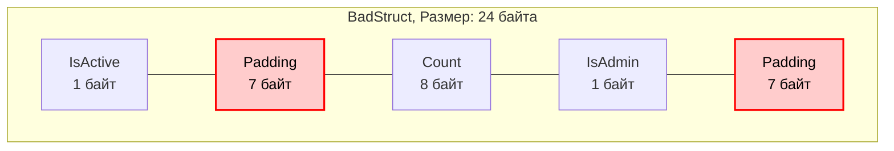

В предыдущих статьях ([[1. Уменьшение аллокаций]] и [[4. Предвыделение памяти]]) мы научились контролировать *количество* выделяемой памяти и жизненный цикл объектов. Но не менее важно то, как именно эти объекты располагаются в оперативной памяти физически. 

В языках с виртуальными машинами (Java, C#) расположение полей в объекте часто оптимизируется самой VM (например, JIT-компилятором) во время выполнения. В Go структура в памяти выглядит ровно так, как вы описали её в коде. Компилятор не меняет порядок полей за вас. И это возлагает ответственность за **Data Structure Optimization** на плечи разработчика.

Неправильный порядок полей в структуре может привести к потере 30-40% оперативной памяти "в никуда" и замедлению работы из-за неэффективного использования кэшей процессора.

## Mechanical Sympathy: Выравнивание памяти (Memory Alignment)

Современные процессоры не читают оперативную память по одному байту. Они читают её "машинными словами" (Words). На 64-битной архитектуре (x86-64, ARM64) размер машинного слова равен 8 байтам.

Представьте, что вы положили 8-байтное число (например, `int64`) по адресу, который не кратен 8 (например, начиная с 3-го байта). Чтобы прочитать это число, процессору придется сделать **два** обращения к оперативной памяти (прочитать первое слово, прочитать второе слово), отбросить лишнее, склеить нужные куски в регистре и только потом начать вычисления. Это называется *Unaligned Memory Access*. На некоторых архитектурах (например, старых ARM) это вообще вызывает аппаратную ошибку (Hardware Fault) и панику приложения.

Чтобы избежать этого штрафа, компилятор Go делает **Выравнивание памяти (Memory Alignment)**. Он гарантирует, что переменные определенных типов всегда начинаются с адресов, кратных их размеру (или размеру машинного слова).
* `bool` (1 байт) — может лежать где угодно.
* `int32` (4 байта) — адрес должен быть кратен 4.
* `int64`, указатели, интерфейсы (8 байт) — адрес должен быть кратен 8.

## Padding (Заполнение): Куда утекает память

Чтобы соблюсти правила выравнивания при последовательном объявлении полей в структуре, компилятор вставляет между ними пустые "мертвые" байты — **Padding**.

Посмотрим на классический пример неудачной структуры:

```go
import "unsafe"

type BadStruct struct {
    IsActive bool    // 1 байт
    Count    int64   // 8 байт
    IsAdmin  bool    // 1 байт
}

// unsafe.Sizeof(BadStruct{}) вернет 24 байта!
```

Почему 24 байта, если полезных данных всего на 10 байт (1 + 8 + 1)?

1. `IsActive` занимает 1 байт.
2. Следующее поле `Count` требует выравнивания по 8 байтам. Компилятор добавляет **7 байт паддинга**.
3. `Count` занимает свои 8 байт.
4. `IsAdmin` занимает 1 байт.
5. *Завершающий паддинг*: размер всей структуры также должен быть кратен размеру её самого большого поля (8 байт), чтобы при создании массива `[]BadStruct` элементы тоже были выровнены. Компилятор добавляет еще **7 байт паддинга** в конец.



Если у вас в памяти висит кэш на 1 миллион таких объектов, вы впустую тратите **14 Мегабайт** оперативной памяти.

## Правило оптимизации: Сортировка по убыванию размера

Решение проблемы элементарно — группируйте поля так, чтобы минимизировать пробелы. Самый простой и безотказный паттерн: **Сортируйте поля по убыванию их размера**.

```go
type GoodStruct struct {
    Count    int64   // 8 байт
    IsActive bool    // 1 байт
    IsAdmin  bool    // 1 байт
}

// unsafe.Sizeof(GoodStruct{}) вернет 16 байт.
```

Как это ложится в память теперь?
1. `Count` (8 байт).
2. `IsActive` (1 байт).
3. `IsAdmin` (1 байт).
4. Завершающий паддинг для кратности 8 — добавляется **6 байт** в конец.

Мы сэкономили 33% памяти простым переносом строки кода!

> [!tip] Собеседование
> **Вопрос:** Нужно ли всегда маниакально сортировать поля во всех структурах проекта?
> **Ответ:** Нет. Читаемость кода важнее микрооптимизаций. Сортировать поля имеет смысл только для тех структур, которые будут инстанцироваться в огромных количествах (сотни тысяч и миллионы объектов в слайсах или мапах). Для конфигурационных структур (которые создаются в единственном экземпляре при старте приложения) логическая группировка полей гораздо важнее экономии пары десятков байт.

Для автоматизации этого процесса в экосистеме Go есть стандартный линтер. Вы можете проверить свои проекты утилитой `fieldalignment`:
```bash
go install golang.org/x/tools/go/analysis/passes/fieldalignment/cmd/fieldalignment@latest
fieldalignment ./...
```

## Магия struct{} (Пустая структура)

Отдельного упоминания заслуживает тип `struct{}` (пустая структура). Её размер равен **0 байт**. Она не требует выравнивания, не занимает места в памяти и не генерирует мусор для GC.

Это делает пустую структуру идеальным инструментом для двух паттернов:

### 1. Сигнальные каналы (Semaphores / Signals)
Если вам нужен канал исключительно для уведомления горутины о событии (например, `done chan struct{}`), использование `chan bool` или `chan int` будет тратить память на передачу ненужных значений. `chan struct{}` передает "ничто", сигнализируя самим фактом события.

### 2. Реализация Set (Множества)
В Go нет встроенного типа Set. Идиоматичный способ его реализации — использование `map[Type]struct{}`.

```go
// ХОРОШО: map как множество, значения не занимают память
visited := make(map[string]struct{})
visited["user_1"] = struct{}{} // Вставка
if _, exists := visited["user_1"]; exists { ... } // Проверка

// ПЛОХО: Использование bool тратит 1 байт на каждое значение
visitedBad := make(map[string]bool)
```

> [!info] Под капотом
> Почему `struct{}{}` занимает 0 байт? Как рантайм понимает, где она лежит?
> В исходниках рантайма Go (`runtime/malloc.go`) есть специальная глобальная переменная `zerobase` размером 8 байт. Все аллокации объектов нулевого размера (пустые структуры, пустые массивы `[0]int`) **всегда** возвращают указатель на эту единую переменную `zerobase`. 

> [!warning] Ловушка / Gotcha
> Из-за механики `zerobase` возникает интересный корнер-кейс с указателями, который любят спрашивать на интервью уровня Middle/Senior:
> ```go
> a := struct{}{}
> b := struct{}{}
> fmt.Println(&a == &b) 
> ```
> Что выведет этот код? Спецификация Go говорит: *"Pointers to distinct zero-size variables may or may not be equal"*. 
> На практике, если переменные "утекают" в кучу (Escape Analysis), рантайм выдаст им одинаковый адрес `zerobase`, и сравнение вернет `true`. Но если компилятор оставит их на стеке, они могут получить разные адреса, и результат будет `false`! Никогда не завязывайте логику приложения на сравнение указателей пустых структур.

## Итог

1. Порядок полей в структуре напрямую влияет на её размер из-за выравнивания памяти (Memory Alignment) и паддинга.
2. Для структур, которые хранятся в памяти в больших количествах, применяйте правило: "поля сортируются от большего к меньшему".
3. Используйте `struct{}` для сигнальных каналов и реализации структур данных типа Set, чтобы добиться Zero-allocation профиля по значениям.

Оптимизируя размер структуры, мы решаем проблему потребления RAM (Capacity). Но размер структуры — это лишь половина дела. То, как эта структура будет обрабатываться процессором при итерации по массивам, зависит от размера кэш-линий процессора и наличия False Sharing. Об этом — в нашей следующей статье: [[6. Cache friendly структуры]].