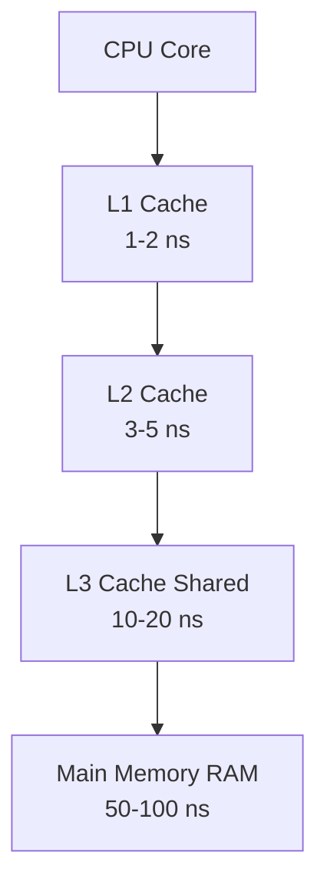

В прошлой статье [[5. Оптимизация структур данных]] мы научились экономить оперативную память (RAM), правильно выравнивая поля структур. Мы оптимизировали потребление памяти на уровне мегабайт и гигабайт. Но в хардкорной инженерии есть правило: **мало разместить данные в памяти, нужно еще и быстро их оттуда прочитать**.

Современный процессор работает на частотах в 3-5 GHz. Одна базовая инструкция выполняется за доли наносекунды. При этом обращение к оперативной памяти (Main Memory) занимает от 50 до 100 наносекунд. С точки зрения процессора, поход в RAM — это ожидание длиною в вечность.

Чтобы процессор не простаивал, придуманы кэши: L1, L2 и L3. Написание кода, который максимизирует использование этих кэшей (Cache Friendliness) — это вершина [[5. Mechanical sympathy в backend разработке]].

## Mechanical Sympathy: Кэш-линии и Префетчер

Когда вы читаете переменную `x` типа `int32` (4 байта) из памяти, процессор **не читает 4 байта**. Он спускается в RAM и забирает оттуда целый блок в **64 байта** (в большинстве современных архитектур), который называется **Кэш-линией (Cache Line)**. 

Вместе с переменной `x` процессор "бесплатно" загружает в кэш L1 соседние 60 байт, лежащие физически рядом с `x`. 

Кроме того, в процессоре есть аппаратный предсказатель — **Prefetcher**. Если он замечает, что вы читаете данные последовательно (адрес 0, затем 64, затем 128), он понимает: *"Ага, это цикл по массиву!"* и начинает загружать следующие кэш-линии в L1 *до того*, как ваш код их запросит.



Ваша задача как инженера — располагать данные так, чтобы каждый загруженный 64-байтный блок был использован на 100%, а префетчер угадывал ваши намерения. Это называется **Пространственной локальностью (Spatial Locality)**.

---

## 1. Слайсы значений против Слайсов указателей

Это самая частая ловушка в Go. Переходники с Java/PHP привыкли, что всё является ссылкой, и по инерции создают массивы указателей.

```go
// ПЛОХО: Слайс указателей
users := make([]*User, 1000)

// ХОРОШО: Слайс значений
users := make([]User, 1000)
```

**Почему слайс указателей — это выстрел в ногу для кэша?**
`[]*User` — это непрерывный массив 8-байтных адресов. Когда процессор читает первый указатель, он загружает кэш-линию с 8 указателями. Но чтобы получить *сами данные* пользователя (поля структуры), процессор должен разыменовать этот указатель и сходить по адресу в кучу (Heap). 
А в куче эти объекты раскиданы в хаотичном порядке аллокатором. Префетчер сходит с ума, пространственная локальность равна нулю, вы ловите **Cache Miss** (кэш-промах) на каждой итерации цикла.

`[]User` — это непрерывный массив самих структур. Если структура занимает 32 байта, в одну кэш-линию влезает ровно 2 пользователя. Процессор читает память идеально линейно, на максимальной скорости шины памяти, не делая лишних прыжков по куче.

> [!tip] Собеседование
> **Вопрос:** В каких случаях все-таки стоит использовать `[]*User` вместо `[]User`?
> **Ответ:** 1. Если размер самой структуры `User` огромен (например, 1 КБ и больше), копирование по значению при `append` или передаче в функции убьет производительность. 2. Если объекты шарятся между разными коллекциями, и их мутация в одной должна отражаться везде. 3. Если требуется поддержка `nil` для обозначения "пустого" слота. Во всех остальных случаях для массовой обработки (batch processing) выбирайте слайсы значений.

---

## 2. Матрицы: Строки против Столбцов

Классический тест на понимание работы кэша. Двумерный массив в Go (например, `matrix [1000][1000]int64`) в оперативной памяти лежит как один длинный плоский кусок. Элементы одной строки лежат рядом.

```go
// ПЛОХО: Итерация по столбцам (Column-major)
func sumCols(m [][]int64) int64 {
    var sum int64
    for j := 0; j < len(m[0]); j++ {
        for i := 0; i < len(m); i++ {
            // Прыгаем на тысячи байт вперед на каждой итерации
            sum += m[i][j] 
        }
    }
    return sum
}

// ХОРОШО: Итерация по строкам (Row-major)
func sumRows(m [][]int64) int64 {
    var sum int64
    for i := 0; i < len(m); i++ {
        for j := 0; j < len(m[0]); j++ {
            // Читаем непрерывный кусок памяти, префетчер счастлив
            sum += m[i][j] 
        }
    }
    return sum
}
```

В варианте "ПЛОХО" мы читаем 1-й элемент из строки, загружая 64 байта в кэш. Но следующий нужный нам элемент находится в *другой* строке, далеко за пределами этой кэш-линии. Кэш-линия отбрасывается (мы использовали лишь 8 байт из 64). Это приводит к падению скорости в 10-20 раз на больших массивах.

---

## 3. Data-Oriented Design: AoS vs SoA

В классическом ООП мы проектируем данные так, как они выглядят в реальном мире. Это называется **AoS (Array of Structs)**. 

Представьте высоконагруженный кэш сессий (например, авторизационный сервис), где фоновая горутина должна каждую секунду пробегать по 1 миллиону сессий и удалять просроченные.

```go
// AoS - Массив структур
type Session struct {
    ID        [16]byte // 16 байт
    UserID    int64    // 8 байт
    ExpiresAt int64    // 8 байт
    Payload   [96]byte // 96 байт
} // Итого: 128 байт (ровно 2 кэш-линии)

func cleanup(sessions []Session, now int64) {
    for i := range sessions {
        if sessions[i].ExpiresAt < now { // Нам нужно только одно поле!
            // удаление...
        }
    }
}
```

Каждая сессия занимает 2 кэш-линии. Чтобы прочитать поле `ExpiresAt`, мы вынуждены "затаскивать" в кэш L1 процессора огромный `Payload`, `ID` и `UserID`, которые нам в этом цикле **вообще не нужны**. Мы забиваем драгоценный кэш мусором.

Продвинутый паттерн для высоконагруженных вычислений — **SoA (Struct of Arrays)**. Мы разбиваем поля по отдельным массивам.

```go
// SoA - Структура массивов
type Sessions struct {
    IDs        [][16]byte
    UserIDs    []int64
    ExpiresAts []int64 // Непрерывный массив int64
    Payloads   [][96]byte
}

func cleanup(s *Sessions, now int64) {
    for i := range s.ExpiresAts {
        if s.ExpiresAts[i] < now {
            // 8 элементов int64 идеально ложатся в одну 64-байтную кэш-линию!
            // удаление по индексу i из остальных массивов...
        }
    }
}
```

При подходе SoA проверка `ExpiresAt` выполняется в десятки раз быстрее, так как процессор загружает за раз 8 значений `ExpiresAt` в одну кэш-линию, и префетчер работает идеально. Этот паттерн массово используется в GameDev (ECS - Entity Component System) и системах финансового трейдинга.

---

## 4. Изоляция кэш-линий (Padding) против False Sharing

В многопоточной среде кэш-линии могут стать вашим врагом. Мы подробно разбирали этот феномен в статьях [[8. False sharing]] и [[9. Cache line и выравнивание]].

Краткое напоминание: если две разные горутины, работающие на разных ядрах CPU, активно модифицируют две *разные* переменные, но эти переменные оказались физически рядом в памяти (внутри одной 64-байтной кэш-линии), процессоры начнут бесконечно инвалидировать кэши друг друга по протоколу MESI. Это называется **False Sharing**.

Чтобы структура стала по-настоящему Cache Friendly в конкурентной среде, горячие поля нужно искусственно разнести по разным кэш-линиям с помощью пустых байтов (Padding):

```go
import "golang.org/x/sys/cpu"

type Metrics struct {
    // Ядро 1 инкрементирует счетчик запросов
    Requests uint64 
    
    // Добавляем 56 пустых байт (64 - 8). 
    // Теперь Errors гарантированно лежит в другой кэш-линии!
    _ [56]byte 
    
    // Ядро 2 инкрементирует счетчик ошибок
    Errors   uint64 
}

// Или более идиоматичный вариант через пакет golang.org/x/sys/cpu:
type MetricsPro struct {
    Requests uint64
    _        cpu.CacheLinePad
    Errors   uint64
}
```

> [!warning] Ловушка / Gotcha
> Не добавляйте `cpu.CacheLinePad` везде подряд. Это нужно делать *только* в специфичных случаях: счетчики метрик, lock-free структуры (ring buffers), где идет интенсивная параллельная запись. В обычных структурах данных паддинг просто впустую сожрет оперативную память (см. предыдущую статью).

## Итог

1. **Кэш-линия (64 байта)** — минимальный квант чтения памяти процессором. Оптимизируйте структуры так, чтобы полезные данные читались плотными блоками.
2. Предпочитайте **слайсы значений** (`[]T`), а не слайсы указателей (`[]*T`), чтобы сохранять пространственную локальность и не напрягать префетчер прыжками по куче.
3. Для тяжелых аналитических циклов и пакетной обработки (batching) применяйте паттерн **Struct of Arrays (SoA)**.
4. Помните про **False Sharing** при проектировании конкурентных структур данных.

Мы разобрали, как выжать максимум из железа, оптимизируя формы данных. Но иногда лучший способ ускорить код — это убрать из него слой «умных» механизмов, которые были добавлены "для красоты" или "на будущее". В следующей статье мы поговорим о том, как интерфейсы, reflection и лишние уровни косвенности убивают производительность: [[7. Удаление лишних абстракций]].