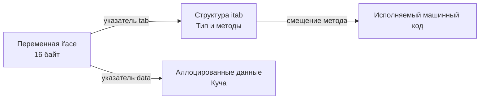

## Цена "Чистого кода" и ООП-наследия

Когда разработчики приходят в Go из миров Java, C# или PHP, они часто приносят с собой багаж паттернов проектирования "Кровавого Энтерпрайза". Они строят абстрактные фабрики, заворачивают каждый чих в интерфейс для "будущей расширяемости" и создают луковую архитектуру из 5-7 слоев (Controller -> Service -> UseCase -> Repository -> DB). 

Для бизнес-логики и тестируемости это кажется правильным. Но с точки зрения высоконагруженной хардкорной инженерии (Highload & Performance), **любая абстракция имеет физическую цену на уровне процессора и памяти**.

Go — это статически компилируемый язык (AOT - Ahead-Of-Time). В отличие от Java, где гениальный JIT-компилятор (HotSpot) может во время выполнения проанализировать вызовы, сделать девиртуализацию интерфейса и заинлайнить код, компилятор Go работает на этапе сборки. Если вы скрыли конкретный тип за интерфейсом, компилятор Go разводит руками и генерирует медленный путь выполнения.

В этой статье мы разберем, когда абстракции нужно безжалостно удалять ради производительности.

---

## 1. Интерфейсы и Динамическая диспетчеризация (Dynamic Dispatch)

Интерфейсы — это главная абстракция в Go. Но вызов метода через интерфейс обходится дороже, чем вызов метода у конкретной структуры.

> [!info] Под капотом
> Интерфейс в памяти (структура `iface`) занимает 16 байт и содержит два указателя:
> 1. `tab` — указатель на таблицу методов `itab` (Interface Table).
> 2. `data` — указатель на сами данные в куче (Heap).
> 
> Когда вы вызываете `user.Save()`, где `user` — это интерфейс `UserRepository`, процессор выполняет **Косвенный вызов (Indirect Call)**:
> 1. Читает `iface`.
> 2. Идет по указателю `tab` в `itab`.
> 3. Ищет там нужный адрес функции (смещение).
> 4. Выполняет прыжок (Jump) по этому адресу, передавая `data` как первый аргумент (receiver).



**Штрафы за динамическую диспетчеризацию:**
1. **Cache Miss:** Переходы по указателям `tab` и `data` — это прыжки по памяти, которые убивают локальность данных, о которой мы говорили в статье [[6. Cache friendly структуры]].
2. **Branch Misprediction:** Процессор не может заранее предсказать, код какого конкретно типа будет вызван, что ломает конвейер (pipeline) предсказателя ветвлений.
3. **Провал инлайнинга:** Компилятор не может встроить (inline) тело функции в место вызова, так как на этапе компиляции не знает, какая именно реализация будет подставлена.
4. **Escape Analysis:** Передача значения в интерфейс почти всегда заставляет компилятор отправить эту переменную в кучу (возникает аллокация и нагрузка на GC), так как поле `data` внутри `iface` может хранить только указатель. Это тот самый Boxing, описанный в [[1. Уменьшение аллокаций]].

**Решение:** Если у интерфейса ровно одна реализация, и вы используете его *только* ради мокирования в тестах — подумайте дважды. В горячих (hot paths) путях исполнения (парсинг протоколов, сетевой I/O, обработка каждого пикселя/байта) возвращайте и принимайте **конкретные типы**, а не интерфейсы.

---

## 2. Generics (Дженерики) как замена Boxing-у

До Go 1.18, чтобы написать универсальный код для разных типов данных (например, кеш или структура данных), разработчики повсеместно использовали пустой интерфейс `interface{}` (ныне `any`). 

Использование `any` означало потерю типобезопасности и 100% гарантию упаковки (Boxing) данных в кучу. Каждое чтение требовало приведения типов (Type Assertion), что стоит CPU-циклов.

С появлением дженериков мы получили механизм **Мономорфизации (Monomorphization)** (с некоторыми оговорками реализации Go, которая использует гибридный подход — stenciling с dictionaries).

```go
// ПЛОХО: Использование абстракции any
// Вызывает аллокацию при передаче числа и Type Assertion при чтении
type AnyStack struct {
    data []any
}
func (s *AnyStack) Push(v any) { s.data = append(s.data, v) }


// ХОРОШО: Использование Generics
// Никаких аллокаций для базовых типов. Строгая типизация.
type GenericStack[T any] struct {
    data []T
}
func (s *GenericStack[T]) Push(v T) { s.data = append(s.data, v) }
```

> [!tip] Собеседование
> **Вопрос:** Могут ли дженерики в Go быть медленнее, чем интерфейсы?
> **Ответ:** Да, в некоторых краевых случаях компиляции. Go не всегда создает полную копию кода для каждого типа (как шаблоны в C++), чтобы не раздувать бинарник. Для интерфейсов и указателей (pointers) генерируется одна общая реализация, использующая скрытый словарь (dictionary) для вызова нужных методов. Это добавляет уровень косвенности. Но для структур (value types) компилятор использует stenciling (генерацию уникального кода), что работает быстрее и позволяет инлайнинг.

---

## 3. Рефлексия (Reflection) — абстракция с максимальным штрафом

Пакет `reflect` позволяет писать максимально универсальный код, который инспектирует структуры во время выполнения (runtime). Это основа таких пакетов, как `encoding/json` или `gorm`.

С точки зрения производительности, рефлексия — это катастрофа.
1. Все аргументы для `reflect.ValueOf` или `reflect.TypeOf` упаковываются в пустые интерфейсы (аллокация).
2. Вызов методов и доступ к полям происходит через длинные цепочки проверок типов и указателей в рантайме.
3. Код становится абсолютно непрозрачным для статических анализаторов и оптимизатора компилятора.

**Как удалять:** Заменяйте рефлексию на **Кодогенерацию (Code Generation)**.
Вместо стандартного `encoding/json`, который при каждом HTTP-запросе через `reflect` изучает, какие поля есть в вашей структуре, используйте библиотеки вроде `easyjson` или `ffjson`. 

Они генерируют конкретный Go-код (конкретные парсеры байт под конкретные структуры) до компиляции приложения (через `go generate`). Этот код работает строго с типами, не делает аллокаций на рефлексию и работает в 3-5 раз быстрее, потребляя кратно меньше памяти.

---

## 4. Архитектурный оверхед: "Слои ради слоев"

Рассмотрим типичный запрос на чтение профиля пользователя по ID.

В перегруженной абстракциями архитектуре путь выглядит так:
`HTTP Handler` -> `UserService (Interface)` -> `UserUseCase (Interface)` -> `UserRepository (Interface)` -> `PostgresDriver`.

Каждый слой оборачивает ошибку, перекладывает данные из DTO-структуры хендлера в Доменную структуру, затем в структуру БД. Каждое перекладывание — это аллокация новой структуры и потенциальная нагрузка на сборщик мусора. Вызовы через 3 интерфейса подряд сводят на нет любые попытки компилятора оптимизировать этот путь.

**Mechanical Sympathy подход:**
Если ваш микросервис делает простой проброс данных из базы в JSON (CRUD) — **удалите промежуточные слои**. Вызывайте конкретную реализацию хранилища прямо из обработчика или сервисного слоя. Смело читайте данные из БД напрямую в DTO-структуру, чтобы избежать промежуточных аллокаций. 

Go спроектирован так, чтобы код был "плоским" (Flat) и читаемым. Idiomatic Go (идиоматичный Go) предпочитает небольшое дублирование кода неправильной абстракции: *"A little copying is better than a little dependency."*

---

## Итог

1. **Интерфейсы стоят денег**: Каждый вызов интерфейса — это косвенный вызов, убивающий инлайнинг и ломающий предсказание ветвлений. Используйте их на границах систем или для мокирования, но не в горячих циклах внутри бизнес-логики.
2. **Generics вместо `any`**: Заменяйте `interface{}` на дженерики для структур данных и утилитарных функций.
3. **Кодогенерация вместо Reflection**: Если вам нужно динамическое поведение для типов, сгенерируйте код (например, `go generate`) вместо использования пакета `reflect`.
4. **Меньше слоев**: Если архитектурный слой ничего не делает, кроме проброса вызова к следующему слою — это лишняя абстракция. Удаляйте её.

Удаляя абстрактные слои, мы позволяем компилятору Go видеть наш код насквозь. А когда компилятор видит, кто кого вызывает напрямую, он может применить свое самое мощное оружие оптимизации. Об этом фундаментальном механизме мы поговорим в следующей статье: [[8. Inline оптимизации]].