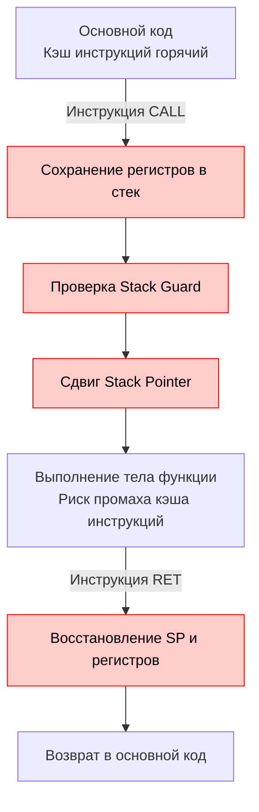

В прошлой статье [[7. Удаление лишних абстракций]] мы выяснили, что интерфейсы и лишние архитектурные слои ломают возможность компилятора оптимизировать код, так как он не видит конкретную реализацию за динамической диспетчеризацией. 

Но что именно делает компилятор, когда *видит* прямой вызов функции? Он применяет свое самое мощное оружие — **Инлайнинг (Inlining / Встраивание)**.

Для бэкенд-разработчика, пишущего высоконагруженный код, инлайнинг — это не просто "фича языка", это фундаментальный механизм, вокруг которого строится проектирование горячих путей (hot paths) выполнения.

## Mechanical Sympathy: Цена вызова функции

В высокоуровневых языках принято считать, что вызов функции бесплатен. С точки зрения железа это далеко не так.

Когда процессор встречает ассемблерную инструкцию `CALL` (вызов подпрограммы), происходит целый ряд системных событий:
1. **Сохранение контекста**: Текущие значения регистров процессора (Instruction Pointer, Base Pointer) нужно сохранить в стек.
2. **Прыжок (Jump)**: Процессор меняет адрес выполнения и прыгает в другой участок памяти, где лежит машинный код вызываемой функции.
3. **Cache Miss**: Так как код функции лежит в другом месте, он может отсутствовать в L1-кэше инструкций (Instruction Cache). Процессор простаивает, ожидая загрузки кода из L2/L3 или RAM.
4. **Пролог и Эпилог**: Внутри функции Go-рантайм должен выполнить проверку на переполнение стека (Stack Guard) и сдвинуть указатель стека (`SP`) для выделения фрейма под локальные переменные. При возврате (`RET`) всё происходит в обратном порядке.


*Красные блоки — это накладные расходы (оверхед), которых можно избежать.*

**Инлайнинг** решает эту проблему радикально: компилятор берет тело вызываемой функции и буквально "вклеивает" его в место вызова на этапе компиляции. Инструкции `CALL` и `RET` исчезают, стек-фрейм не создается, кэш инструкций работает идеально.

## Бюджет инлайнинга в Go

В отличие от C++ с его ключевым словом `inline`, в Go программист не может принудительно заставить компилятор заинлайнить функцию (есть прагма `//go:noinline` для запрета, но нет обратной). Компилятор решает всё сам на основе эвристики и "стоимости".

> [!info] Под капотом
> При разборе исходного кода компилятор Go строит AST-дерево (Abstract Syntax Tree). Каждому узлу дерева (операции присваивания, вызовы, условия) присваивается "стоимость" (обычно 1 узел = 1 условная единица бюджета).
> На данный момент **лимит (бюджет) инлайнинга составляет 80 единиц**. Если функция превышает этот порог по сложности — компилятор отказывается её встраивать, чтобы бинарный файл не раздулся до неадекватных размеров (Instruction Cache Bloat).

**Что моментально убивает инлайнинг (превышает бюджет или запрещено компилятором):**
* Большие функции с множеством условий и локальных переменных.
* Вызовы `panic()` и `recover()`.
* Сложные циклы `for` и `select` (хотя с Go 1.22 компилятор научился инлайнить некоторые простые циклы).
* Вызовы через интерфейсы (без использования PGO).

Вы можете проверить, какие функции заинлайнились, передав флаг `gcflags` при сборке:
```bash
# Флаг -m выводит решения оптимизатора. Двойной -m -m дает больше деталей
go build -gcflags="-m -m" main.go
```
Вы увидите строки вида: `can inline calculateSum with cost 32 as: ...` или `cannot inline complexFunc: function too complex: cost 114 exceeds budget 80`.

---

## Синергия оптимизаций: Inline + Escape Analysis

Самое важное свойство инлайнинга — это не просто экономия на `CALL`. Инлайнинг является **катализатором для других оптимизаций**, в первую очередь для Escape Analysis (о котором мы говорили в [[3. Escape analysis]]).

Представьте код:
```go
func NewUser(id int) *User {
    u := User{ID: id}
    return &u
}

func process() {
    user := NewUser(42)
    // работаем с user и выходим
    fmt.Println(user.ID)
}
```
Если бы инлайнинга не было, `NewUser` вернула бы указатель на локальную переменную. Escape Analysis был бы обязан перенести `u` в кучу (Heap), вызвав аллокацию и нагрузив GC.

Но благодаря инлайнингу компилятор превращает код в:
```go
func process() {
    // Тело NewUser встроено напрямую
    u := User{ID: 42}
    user := &u
    
    fmt.Println(user.ID)
}
```
Теперь Escape Analysis видит, что `u` никуда не утекает за пределы функции `process`! Объект `User` остается на стеке, аллокация в куче отменяется (Zero Allocation).

---

## Паттерн: Fast-path / Slow-path

Это архитектурный паттерн, который вы обязаны знать на уровне Senior. Он повсеместно используется в рантайме Go (например, внутри `sync.Mutex` или при работе с мапами).

Если у вас есть частая операция, у которой в 99% случаев логика тривиальна (Fast-path), а в 1% случаев требуется тяжелая обработка, аллокации или работа с сетью (Slow-path) — **разделяйте их на две функции**.

```go
// ПЛОХО: Функция огромная. Бюджет превышен. 
// Она НИКОГДА не заинлайнится, даже в 99% успешных случаев.
func (c *Cache) Get(key string) (string, error) {
    c.mu.RLock()
    val, ok := c.data[key]
    c.mu.RUnlock()
    
    if ok {
        return val, nil
    }
    
    // Огромный кусок кода:
    // Поход в БД, логирование, аллокации метрик,
    // обновление локального кэша с Mutex.Lock() и т.д.
    return c.fetchFromDB(key)
}
```

Как это написать идиоматично и с максимальной производительностью? Мы выносим "тяжелую" часть в отдельную функцию, которую помечаем директивой запрета инлайна (чтобы она даже не пыталась тратить бюджет).

```go
// ХОРОШО: Fast-path компактен и легко инлайнится (cost < 80)
func (c *Cache) Get(key string) (string, error) {
    c.mu.RLock()
    val, ok := c.data[key]
    c.mu.RUnlock()
    
    if ok {
        return val, nil
    }
    
    // Вызов медленного пути (CALL произойдет только в 1% случаев)
    return c.getSlow(key) 
}

// Отделяем мухи от котлет. Эту функцию мы явно просим не инлайнить.
//go:noinline
func (c *Cache) getSlow(key string) (string, error) {
    // Вся сложная логика, БД, метрики...
}
```
Теперь во всех местах, где вы вызываете `Cache.Get()`, компилятор встроит проверку мапы прямо в вызывающий код. Это сэкономит миллионы наносекунд под нагрузкой.

---

## PGO (Profile-Guided Optimization)

Начиная с Go 1.20 (и полномасштабно в 1.21), в компиляторе появилась поддержка PGO. Это революция для инлайнинга.

Раньше мы говорили, что вызов метода через интерфейс ломает инлайнинг. С PGO вы можете собрать профиль CPU (pprof) с вашего Production-сервера, скормить его компилятору (`go build -pgo=default.pgo`), и произойдет магия:
1. Компилятор увидит, что в 95% случаев под интерфейсом `UserRepository` скрывается конкретный тип `PostgresRepository`.
2. Он выполнит **Девиртуализацию (Devirtualization)** — заменит интерфейсный вызов на прямой вызов конкретной структуры.
3. И сразу же после этого **заинлайнит** метод `PostgresRepository` прямо в бизнес-логику!

> [!tip] Собеседование
> **Вопрос:** Если инлайнинг так хорош, почему компилятор не встраивает вообще все функции, убрав бюджет полностью?
> **Ответ:** Это приведет к эффекту **Instruction Cache Thrashing** (Разрушение кэша инструкций). Размер L1i-кэша процессора обычно всего 32 КБ. Если заинлайнить всё, размер бинарного кода раздуется катастрофически. Тела одних и тех же функций будут скопированы в тысячах мест. Процессор не сможет держать горячий цикл в L1 кэше — ему придется постоянно грузить новые гигабайты машинного кода из оперативной памяти, что сделает программу в десятки раз медленнее, чем если бы мы просто сделали дешёвый вызов `CALL` уже закэшированной функции.

## Итог

1. **Инлайнинг** устраняет накладные расходы на вызов функций и спасает от промахов кэша инструкций процессора.
2. Он критически важен для работы **Escape Analysis** — встраивание абстракций позволяет компилятору оставлять переменные на стеке.
3. Соблюдайте лимиты компилятора. Используйте паттерн **Fast-path / Slow-path**, чтобы горячий код был компактным и легко встраивался.
4. Используйте возможности **PGO** в современном Go для девиртуализации и инлайнинга интерфейсных вызовов в горячих путях.

Научившись дружить с компилятором через контроль аллокаций, предвыделение памяти, выравнивание структур и инлайнинг, мы подходим к высшему пилотажу хардкорной инженерии. В следующей статье мы объединим эти практики, чтобы разобрать радикальный метод проектирования, к которому стремятся разработчики высокочастотных трейдинг-систем и сетевых драйверов: [[9. Zero allocation подход]].