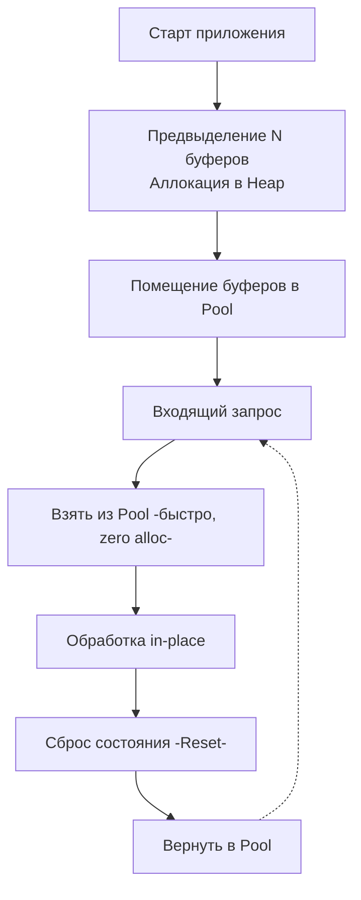

## Zero Allocation: Святой Грааль производительности

На протяжении предыдущих восьми статей мы разбирали отдельные механизмы оптимизации: от предвыделения памяти и инлайнинга до выравнивания структур и кэшей процессора. **Zero allocation (Нулевая аллокация)** — это не отдельный инструмент, это архитектурная парадигма и экстремальный майндсет, который объединяет все эти техники воедино.

В мире классического бэкенда (CRUD, бизнес-логика) аллокации — это нормально. Но в сферах HFT (High-Frequency Trading), AdTech (обработка рекламных аукционов RTB), разработке баз данных и высоконагруженных API-шлюзах каждый такт процессора на вес золота. 

Zero allocation подход означает проектирование горячих путей (Hot Paths) выполнения кода таким образом, чтобы во время обработки единицы работы (HTTP-запроса, сообщения из брокера, сетевого пакета) **не происходило ни одного выделения памяти в куче (Heap)**.

### Mechanical Sympathy: Зачем нужен абсолютный ноль?

Как мы обсуждали в [[1. GC в Go. Обзор]], Garbage Collector в Go — один из лучших среди современных языков, но он не бесплатный. Даже если GC работает параллельно (Concurrent), он съедает до 25% ресурсов CPU на фазах Mark, требует барьеров записи и периодически останавливает мир (Stop The World). 

Чем больше объектов вы аллоцируете, тем чаще запускается GC. Если вы обрабатываете 100 000 RPS (запросов в секунду), и каждый запрос создает 10 мелких объектов, вы генерируете 1 миллион объектов в секунду. GC будет работать практически непрерывно, выжигая процессорные кэши (Cache Thrashing) и вызывая непредсказуемые спайки Tail Latency.

Zero allocation сводит эту проблему к нулю. Нет нового мусора — нет работы для GC. Приложение начинает работать со скоростью, ограниченной исключительно пропускной способностью RAM и L-кэшей процессора.

---

## 4 Столпа Zero Allocation архитектуры

Чтобы добиться нулевых аллокаций, вам придется писать код, который выглядит совершенно не так, как идиоматичный "чистый" Go. Вы будете нарушать правила инкапсуляции и отказываться от удобных абстракций (как мы обсуждали в [[7. Удаление лишних абстракций]]).

### 1. Preallocation + Object Pools (Жизненный цикл "Аренда")
Ничего не создается в момент запроса. Вся память (буферы, структуры, контексты) выделяется при старте приложения (Pre-allocation) и складывается в `sync.Pool` или кастомные Free Lists (списки свободных блоков), как описано в [[3. Reuse объектов]].

Когда приходит запрос, мы берем память в "аренду", мутируем её in-place (на месте) и возвращаем обратно.



### 2. Value Semantics и Stack Allocation
Всё, что не может быть закэшировано в пуле, обязано остаться на стеке. Это означает использование передачи по значению (до определенного размера структур), избегание интерфейсов (чтобы избежать Boxing-а) и понимание того, как работает [[3. Escape analysis]]. Благодаря [[8. Inline оптимизации]], компилятор может помочь удержать переменные на стеке, если функции-обработчики достаточно компактны.

### 3. Zero-copy операции с I/O
Главный источник аллокаций в веб-серверах — это чтение байт из сокета и преобразование их в строки для маршрутизации (роутинга) или парсинга JSON. В Zero allocation мы никогда не делаем `string(bytes)` или `[]byte(str)`. Мы работаем с `[]byte` напрямую, либо используем `unsafe.String` (как разобрано в [[1. Уменьшение аллокаций]]).

### 4. Custom parsers (Отказ от reflect)
Стандартный `encoding/json` использует рефлексию, которая гарантированно аллоцирует память. В Zero allocation мире используются кодогенераторы (например, `easyjson` или `ffjson`), либо потоковые парсеры байт (например, `valyala/fastjson`), которые парсят данные, не создавая промежуточных структур в куче.

---

## Практический пример: fasthttp

Абсолютным эталоном Zero allocation подхода в экосистеме Go является пакет `fasthttp` от разработчика Александра Валялкина. Этот фреймворк обходит стандартный `net/http` в производительности в несколько раз, именно за счет тотального отказа от выделения памяти.

Сравним обработчики `net/http` и `fasthttp`:

```go
// Стандартный net/http (Много аллокаций)
func stdHandler(w http.ResponseWriter, r *http.Request) {
    // 1. r *http.Request уже аллоцирован рантаймом в куче для каждого запроса
    // 2. r.URL.Path возвращает новую строку (аллокация)
    // 3. w.Write принимает слайс байт, конкатенация строк вызовет аллокацию
    io.WriteString(w, "Hello, "+r.URL.Path) 
}

// fasthttp (Zero allocation)
func fastHandler(ctx *fasthttp.RequestCtx) {
    // 1. ctx переиспользуется из sync.Pool самим фреймворком
    // 2. ctx.Path возвращает []byte, указывающий на оригинальный сетевой буфер!
    // 3. SetBodyString пишет напрямую в переиспользуемый буфер ответа
    
    ctx.WriteString("Hello, ")
    ctx.Write(ctx.Path()) // Zero-copy передача байт
}
```

> [!info] Под капотом
> В `fasthttp` даже HTTP-заголовки не парсятся в `map[string][]string` (как это делает `net/http`, аллоцируя мапу и строки). Вместо этого `fasthttp` сохраняет оригинальный массив байт из TCP-сокета и массив структур, хранящих индексы (смещения начала и конца) ключей и значений в этом массиве. Когда вы просите `ctx.Request.Header.Peek("User-Agent")`, он просто сканирует индексы и возвращает `[]byte` без единой аллокации.

---

## Обратная сторона: The Dark Side of Zero Alloc

Если этот подход так хорош, почему мы не пишем так весь код? Потому что за производительность приходится платить читаемостью, безопасностью и временем разработки.

1. **Memory Leaks (Утечки памяти):** Если вы вернули объект в пул, но забыли затереть в нем указатели (например, `buf.user = nil`), вы создаете скрытую утечку. Гораздо хуже — если вы сохранили слайс байт, который отдал `fasthttp` или пулинг-система, в глобальную переменную или горутину, а фреймворк уже вернул этот буфер в работу и начал писать туда новые данные. Вы получите классический Data Race и Use-After-Free.
2. **Сложность API:** Вместо возвращения готовых объектов, функции вынуждены принимать буферы для записи: `func Parse(data []byte, dst *Result) error`. Это усложняет цепочки вызовов.
3. **Отсутствие стандартов:** Код, написанный на `fasthttp`, не совместим со стандартным интерфейсом `http.Handler`. Вы теряете доступ к 90% open-source экосистемы (middleware, трейсинг, метрики), которые написаны под `net/http`.

> [!warning] Ловушка / Gotcha
> Zero-copy парсинг подразумевает, что вы работаете с оригинальным сетевым буфером. Если вы попробуете изменить `[]byte`, полученный из `ctx.Path()` в `fasthttp`, вы модифицируете сырые данные TCP-запроса, что приведет к непредсказуемым багам или панике (если память защищена). Данные из Zero-copy всегда должны рассматриваться как Read-Only.

> [!tip] Собеседование
> **Вопрос:** Если `sync.Pool` дает нам Zero allocation, почему бы не сделать пул для абсолютно всех структур в проекте?
> **Ответ:** Это приведет к деградации производительности. У `sync.Pool` есть базовый оверхед на вызов методов `Get` и `Put` (атомарные операции, захват P, см. [[2. sync Pool]]). Для небольших структур (например, DTO из 2-3 полей) аллокация на стеке (если она проходит Escape Analysis) занимает 1-2 ассемблерные инструкции и работает на порядки быстрее пула. Пулы нужны только для тяжелых объектов, избежавших стека, буферов I/O и сложных в инициализации структур (например, коннектов к БД или gzip-райтеров).

## Итог и чек-лист Zero Alloc инженера

Если вы оптимизируете бутылочное горлышко (Bottleneck) системы до уровня Zero Allocation, проверьте себя:
1. Вы используете `go test -bench . -benchmem`. В колонке `allocs/op` должен быть строгий **0**.
2. Избегают ли ваши переменные утечки в кучу (проверено через `go build -gcflags="-m"`).
3. Все слайсы и мапы предвыделены, а тяжелые буферы берутся из пулов.
4. Вы не конкатенируете строки через `+` и не конвертируете `[]byte` в `string` без `unsafe`.
5. Вы используете специализированные библиотеки (вроде `valyala/fasthttp`, `valyala/fastjson`, `puzpuzpuz/xsync`).

Мы завершаем раздел, посвященный профилированию, устройству рантайма и низкоуровневым микрооптимизациям кода. Все эти знания: кэши, устройство памяти, GC и инлайнинг, — дают вам возможность написать один инстанс сервиса, способный держать колоссальную нагрузку. 

Но в реальном мире один сервер может упасть, а нагрузка может вырасти в 100 раз за секунду. Поэтому мы переходим к макро-уровню. В следующем разделе мы начнем изучать паттерны обеспечения надежности распределенных систем, и первая статья будет посвящена тому, как правильно нагрузить и сломать наш сервис: [[1. Load testing]].