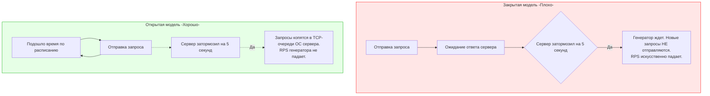

Мы потратили много времени на микроуровень: научились не аллоцировать память (см. [[9. Zero allocation подход]]), выравнивать структуры и инлайнить функции. Но в мире Highload микрооптимизации ничего не значат, если архитектура или инфраструктура не выдерживают реального потока пользователей. 

Чтобы доказать, что наш сервис готов к Production, нам нужны макро-измерения (как мы упоминали в [[5. microbenchmarks vs macrobenchmarks]]). Нам необходимо **Нагрузочное тестирование (Load testing)**.

## Зачем тестировать бэкенд на Go?

Go изначально создавался для сетевых сервисов. Благодаря неблокирующему вводу-выводу (`netpoller`) и легковесным горутинам, даже неоптимизированный "Hello World" на Go легко держит 50 000 RPS (Requests Per Second). 

Проблемы начинаются не на пустых эндпоинтах, а когда:
1. Подключается реальная база данных с ограниченным пулом соединений (Connection Pool).
2. Запускается Garbage Collector, пытаясь собрать гигабайты мусора в условиях активного трафика.
3. Упираются в потолок лимиты операционной системы (файловые дескрипторы, эфемерные порты).

## Виды нагрузочного тестирования

В инженерной практике принято разделять нагрузочные тесты по их целям:

1. **Load Testing (Объемное тестирование):** Подача ожидаемой "нормальной" и "пиковой" нагрузки. Цель — проверить, что `p99` latency (см. [[6. Метрики. p50, p95, p99]]) остается в рамках SLA, а память не течет.
2. **Stress Testing (Стресс-тест):** Увеличение нагрузки до тех пор, пока сервис не сломается. Цель — найти "бутылочное горлышко" (bottleneck). Упрется ли сервис в CPU? В память? В сеть? Или упадет база данных?
3. **Soak Testing (Тестирование на стабильность):** Подача средней нагрузки на длительный срок (часы или дни). Отлично выявляет медленные утечки памяти (Memory Leaks) и деградацию производительности со временем.
4. **Spike Testing (Тестирование скачков):** Резкая (мгновенная) подача экстремальной нагрузки. Проверяет, как сервис справляется с "эффектом толпы" (например, рассылка push-уведомлений миллиону пользователей).

---

## Mechanical Sympathy: Битва с операционной системой

Частая ошибка Junior/Middle разработчиков: они запускают нагрузочный генератор и свой сервер на одной машине (или на слабом CI-раннере) и видят ошибки "Connection refused" или зависания. Они думают, что сломался Go, но на самом деле **сломалась операционная система**.

> [!info] Под капотом
> При высоких RPS ваш сервис активно взаимодействует с сетевым стеком ядра Linux (Kernel Space). Каждое TCP-соединение требует ресурсов ОС. 

Два главных препятствия на уровне ОС при нагрузочном тестировании:

### 1. File Descriptors Exhaustion (Нехватка дескрипторов)
В Linux "Всё есть файл", включая сетевые сокеты. Ядро ограничивает количество одновременно открытых файлов для процесса. По умолчанию это значение часто равно 1024. При 1024 одновременных подключениях Go-сервер начнет возвращать ошибку `too many open files`.
* **Решение:** Поднять лимит с помощью `ulimit -n 65535` (или 1000000 для реального хайлоада) перед запуском сервера и генератора нагрузки.

### 2. Ephemeral Ports Exhaustion и TIME_WAIT
Когда клиент (ваш генератор нагрузки) инициирует TCP-подключение к серверу, он занимает один исходящий (эфемерный) порт. Их количество ограничено (обычно около 65000 минус системные порты). 
Более того, когда TCP-соединение закрывается, порт не освобождается мгновенно. Он переходит в состояние `TIME_WAIT` (обычно на 60 секунд), чтобы "поймать" запоздавшие пакеты в сети. Если вы генерируете 2000 RPS короткими подключениями, вы исчерпаете все порты за 30 секунд.
* **Решение:** Использовать `Keep-Alive` в генераторе нагрузки (переиспользование TCP-соединений). На уровне ОС — тюнинг `sysctl` (`net.ipv4.ip_local_port_range`, `net.ipv4.tcp_tw_reuse`).

---

## Главная ловушка: Coordinated Omission

Это фундаментальная концепция, о которой спрашивают на собеседованиях Senior-уровня и System Design интервью. **Coordinated Omission (Скоординированное упущение)** — это проблема генераторов нагрузки, которая заставляет вас думать, что ваш сервис работает быстро, когда на самом деле он лежит.

Существует две модели генерации нагрузки: **Закрытая (Closed)** и **Открытая (Open)**.

> [!warning] Ловушка / Gotcha
> Представьте, что ваш генератор настроен на 100 RPS. Внезапно Go-сервер делает долгую GC-паузу на 1 секунду. 
> * **В закрытой модели** (многие простые скрипты на Python/Bash или старые инструменты) генератор пошлет запрос, упрется в паузу сервера и будет ждать. За эту секунду он пошлет не 100 запросов, а 1. В итоговом отчете вы увидите: `p99 latency = 1s`. Звучит плохо, но терпимо.
> * **В открытой модели** генератору плевать, отвечает сервер или нет. Он обязан выслать 100 запросов за секунду. Эти 100 запросов встанут в очередь ядра (listen backlog). Когда сервер проснется через 1 секунду, первому запросу в очереди придется обрабатываться, а сотый запрос прождет в очереди *еще* дольше. Реальная `p99 latency` будет катастрофической (вплоть до отвала по таймауту). 
> 
> **Закрытая модель скрывает реальные проблемы, когда сервер не справляется.**

### Инструменты тестирования (Экосистема Go)

Поскольку Go идеален для написания многопоточных сетевых утилит, лучшие современные инструменты для нагрузочного тестирования написаны именно на Go:

1. **Vegeta (`tsenart/vegeta`)**: Стандарт де-факто для стресс-тестирования HTTP-сервисов в Go. Поддерживает *строгую открытую модель* нагрузки. Вы задаете Rate (например, `1000/s`), и он будет стрелять с этой частотой независимо ни от чего. Отлично выявляет Coordinated Omission.
2. **k6 (Grafana k6)**: Мощный инструмент, написанный на Go, но тесты пишутся на JavaScript. Идеален для сложных сценариев (авторизация, цепочки вызовов, имитация реального пользователя). Начиная с версии 0.27 поддерживает открытую модель (`constant-arrival-rate`).
3. **Pandora (Yandex)**: Мощный инструмент (часть Yandex.Tank), написанный на Go, заточенный под экстремальные нагрузки (миллионы RPS) с использованием кастомных пушек и протоколов.

> [!tip] Собеседование
> **Вопрос:** Мы запустили нагрузочный тест с 1000 RPS. Сервер отвечает 200 OK. Метрики CPU показывают загрузку 10%. Почему p99 latency вдруг выросла с 10ms до 200ms?
> **Ответ:** Причин может быть несколько:
> 1. Исчерпание пула соединений с БД (горутины блокируются в ожидании свободного коннекта).
> 2. Аппаратные лимиты диска (I/O Wait), если пишем логи синхронно.
> 3. Lock Contention — конкуренция за `sync.Mutex` в глобальном кэше приложения.
> 4. Долгие паузы Garbage Collector-а из-за обилия мелких аллокаций.

## Go netpoller под нагрузкой

При проектировании высоконагруженных систем разработчики часто боятся модели "One thread per connection" (один поток на соединение), так как в Java/C++ треды ОС стоят дорого (мегабайты памяти на стек, тяжелое переключение контекста).

В Go применяется модель **"One Goroutine per connection"**. Это работает блестяще, потому что:
1. Стек горутины стартует всего с 2 КБ. 100 000 подключений займут всего ~200 МБ оперативной памяти.
2. Переключение контекста горутин в User Space стоит дешево.
3. **Netpoller**: Когда горутина вызывает `conn.Read()`, а данных в сокете нет, она не блокирует поток ОС (`M`). Рантайм Go перехватывает этот системный вызов, паркует горутину и добавляет файловый дескриптор в `epoll` (в Linux) или `kqueue` (в macOS). Поток ОС идет выполнять другие горутины. Когда данные приходят по сети, ОС уведомляет `epoll`, рантайм Go будит нужную горутину и продолжает ее работу.

Эта архитектура позволяет Go-серверам держать миллионы "спящих" соединений (например, WebSockets или Long Polling) практически бесплатно.

## Итог

1. Без макро-тестирования любые локальные бенчмарки бессмысленны. Инфраструктура, БД и ОС внесут свои коррективы под нагрузкой.
2. Помните про лимиты ОС: настройте `ulimit` и переиспользуйте TCP-соединения (`Keep-Alive`), чтобы не исчерпать эфемерные порты.
3. Остерегайтесь **Coordinated Omission**. Используйте инструменты с открытой моделью генерации (Vegeta, k6 с arrival-rate), чтобы видеть реальную картину задержек, когда сервис начинает "захлебываться".

Но что делать, если нагрузочный тест показал деградацию, и сервис "не тянет"? Нам нужно понять, где именно внутри Go-кода находится узкое место, прямо во время работы под нагрузкой. Как безопасно собирать профили CPU и памяти с живого боевого сервера, мы разберем в следующей статье: [[2. Profiling в production]].