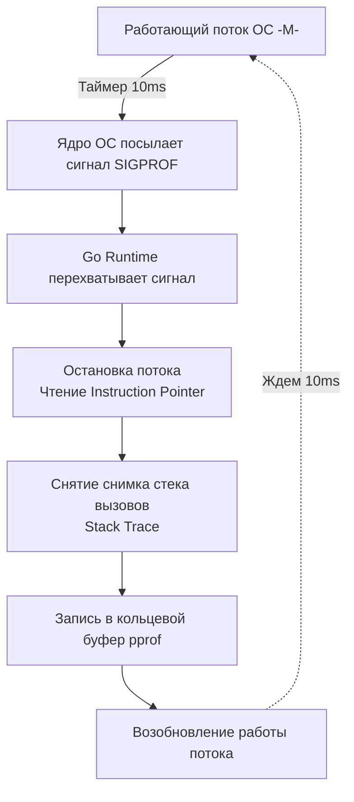

В прошлой статье [[1. Load testing]] мы обсуждали, как с помощью искусственной нагрузки найти пределы прочности нашего сервиса. Однако реальность такова, что **Staging всегда врет**. Как бы вы ни старались скопировать production-окружение, распределение данных в реальной БД, паттерны поведения пользователей и сетевая топология всегда будут отличаться. 

Настоящие "бутылочные горлышки" проявляются только на реальном трафике. И когда ваш график `p99 latency` улетает в космос, гадать по логам уже поздно. Вам нужно заглянуть внутрь работающего приложения. И здесь возникает главный страх многих разработчиков: *"А можно ли включать профилирование на "живом" проде? Не убьет ли это сервер окончательно?"*

Ответ от инженеров Google и создателей языка: **Go изначально спроектирован для профилирования в Production**. Но делать это нужно с умом.

## Mechanical Sympathy: Стоимость профилирования

Чтобы не бояться инструмента, нужно понимать, как он работает под капотом.

### 1. CPU Profiling (Затраты ~5%)
Когда вы запускаете профилирование CPU (см. [[2. CPU profiling в Go]]), рантайм Go не вставляет никаких хуков в ваш скомпилированный код. Он использует механизм **статистического сэмплирования (Statistical Sampling)** через прерывания ОС.



По умолчанию таймер срабатывает 100 раз в секунду (100 Hz). Это означает, что рантайм прерывает поток всего на несколько микросекунд каждые 10 миллисекунд. Накладные расходы на такую операцию составляют около 1-5% CPU. Это абсолютно приемлемая цена за точную картину того, где "горит" ваш процессор.

### 2. Memory Profiling (Затраты < 1%)
Профилирование кучи (Heap) работает еще дешевле (см. [[5. pprof memory profile]]). Аллокатор Go просто инкрементирует внутренние счетчики при выделении памяти. По умолчанию он записывает детальный стек-трейс только для одной аллокации из каждых **512 Килобайт** выделенной памяти (параметр `MemProfileRate`). Это делает профилирование памяти практически бесплатным.

> [!warning] Ловушка / Gotcha
> Вы можете изменить `runtime.MemProfileRate = 1`, чтобы записывать *каждую* аллокацию. **Никогда не делайте этого на проде!** Запись стек-трейса на каждый выделенный байт убьет производительность в десятки раз, и ваш сервис ляжет под тяжестью самого профилировщика. Оставляйте дефолтное значение 512 КБ — для поиска утечек этого более чем достаточно.

## Безопасная интеграция pprof

Стандартный способ включить профилирование — добавить "магический" импорт:

```go
import _ "net/http/pprof"
```

Этот импорт в своей функции `init()` автоматически регистрирует хендлеры `/debug/pprof/*` в стандартном глобальном роутере `http.DefaultServeMux`.

> [!warning] Ловушка / Gotcha
> **Критическая уязвимость:** Если ваш публичный API-сервер использует `http.DefaultServeMux` (например, вы просто вызываете `http.ListenAndServe(":80", nil)`), то после добавления этого импорта **любой человек в интернете** сможет скачать профили вашего сервера! 
> Профили содержат полные пути к файлам исходного кода на сервере, параметры запуска и могут стать вектором для DoS-атак (злоумышленник может запустить тяжелый CPU-профиль на 1 час).

**Правильный паттерн:** Никогда не вешайте `pprof` на публичный порт. Создайте отдельный внутренний HTTP-сервер на другом порту, который закрыт файрволом и доступен только из внутренней сети (или через Kubernetes port-forward).

```go
package main

import (
	"log"
	"net/http"
	"net/http/pprof"
)

func main() {
	// 1. Ваш основной публичный роутер (строго без pprof)
	publicMux := http.NewServeMux()
	publicMux.HandleFunc("/api/data", handleData)

	// Запуск публичного сервера в отдельной горутине
	go func() {
		log.Println("Public server starting on :8080")
		if err := http.ListenAndServe(":8080", publicMux); err != nil {
			log.Fatalf("public server failed: %v", err)
		}
	}()

	// 2. Внутренний роутер для диагностики
	debugMux := http.NewServeMux()
	
	// Явная регистрация хендлеров pprof
	debugMux.HandleFunc("/debug/pprof/", pprof.Index)
	debugMux.HandleFunc("/debug/pprof/cmdline", pprof.Cmdline)
	debugMux.HandleFunc("/debug/pprof/profile", pprof.Profile)
	debugMux.HandleFunc("/debug/pprof/symbol", pprof.Symbol)
	debugMux.HandleFunc("/debug/pprof/trace", pprof.Trace)

	// Запуск диагностического сервера на закрытом порту (например, 9090)
	log.Println("Debug server starting on :9090")
	if err := http.ListenAndServe("127.0.0.1:9090", debugMux); err != nil {
		log.Fatalf("debug server failed: %v", err)
	}
}
```

## Continuous Profiling (Непрерывное профилирование)

Раньше профилирование было реактивным: произошел инцидент $\rightarrow$ инженер пошел по SSH или `kubectl port-forward` на сервер $\rightarrow$ запустил `go tool pprof` $\rightarrow$ начал искать проблему.
Но что, если скачок latency был ночью на 5 минут? Утром вы зайдете на сервер, снимите профиль, и он будет идеально чистым.

В мире современного Highload стандартом стал **Continuous Profiling**. Вы собираете профили 24/7 так же, как метрики в Prometheus.

Для этого используются системы вроде **Pyroscope** (от Grafana) или **Parca**. 
Они работают в двух режимах:
1. **Pull-модель:** Агент периодически (раз в 10-15 секунд) дергает ваш `/debug/pprof/profile?seconds=10` и складывает результаты в TSDB (Time Series Database).
2. **eBPF-модель:** Агент (например, Parca Agent) живет на уровне ядра Linux и с помощью eBPF программ читает стеки вызовов прямо из памяти ОС, вообще не требуя импорта пакета `pprof` в ваш код!

Это позволяет вам открыть дашборд и сказать: *"Покажи мне Flamegraph для этого микросервиса вчера с 03:15 до 03:20, когда был спайк ошибок"*.

> [!tip] Собеседование
> **Вопрос:** Если CPU профилирование — это статистика, как найти функцию, которая вызывается очень редко, но работает недопустимо долго (например, 1 раз в минуту тормозит на 500мс)? pprof с шансом 99% ее не заметит, так как частота сэмплирования всего 100Hz.
> **Ответ:** Для поиска таких редких, но долгих событий CPU-профиль не подходит. Нам потребуется использовать `go tool trace` (Execution Tracer), который записывает *каждое* событие планировщика, смены состояний горутин и системные вызовы. Либо расставлять span-ы распределенной трассировки (OpenTelemetry) вокруг подозреваемых кусков кода.

## Чего стоит избегать на проде?

Кроме установки правильного `MemProfileRate`, есть еще два вида профилей, которые по умолчанию **отключены** в рантайме Go, и их включение требует осторожности:

1. **Block Profiling (`runtime.SetBlockProfileRate`)**: Записывает горутины, которые долго заблокированы на каналах, `select` или системных вызовах.
2. **Mutex Profiling (`runtime.SetMutexProfileFraction`)**: Записывает стеки вызовов горутин, которые ожидают захвата `sync.Mutex` или `sync.RWMutex` (см. [[7. Contention и lock profiling]]).

Если вы включите Mutex Profiling с фракцией `1` (записывать каждое событие блокировки) на высоконагруженном сервере, где часто используется глобальный кэш, рантайм начнет тратить колоссальное количество ресурсов на снятие стек-трейсов при каждой конкуренции за лок. Это приведет к эффекту домино и падению сервиса. Включайте их только с большими значениями рейта (например, 1 из 1000 событий) или временно, через скрытые хендлеры API.

## Итог

1. Профилирование в production на Go — это **безопасно и необходимо**. Накладные расходы на CPU составляют около 5%, а на память — менее 1%.
2. Строго разделяйте публичный и диагностический роутинг. Никогда не светите порты с `pprof` в интернет.
3. Внедряйте системы **Continuous Profiling** (Pyroscope, Parca), чтобы иметь исторические данные о поведении системы в моменты пиковых нагрузок или ночных инцидентов.
4. Помните, что `pprof` — это статистический сэмплер. Он отлично ищет узкие места, где приложение проводит *большую часть времени*, но плохо подходит для поиска редких единичных спайков latency.

Представьте ситуацию: вы нашли по профилю медленную функцию, переписали ее (применив zero allocation и правильные структуры). Но как безопасно выкатить эту оптимизацию на миллионы пользователей и быстро откатить, если профиль памяти вдруг покажет утечку в новом коде? Для этого хардкорные инженеры используют не просто деплой новой версии, а механизмы управления кодом в рантайме. Об этом — в нашей следующей статье: [[3. Feature flags для оптимизаций]].