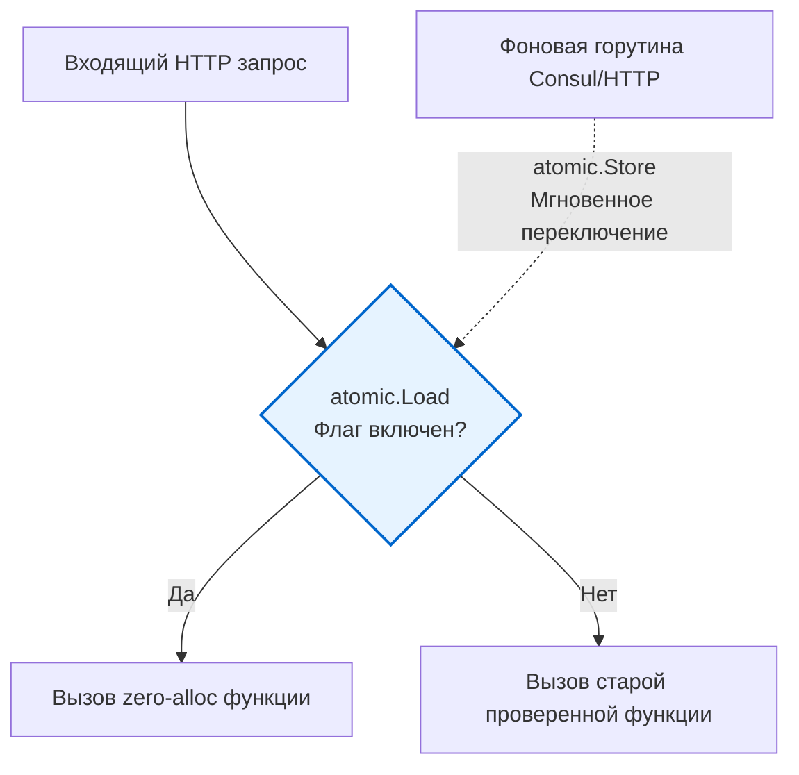

В прошлой статье [[2. Profiling в production]] мы выяснили, как найти узкое место на живом сервере. Допустим, профилировщик показал, что 40% CPU тратится на стандартный `encoding/json`. Вы, как хардкорный инженер, переписали этот кусок на кодогенерацию или применили [[9. Zero allocation подход]]. Локальные бенчмарки показывают ускорение в 10 раз. 

Казалось бы, пора выкатывать код в Production. Но реальность жестока: ваша "идеальная" оптимизация может не учесть редкий корнер-кейс, упасть с паникой на битом JSON или привести к утечке памяти из-за неправильной работы с `sync.Pool`. В Highload выкат радикальных оптимизаций напрямую — это игра в русскую рулетку. 

Для безопасного внедрения изменений мы используем **Feature Flags (Флаги функций)**. В контексте производительности они выступают как **Kill Switches (Рубильники)**, позволяя моментально откатить код на старую (медленную, но надежную) версию без пересборки и редеплоя микросервиса.

## Mechanical Sympathy: Цена проверки флага

Feature Flag — это, по сути, ветвление (`if flag { ... } else { ... }`). 
Когда мы говорим о бизнес-логике (например, включить новую кнопку в UI), флаг можно проверять хоть походом в Redis или базу данных, так как сеть занимает миллисекунды.

Но когда мы защищаем микрооптимизацию, которая экономит сотни наносекунд, поход в сеть (и даже захват мьютекса) **убьет всю производительность**.

> [!warning] Ловушка / Gotcha
> Типичная ошибка Junior-разработчиков: 
> ```go
> func process(data []byte) {
>     // УЖАСНО: Поход в сеть/Redis на каждый пакет! 
>     // Это замедлит функцию в тысячи раз.
>     if redisClient.Get("use_fast_parser") == "true" { 
>         fastParse(data)
>     } else {
>         slowParse(data)
>     }
> }
> ```

Проверка флага для оптимизации должна происходить исключительно в оперативной памяти (In-Memory) и быть потокобезопасной (Thread-Safe).

Идеальный инструмент для этого — пакет `sync/atomic`.

> [!info] Под капотом
> Почему `atomic.Bool` (или `atomic.LoadInt32` в старых версиях Go) так хорош? 
> Когда горутина вызывает атомарное чтение переменной, которая редко меняется, процессор сохраняет эту кэш-линию в L1/L2 кэше в состоянии `Shared` (по протоколу когерентности MESI). 
> Атомарное чтение из L1 кэша стоит всего ~1-2 наносекунды. А благодаря аппаратному предсказателю ветвлений (о котором мы говорили в [[6. Branch prediction и код]]), процессор со 100% вероятностью угадывает, по какому пути пойдет `if`, выполняя код вообще без задержек.
> Нагрузка на шину памяти возникает *только* в момент записи (`atomic.Store`), когда мы переключаем флаг, что происходит крайне редко.

## Идиоматичная реализация In-Memory флагов

Мы создаем структуру конфигурации, которая хранится в памяти, и фоновую горутину, которая обновляет ее (например, слушая Consul, etcd или простой HTTP-эндпоинт конфигурации).

```go
package flags

import (
	"sync/atomic"
)

// GlobalFlags хранит состояние рубильников
type GlobalFlags struct {
	UseZeroAllocParser atomic.Bool
	EnableCache        atomic.Bool
}

var activeFlags GlobalFlags

// IsZeroAllocParserEnabled - сверхбыстрое O-от-1 чтение
func IsZeroAllocParserEnabled() bool {
	return activeFlags.UseZeroAllocParser.Load()
}

// SetZeroAllocParser - вызывается извне (admin API или Consul watcher)
func SetZeroAllocParser(enabled bool) {
	activeFlags.UseZeroAllocParser.Store(enabled)
}
```



Теперь в горячем пути (Hot Path) вы можете безопасно использовать флаг:

```go
func parseData(data []byte) (Result, error) {
    if flags.IsZeroAllocParserEnabled() {
        return fastParse(data) // Новая сверхбыстрая версия
    }
    return slowParse(data)     // Старая версия
}
```

Если графики покажут рост потребления памяти или ошибки 500 после включения флага, SRE-инженер делает один API-вызов, `atomic.Store` переключает `bool` в `false`, и **на следующем же такте процессора** весь трафик возвращается на безопасный маршрут. Никакого рестарта подов в Kubernetes, никаких простоев.

---

## Контекстные флаги (Заморозка состояния)

Для некоторых оптимизаций глобальный `atomic.Bool` таит в себе скрытую угрозу. Представьте распределенную транзакцию (Saga) или долгий пайплайн обработки.

Что будет, если в начале пайплайна флаг "Новый формат БД" был `true`, мы создали объект нового типа, а на середине пайплайна SRE-инженер выключил флаг? Вторая половина пайплайна прочитает `false`, попытается обработать объект по-старому и вызовет `panic` или Data Corruption (повреждение данных).

> [!tip] Собеседование
> **Вопрос:** Как избежать ситуации "рассинхрона", когда глобальный фитча-флаг переключается прямо во время выполнения долгого запроса пользователя?
> **Ответ:** Состояние флага должно "замораживаться" на входе в систему и передаваться по всей цепочке вызовов через `context.Context`.

**Реализация через Middleware:**

```go
type contextKey string
const flagsKey contextKey = "feature_flags"

// Снапшот флагов на момент начала запроса
type RequestFlags struct {
	UseFastParser bool
}

func FlagsMiddleware(next http.Handler) http.Handler {
	return http.HandlerFunc(func(w http.ResponseWriter, r *http.Request) {
		// Читаем из atomic один раз в начале запроса!
		currentFlags := RequestFlags{
			UseFastParser: flags.IsZeroAllocParserEnabled(),
		}
		
		// Кладем в контекст
		ctx := context.WithValue(r.Context(), flagsKey, currentFlags)
		next.ServeHTTP(w, r.WithContext(ctx))
	})
}
```

Дальше в бизнес-логике мы читаем флаг из контекста. Даже если глобальный флаг изменится, текущий запрос гарантированно завершится с тем же набором правил, с которым начался.

---

## Паттерн "Теневое чтение" (Dark Launch / Shadowing)

Это высший пилотаж внедрения оптимизаций. 
Допустим, вы переписали алгоритм поиска или парсер, и хотите быть **на 100% уверенными**, что новая быстрая версия возвращает *абсолютно такие же* результаты, как и старая. 

С помощью фитча-флага `EnableShadowParsing` вы запускаете **обе** функции одновременно! Старая функция возвращает результат пользователю (бизнес в безопасности), а новая работает "в тени".

```go
func parseDataShadow(ctx context.Context, data []byte) (Result, error) {
    // Основной (медленный, но верный) путь
    res, err := slowParse(data)
    
    // Если включено теневое тестирование
    if flags.IsShadowParsingEnabled() {
        // Запускаем новую версию асинхронно, чтобы не тормозить ответ пользователю
        go func(d []byte, expectedRes Result, expectedErr error) {
            fastRes, fastErr := fastParse(d)
            
            // Сравниваем результаты
            if fastErr != expectedErr || !reflect.DeepEqual(fastRes, expectedRes) {
                // Если результаты расходятся - бьем тревогу в логи/метрики!
                metrics.Inc("parser_mismatch_errors")
                log.Printf("Mismatch: expected %v, got %v", expectedRes, fastRes)
            }
        }(data, res, err)
    }
    
    return res, err
}
```

Как только вы видите, что метрика `parser_mismatch_errors` равна нулю на протяжении нескольких суток, вы можете с чистой совестью переключить основной рубильник на `fastParse`, удалив теневой запуск.

## Итог

1. **Feature Flags** (в контексте Highload) — это ваш парашют при выкате микрооптимизаций.
2. Проверки в горячих путях должны быть строго **In-Memory и без блокировок**. Используйте пакет `sync/atomic` (`atomic.Bool`).
3. Применяйте **Заморозку состояния** (чтение флага в `context.Context` на уровне Middleware), чтобы защититься от несогласованности при смене флага в процессе обработки запроса.
4. Используйте паттерн **Теневого чтения (Shadowing)** для валидации консистентности данных между старым и новым оптимизированным кодом перед финальным переключением.

Feature flags позволяют нам безопасно переключать код *внутри* одного запущенного приложения. Но что если изменение затрагивает саму структуру БД или настолько масштабно, что мы хотим пустить на него лишь 1-5% реальных пользователей, чтобы проверить нагрузку на ОС? В таком случае рубильников в коде уже недостаточно, и мы переходим к инфраструктурному уровню маршрутизации трафика. Об этом — в нашей следующей статье: [[4. Canary releases]].