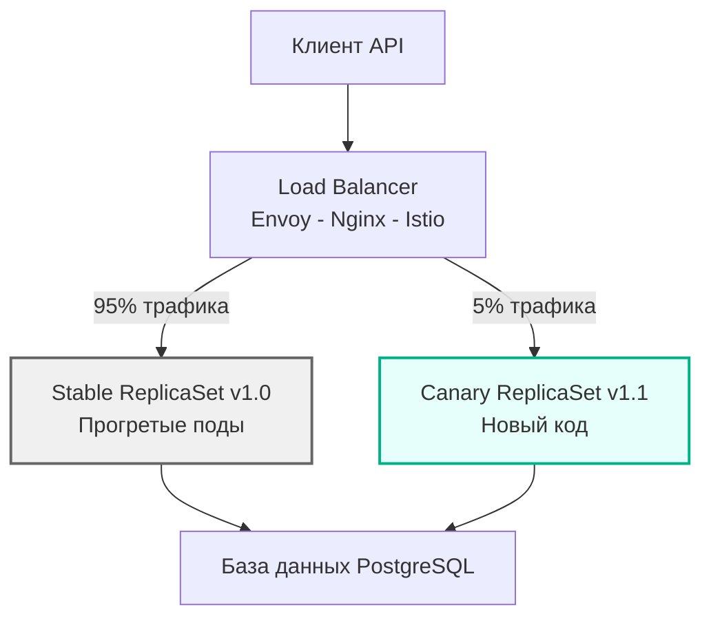

В прошлой статье [[3. Feature flags для оптимизаций]] мы научились безопасно внедрять оптимизации прямо в код, используя In-Memory переключатели. Это отличный паттерн для изменения алгоритмов или парсеров. Но что делать, если ваша оптимизация затрагивает не одну функцию, а фундаментальные основы сервиса? 

Представьте, что вы обновляете мажорную версию Go (например, с 1.20 на 1.22 для получения новых оптимизаций компилятора), переходите на другой веб-фреймворк (с `net/http` на `fasthttp`) или полностью меняете структуру хранения сессий в Redis. Такие изменения невозможно обернуть в `if flag { ... }`. Вам нужно обновить сам бинарный файл.

Здесь на сцену выходят **Канареечные релизы (Canary Releases)** — инфраструктурный паттерн развертывания, при котором новая версия приложения выкатывается параллельно со старой и получает лишь крошечную долю (1-5%) реального пользовательского трафика.

## Mechanical Sympathy: Проблема "Холодного старта"

В мире Java (Spring Boot) холодный старт — это известная проблема: JVM должна прогреть JIT-компилятор. Переходящие на Go инженеры часто думают: *"Go компилируется в машинный код (AOT). У нас нет JIT-компилятора. Значит, Go-сервис сразу после старта работает на 100% скорости!"*

Это опасное заблуждение. На уровне железа и рантайма "холодный старт" существует всегда:

1. **Instruction Cache (L1i / L2):** При старте нового пода кэши инструкций процессора девственно чисты. Приложению нужно время, чтобы заполнить их "горячими" путями выполнения.
2. **TCP Connection Pool:** Если ваш сервис делает запросы в БД или другие микросервисы, пулы соединений (`sync.Pool` или внутри `database/sql`) изначально пусты. Первые запросы потратят драгоценные миллисекунды на 3-Way Handshake, SSL/TLS negotiation и аллокацию структур соединений.
3. **GC Pacing (Адаптация сборщика мусора):** Рантайм Go не знает заранее профиль вашей нагрузки. Сборщик мусора (GC) использует эвристики и обратную связь от планировщика, чтобы вычислить оптимальную частоту запусков (Pacing) и базовый размер кучи. При резкой подаче 100% нагрузки на "холодный" под GC может запаниковать, запустив частые циклы очистки и вызвав CPU Throttling.
4. **OS Page Cache:** Данные с диска (если вы их читаете) еще не поднялись в оперативную память ядра Linux.

Канареечный релиз решает эту проблему элегантно: отправляя на новый под всего 1% трафика, мы даем ОС, кэшам процессора, пулам коннектов и GC плавно "прогреться" (Warm-up) в течение 5-10 минут перед подачей основной нагрузки.

## Архитектура Канарейки: Как это работает под капотом

В современном Cloud-Native мире (Kubernetes, Envoy, Nginx) маршрутизация канарейки настраивается на уровне Service Mesh или Ingress-контроллера. Балансировщик нагрузки перехватывает трафик и, основываясь на весах (Weights) или заголовках, направляет запросы.

Существует два основных способа распределения трафика:
1. **По весу (Weight-based):** Роутер кидает кубик. Выпало 1-5 — идем в канарейку, 6-100 — в стабильную версию. Подходит для stateless микросервисов.
2. **По заголовкам/Cookies (Header-based):** Трафик маршрутизируется детерминированно. Например, пользователи из внутренней сети компании (или бета-тестеры с кукой `X-Canary: true`) попадают на новую версию. Это обязательно для stateful потоков, где важно, чтобы сессия клиента не "прыгала" между версиями API.

> [!info] Под капотом
> При использовании Weight-based маршрутизации алгоритмы балансировки (например, Round Robin) могут сыграть злую шутку на малых RPS. Если у вас всего 20 запросов в секунду и вес 5%, канарейка получит 1 запрос в секунду. Этого недостаточно для статистической значимости и прогрева пулов. На малых RPS процент канарейки нужно увеличивать (до 10-20%).

## Главная ловушка Канарейки: База данных

Взгляните на диаграмму выше еще раз. И Stable, и Canary поды смотрят в **одну и ту же базу данных**. Это рождает фундаментальное правило хардкорной инженерии:

> [!warning] Ловушка / Gotcha
> **Ни один релиз не должен ломать обратную совместимость схемы БД или форматов данных!**
> Если ваш новый код переименовал колонку в PostgreSQL (через миграцию `ALTER TABLE ... RENAME`), Canary-под заработает отлично. Но Stable-поды (которых 95%) в ту же секунду начнут сыпать 500-ми ошибками, так как они ожидают старое имя колонки. Ваша "безопасная" канарейка положит весь Production.

**Как это лечится? Паттерном "Expand and Contract" (Двухфазные миграции):**

Если вам нужно перенести данные из колонки `name` (строка) в `first_name` и `last_name` (две строки):
1. **Фаза 1 (Expand):** Создаете миграцию БД, которая *добавляет* новые колонки `first_name` и `last_name`, не удаляя `name`. Старый код (Stable) пишет и читает `name`. Новый код (Canary) пишет в *обе* колонки (старую и новую), а читает из новых. Выкатываете Canary. Если все хорошо — раскатываете на 100%.
2. **Фоновая миграция:** Запускаете скрипт, который переносит исторические данные из `name` в новые колонки для всех старых записей.
3. **Фаза 2 (Contract):** Создаете следующий релиз, где код больше не пишет в `name`. После полного релиза удаляете колонку `name` из БД.

## Метрики: Как понять, что канарейка "поет"?

Смысл канарейки (как птички в угольной шахте) — умереть первой, спася шахтеров (основной трафик). Но как понять, что птичке плохо, до того как начнут жаловаться клиенты? Нам нужна строгая Observability (см. [[8. Observability и performance]]).

При запуске Canary релиза SRE или автоматизированная система (например, Argo Rollouts) начинает сравнивать метрики:

1. **Rate (RPS):** Количество запросов должно соответствовать проценту роутинга. Если канарейка должна получать 5%, а получает 0.1% — ваш Ingress настроен неверно, либо приложение не может пройти Health Check (`/live`, `/ready`).
2. **Errors (Ошибки HTTP 5xx):** Если уровень ошибок на Canary > 1% (или превышает baseline Stable версии), релиз немедленно откатывается (Rollback).
3. **Duration (p99 Latency):** Вы сравниваете `p99` и `p50` задержек (о них в [[6. Метрики. p50, p95, p99]]). Новая версия должна быть не медленнее старой.
4. **Ресурсы (CPU / Memory / Goroutines):** Мы смотрим на дашборд и видим, что Canary-под потребляет на 20% больше CPU или постоянно увеличивает счетчик активных горутин (явный признак утечки, goroutine leak).

> [!tip] Собеседование
> **Вопрос:** Если мы выкатили канарейку (5% трафика) и видим, что `p50 latency` на ней 10ms, а на Stable — 50ms, означает ли это, что наш новый код стал в 5 раз быстрее?
> **Ответ:** Совершенно не обязательно. Мы можем стать жертвой иллюзии недогруженности. Canary-под получает в 20 раз меньше трафика, чем Stable-поды. Его кэши могут не вытесняться, сборщик мусора работает редко, а пулы соединений с БД свободны. Сравнивать абсолютные значения latency при разном уровне нагрузки — ошибка. Правильно тестировать производительность на 100% нагрузки в Staging (см. [[1. Load testing]]), а в проде с помощью канарейки отлавливать аномалии и деградации (пропорционально нагрузке).

## Итог

1. Канареечные релизы — это инфраструктурный паттерн безопасного развертывания, снижающий Blast Radius (радиус поражения) при ошибках в коде.
2. Для Go-сервисов канарейка жизненно необходима для **прогрева системы**: заполнения кэшей процессора (L1/L2), TCP-пулов и калибровки сборщика мусора (GC).
3. Всегда помните про паттерн **Expand and Contract**: Canary и Stable версии работают одновременно с одной БД, поэтому миграции должны быть строго обратно совместимыми.
4. Автоматизируйте Rollback (откат) на основе метрик (RED: Rate, Errors, Duration).

Мы настроили стенды, прогнали нагрузочные тесты, обернули новый код в Feature Flags и выкатили через Canary. Кажется, мы защищены со всех сторон. Однако производительность — это не статичная величина. Кодовая база меняется каждый день, сотни разработчиков делают коммиты. Как сделать так, чтобы ваш `p99` не деградировал со временем из-за "смерти от тысячи порезов"? Переходим к автоматизации контроля качества: [[5. Performance regression detection]].