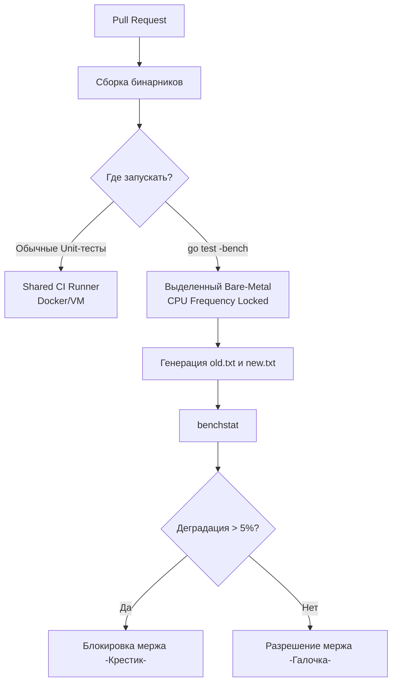

В прошлой статье [[4. Canary releases]] мы разобрали, как безопасно выкатывать изменения на "живой" трафик. Канарейка спасает нас от катастрофы в Production. Но если релиз дошел до стадии канарейки, а затем был откачен из-за просадки производительности — время разработчиков, QA и CI-пайплайна уже потрачено впустую.

Истинная инженерия уровня Senior/Lead требует проактивности. Производительность не падает внезапно. В больших проектах действует правило **"Смерти от тысячи порезов" (Death by a thousand cuts)**: один коммит добавил лишний `fmt.Sprintf` (аллокация), другой добавил интерфейс (убил [[8. Inline оптимизации]]), третий переставил поля в структуре (увеличил паддинг). Ни один из этих коммитов по отдельности не уронит канарейку, но за полгода `p99 latency` вырастет вдвое.

Чтобы этого избежать, нам нужна **Continuous Performance Regression Detection (Непрерывное обнаружение деградации производительности)** — система, которая будет автоматически "бить по рукам" на этапе Pull Request-а, если код стал медленнее.

## 1. Проблема дисперсии и утилита benchstat

Когда разработчики впервые пытаются автоматизировать бенчмарки в CI (Continuous Integration), они пишут простой Bash-скрипт, который запускает `go test -bench .`, парсит наносекунды и сравнивает числа из `main` ветки с текущим PR.

Это **не работает**. Если вы запустите бенчмарк дважды подряд на одном и том же коде, результаты будут отличаться на 2-10%. Операционная система может решить запустить фоновый процесс, процессор может изменить тактовую частоту из-за нагрева — возникнет _шум_. Если ваш скрипт будет падать при любом отклонении на 3%, разработчики возненавидят ваш CI за ложноположительные срабатывания (Flaky tests).

**Решение: Статистический подход.**

В экосистеме Go для этого существует официальная утилита `benchstat` (`golang.org/x/perf/cmd/benchstat`).

Bash

```
# 1. Checkout в основную ветку (baseline)
git checkout main
# ОБЯЗАТЕЛЬНО запускаем бенчмарки несколько раз (count=10) для сбора статистики
go test -run=^$ -bench=. -count=10 > old.txt

# 2. Checkout в ветку с фичей
git checkout feature-branch
go test -run=^$ -bench=. -count=10 > new.txt

# 3. Сравниваем статистически значимую разницу
benchstat old.txt new.txt
```

> [!info] Под капотом
> 
> `benchstat` не просто вычисляет среднее арифметическое. Он использует непараметрический статистический критерий **U-критерий Манна — Уитни (Mann-Whitney U test)**.
> 
> Алгоритм берет два массива результатов (по 10 запусков) и математически доказывает: является ли разница между ними случайным шумом дисперсии ОС, или новые значения действительно сместились на графике.
> 
> Если `benchstat` показывает `delta +15%` и `p-value < 0.05` — это математически доказанная регрессия, которую нельзя списывать на "сервер лаганул".

---

## 2. Mechanical Sympathy: Аппаратные ловушки CI/CD

Самая большая архитектурная проблема CI/CD пайплайнов (GitHub Actions, GitLab CI) — это использование эфемерных виртуальных машин. Виртуалки в облаке страдают от проблемы **"Шумных соседей" (Noisy Neighbors)**. Ваш бенчмарк может делить физическое ядро (vCPU) с контейнером, который майнит биткоины, что приведет к катастрофической разнице в CPU Cache Misses.

Для надежной ловли регрессий вам потребуется **выделенный Bare-Metal сервер (Железо)**, настроенный специфическим образом:

1. **Отключение Turbo Boost:** Процессор не должен разгоняться. Если `main` ветка тестировалась при частоте 3.0 ГГц, а на `feature` ветке CPU "разогрелся" до 4.5 ГГц (Turbo Boost), вы получите ложноположительное улучшение производительности. Частота (CPU Scaling Governor) должна быть зафиксирована на `performance` или жесткой частоте.
2. **Изоляция ядер (CPU Isolation):** Используйте параметры ядра Linux `isolcpus`, чтобы ОС не планировала свои прерывания на тех ядрах, где бегут бенчмарки.
3. **Отключение ASLR:** Рандомизация адресного пространства ОС (ASLR) может приводить к тому, что в разных запусках бинарник ложится в память по-разному, по-разному попадая в кэш-линии (см. подробнее в [[6. Стабилизация результатов]]).

Фрагмент кода



---

## 3. Отслеживание аллокаций: Нулевая терпимость

Даже если у вас нет идеального "железа" для замеров наносекунд, вы обязаны отслеживать **метрики аллокаций памяти**.

В отличие от времени процессора, количество аллокаций детерминировано. Одна и та же функция с одними и теми же входными данными всегда выделит одинаковое количество байт и объектов (вспомните концепции из [[1. Уменьшение аллокаций]]).

> [!tip] Собеседование
> 
> **Вопрос:** В нашем CI `benchstat` постоянно показывает "шум" по времени выполнения (CPU time), но нам критически важно не пропускать код, который мусорит в память. Как настроить CI?
> 
> **Ответ:** Запускать тесты с флагом `-benchmem` и написать парсер (или использовать `benchstat`), который будет игнорировать изменения в `ns/op` (наносекунды), но строго фейлить пайплайн, если `B/op` (байты) или `allocs/op` (количество аллокаций) увеличились хотя бы на 1. Аллокации не зависят от нагрузки на CI-сервер.

Типичный скрипт для CI, который ловит утечки абстракций в Hot Path:

```bash
# Получаем разницу
benchstat old.txt new.txt > diff.txt

# Если в колонке 'allocs/op' есть знак '+' (увеличение аллокаций)
if grep -q "allocs/op" diff.txt | grep -q "+"; then
    echo "ERROR: Обнаружена деградация аллокаций памяти!"
    cat diff.txt
    exit 1
fi
```

---

## 4. Макро-регрессии: Непрерывное Нагрузочное Тестирование

Бенчмарки (микро-уровень) проверяют отдельные функции. Но они не поймают регрессию, связанную с Lock Contention. Например, разработчик случайно добавил глобальный `sync.Mutex` в популярный middleware. Юнит-бенчмарк этого хендлера может пройти быстро, так как он запускается в один поток. А вот под нагрузкой приложение "встанет в пробку".

Чтобы ловить макро-регрессии:

1. В пайплайн перед мержем в `main` добавляется шаг деплоя в изолированный Staging (похожий на прод).
2. Инструмент вроде `vegeta` или `k6` запускает 5-минутный тест с профилем открытой нагрузки (например, 5000 RPS).
3. Парсятся результаты: если `p99 latency` превысила базовую линию (Baseline) прошлых сборок более чем на 10%, релиз блокируется.

> [!warning] Ловушка / Gotcha
> 
> Ошибка "хрупких тестов": не сравнивайте `p99` нового коммита с `p99` **предыдущего** коммита. Если каждый коммит будет ухудшать скорость на 1%, скрипт этого не заметит (разница слишком мала), но за 100 коммитов скорость упадет в 2 раза!
> 
> Всегда сравнивайте результаты с фиксированной **Базовой линией (Baseline)** — результатами мажорного релиза (например, v1.0.0), либо с жестко зашитым SLA (например, "p99 < 50ms").

## Итог

1. Используйте **`benchstat`** и U-критерий для доказательства деградации, не полагайтесь на сырые наносекунды из одного прогона.
2. Изолируйте аппаратную среду для CI-бенчмарков: отключайте частотный скейлинг процессора и "шумных соседей".
3. **Allocs/op** — ваша самая надежная метрика в CI, так как она полностью детерминирована и не зависит от загрузки процессора.
4. Дополняйте микро-бенчмарки в CI автоматическими макро-тестами на изоляции (Staging) с проверкой `p99` по жесткому Baseline-у.

Настроив автоматическое обнаружение регрессий, вы гарантируете, что ваш сервис не станет медленнее. Но сможет ли он выдержать рост трафика, если маркетинг запустит новую рекламную кампанию? Чтобы ответить на этот вопрос, нам нужно перевести наносекунды из бенчмарков в язык денег и серверов. В следующей статье мы разберем, как правильно рассчитывать ресурсы для Highload-проектов: [[6. Capacity planning]].