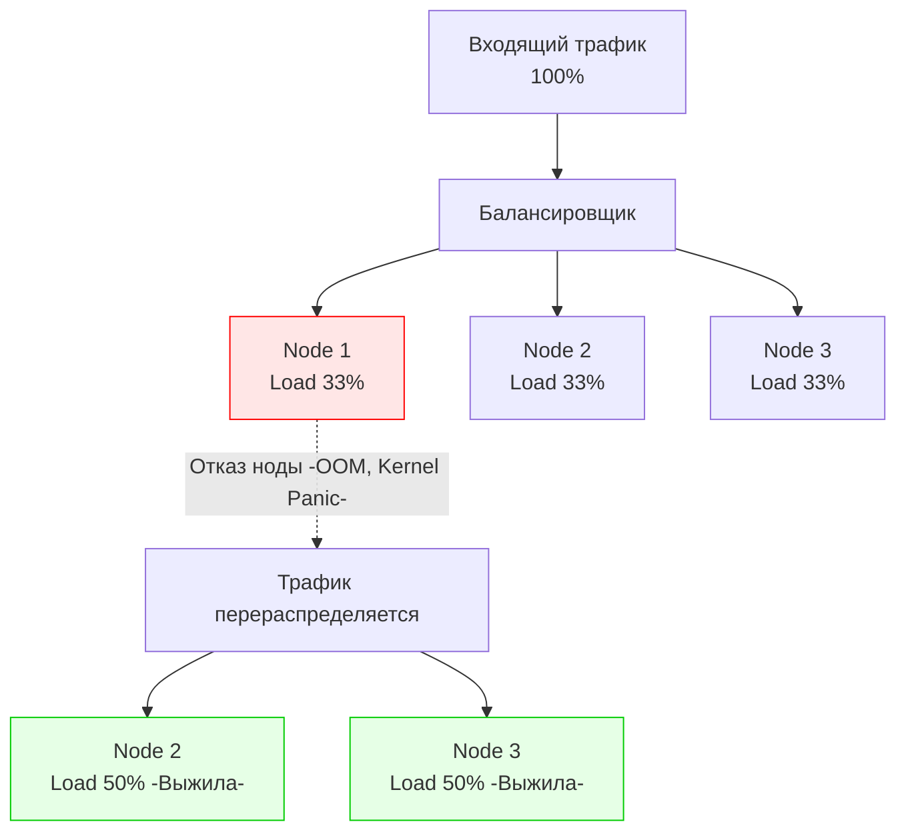

В прошлых статьях мы научились тестировать систему на прочность ([[1. Load testing]]) и ловить деградации кода в CI/CD пайплайнах ([[5. Performance regression detection]]). Теперь представим классическую ситуацию: бизнес приходит к вам и говорит: *"Через месяц Черная Пятница. Мы ожидаем рост трафика до 50 000 RPS. Сколько серверов нам нужно купить / арендовать в облаке?"*

Гадать на кофейной гуще или "просто поднять 100 подов в Kubernetes" — подход дилетанта. Избыточное железо сжигает бюджет компании, а недостаточное — приводит к каскадным отказам и потере выручки. 

**Capacity Planning (Планирование емкости)** — это инженерная дисциплина перевода бизнес-метрик (RPS, DAU) в математически обоснованные аппаратные требования (CPU, RAM, Network) с учетом архитектурных особенностей рантайма Go.

## 1. Фундамент: Закон Литтла (Little's Law)

Любое планирование начинается с теории массового обслуживания. Фундаментальная формула, которую обязан знать каждый System Architect — Закон Литтла.

Он описывает зависимость между пропускной способностью (Throughput / RPS), временем обработки (Latency) и количеством одновременно выполняемых задач (Concurrency).

Формула выглядит так:
$$ L = \lambda \times W $$

Где:
* $L$ — количество одновременно обрабатываемых запросов (Concurrent requests). В контексте Go — это **количество активных горутин**, занятых полезной работой.
* $\lambda$ — интенсивность входящего потока (RPS).
* $W$ — среднее время обработки одного запроса (Latency) в секундах.

**Пример:**
Ваш сервис должен держать 10 000 RPS. Среднее время ответа (с учетом походов в БД) составляет 50 миллисекунд (0.05 сек).
$L = 10000 \times 0.05 = 500$

Это означает, что в любую секунду времени в вашем приложении будет "висеть" 500 активных горутин-обработчиков. 

Если время ответа базы данных внезапно вырастет до 500 мс (0.5 сек), то $L = 10000 \times 0.5 = 5000$. Количество активных горутин вырастет в 10 раз! Это приведет к пропорциональному росту потребления памяти на стеки горутин и буферы, даже если RPS не изменился.

---

## 2. Планирование CPU: Масштабирование по ядрам

Рантайм Go отлично утилизирует многоядерные процессоры благодаря G-M-P планировщику. Однако зависимость не всегда строго линейная из-за накладных расходов на сборку мусора и Lock Contention (конкуренцию за мьютексы).

**Как рассчитать CPU:**
1. Вы берете эталонный стенд с 1 ядром (vCPU).
2. Подаете нагрузку до достижения 70-80% утилизации ядра. (Никогда не тестируйте до 100%, так как на 100% начинается нелинейная деградация из-за троттлинга ОС и огромных очередей планировщика).
3. Фиксируете RPS. Допустим, 1 ядро на 80% держит 2000 RPS.

Для 50 000 RPS нам нужно:
$$ Cores = \frac{50000}{2000} = 25 \text{ ядер} $$

Но это расчет для **Идеального мира**. В реальности действует закон Амдала (мы упоминали его в теоретической части). Чем больше ядер на одной машине, тем больше времени они тратят на синхронизацию кэшей (MESI) и блокировки. 
Машина на 32 ядра не будет в 32 раза быстрее 1-ядерной. Поэтому выгоднее масштабироваться горизонтально: взять 8 машин по 4 ядра, чем одну на 32.

> [!warning] Ловушка / Gotcha
> Если ваш сервис строго IO-bound (например, проксирует HTTP-запросы или ждет ответа от Redis), 500 активных горутин почти не будут потреблять CPU — они будут спать в `netpoller`. В таком сервисе одно ядро может держать десятки тысяч RPS. 
> Наоборот, для CPU-bound задач (криптография, парсинг гигантских JSON, ресайз картинок) 500 горутин на 4 ядрах приведут к жесткому голоданию (CPU Starvation), горутины будут стоять в очереди `runq`, а Latency улетит в небеса.

---

## 3. Планирование RAM: Учитываем аппетит Garbage Collector

Потребление памяти в Go — самая сложная часть для Capacity Planning. Разработчики на С++ привыкли считать: "Размер структуры 1 КБ, их миллион, значит нужно 1 ГБ памяти". В Go эта формула приведет к падению сервера с Out Of Memory (OOM).

Память Go-сервиса состоит из трех частей:

1. **Static / Base Footprint:** Исполняемый код, глобальные кэши (`sync.Map`, предвыделенные пулы).
2. **In-Flight Data:** Память, потребляемая текущими обрабатываемыми запросами ($L$ из Закона Литтла).
   * Стек горутины (минимум 2 КБ).
   * Буферы I/O (например, по умолчанию `io.Copy` или сетевые буферы могут занимать от 4 КБ до 32 КБ на соединение).
3. **GC Overhead (Мусор):** Это самая объемная часть. 

Сборщик мусора Go использует параметр `GOGC` (по умолчанию 100). Это означает, что рантайм позволяет куче (Heap) вырасти на 100% от объема "живых" данных, прежде чем запустить фазу сборки.

$$ Total Memory \approx Base + (InFlight \times \text{Size}) \times (1 + \frac{GOGC}{100}) $$

Если у вас в любой момент времени "живых" (обрабатываемых) данных на 2 ГБ, ваше приложение будет потреблять **4 ГБ** оперативной памяти ОС (так как $GOGC = 100$).

> [!tip] Собеседование
> **Вопрос:** Мы выделили поду в Kubernetes 2 ГБ RAM (Limit). Приложение потребляет 1.2 ГБ живых данных. Почему под постоянно убивает OOM-Killer?
> **Ответ:** Потому что при дефолтном `GOGC=100` приложение попытается вырасти до 2.4 ГБ (1.2 ГБ живых + 1.2 ГБ мусора) до того, как GC очистит память. Ядро Linux убьет процесс за превышение лимита в 2 ГБ (OOM). 
> **Решение:** Настроить `GOMEMLIMIT=1800MiB` (доступно с Go 1.19), чтобы рантайм Go агрессивнее собирал мусор при приближении к жесткому лимиту контейнера, предотвращая вмешательство OOM-Killer-а.

---

## 4. Сетевые квоты облаков (Bandwidth & PPS)

Бэкендеры часто забывают про сеть, считая её бесконечной. Но в облаках (AWS, GCP, Yandex Cloud) сеть жестко лимитирована в зависимости от размера виртуальной машины (VM).

Два главных лимита:
1. **Bandwidth (Пропускная способность в Мегабитах/с).**
   Рассчитывается как: $RPS \times (\text{Средний размер запроса} + \text{Средний размер ответа})$.
   Если вы отдаете JSON по 50 КБ со скоростью 5000 RPS, вы генерируете $5000 \times 50 \text{ KB} = 250 \text{ MB/s} \approx 2 \text{ Gbps}$. Дешевые виртуалки имеют лимит в 1 Gbps и начнут молча дропать пакеты на уровне гипервизора.
2. **PPS (Packets Per Second).**
   Даже если ваши payload-ы крошечные (по 100 байт), каждый HTTP-запрос — это несколько TCP-пакетов (SYN, ACK, PSH, FIN). Облачные гипервизоры накладывают жесткие ограничения на количество маршрутизируемых пакетов в секунду (часто около 100 000 – 500 000 PPS для средних инстансов). Превышение приведет к росту Retransmits и диким задержкам.

---

## 5. Правило N+1 и деградация нод

Capacity Planning не должен быть "впритык". Если по расчетам вам нужно 10 серверов, чтобы утилизировать их на 100%, вы настраиваете систему на отказ.

В Highload применяется паттерн резервирования **N+1 (или N+2 для нескольких дата-центров)**.
Вы планируете емкость так, чтобы в штатном режиме ноды были загружены максимум на 60-70%.

Если одна нода внезапно умирает (железо сгорело, OOM, сеть моргнула), её трафик мгновенно перебалансируется на оставшиеся ноды. Если они были загружены на 90%, перенос дополнительных 10% от упавшей ноды приведет к их перегрузке на 100+%, и они тоже умрут по эффекту домино (Cascading Failure), положив весь кластер.

## Итог

1. Планирование емкости строится вокруг **Закона Литтла**: $L = \lambda W$. Количество активных горутин в памяти прямо пропорционально RPS и Latency.
2. RAM планируется с учетом работы GC. Ваше приложение будет потреблять памяти кратно больше, чем объем текущих рабочих данных (регулируется `GOGC` и ограничивается `GOMEMLIMIT`).
3. При развертывании в облаке всегда проверяйте лимиты сети виртуалки на пропускную способность (Gbps) и количество пакетов (PPS).
4. Проектируйте систему под загрузку 60-70% (правило N+1), чтобы пережить отказ соседних серверов или кратковременные спайки трафика (Microbursts).

Расчет Capacity Planning необходим для закупки железа (Bare-Metal) или формирования базового пула серверов в облаке. Но трафик днем и ночью отличается в разы. Зачем платить за сервера, которые ночью простаивают? Для решения этой проблемы поверх заранее спланированной архитектуры мы внедряем динамическое управление. Об этом — в нашей следующей статье: [[7. Autoscaling]].