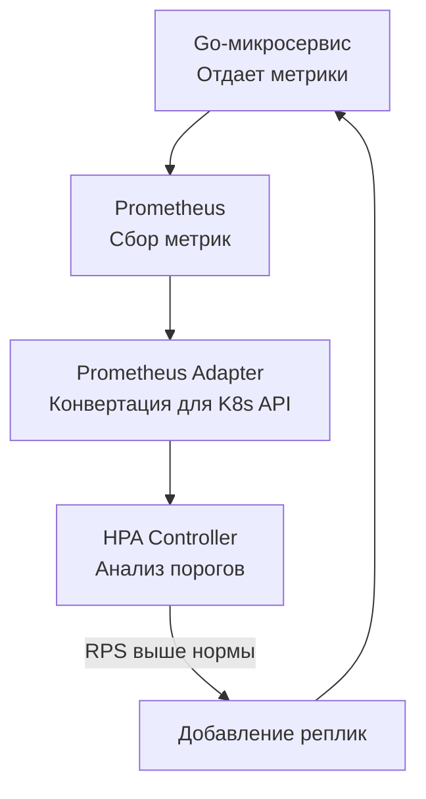

В прошлой статье [[6. Capacity planning]] мы рассчитали, сколько "железа" нам нужно для выживания в час пик (например, в Черную Пятницу). Но трафик в интернете не статичен. Ночью он может падать в 10 раз по сравнению с вечерним прайм-таймом. 

Держать зарезервированные под пик мощности 24/7 — это сжигать деньги бизнеса. Чтобы инфраструктура была эластичной, поверх Capacity Planning настраивается **Автомасштабирование (Autoscaling)**. 

В мире Cloud-Native (Kubernetes) и Go-бэкенда автомасштабирование работает великолепно благодаря феноменально быстрому старту бинарников Go. Однако неправильная настройка метрик или игнорирование жизненного цикла приложения приведет к тому, что автоскейлинг либо убьет ваш сервис, либо будет обрывать соединения пользователям.

## 1. Горизонтальное vs Вертикальное масштабирование

В Kubernetes существует два основных подхода:
1. **VPA (Vertical Pod Autoscaler)**: Динамическое изменение `requests` и `limits` (CPU/RAM) для существующего пода.
2. **HPA (Horizontal Pod Autoscaler)**: Изменение *количества* подов (реплик) в зависимости от нагрузки.

> [!info] Под капотом
> Для Go-приложений **VPA использовать крайне не рекомендуется**. 
> Во-первых, VPA в K8s часто требует перезапуска пода для применения новых лимитов памяти. Во-вторых, рантайм Go (в частности Garbage Collector) сильно завязан на доступную память (особенно если вы используете `GOMEMLIMIT`). Динамическое изменение RAM "на лету" без перезапуска может запутать планировщик Go и привести к агрессивному GC pacing или OOM.

Стандарт индустрии для Highload — **HPA (Горизонтальное автомасштабирование)**. Go-микросервисы идеально подходят для этого: они stateless (не хранят состояние сессии внутри себя), потребляют мало памяти и готовы обрабатывать трафик уже через пару миллисекунд после запуска процесса.

---

## 2. Mechanical Sympathy: Ловушка CPU-метрик

По умолчанию большинство туториалов предлагают настраивать HPA по утилизации CPU (например, `targetCPUUtilizationPercentage: 80`). 

Для языков вроде Python или Ruby это работает хорошо: пришел трафик, GIL заблокировался, CPU улетел в 100%, HPA добавил подов. 
Но с Go это **самая опасная ловушка**.

Вспомним модель `netpoller` из [[1. Load testing]]. Если ваш микросервис занимается перекладыванием JSON из HTTP в базу данных (IO-bound задача), ваши горутины будут 99% времени спать, ожидая ответа от сети. 

**Сценарий катастрофы:**
1. Начинается наплыв пользователей. RPS растет с 1000 до 10000.
2. Go легко создает 10 000 горутин. Они открывают 10 000 TCP-соединений к базе данных.
3. Процессор (CPU) при этом загружен всего на 15%, потому что основная работа ядра — просто парковать горутины.
4. HPA смотрит на CPU: "О, всего 15% (а порог 80%). Масштабироваться не нужно!".
5. Под исчерпывает пул соединений с БД, память раздувается от буферов 10000 горутин, и ядро Linux убивает процесс по нехватке файловых дескрипторов (OOM / FD Exhaustion).

**Решение:** Автомасштабирование в Go **обязано** строиться на Custom Metrics (кастомных метриках), а не на голом CPU.

### HPA + Prometheus Adapter

В высоконагруженных системах HPA связывают с сервером метрик (например, Prometheus) через Prometheus Adapter. Вы скейлитесь не по CPU, а по бизнес-метрикам или метрикам инфраструктуры:

* **HTTP Requests Per Second (RPS)**: Идеально для API-шлюзов. Если на под приходится > 500 RPS, добавляем реплику.
* **Queue Length (Длина очереди)**: Идеально для воркеров-потребителей. Если в RabbitMQ / Kafka скопилось больше 1000 сообщений, поднимаем больше воркеров.
* **Active Connections**: Количество открытых WebSocket или TCP-соединений.



> [!info] Под капотом
> Сегодня стандартом де-факто для сложного масштабирования стал **KEDA (Kubernetes Event-driven Autoscaling)**. KEDA позволяет настраивать Scale-to-Zero (масштабирование в ноль, если нет сообщений) и умеет читать длину лага из Kafka или Redis напрямую, минуя сложные цепочки с Prometheus Adapter.

---

## 3. Проблема инерции и прогрева (Cold Start)

Когда HPA принимает решение "Нам нужно больше подов", новые мощности не появляются мгновенно.
1. K8s должен найти свободную ноду и запустить контейнер (1-3 секунды).
2. Если нод не хватает, Cluster Autoscaler заказывает новую виртуалку в облаке (AWS/GCP), что занимает **от 1 до 5 минут**.
3. Когда Go-бинарник стартует, он сталкивается с проблемой "Холодного старта" кэшей и пулов коннектов (о чем мы подробно говорили в [[4. Canary releases]]).

Если трафик растет резким спайком (Spike), автоскейлинг просто **не успеет**. Пока поднимаются новые поды, старые захлебнутся от нагрузки.

**Как бороться с инерцией?**
* **Overprovisioning (Перезаклад ресурсов)**: Всегда держите порог масштабирования ниже критического. Если под "умирает" на 2000 RPS, настройте скейлинг на 1200 RPS. Это даст запас прочности (буфер) на те 2-3 минуты, пока поднимаются новые сервера.
* **Readiness Probes с прогревом**: Не отдавайте трафик на новый Go-под сразу после старта функции `main`. Реализуйте "прогрев" (warm-up) в коде: сделайте пару фиктивных запросов в БД, чтобы инициализировать пулы соединений (`database/sql`), и только потом возвращайте `200 OK` на Readiness-пробу Kubernetes.

---

## 4. Масштабирование вниз и Graceful Shutdown

Самая сложная часть Autoscaling — это **Scale Down** (уменьшение количества подов, когда нагрузка спала). 

Когда K8s решает убить под, он не спрашивает ваше приложение, готово ли оно. Он отправляет процессу сигнал **SIGTERM**, ждет `terminationGracePeriodSeconds` (по умолчанию 30 секунд), а затем жестко убивает процесс сигналом **SIGKILL**.

Если ваш Go-сервер при получении `SIGTERM` просто завершает функцию `main`, все клиенты, чьи запросы сейчас обрабатывались (а также транзакции в БД, которые коммитились в этот момент), получат оборванные TCP-соединения, потерянные данные и HTTP 502/504.

Вы **обязаны** реализовать паттерн **Graceful Shutdown (Плавное завершение)**.

```go
package main

import (
	"context"
	"log"
	"net/http"
	"os"
	"os/signal"
	"syscall"
	"time"
)

func main() {
	srv := &http.Server{
		Addr:    ":8080",
		Handler: myRouter(),
	}

	// 1. Запускаем сервер в отдельной горутине
	go func() {
		if err := srv.ListenAndServe(); err != nil && err != http.ErrServerClosed {
			log.Fatalf("listen: %s\n", err)
		}
	}()

	// 2. Создаем канал для прослушивания сигналов ОС
	quit := make(chan os.Signal, 1)
	// K8s отправляет SIGTERM при удалении пода (Scale Down)
	// Ctrl+C в терминале отправляет SIGINT
	signal.Notify(quit, syscall.SIGINT, syscall.SIGTERM)

	// 3. Блокируем main горутину до получения сигнала
	<-quit
	log.Println("Shutting down server...")

	// 4. Даем серверу контекст с таймаутом на завершение текущих запросов
	// Таймаут должен быть МЕНЬШЕ, чем terminationGracePeriodSeconds в K8s!
	ctx, cancel := context.WithTimeout(context.Background(), 25*time.Second)
	defer cancel()

	// 5. srv.Shutdown: 
	// - Немедленно закрывает порт для новых подключений.
	// - Ждет, пока завершатся все активные текущие запросы (или пока не истечет ctx).
	if err := srv.Shutdown(ctx); err != nil {
		log.Fatalf("Server forced to shutdown: %v", err)
	}

	log.Println("Server exiting")
}
```

> [!tip] Собеседование
> **Вопрос:** Если мы реализовали Graceful Shutdown, гарантирует ли это, что клиенты не получат HTTP 502 во время Scale Down?
> **Ответ:** Нет, не гарантирует. Между моментом, когда K8s отправляет `SIGTERM` вашему поду, и моментом, когда Ingress/LoadBalancer исключает IP вашего пода из таблицы маршрутизации, есть задержка (асинхронное обновление iptables/IPVS). В эти миллисекунды балансировщик может направить *новый* запрос на ваш под, который уже вызвал `srv.Shutdown()` и перестал принимать новые соединения. 
> **Хардкорный фикс:** Добавьте `time.Sleep(5 * time.Second)` в ваш обработчик `SIGTERM` *перед* вызовом `srv.Shutdown()`. Под начнет фейлить Readiness пробу (исключая себя из балансировщика), но продолжит принимать случайные "опоздавшие" подключения, пока маршруты сети не обновятся.

## Итог

1. Масштабируйте Go-сервисы горизонтально (HPA).
2. Никогда не масштабируйте IO-bound приложения на Go исключительно по метрикам CPU. Используйте кастомные метрики (RPS, глубина очередей) через Prometheus Adapter или KEDA.
3. Учитывайте время прогрева (Cold Start) пулов соединений и кэшей. Закладывайте запас прочности, чтобы пережить инерцию добавления новых нод в кластер.
4. Scale Down так же важен, как и Scale Up. Без правильного `Graceful Shutdown` с перехватом `SIGTERM` автомасштабирование будет вызывать всплески ошибок у клиентов.

Настроив автомасштабирование, мы передали управление инфраструктурой автоматам. Поды создаются и уничтожаются сотнями, трафик перераспределяется. В этом хаосе старые методы дебага (чтение логов через SSH) перестают работать. Нам нужна система, которая позволит видеть весь кластер как на ладони. Следующая статья открывает новый важнейший блок высоконагруженных систем: [[8. Observability и performance]].