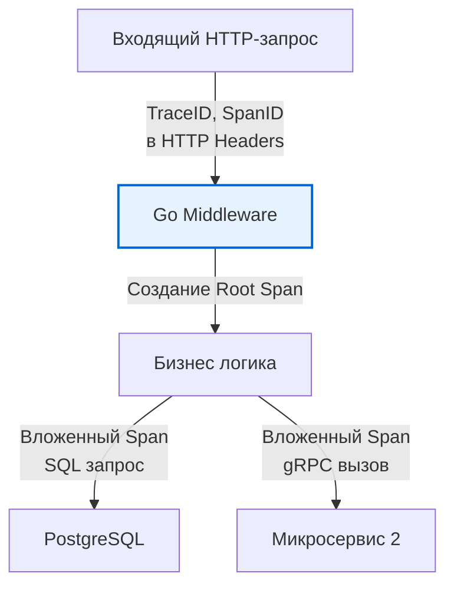

В прошлой статье [[7. Autoscaling]] мы отдали управление инфраструктурой на откуп алгоритмам Kubernetes. Поды теперь создаются и уничтожаются динамически, в зависимости от нагрузки. В такой распределенной, эфемерной среде классические методы отладки (зайти по SSH, сделать `tail -f` логов или поймать проблему локально под дебаггером) перестают работать. 

Когда у вас 50 инстансов микросервиса, и каждый 1000-й запрос обрабатывается дольше 2 секунд, вы не можете угадать причину. Вам нужно сделать систему **Наблюдаемой (Observable)**.

В контексте хардкорной инженерии производительности, **Observability (Наблюдаемость)** — это не просто дашборды с красивыми графиками. Это способность системы отвечать на вопросы, которые вы *не планировали* задавать заранее, основываясь на данных, которые она экспортирует наружу (Метрики, Логи и Трассировки — "Три столпа Observability").

Но у Observability есть темная сторона: генерация, сериализация и отправка телеметрии — это тоже код. И если написать его неэффективно, ваша система наблюдения "съест" ресурсы вашего бизнес-приложения.

---

## 1. Метрики (Prometheus): Дешево и сердито

Метрики — это агрегированные числовые показатели с тегами (лейблами), привязанные к метке времени (Time Series). Они идеальны для отслеживания макро-состояния системы (Latency, RPS, Error Rate).

В Go стандартом де-факто является экосистема **Prometheus**. Prometheus использует **Pull-модель**: ваш Go-сервис не тратит сетевые и CPU-ресурсы на отправку метрик куда-либо. Он просто инкрементирует переменные в памяти (под мьютексами или атомиками) и выставляет легковесный HTTP-эндпоинт `/metrics`, который Prometheus опрашивает раз в 10-15 секунд.

### Mechanical Sympathy: Стоимость метрик

Увеличение счетчика в Prometheus-клиенте для Go стоит всего несколько наносекунд. Под капотом `prometheus/client_golang` использует массивы структур с правильным выравниванием для борьбы с False Sharing (см. [[8. False sharing]]), чтобы сотни горутин могли инкрементировать метрику одновременно, не блокируя друг друга.

Но главная угроза метрик — это не процессор, а оперативная память.

> [!warning] Ловушка / Gotcha
> **Cardinality Explosion (Взрыв кардинальности)**
> Каждая уникальная комбинация лейблов (тегов) метрики создает *новый отдельный объект* (тайм-серию) в памяти вашего Go-приложения и в самом сервере Prometheus.
> 
> ```go
> // ПЛОХО: Лейбл user_id уникален для миллионов пользователей
> requestDuration.WithLabelValues("GET", "/api/v1/profile", "user_123456").Observe(0.5)
> ```
> Если вы добавите `user_id`, `session_id` или сырой URL с query-параметрами в качестве лейбла, память вашего сервиса всосет гигабайты структур за несколько минут (OOM). 
> **Правило:** Используйте в метриках только перечисления (enum) с конечным, небольшим набором значений (HTTP статусы 200/404/500, статические роуты, имена микросервисов).

### runtime/metrics

Начиная с версии 1.16 (и значительно расширено в 1.21), в Go появился пакет `runtime/metrics`. Он предоставляет стандартизированный доступ к десяткам внутренних метрик рантайма с околонулевым оверхедом:
* `/gc/pauses:seconds` — распределение (гистограмма) длительности Stop-The-World пауз.
* `/sched/goroutines:goroutines` — количество активных горутин.
* `/memory/classes/heap/objects:bytes` — размер живых объектов в куче.

Если ваш сервис испытывает спайки Latency, первый график, на который вы должны посмотреть — это GC Pauses.

---

## 2. Distributed Tracing (OpenTelemetry): Анатомия задержек

Метрики покажут вам, *что* `p99 latency` выросла до 2 секунд. Но они не скажут *почему*. 
Для этого нужна **Распределенная Трассировка (Distributed Tracing)**.

Трассировка прокидывает уникальный `TraceID` через все слои и микросервисы. Каждая операция (поход в БД, запрос в Redis, работа бизнес-логики) становится "Спаном" (`Span`) с началом и концом. 



В Go трассировка неразрывно связана с `context.Context`. Вы прокидываете `ctx` во все функции именно для того, чтобы OpenTelemetry мог "прицепить" новый Span к текущему дереву.

### Цена контекста и трассировки

> [!info] Под капотом
> `context.Context` в Go — это иммутабельное дерево (связный список). Вызов `context.WithValue` (который используется для прокидывания TraceID) создает **новый узел** этого дерева. 
> Поскольку интерфейс `context.Context` должен пережить текущий фрейм, этот новый узел почти всегда аллоцируется в куче (Escape Analysis отправляет его туда). 

Кроме того, сборщик трасс (Tracer) должен зафиксировать время начала `time.Now()`, время конца, собрать атрибуты (строки) и отправить их в коллектор (Jaeger / Tempo). 
На высоконагруженных системах (10 000+ RPS) тотальная трассировка может сожрать до 30% ресурсов CPU сети.

**Как оптимизировать (Паттерны Sampling-а):**
1. **Head-based Sampling (Сэмплирование на входе):** API Gateway решает (например, с шансом 1%), трассировать этот запрос или нет. Если нет — он передает пустой контекст (noop tracer), и Go-сервис вообще не тратит ресурсы на создание спанов. Это самый быстрый метод, но вы можете упустить те самые редкие долгие запросы.
2. **Tail-based Sampling (Сэмплирование на выходе):** Go-сервис генерирует трассы *для всех* запросов, но отправляет их в локальный агент (OpenTelemetry Collector). Агент буферизует их и решает сохранить трассу *только если* в ней была ошибка (HTTP 5xx) или она длилась дольше SLA. Это нагружает Go-сервис, но дает 100% покрытие проблемных кейсов.

---

## 3. Логирование для Highload: Zero-Allocation Logs

Логирование — самый старый и дорогой вид телеметрии. В мире микросервисов логи пишутся в `stdout`, подхватываются агентом (Filebeat / Promtail) и летят в хранилище (Elasticsearch / Loki).

Классический пакет `log` из стандартной библиотеки блокирует мьютекс при каждой записи (чтобы строки не перемешались). Вызов `fmt.Sprintf` внутри `log.Printf` гарантирует аллокации строк в куче (см. [[1. Уменьшение аллокаций]]).

В Highload это недопустимо. Идиоматичный современный подход — использование **Структурированного логирования (Structured Logging)** с JSON-выводом и минимальным оверхедом.

> [!tip] Собеседование
> **Вопрос:** Почему библиотека `uber-go/zap` работает в десятки раз быстрее стандартного логера или `logrus`?
> **Ответ:** Во-первых, `zap` избегает рефлексии и Boxing-а. Вместо передачи `interface{}` (`zap.Any`), он предоставляет строго типизированные поля (`zap.Int`, `zap.String`). 
> Во-вторых, под капотом `zap` использует `sync.Pool` для переиспользования байтовых буферов (см. [[2. sync Pool]]). Он пишет JSON-строку напрямую в переиспользуемый буфер без промежуточных аллокаций памяти.

С выходом Go 1.21 в стандартной библиотеке появился пакет `log/slog`, который перенял лучшие практики `zap`. 

**Правила высокопроизводительного логирования:**
1. **Никакой конкатенации в параметрах:** Никогда не делайте так: `logger.Debug("user " + id + " loaded")`. Даже если уровень логов выставлен в `Info`, конкатенация строк (или вызов `fmt.Sprintf`) будет выполнена *до* передачи в функцию. 
2. Идиоматичный способ: `logger.Debug("user loaded", slog.String("id", id))`. Если уровень `Debug` отключен, функция выйдет сразу, не выполняя дорогостоящую сериализацию полей.
3. Логируйте только переходы состояний (State changes), ошибки и бизнес-события. Не используйте логи как замену трассировкам (не пишите "entered func X", "exited func X" — для этого есть OpenTelemetry).

---

## Синергия (Exemplars)

Высший пилотаж Observability — это **Exemplars (Экземпляры)**. Это механизм связи метрик и трассировок.

Когда вы смотрите на дашборд Grafana и видите, что в гистограмме `http_request_duration` есть один пиксель в районе 2.5 секунд, вам не нужно идти в Jaeger и искать трассу по времени.
Exemplars позволяют прикрепить `TraceID` прямо к конкретному наблюдению (bucket-у) в Prometheus. Вы кликаете на точку графика в Grafana и мгновенно переходите в детальную трассировку этого конкретного долгого запроса. Это сокращает время отладки в production (MTTR) с часов до секунд.

## Итог

1. Observability стоит процессорных циклов и памяти. Неконтролируемая телеметрия может стать причиной деградации (эффект Наблюдателя).
2. Остерегайтесь **Cardinality Explosion** в Prometheus. Лейблы должны быть конечными словарями.
3. Трассировки (OpenTelemetry) создают аллокации через `context.Context`. Используйте стратегии сэмплирования, чтобы снизить нагрузку.
4. Для логов используйте zero-allocation логеры (типа `zap` или `slog`), избегайте конкатенации строк и `interface{}` в горячих путях.

Мы обвешали наш сервис метриками, логами и трассировками. Мы видим каждый чих рантайма Go. У нас есть сотни графиков. Но какие из них действительно важны для бизнеса? Как понять, что p99 равный 150ms — это инцидент, а 145ms — это норма? Чтобы перевести технические метрики на язык бизнес-гарантий, мы переходим к финальной части обеспечения надежности: [[9. SLO и SLA]].