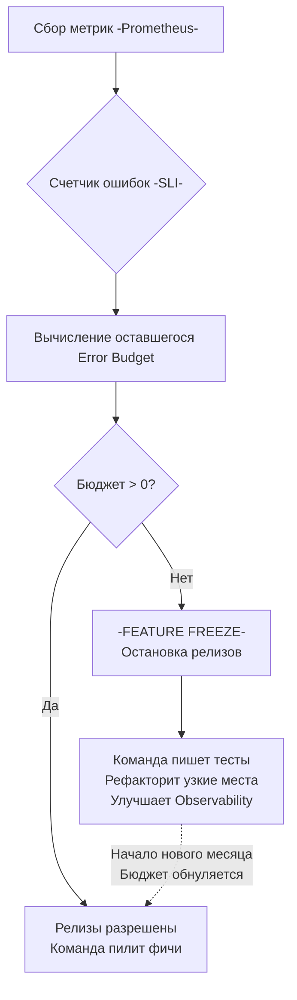

В прошлой статье [[8. Observability и performance]] мы научились собирать технические метрики: RPS, потребление памяти, время пауз Garbage Collector-а и задержки процессора. У нас есть идеальные дашборды, на которых видны любые всплески. 

Но здесь возникает фундаментальная проблема перехода от инженера-разработчика к роли System Architect / Principal. Графики сами по себе бессмысленны. Если `p99 latency` вашего Go-сервиса выросла с 50 мс до 150 мс — это инцидент? Нужно ли будить команду посреди ночи? Нужно ли откладывать релиз новой фичи и срочно переписывать код?

На этот вопрос невозможно ответить, глядя только в код или на графики Prometheus. Ответ лежит в плоскости бизнес-гарантий. В мире SRE (Site Reliability Engineering) и Highload для этого используется триада понятий: **SLI, SLO и SLA**.

---

## 1. Терминология: SLI, SLO, SLA

Эти три акронима часто путают, но они описывают абсолютно разные уровни абстракции — от технических метрик до юридических контрактов.

### SLI (Service Level Indicator) — Индикатор
Это конкретная, измеримая метрика, которая отражает пользовательский опыт. Это факт.
* **Плохой SLI:** Средняя загрузка CPU на серверах равна 45%. (Пользователю плевать на ваш CPU, он хочет получить ответ от API).
* **Хороший SLI:** Процент HTTP-запросов, завершившихся со статусом `200 OK`, деленный на общее количество валидных запросов.
* **Хороший SLI:** `p99 latency` отдачи профиля пользователя (как мы обсуждали в [[6. Метрики. p50, p95, p99]]).

### SLO (Service Level Objective) — Цель
Это целевое значение для вашего SLI, согласованное с бизнесом. Это внутренний инженерный стандарт, к которому вы стремитесь. 
* **Пример:** 99.9% всех запросов к эндпоинту `/api/v1/checkout` должны завершаться без серверных ошибок (5xx).
* **Пример:** `p99 latency` для получения ленты постов должна быть меньше 250 миллисекунд на интервале в 5 минут.

### SLA (Service Level Agreement) — Соглашение (Контракт)
Это юридический и финансовый договор с клиентами (или смежными отделами). SLA говорит: *"Что будет, если мы не выполним SLO"*. 
* **Пример:** Если доступность API падает ниже 99.5% в месяц, мы возвращаем B2B-клиентам 20% от их абонентской платы.
* Как инженеры, мы редко определяем SLA (это работа юристов и менеджеров), но **наш SLO всегда должен быть строже, чем SLA**. Если SLA требует 99.5%, ваш внутренний SLO должен быть 99.9%, чтобы у вас был запас времени на реакцию до того, как компания начнет терять деньги.

---

## 2. Mechanical Sympathy: Физика целей (Physics of SLOs)

При постановке SLO часто совершается ошибка — менеджеры просят "100% доступность" или "p99 < 1ms". С точки зрения хардкорной инженерии это физически и математически невозможно или стоит неадекватных денег.

Почему 100% доступности не существует?
1. **Сеть нестабильна:** TCP-пакеты дропаются на транзитных маршрутизаторах (BGP leaks, обрывы оптоволокна).
2. **Аппаратные сбои:** Диски умирают, оперативная память ловит космические лучи (Bit flips).
3. **Рантайм Go:** Даже идеально оптимизированный код с применением zero-allocation подходов иногда сталкивается с паузами планировщика ОС или редкими Stop-The-World фазами Garbage Collector-а. Если ваша цель — 1ms, одна пауза GC в 2ms уничтожит ваш SLO.

> [!tip] Собеседование
> **Вопрос:** Бизнес требует, чтобы ваш HTTP API отвечал за 5 миллисекунд в 99.99% случаев (p99.99 < 5ms). Клиенты находятся в Европе, а ваши сервера — в США. Возможно ли это выполнить?
> **Ответ:** Физически невозможно. Свет проходит в вакууме ~300 км за 1 мс. В оптоволокне скорость ниже. Путь от Европы (например, Франкфурт) до США (Нью-Йорк) и обратно занимает минимум 80-90 мс только на сетевую маршрутизацию (Round Trip Time), не считая TLS Handshake. Инженер обязан знать ограничения физики при постановке SLO.

---

## 3. Error Budget (Бюджет на ошибки)

Самый мощный инструмент, который дает нам концепция SLO — это **Бюджет на ошибки**.

Если ваш SLO равен 99.9% успешных запросов, это означает, что вам математически разрешено потерять 0.1% запросов. **Это и есть ваш Error Budget.**

Бюджет на ошибки — это не "плохо". Это валюта, которую вы тратите на инновации, релизы и эксперименты (те же [[4. Canary releases]]). Любой деплой — это риск. Если вы будете требовать 100% надежности, вы никогда не сможете обновлять приложение.

### Как это работает на практике

Допустим, ваш сервис обрабатывает 10 000 000 запросов в месяц.
Ваш SLO: 99.9% успешных (200 OK).
Ваш Error Budget: 10 000 запросов (0.1%).

Пока количество ошибок 5xx за месяц меньше 10 000 — разработчики могут выкатывать новые фичи, рефакторить код, экспериментировать с настройками `GOMEMLIMIT`. Вы "в бюджете". Бизнес счастлив.

Но если неудачный релиз сгенерировал 8 000 ошибок за один час (инцидент), ваш бюджет сгорает.



**Feature Freeze (Заморозка фич)** — это жесткое правило SRE. Если бюджет исчерпан, продуктовая разработка останавливается. Вся команда (Backend, QA, DevOps) бросает задачи из JIRA и занимается исключительно повышением надежности (Postmortems, оптимизация аллокаций, кэширование, масштабирование). 

> [!warning] Ловушка / Gotcha
> Ошибка измерения: вы настроили SLI на чтение логов Nginx (считаете 500-е статусы). Сервер Nginx упал по OOM (Out Of Memory) на 10 минут. Клиенты получали ошибку таймаута TCP, но в логах Nginx этих ошибок нет, так как он лежал! По вашему SLI у вас 100% доступности, а клиенты в ярости.
> **Правило:** Метрики для SLI должны собираться максимально близко к клиенту (например, на внешнем Load Balancer-е или API Gateway, а в идеале — прямо на клиентском приложении/фронтенде).

---

## 4. Как измерять SLI для latency в Go?

Измерять "успешность" (процент 200 OK) легко. Измерять Latency (задержку) сложнее. 
Как мы помним, среднее значение (Average) врет. Нам нужны перцентили. В экосистеме Prometheus для этого используются **Histograms (Гистограммы)**.

```go
import (
	"[github.com/prometheus/client_golang/prometheus](https://github.com/prometheus/client_golang/prometheus)"
	"[github.com/prometheus/client_golang/prometheus/promauto](https://github.com/prometheus/client_golang/prometheus/promauto)"
)

// Определяем гистограмму с бакетами (корзинами)
var requestDuration = promauto.NewHistogramVec(prometheus.HistogramOpts{
	Name: "http_request_duration_seconds",
	Help: "Duration of HTTP requests.",
	// Бакетирование критически важно для SLO!
	// Если SLO: 99% запросов < 100ms, нам обязательно нужен бакет на 0.1s
	Buckets: []float64{0.01, 0.05, 0.1, 0.25, 0.5, 1.0, 5.0},
}, []string{"handler"})

func myHandler(w http.ResponseWriter, r *http.Request) {
	start := time.Now()
	defer func() {
		// Записываем время выполнения
		requestDuration.WithLabelValues("/api/v1/data").Observe(time.Since(start).Seconds())
	}()
	
	// Полезная работа...
}
```

Почему важно задать правильные `Buckets`? Prometheus не хранит каждое значение времени. Он считает, сколько запросов попало в корзину "до 100мс", "до 250мс" и т.д. 

Для вычисления SLO (например, цель: 99% быстрее 100мс) в Grafana используется PromQL-запрос, который делит количество запросов в корзине `<= 0.1` на общее количество запросов:

```promql
sum(rate(http_request_duration_seconds_bucket{le="0.1"}[5m]))
/
sum(rate(http_request_duration_seconds_count[5m]))
```
Если результат этого деления равен `0.995` (99.5%), ваш SLO выполняется! Если падает до `0.98` — бюджет начинает сгорать.

---

## Итог раздела

1. **SLA** — это контракт с клиентом (деньги). **SLO** — цель инженеров. **SLI** — измеряемый факт.
2. SLO переводит перформанс-инженерию из разряда "чем быстрее, тем лучше" в разряд "достаточно быстро для бизнеса". Не тратьте месяцы на оптимизацию микросекунд (Zero allocation), если ваш SLO выполняется, а Error Budget цел.
3. **Error Budget** — это инструмент примирения бизнеса и инженеров. Он математически обосновывает, когда можно катить фичи, а когда необходимо платить технический долг и заниматься надежностью.
4. При замерах SLI помните про физику серверов и сетей, и собирайте метрики как можно ближе к реальному пользователю.

Поздравляю! Мы полностью завершили огромный раздел «Highload», охватывающий путь от нагрузочного тестирования до бизнес-метрик. Мы умеем писать сверхбыстрый код на Go, профилировать его, безопасно доставлять в production и гарантировать его надежность.

Но как бы мы ни старались, баги случаются. Горутины могут заблокироваться друг на друге в мертвой петле (Deadlock), данные могут повредиться (Data Race), а память — начать утекать по вине сторонней библиотеки. Чтобы бороться с этим, мы переходим к следующему фундаментальному разделу нашей базы знаний: [[1. Debugging в Go]].