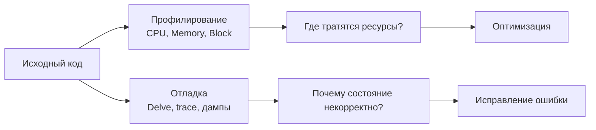
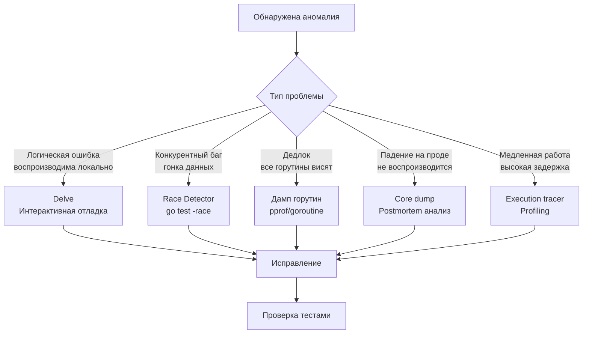

## Debugging в Go: философия и инструментарий

В предыдущих подразделах мы подробно изучили, как измерять производительность ([[1. Обзор раздела. Как мыслить о производительности]], [[2. Benchmarking в Go]]), снимать и анализировать профили ([[2. CPU profiling в Go]], [[5. pprof memory profile]]), работать со сборщиком мусора ([[1. GC в Go. Обзор]]) и конкурентностью ([[1. Scheduler Go. G M P модель]]). Но любой инженер знает: программа может быть быстрой как молния, но если она делает не то, что задумано, — это мусор. **Отладка** (debugging) — это искусство поиска и устранения логических ошибок, аномального поведения и причин падений.

В экосистеме Go отладка занимает особое место. Статическая типизация, отсутствие исключений и идиоматичная обработка ошибок сокращают класс ошибок, с которыми сталкиваются разработчики на динамических языках. Но конкурентность, сборщик мусора, сложная модель памяти и взаимодействие с ОС порождают собственный спектр проблем: гонки данных, дедлоки, утечки горутин, трудноуловимые баги, зависящие от таймингов. Поэтому Senior Go-инженер должен владеть всем спектром отладочных инструментов — от интерактивного Delve до анализа core dump'ов и статического анализа.

Эта статья открывает подраздел «Debugging» и задаёт обзорную карту: классифицирует методы отладки, показывает их связь с уже изученными техниками профилирования и runtime-инструментами, и обозначает роль механической эмпатии ([[5. Mechanical sympathy в backend разработке]]) в процессе поиска ошибок. Следующие статьи глубоко погружаются в каждый инструмент: [[2. Delve debugger]], [[3. Race detector в проде]], [[4. Логи и debugging]], [[5. Postmortem анализ]], [[6. Core dumps]], [[7. Debugging latency проблем]].

## Отладка против профилирования: два разных вопроса

Часто новички путают отладку и профилирование, потому что оба используют pprof и `go tool trace`. Но цели у них противоположны:

- **Профилирование** спрашивает: «Почему программа *медленная*?» Ответ — в распределении тактов и аллокаций.
- **Отладка** спрашивает: «Почему программа работает *неправильно*?» Ответ — в конкретном состоянии, которое привело к ошибочному поведению.

Профилирование — это анализ **агрегированных характеристик** за период времени. Отладка — это анализ **конкретного среза состояния** или **конкретного пути исполнения**. При этом инструменты пересекаются: дамп горутин ([[4. goroutine dump]]) может использоваться и для поиска утечек (производительность), и для обнаружения дедлока (отладка). Execution tracer ([[3. execution tracer]]) показывает и задержки, и причинно-следственную связь между блокировками. Поэтому отладка и профилирование дополняют друг друга.

## Классификация методов отладки в Go

Отладочные техники можно разбить на несколько слоёв — от статического анализа до postmortem-исследования.

### 1. Статический анализ на этапе компиляции

Самый дешёвый способ отладки — не допускать ошибки в код. В Go для этого есть:
- **Встроенные анализаторы `go vet`** — проверки на копирование мьютексов, неправильные printf, неиспользуемые переменные, подозрительные конструкции.
- **`staticcheck`** (интегрируется с `golangci-lint`) — сотни дополнительных проверок: от некорректного использования `time.Tick` до забытых `defer`.
- **`golang.org/x/tools/go/analysis/passes/fieldalignment`** — проверка порядка полей структур ([[9. Cache line и выравнивание]]).

Эти инструменты должны работать в CI/CD как обязательный этап, предотвращая целые классы ошибок ещё до запуска.

### 2. Логирование как основа наблюдаемости

Логи с правильной структурой и Correlation ID ([[7. Correlation ID]]) — это самый доступный способ понять, что происходило в системе в момент ошибки. В отличие от интерактивного отладчика, логи работают в production без задержек и доступны для postmortem-анализа. Современный Go предлагает `slog` для структурированного логирования, интегрированный с контекстом и трассировкой. Подробнее — в [[4. Логи и debugging]].

### 3. Интерактивная отладка с Delve

[Delve](https://github.com/go-delve/delve) (`dlv`) — это полноценный отладчик уровня исходного кода. Позволяет ставить точки останова, инспектировать переменные, трассировать вызовы, переключаться между горутинами и даже выполнять удалённую отладку. Delve незаменим, когда нужно пройти шаг за шагом по конкретному пути исполнения и понять, почему переменная получила неожиданное значение. Детальный разбор — [[2. Delve debugger]].

Однако Delve имеет серьёзные ограничения: он замедляет исполнение (использует `ptrace` и сигналы), что делает его непригодным для продакшена и искажает поведение конкурентных программ. Поэтому его используют локально или на стейджинг-окружении.

### 4. Дампы и профили как снимки состояния

Когда интерактивная отладка недоступна, на помощь приходят **снимки состояния** рантайма:

- **Дамп горутин** (`/debug/pprof/goroutine?debug=2`, `runtime.Stack`, `SIGQUIT`) — показывает, что прямо сейчас делает каждая горутина. Идеален для поиска дедлоков, утечек и "зависших" обработчиков. Подробно в [[4. goroutine dump]].
- **Профили в реальном времени** (CPU, memory, block, mutex) — не только для производительности. Например, block profile ([[5. block profile]]) может показать, что горутина навсегда застряла на `chan send`.
- **Execution tracer** ([[3. execution tracer]]) — позволяет «прокрутить» историю и увидеть, какая горутина и когда заблокировала другую. Это мощнейший инструмент для отладки конкурентных багов.

### 5. Трассировка планировщика (scheduler trace)

Включение `GODEBUG=schedtrace=1000` ([[7. scheduler trace]]) даёт моментальный срез состояния планировщика. В сочетании с дампом горутин это позволяет быстро оценить, не перегружен ли планировщик, не утекли ли потоки M.

### 6. Детектор гонок (race detector)

`go build -race` встраивает в программу детектор гонок данных. Он отслеживает все обращения к памяти и сигнализирует о несинхронизированных одновременных доступах. Race detector — обязательный этап тестирования конкурентного кода, но его overhead (5-10x CPU, 5-10x память) делает его неприменимым в production на постоянной основе. О том, как точечно использовать его в production для диагностики, расскажет [[3. Race detector в проде]].

### 7. Postmortem анализ

Когда программа падает с паникой или аварийно завершается (SIGSEGV), на помощь приходит **postmortem анализ** — изучение core dump'а и логов после остановки. Go позволяет записать core dump через `GOTRACEBACK=crash` или через сигналы ОС, а затем проанализировать его с помощью Delve. Это единственный способ понять причину краша, который невозможно воспроизвести локально. Методология описана в [[5. Postmortem анализ]] и [[6. Core dumps]].

### 8. Отладка проблем задержек

Особый класс ошибок — когда программа работает корректно, но слишком медленно. Здесь отладка смыкается с профилированием. Специализированные техники: анализ хвостовой задержки через `go tool trace`, поиск "долгих" горутин через execution tracer, использование пользовательских задач и регионов. Этому посвящена завершающая статья подраздела — [[7. Debugging latency проблем]].

## Отладка конкурентности: особая сложность

Конкурентные программы в Go труднее всего поддаются отладке. Планировщик недетерминирован, горутины мигрируют между ядрами, порядок исполнения зависит от таймингов. Ключевые инструменты для таких случаев:

- **Race detector** — первая линия обороны. Любой тест конкурентного кода должен запускаться с `-race`.
- **Дамп горутин** — позволяет мгновенно увидеть, что горутины застряли в `[chan send]` или `[sync.Mutex.Lock]`.
- **Execution tracer** — визуализирует цепочку блокировок: «G1 ждала канал, потому что G2 держала мьютекс, а G2 ждала G1». Это позволяет распутывать дедлоки.
- **Mutex profile** ([[6. mutex profile]]) — показывает, кто удерживает мьютекс, пока другие ждут.

При этом важно помнить, что **интерактивный отладчик (Delve) меняет порядок исполнения**. Постановка точки останова останавливает одну горутину, но другие продолжают лететь. Это может маскировать проблемы или, наоборот, создавать ложные. Поэтому для отладки конкурентности чаще используют логи, дампы и трассировку, а Delve — лишь для изолированных участков.

## Mechanical Sympathy: как инструменты отладки влияют на программу

Каждый инструмент отладки имеет ненулевую стоимость и побочные эффекты. Senior-инженер обязан их учитывать, чтобы не исказить картину.

**Интерактивная отладка (Delve):**
- Использует системные вызовы `ptrace` (Linux) или аналоги, чтобы перехватывать исполнение.
- Остановка на точке останова замораживает только одну горутину или весь процесс (зависит от команды), останавливая GC и планировщик. Это полностью разрушает временные характеристики.
- Длительная остановка может вызвать тайм-ауты в сети, разрыв соединений и срабатывание health-check'ов.

**Race detector:**
- Добавляет overhead 5-10x CPU и 5-10x памяти из-за инструментирования доступа к памяти.
- Может замедлить программу настолько, что гонка, проявлявшаяся на production, исчезнет из-за изменившихся таймингов. Поэтому race detector не гарантирует обнаружение всех гонок, а лишь тех, что случились во время его работы.

**Execution tracer:**
- Overhead 10-30%, создаёт дополнительную нагрузку на GC (аллокации буферов).
- Может изменить поведение планировщика, так как записывает события в критические секции.

**Дамп горутин и pprof-профили:**
- Относительно лёгкие (миллисекунды), но при получении memory profile может произойти STW ([[3. Stop the world]]).

**Логирование:**
- Слишком детальное логирование в горячем пути может создавать миллионы аллокаций и давление на GC. Нужно использовать сэмплирование и структурированные логгеры без аллокаций в критическом пути.

Поэтому правило: **начинай с самых лёгких инструментов (логи, метрики, дамп горутин), переходи к более тяжёлым (трейс, race detector) точечно, и никогда не используй интерактивный отладчик на production**.

> [!tip] Собеседование
> **Вопрос:** У вас есть продакшен-сервис на Go. Клиенты жалуются, что иногда запросы зависают на 30 секунд. Ваши действия?
> **Ответ:** 1) Проверю метрики: `go_goroutines`, `go_gc_duration_seconds`, p99 latency. 2) Включу `GODEBUG=schedtrace=1000` для мониторинга планировщика. 3) Сниму дамп горутин (`/debug/pprof/goroutine?debug=2`) — вероятно, увижу много горутин в `[chan send]` или `[sync.Mutex.Lock]`. 4) Если это дедлок, обнаружу его по ожидающим друг друга горутинам. 5) Если неясно, сниму execution tracer на 5 секунд, чтобы увидеть цепочку блокировок. 6) Воспроизведу проблему локально и включу race detector, если подозреваю гонку.

## Интеграция отладки в цикл разработки

Отладка не должна быть исключительной практикой «когда всё сломалось». Инструменты отладки должны быть частью CI/CD и повседневной разработки:

- **Pre-commit:** `go vet`, `golangci-lint`.
- **CI:** юнит-тесты с `-race`, benches для отслеживания регрессий.
- **Стендинг:** интеграционные тесты с включённым трейсом и профилями.
- **Production:** всегда доступные pprof-эндпоинты (с авторизацией), Correlation ID в логах, дамп горутин по `SIGQUIT`.
- **Post-incident:** сохранение core dump'ов, анализ через Delve, постмортемы.

Такой подход гарантирует, что у вас всегда будет достаточно информации для диагностики, и вам не придётся гадать.

## Итог

- **Отладка** — это процесс поиска причин некорректного поведения программы. Она дополняет профилирование, но решает другой класс задач.
- В Go отладка опирается на многослойный арсенал: статический анализ, логирование, интерактивный отладчик Delve, дампы горутин, трассировщик, race detector, core dump'ы.
- Конкурентные баги требуют особого подхода: дамп горутин + execution tracer + race detector.
- Каждый инструмент имеет свою цену и влияние на исполнение. Senior-инженер выбирает инструмент адекватно контексту — от лёгких логов до тяжёлого Delve.
- Отладка должна быть встроена в процесс разработки, а не применяться экстренно.

Следующая статья глубоко рассматривает интерактивный отладчик Delve, его возможности и ограничения: [[2. Delve debugger]].