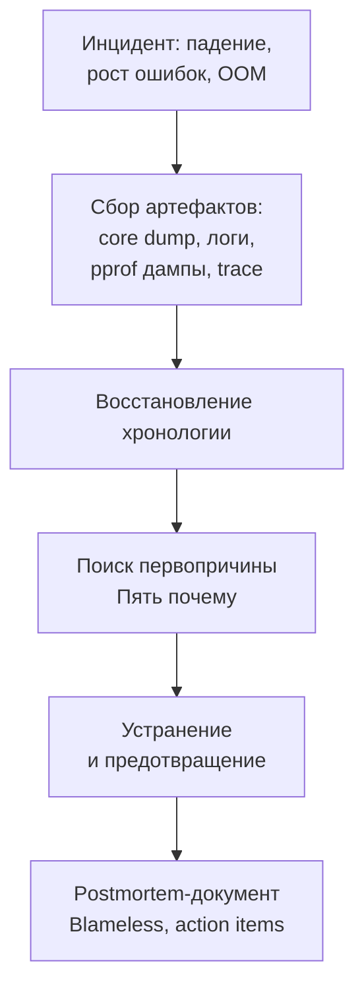

## Postmortem анализ: расследование после инцидента

В предыдущих статьях подраздела мы освоили инструменты оперативной отладки: интерактивный Delve ([[2. Delve debugger]]), детектор гонок ([[3. Race detector в проде]]) и структурированное логирование ([[4. Логи и debugging]]). Но существует класс проблем, которые невозможно отлаживать в реальном времени: продакшен-сервис упал в 3 часа ночи, оставив после себя только core dump и разрозненные логи. Или инцидент уже завершился, система работает, но причина неясна. В такие моменты на сцену выходит **postmortem анализ** — системное расследование уже случившегося инцидента по оставленным артефактам.

Postmortem анализ в Go — это не магия и не удел SRE-отдела. Это инженерная дисциплина, которой Senior Go-разработчик должен владеть наравне с написанием кода. Без неё каждый инцидент превращается в «мистику», а Lessons Learned остаются пустыми словами. С ней же даже катастрофический отказ становится источником знаний, который делает систему устойчивее.

В этой статье мы выстроим полный цикл postmortem-расследования: от сбора артефактов (core dump, логи, профили, трассировка) до формулирования первопричины по методике «Пять почему». Мы свяжем инструменты из разных разделов — [[4. goroutine dump]], [[5. pprof memory profile]], [[3. execution tracer]], [[1. runtime пакет]], [[7. Correlation ID]] — в единый алгоритм, работающий на практике.

## Что такое postmortem анализ в контексте Go-приложения

**Postmortem анализ** (дословно — «посмертный анализ») — это процесс исследования состояния программы после её аварийного завершения или серьёзного инцидента. Цель — не найти виноватого, а установить точную цепочку событий, приведших к проблеме, и предотвратить её повторение.

В экосистеме Go postmortem анализ базируется на трёх столпах:

1. **Артефакты**, сохранённые в момент инцидента или автоматически записанные ОС/рантаймом: core dump, логи с Correlation ID, профили памяти, дамп горутин.
2. **Инструменты** для анализа этих артефактов: Delve (core dump), `go tool pprof`, `go tool trace`, утилиты журналирования.
3. **Методология** восстановления хронологии и причинно-следственных связей.

Ключевое отличие от живой отладки: здесь нельзя поставить точку останова. Есть только «снимки» — иногда неполные, сделанные в критический момент. Senior-инженер должен уметь по этим фрагментам восстановить полную картину.



## Подготовка к postmortem: что нужно сохранять всегда

Postmortem анализ невозможен без артефактов. Поэтому подготовка начинается до инцидента — с настройки observability и автоматического сохранения критичных данных.

### Логи с Correlation ID

Все логи должны быть структурированы ([[4. Логи и debugging]]), содержать Correlation ID ([[7. Correlation ID]]) и отправляться в централизованное хранилище (Loki, Elasticsearch) с достаточным сроком хранения. Без этого анализ сводится к угадыванию.

### Core dump

Go поддерживает запись core dump при панике или аварийном завершении. Настройка:

```bash
GOTRACEBACK=crash ./my_server
```

Или через `ulimit -c unlimited` и `sysctl kernel.core_pattern`. После падения остаётся файл `core.<pid>`, который содержит образ памяти процесса. Этот файл — главный артефакт для анализа падений. Подробнее в [[6. Core dumps]].

### Автоматические дампы при OOM или зависаниях

Для Go-сервисов можно настроить автоматическое снятие профилей при приближении к лимитам или по сигналам:

- **pprof-эндпоинты** (`/debug/pprof/heap`, `/debug/pprof/goroutine`) — можно опрашивать скриптом мониторинга при триггере.
- **Сохранение memory profile** при росте кучи выше порога через `runtime.MemProfileRate` и периодический вызов `pprof.WriteHeapProfile`.
- **Сохранение execution trace** ([[3. execution tracer]]) на короткий интервал при обнаружении аномальной задержки.

Рекомендуется иметь в инфраструктуре агент (или sidecar), который по алерту от Prometheus автоматически снимает дамп горутин и памяти с проблемного пода и сохраняет в объектное хранилище для последующего анализа.

## Инструменты анализа артефактов

### Core dump + Delve

Самый мощный инструмент для postmortem. Delve ([[2. Delve debugger]]) может открыть core dump так же, как живой процесс:

```bash
dlv core ./my_server core.dump
```

Внутри Delve доступны:
- `goroutines` — список всех горутин на момент падения с состояниями и стеками.
- `stack` — полный стек выбранной горутины.
- `locals` и `print` — значения локальных переменных и аргументов.
- `threads` — потоки ОС (помогает при проблемах с CGO или блокирующими syscall).

Это позволяет точно определить, какая горутина и на какой строке кода вызвала панику или заблокировалась навсегда (дедлок).

### pprof профили

Профили CPU ([[2. CPU profiling в Go]]), памяти ([[5. pprof memory profile]]), горутин ([[4. goroutine dump]]), блокировок ([[5. block profile]]) можно снимать не только в реальном времени, но и сохранять по расписанию или по триггеру. При postmortem они показывают картину накопленной статистики до инцидента. Например:

- **Heap profile** показывает, какой объект раздул память перед OOM.
- **Goroutine profile** — сколько горутин утекло и в каком состоянии они висели.
- **Block profile** — на каких каналах или мьютексах скопилось ожидание.

### Execution trace

Трассировка ([[3. execution tracer]]) особенно ценна для анализа медленных инцидентов (latency degradation). Если trace был записан в момент проблемы, `go tool trace` покажет хронологию событий: цепочки блокировок, GC-паузы, миграцию горутин.

### Логи и Elasticsearch/Kibana

Структурированные логи с `trace_id` позволяют восстановить точную последовательность действий, которые привели к ошибке. Фильтр по Correlation ID проблемного запроса вытаскивает все логи сервисов, участвовавших в цепочке вызовов. Это ключевой инструмент для распределённых систем ([[8. Debugging distributed systems]]).

## Методология postmortem: шаг за шагом

### Шаг 1. Сбор всех доступных артефактов

- Core dump (если процесс упал).
- Дамп горутин (снятый мониторингом или из core dump).
- Memory profile (inuse_space и alloc_space).
- Логи за период инцидента ± 5 минут.
- Execution trace (если был включен).
- Метрики Prometheus/Grafana (скриншоты дашбордов на момент инцидента).
- Конфигурация кластера, версии деплоев, изменения окружения.

### Шаг 2. Восстановление хронологии

На основе временных меток логов и метрик строится **timeline** — временная шкала событий. Например:

```
14:02:31 — Prometheus: рост p99 latency на payment-service
14:02:45 — Alertmanager: алерт на p99 > 500ms
14:03:10 — Kibana: первый лог с ошибкой "connection refused" к БД
14:03:15 — Kubernetes: OOMKill payment-service
14:03:17 — Syslog: core dumped, PID 23456
```

Timeline помогает понять, что было причиной, а что — следствием.

### Шаг 3. Поиск первопричины (Root Cause Analysis)

Основной метод — **«Пять почему»** (Five Whys). Последовательно задаём вопрос «почему?», пока не дойдём до корневой причины — недостатка в процессе, архитектуре, а не в конкретной строке кода.

Пример для OOMKill:

1. Почему упал под? — OOMKill, превышен лимит памяти.
2. Почему превышен лимит? — Куча Go выросла до 2 ГБ.
3. Почему куча выросла? — Накапливались объекты в глобальном кэше без ограничения размера.
4. Почему не было ограничения? — Разработчик не предусмотрел сценарий роста нагрузки.
5. Почему это не выявили до прода? — Не было нагрузочного тестирования и алерта на рост кучи.

Корневая причина — отсутствие алерта и нагрузочного тестирования для нового кэша. Техническое исправление — добавить лимит размера кэша. Процессное — ввести обязательное нагрузочное тестирование для фич, меняющих потребление памяти.

### Шаг 4. Формирование выводов и action items

Результаты оформляются в **postmortem-документ** (см. ниже). Action items должны быть конкретными, назначенными на владельцев и с дедлайнами.

### Шаг 5. Верификация исправлений

После реализации исправлений необходимо:
- Нагрузочное тестирование, подтверждающее, что проблема устранена.
- Добавление метрик/алертов, которые заметят регресс.
- Обновление runbook'ов.

## Пример postmortem-расследования падения с паникой

**Инцидент:** Сервис `user-api` упал с `panic: runtime error: invalid memory address or nil pointer dereference`. Core dump сохранён.

**Хронология (из логов):**
- 03:14:05 — запрос с `trace_id=abc123` поступил на `user-api`.
- 03:14:05 — лог `processing user update`.
- 03:14:05 — паника, процесс завершён.

**Анализ core dump (Delve):**
```bash
dlv core ./user-api core.user-api.3456
(dlv) goroutines
  Goroutine 1: Running: main.main
  Goroutine 42: Running: main.handleUpdate
(dlv) goroutine 42
(dlv) stack
0  0x4a1c2d in main.handleUpdate
    at /app/handler.go:56
1  0x4a1b8a in main.processUser
    at /app/user.go:23
(dlv) locals
user = main.User {ID: 123, Name: "", Email: nil}
```

Переменная `user` имеет `Email: nil`. В `user.go:23` вызывается `*user.Email`. Проблема: поле Email не проверяется на nil.

**Пять почему:**
1. Почему произошла паника? — Разыменован nil-указатель Email.
2. Почему Email был nil? — В БД есть записи без email.
3. Почему такие записи попали в БД? — Миграция привела к появлению пустых полей.
4. Почему код не проверял nil? — Не было валидации.
5. Почему это не обнаружили тесты? — Unit-тесты не покрывали случай nil-Email.

**Action items:**
- [ ] Добавить nil-check в `processUser` (владелец @dev1, срок: +1d).
- [ ] Расширить тесты на случай nil-Email (владелец @dev1, срок: +2d).
- [ ] Проверить целостность данных в БД, заполнить пустые поля (владелец @dba, срок: +3d).
- [ ] Внедрить статический анализатор `nilaway` в CI (владелец @dev2, срок: +1sprint).

## Mechanical Sympathy: как снятие артефактов влияет на систему

Postmortem артефакты не бесплатны. Senior-инженер настраивает их сбор так, чтобы не вызвать второй инцидент.

### Запись core dump

При падении с `GOTRACEBACK=crash` рантайм вызывает `abort()`, и ОС записывает core dump. Запись дампа памяти размером в десятки гигабайт на диск может занять секунды или минуты, в течение которых процесс находится в состоянии `TASK_UNINTERRUPTIBLE`. Это замораживает все горутины и потоки. Поэтому для сервисов с большой кучей core dump может быть проблемой. Настраивают лимиты через `ulimit -c` (ограничение размера) или используют `core_pattern` с pipe в сжатие (например, `|/usr/bin/core_compressor`), чтобы минимизировать время блокировки.

### Снятие heap profile

Запись `pprof.WriteHeapProfile` вызывает STW ([[3. Stop the world]]) для обеспечения консистентности. На кучах в гигабайты пауза может быть миллисекундной. Автоматический сбор профилей должен быть настроен с осторожностью: не чаще одного раза в несколько минут, только при подозрении на проблему (например, метрика `go_memstats_heap_inuse_bytes` превышает порог).

### Execution trace

Overhead 10-30% CPU, как обсуждалось в [[3. execution tracer]]. Нельзя включать trace постоянно «на всякий случай». Обычно его активируют вручную на короткий период при расследовании или автоматически при срабатывании алерта на latency.

### Логи

Обсуждали в [[4. Логи и debugging]]: важно сэмплирование, буферизация, асинхронность, чтобы логи не становились источником задержек.

## Культура Blameless Postmortem

Senior-инженер не только проводит технический анализ, но и формирует **культуру blameless** в команде. Ошибки — это системные сбои, а не злой умысел разработчика. Postmortem-документ пишется так, чтобы извлечь уроки, а не наказать.

Принципы:
- **Никаких имён виновных.** Только роли (дежурный инженер, разработчик компонента).
- **Фокус на процессе.** Почему процесс (ревью, тестирование, деплой) пропустил ошибку?
- **Action items** ориентированы на предотвращение класса проблем, а не конкретного бага.
- **Доступность.** Документ публикуется для всей команды, чтобы обучение было коллективным.

Пример хорошо написанного postmortem-документа приведён в разделе «Распределённые системы» ([[9. Production incidents]]). Там же раскрыта тема Game Days и проактивного хаос-инжиниринга.

## Итог

- **Postmortem анализ** — это системное расследование инцидента по сохранённым артефактам с целью найти первопричину и предотвратить повторение.
- Артефакты: core dump, логи с Correlation ID, профили памяти и горутин, execution trace, метрики.
- Инструменты: Delve для core dump, pprof для профилей, `go tool trace` для трассировки, Kibana/Loki для логов.
- Методология: сбор артефактов → хронология → «Пять почему» → action items → верификация.
- Mechanical sympathy: сбор артефактов имеет цену (core dump замораживает процесс, heap profile вызывает STW, trace создаёт CPU overhead), поэтому автоматизация сбора должна быть настраиваемой и осторожной.
- Культура blameless postmortem — обязательная составляющая зрелой инженерной организации.

Postmortem-анализ замыкает цикл отладки, превращая непонятные падения в конкретные улучшения. Следующая статья углубляется в получение и анализ самого ценного артефакта для расследования падений — [[6. Core dumps]].