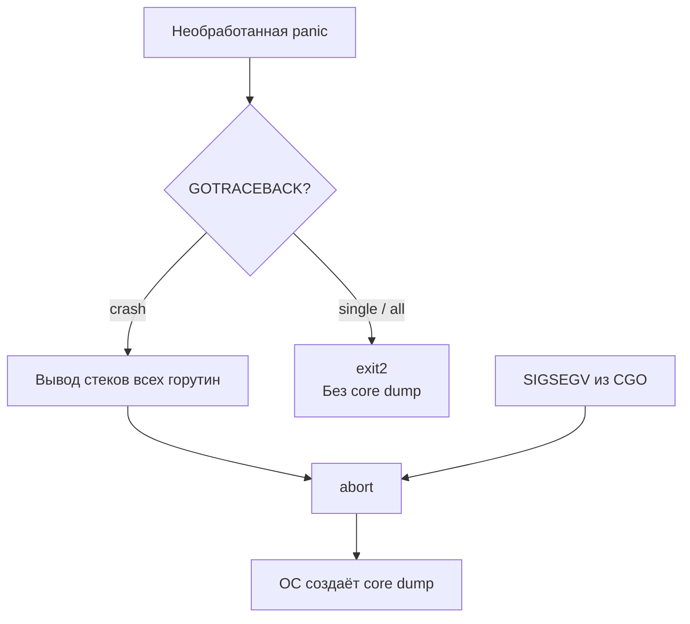

## Core dumps: «чёрный ящик» упавшей программы

В [[5. Postmortem анализ]] мы выстроили общую методологию расследования инцидентов по артефактам. Главный из них — **core dump** (дамп памяти) — образ виртуальной памяти процесса в момент аварийного завершения. Если логи ([[4. Логи и debugging]]) отвечают на вопрос «что происходило перед падением?», а профили памяти — «сколько памяти было занято?», то core dump позволяет заглянуть в самый эпицентр катастрофы: восстановить точное состояние всех горутин, значения переменных, стек вызовов и даже регистры процессора на момент падения.

Для Senior Go-инженера умение получать и анализировать core dump'ы — обязательный навык. Паника с nil pointer dereference, сегфолт при вызове CGO, дедлок, который не воспроизводится локально — всё это оставляет следы в core dump, которые можно прочитать с помощью Delve ([[2. Delve debugger]]). Без core dump'а расследование внезапных падений на продакшене превращается в гадание, с ним — в строгий анализ.

В этой статье мы разберём, как рантайм Go генерирует core dump, как настроить окружение для его сохранения, как анализировать дамп через Delve и какие ограничения у этого механизма. Завершим механической эмпатией: что происходит с процессом и ОС во время записи многогигабайтного дампа.

## Что такое core dump

**Core dump** (файл ядра, дамп памяти) — это файл, содержащий полный или частичный образ виртуальной памяти процесса, а также состояние регистров процессора и информацию о потоках на момент аварийного завершения. Он создаётся операционной системой, когда процесс получает сигнал, приводящий к завершению (SIGSEGV, SIGABRT, SIGQUIT в определённых случаях), и настроен `ulimit -c` (лимит размера core-файла) в значение, отличное от нуля.

В контексте Go core dump включает:

- **Стеки всех горутин.** Каждая горутина имеет свой стек в адресном пространстве процесса. По core dump можно восстановить состояние всех горутин: где они были остановлены, какие значения имели локальные переменные.
- **Кучу (heap).** Все объекты, аллоцированные в куче, включая их содержимое — строки, структуры, слайсы, мапы.
- **Сегменты данных и кода.** Глобальные переменные, const-данные и исполняемый код.
- **Регистры процессора** для каждого потока ОС (M) на момент краша.

В отличие от дампа горутин ([[4. goroutine dump]]), который содержит только текст стек-трейсов, core dump содержит **бинарный образ памяти**, что позволяет инспектировать значения переменных, обходом кучи находить утечки (через профилирование offline) и диагностировать повреждения памяти (например, из-за CGO).

## Как Go создаёт core dump

Рантайм Go управляет аварийным завершением через переменную окружения **`GOTRACEBACK`** и внутреннюю логику обработки паники. Возможные сценарии:

### 1. Необработанная паника (panic)

Когда в программе возникает паника, и она не перехвачена `recover()`, рантайм вызывает `runtime.fatalpanic`. Поведение зависит от `GOTRACEBACK`:

- **`GOTRACEBACK=none`** — процесс завершается без вывода стеков и без core dump.
- **`GOTRACEBACK=single`** (по умолчанию) — выводит стек упавшей горутины, затем вызывает `exit(2)`. Core dump **не создаётся**.
- **`GOTRACEBACK=all`** — выводит стеки всех горутин, затем `exit(2)`. Core dump не создаётся.
- **`GOTRACEBACK=crash`** — выводит стеки всех горутин, затем вызывает `abort()`, что приводит к сигналу `SIGABRT` и созданию core dump (если разрешено ulimit).
- **`GOTRACEBACK=system`** — аналогично `all`, но включает и горутины рантайма. Без `crash` core dump не создаётся.

Только с ключом `crash` гарантируется создание дампа памяти при панике.

### 2. Сигналы ОС (SIGSEGV, SIGBUS)

При аппаратных исключениях (разыменование нулевого указателя через unsafe, ошибка в CGO) ОС посылает процессу сигнал `SIGSEGV`. Рантайм Go перехватывает этот сигнал, пытается преобразовать его в панику (`panic: runtime error: invalid memory address`), но если восстановление невозможно или программа собрана без поддержки паники на сигналах, процесс завершается с `SIGSEGV`. Если в этот момент установлен `GOTRACEBACK=crash`, рантайм вызывает `abort()`. Если нет — ОС может создать core dump напрямую при получении `SIGSEGV`, если настроена.

### 3. Принудительная генерация

Можно принудительно вызвать `abort()` через `runtime.Breakpoint()` или `syscall.Kill(syscall.Getpid(), syscall.SIGABRT)`, но это экстремальные меры для отладки. В production предпочтительнее снимать дамп горутин через `SIGQUIT`.



> [!info] Под капотом
> Функция `runtime.abort()` в Linux вызывает системный вызов `tgkill(getpid(), gettid(), SIGABRT)` или просто `abort()`. ОС по умолчанию обрабатывает `SIGABRT` созданием core dump, если `ulimit -c` не равен нулю. Важно, что до вызова `abort()` рантайм уже вывел стек-трейс в stderr. Поэтому core dump содержит полный образ памяти, но не дублирует текстовые логи.

## Настройка окружения для core dump

### Локально и на серверах

```bash
# Разрешить создание core dump неограниченного размера
ulimit -c unlimited

# Задать шаблон пути для core-файлов (Linux)
echo "/var/coredumps/core.%e.%p.%t" | sudo tee /proc/sys/kernel/core_pattern
```

Переменные в шаблоне: `%e` — имя исполняемого файла, `%p` — PID, `%t` — timestamp. Рекомендуется выделить отдельную директорию с достаточным местом, так как дампы могут занимать гигабайты.

Для сжатия на лету можно использовать pipe в `core_pattern`:

```bash
echo "|/usr/local/bin/core_compressor %e %p %t" | sudo tee /proc/sys/kernel/core_pattern
```

где `core_compressor` — скрипт, принимающий дамп через stdin, сжимающий его и записывающий в хранилище.

### В контейнерах Docker/Kubernetes

Core dump по умолчанию создаётся в рабочей директории контейнера, но часто она недоступна после падения и pod удаляется. Рекомендации:

- **`kernel.core_pattern`** на хосте влияет на все контейнеры. Если она не настроена, core файл останется в файловой системе контейнера и может быть извлечён до удаления pod'а через `kubectl cp`.
- Использовать **emptyDir** том, смонтированный в `/var/coredumps`, и установить `core_pattern` внутри контейнера (требует привилегий или sysctl). Альтернатива — направить core dump в stdout/stderr через `/proc/sys/kernel/core_pattern = |/bin/cat`, но это нестандартно.
- Установить **`GOTRACEBACK=crash`** в манифесте пода для Go-приложений.

```yaml
spec:
  containers:
  - name: myapp
    env:
    - name: GOTRACEBACK
      value: "crash"
    volumeMounts:
    - name: coredumps
      mountPath: /var/coredumps
  volumes:
  - name: coredumps
    emptyDir: {}
```

После падения pod может перейти в `CrashLoopBackOff`, что даст время забрать дамп.

## Анализ core dump с помощью Delve

Delve ([[2. Delve debugger]]) умеет открывать core dump'ы как замороженный процесс:

```bash
dlv core ./my_server core.my_server.12345
```

После запуска доступны почти все команды живой отладки:

- **`goroutines`** — список всех горутин с состояниями на момент краша.
- **`threads`** — потоки ОС.
- **`goroutine <id>`** — переключиться на конкретную горутину.
- **`stack`** — стек выбранной горутины.
- **`frame <N>`** — переключиться на фрейм стека.
- **`locals`** — локальные переменные текущего фрейма.
- **`print <variable>`** — значение переменной, включая структуры, слайсы, мапы.
- **`list`** — показать исходный код вокруг текущей инструкции.

### Пример: падение с nil pointer

Сервис упал с `panic: runtime error: invalid memory address or nil pointer dereference`. Core dump сохранён.

```bash
dlv core ./api core.api.5678
(dlv) goroutines
  Goroutine 1: Running: main.main
  Goroutine 34: Running: main.processRecord
(dlv) goroutine 34
(dlv) stack
0  0x4a1b20 in main.processRecord
    at /app/handler.go:67
1  0x4a1a8a in main.handleRequest
    at /app/handler.go:32
(dlv) frame 0
(dlv) locals
record = main.Record {ID: 456, Data: nil}
(dlv) p record.Data
nil
```

Паника произошла в `handler.go:67`: обращение к `record.Data.Field` при `Data == nil`. Причина — непроверенный nil-интерфейс. Без core dump'а мы бы видели только стек-трейс в логах, но не могли инспектировать значения переменных, чтобы понять, что именно пришло в функцию.

### Анализ дедлока

Core dump также пригоден для анализа дедлоков, если процесс был принудительно завершён сигналом `SIGABRT` (например, по health-check тайм-ауту). В core dump видно состояние всех горутин: если сотни из них в `[chan send]` и ни одной в `[running]`, это явный дедлок. Delve позволяет переключаться между ними и смотреть, какие каналы они ожидают.

## Ограничения core dump'ов

- **Размер.** Дамп равен объёму виртуальной памяти процесса (RES + swapped). Для Go-приложения с кучей в 2 ГБ и несколькими миллионами горутин дамп может быть сопоставимого размера. Запись такого файла на медленный диск занимает десятки секунд, в течение которых процесс заблокирован в состоянии `TASK_UNINTERRUPTIBLE`. Это может затянуть перезапуск сервиса.
- **Конфиденциальность.** Core dump содержит все данные программы: переменные окружения, строки из БД, пользовательские данные. Файл должен храниться с ограниченным доступом и удаляться после анализа.
- **Восстановление.** Core dump не содержит историю исполнения, только последнее состояние. Если повреждение памяти произошло задолго до краша и уже не видно в переменных, core dump может не выявить первопричину (тут нужен race detector, [[3. Race detector в проде]], и execution tracer).
- **Платформенная зависимость.** На macOS core dump'ы по умолчанию записываются в `/cores/`, но формат Mach-O. Delve поддерживает их, но могут быть нюансы.

## Альтернативы: когда core dump избыточен

В некоторых сценариях core dump можно заменить более лёгкими артефактами:

- **Дамп горутин** ([[4. goroutine dump]]) через `pprof.Lookup("goroutine").WriteTo()` или `SIGQUIT` — даёт состояние всех горутин, но без значений переменных. Для расследования дедлоков часто достаточен.
- **Memory profile** ([[5. pprof memory profile]]) — показывает распределение памяти перед падением, если был сохранён по триггеру.
- **Execution trace** ([[3. execution tracer]]) — записанный за несколько секунд до падения, показывает динамику блокировок и состояний.

Эти артефакты намного компактнее core dump и не замораживают процесс на длительное время. Senior-инженер комбинирует их в зависимости от типа проблемы.

## Mechanical Sympathy: что происходит с процессом при записи дампа

Когда рантайм вызывает `abort()` и ОС начинает запись core dump:

- **Процесс замораживается.** Ядро переводит все потоки в состояние `TASK_UNINTERRUPTIBLE` и начинает обход виртуальной памяти для записи в файл. Никакие горутины не исполняются, GC не работает, сетевые соединения не обслуживаются.
- **Дисковое I/O.** Запись идёт через VFS, с буферизацией ядра, но всё равно генерирует значительный объём операций ввода-вывода. Если диск медленный (HDD, сетевой диск), запись дампа может длиться минуты, конкурируя за пропускную способность с другими процессами.
- **Кэш процессора.** Содержимое кэшей не сбрасывается полностью в память до краша, поэтому часть данных может быть потеряна (неактуальна). Однако на архитектурах с когерентностью кэша при обработке сигнала ядро сбрасывает грязные линии.
- **Стратегия уменьшения.** Использование `core_pattern` с pipe в компрессор (gzip) позволяет сократить размер записываемого файла на порядок, но добавляет CPU-нагрузку на сжатие, которая выполняется в контексте ядра (потенциально замедляет завершение). Настройка `ulimit -c` для ограничения максимального размера предотвращает исчерпание дискового пространства.

Эти компромиссы — часть проектирования надёжного продакшен-сервиса. Если падения редки, допустимо записывать полный дамп. Если часты — лучше сначала полагаться на дамп горутин и профайлы, а core dump включать только на ограниченном числе экземпляров.

## Итог

- **Core dump** — полный образ памяти процесса в момент аварийного завершения, создаваемый ОС.
- В Go для генерации core dump при панике необходимо установить **`GOTRACEBACK=crash`** и `ulimit -c unlimited`.
- Core dump сохраняет стеки и значения переменных всех горутин, кучу, сегменты кода и данных; анализируется с помощью **Delve** (`dlv core`).
- Используется для postmortem-анализа паник, сегфолтов, дедлоков и загадочных крашей, не воспроизводимых локально.
- Имеет существенные ограничения: большой размер, время записи, конфиденциальность данных. В альтернативу часто используют дамп горутин, memory profile и execution trace.
- Механическая эмпатия: запись core dump замораживает процесс на значительное время, конкурирует за дисковый I/O и требует настройки сжатия/лимитов.
- Навык работы с core dump — завершающий элемент отладочного арсенала Senior-инженера, связывающий логи, профили и интерактивную отладку в единую картину.

Следующая статья закрывает подраздел Debugging, фокусируясь на особом классе проблем, которые не роняют сервис, но превращают его в «тормоз»: [[7. Debugging latency проблем]].