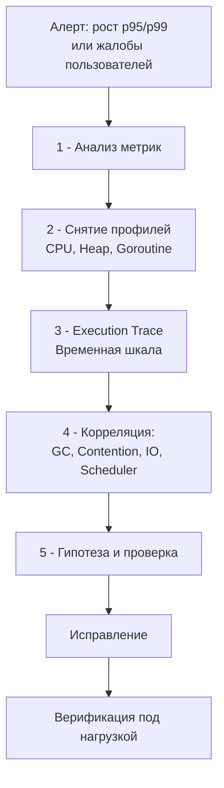

## Debugging Latency проблем: когда программа не ломается, но «тормозит»

В предыдущих статьях подраздела мы разобрали инструменты для отладки «жёстких» отказов: интерактивный Delve ([[2. Delve debugger]]), детектор гонок ([[3. Race detector в проде]]), postmortem-анализ падений ([[5. Postmortem анализ]]) и core dump'ов ([[6. Core dumps]]). Но самые коварные проблемы в высоконагруженных Go-сервисах — это не падения, а **задержки**. Программа работает корректно, возвращает правильные ответы, но p99 latency внезапно улетает с 10 мс до 500 мс, бюджет ошибок SLO тает на глазах, а CPU и память выглядят нормально. Это не баг в логике — это сбой **временных характеристик**.

Отладка задержек (latency debugging) — самостоятельная дисциплина, находящаяся на стыке профилирования производительности (раздел [[16. Профилирование, отладка и производительность]]) и классической отладки (раздел [[11. Debugging]]). Она не сводится к запуску `pprof` и поиску горячей функции. Она требует **временной корреляции** событий: понимания, в какой момент и почему горутина «заснула», кто её разбудил, и сколько она простояла в очередях планировщика. Senior Go-инженер видит за задержкой не просто «медленный код», а цепочку взаимодействий: GC → mark assist → планировщик → contention → сеть.

В этой завершающей статье подраздела Debugging мы выстроим системный фреймворк для отладки проблем задержек в Go-сервисах. Мы свяжем метрики ([[6. Метрики. p50, p95, p99]]), профилировщики ([[2. CPU profiling в Go]], [[5. pprof memory profile]], [[5. block profile]], [[6. mutex profile]]), execution tracer ([[3. execution tracer]]), scheduler trace ([[7. scheduler trace]]) и логи ([[4. Логи и debugging]]) в единый алгоритм расследования, основанный на механической эмпатии ([[5. Mechanical sympathy в backend разработке]]).

## Почему проблемы задержек — самые сложные

Краш программы однозначен: есть core dump ([[6. Core dumps]]), стек-трейс, строка кода, на которой всё остановилось. Задержка же субъективна и многомерна:

- **Нет точки отказа.** Система жива, просто медленна. Неясно, *что именно* задерживается: все запросы или только 1%? На каком этапе: приём соединения, парсинг, бизнес-логика, вызов к БД?
- **Требуется временная шкала.** Статический профиль CPU покажет, что 30% времени ушло на `json.Unmarshal`, но не скажет, *почему* именно сейчас этот вызов стал занимать 100 мс вместо 1 мс. Возможно, в это время работал GC ([[6. GC pause и latency]]), или горутина была вытеснена планировщиком ([[1. Scheduler Go. G M P модель]]).
- **Эффект накопления.** Задержка в 1 мс на каждом из 10 последовательных вызовов микросервисов даёт 10 мс; если один из них «выпал» в хвост ([[7. Tail latency и почему она важна]]), общая задержка экспоненциально растёт.
- **Многопричинность.** Задержка может быть вызвана комбинацией: contention на мьютексе ([[7. Contention и lock profiling]]), вызванный этим рост аллокаций, который запускает GC, который включает mark assist, замедляющий основную горутину.

Поэтому для отладки задержек нужен не единый инструмент, а **фреймворк** — последовательность шагов и набор коррелирующих инструментов.

## Фреймворк отладки задержек (Latency Debugging Framework)

Предлагаемый алгоритм состоит из пяти этапов, последовательно сужающих круг поиска.



### Шаг 1. Анализ метрик — где именно задержка?

Инцидент начинается с графика в Grafana или алерта. Необходимо быстро ответить на вопросы:

- **Какая метрика деградировала?** p50, p95, p99? Если вырос только p99, а p50 стабилен — проблема в хвосте (GC-паузы, эпизодический contention, перезагрузка пула соединений). Если p50 тоже вырос — проблема системная (CPU исчерпан, медленная зависимость).
- **На каком сегменте?** Если есть разбивка latency по этапам (парсинг, вызов БД, сериализация), смотрим, какой этап стал занимать больше времени.
- **Коррелирует ли с другими метриками?** `go_gc_duration_seconds` (GC), `go_goroutines` (утечка горутин), `go_memstats_heap_inuse_bytes` (рост кучи), `container_cpu_throttling` (троттлинг CPU).
- **Только один сервис или несколько?** Если latency выросла у нескольких upstream-сервисов, вероятно, проблема в общем зависимом сервисе (БД, кэш) или в сети ([[3. Network latency]]).

**Инструменты:** Prometheus + Grafana, метрики RED (Rate, Errors, Duration), `GODEBUG=gctrace=1` ([[7. GOGC и tuning]]).

### Шаг 2. Снятие профилей — что делает процессор и память?

Когда временной промежуток определён, снимаем **мгновенные срезы** состояния на пике проблемы.

- **CPU profile** (`/debug/pprof/profile?seconds=10`): видим, куда расходуются такты. Если в топе `runtime.mallocgc`, `runtime.gcAssistAlloc` — проблема в аллокациях и GC ([[9. Когда GC становится bottleneck]]). Если `sync.(*Mutex).Lock` — contention ([[7. Contention и lock profiling]]). Если `runtime.netpollblock` — ожидание сети ([[4. epoll kqueue и netpoller]]).
- **Heap profile** (`/debug/pprof/heap`): резкий рост `inuse_space` указывает на утечку или накопление объектов. `alloc_space` покажет источники временного мусора.
- **Goroutine profile** (`/debug/pprof/goroutine`): аномальное количество горутин в состоянии `[chan receive]`, `[sync.Mutex.Lock]` или `[runnable]` — ключ к поиску дедлоков, contention и нехватки CPU соответственно.

Профили дают **агрегированную** картину, но не временную динамику. Они отвечают «кто виноват», но не «когда и в какой последовательности».

### Шаг 3. Execution trace — восстановление временной шкалы

Самый мощный инструмент для отладки задержек — **execution tracer** ([[3. execution tracer]]). Он записывает хронологию событий рантайма: запуск/остановка горутин, блокировки, миграция между P, GC-фазы, syscall'ы.

Трассировка на 5-10 секунд, снятая в момент проблемы, позволяет:

- Увидеть **STW-паузы** как красные вертикальные полосы, пересекающие все P. Измерить их длительность выделением.
- Увидеть **mark assist**: горутина помечается как `MARK ASSIST`. Если обработчики запросов проводят значительное время в этом режиме, GC не успевает за аллокациями.
- Увидеть **долгое ожидание на канале или мьютексе** (полосы `Waiting`). Execution tracer покажет, какая конкретно горутина разблокировала ожидающую.
- Увидеть **миграцию горутин** между P. Если latency-чувствительная горутина часто мигрирует, каждый раз теряется локальность кэша ([[8. Cache friendliness]]).

### Шаг 4. Корреляция — соединение точек

Теперь у нас есть: профили (агрегированные горячие точки), execution trace (хронология), логи с Correlation ID (события уровня приложения). Соединяем их:

- **Если CPU profile показывает `gcAssistAlloc`, а trace — частые GC-циклы:** первопричина — высокий темп аллокаций. Уменьшаем аллокации ([[1. Уменьшение аллокаций]], [[2. sync Pool]]).
- **Если goroutine profile показывает тысячи горутин в `[sync.Mutex.Lock]`, а mutex profile ([[6. mutex profile]]) — долгое удержание в `updateCache`:** первопричина — длительная критическая секция. Выносим тяжёлые операции за мьютекс, или шардируем кэш.
- **Если trace показывает, что горутины долго в состоянии `Runnable` при занятых P, а CPU profile не показывает явных горячих точек:** возможно, CPU throttling контейнера или конкуренция с другими процессами. Проверяем `container_cpu_cfs_throttled_seconds_total`.
- **Логи с Correlation ID** ([[7. Correlation ID]]) позволяют вытащить конкретный медленный запрос, пройти по его trace id и увидеть, на каком сервисе он задержался.

### Шаг 5. Гипотеза, исправление, верификация

Формулируем гипотезу: «Рост p99 вызван GC-паузами из-за всплеска аллокаций после деплоя новой фичи». Проверяем: профили памяти подтверждают рост alloc_space в новом коде. Исправляем: добавляем `sync.Pool`. Верифицируем нагрузочным тестированием ([[1. Load testing]]) и сравнением p99 до/после.

## Ключевые источники задержек в Go

Ниже — карта типичных «тормозов» с указанием симптомов и инструментов диагностики.

| Источник задержки | Симптомы | Инструменты |
|-------------------|----------|-------------|
| **GC-паузы и mark assist** | `go_gc_duration_seconds` растёт, в CPU profile — `gcAssistAlloc`, в trace — красные полосы STW и `MARK ASSIST`. | [[6. GC pause и latency]], [[3. execution tracer]], `GODEBUG=gctrace=1` |
| **Contention на мьютексах** | В goroutine dump — много в `[sync.Mutex.Lock]`, block profile — `sync.(*Mutex).Lock`, mutex profile показывает holder'ов. | [[7. Contention и lock profiling]], [[5. block profile]], [[6. mutex profile]] |
| **Перегрузка планировщика** | `schedtrace` показывает большой `runqueue`, много `runnable` при `idleprocs=0`. Trace — долгое `Runnable`. | [[7. scheduler trace]], [[1. Scheduler Go. G M P модель]] |
| **Сетевые задержки** | `http_client_request_duration_seconds` растёт на этапе подключения, trace — долгое `Waiting` на `netpoll`. | [[3. Network latency]], [[4. epoll kqueue и netpoller]], [[5. block profile]] |
| **Блокирующие syscall** | `threads` в schedtrace растёт, trace — долгое `syscall`. | [[1. Системные вызовы и их стоимость]] |
| **CPU Throttling** | `container_cpu_cfs_throttled_seconds_total` > 0 при низком `cpu/utilization` от Go. | Linux cgroup metrics |

## Пользовательские аннотации в трассировке

Для связывания бизнес-логики с событиями рантайма в `runtime/trace` существуют **пользовательские задачи и регионы** (tasks / regions). Они позволяют разметить обработку одного запроса и увидеть её на временной шкале в `go tool trace`.

```go
ctx, task := trace.NewTask(r.Context(), "handleOrder")
defer task.End()

region := trace.StartRegion(ctx, "validatePayment")
// ... валидация
region.End()
```

В `go tool trace` эти задачи появляются в разделе **User-defined tasks**. Можно выбрать конкретный запрос и увидеть, сколько времени занял каждый этап, и как он пересекался с GC или contention. Это превращает трассировку из «простыни событий» в карту задержек конкретного запроса.

## Практический пример: расследование роста p99

**Инцидент:** Сервис `order-api` внезапно показал рост p99 с 50 мс до 300 мс. p50 остался 20 мс. Нагрузка не менялась.

**Шаг 1. Метрики:**
- `go_gc_duration_seconds` — всплески до 50 мс.
- `go_memstats_heap_alloc_bytes` — пилообразный график, частые GC.
- `go_goroutines` — стабильно.

**Шаг 2. Профили:**
- CPU profile на 10 сек: `runtime.gcAssistAlloc` — 25%, `json.Unmarshal` — 35% (с учётом потомков).
- Memory profile (alloc_space): `json.Unmarshal` — 60% аллокаций.

**Шаг 3. Execution trace (5 сек):**
- Каждые ~200 мс красные полосы STW по 1-2 мс.
- Многие горутины-обработчики в `MARK ASSIST` по 2-4 мс.
- Сеть (`Waiting` на netpoll) незначительна.
- Локальные очереди P не перегружены.

**Шаг 4. Корреляция:**
- Высокий темп аллокаций в `json.Unmarshal` вызывает частые GC.
- Частые GC приводят к mark assist, который забирает время у обработчиков.
- STW-паузы напрямую добавляют задержку.

**Шаг 5. Гипотеза и исправление:**
- Гипотеза: JSON-десериализация генерирует слишком много мусора.
- Решение: заменить `encoding/json` на `sonic` и добавить переиспользование буферов через `sync.Pool`.
- Верификация: нагрузочное тестирование показало снижение alloc_space на 70%, GC-паузы уменьшились до микросекунд, p99 вернулся к 50 мс.

## Mechanical Sympathy: как задержка складывается из тактов

С точки зрения процессора, задержка обработки запроса — это сумма:

1. **Полезных тактов** (исполнение бизнес-логики).
2. **Тактов ожидания кэша** (cache miss) — когда данные не в L1/L2 ([[8. Cache friendliness]]).
3. **Тактов ожидания синхронизации** — spinning на мьютексе или ожидание `futex` ([[4. Контекстные переключения]]).
4. **Тактов, украденных GC** (mark assist, STW) ([[9. Когда GC становится bottleneck]]).
5. **Тактов, потраченных на переходы в ядро** (системные вызовы) ([[1. Системные вызовы и их стоимость]]).
6. **Тактов ожидания в очередях планировщика** (runnable) ([[1. Scheduler Go. G M P модель]]).

Execution tracer и scheduler trace позволяют разложить общее время на эти компоненты. Senior-инженер, глядя на trace, видит не просто «красную полосу GC», а понимает: «этот запрос ждал 2 мс mark termination, потому что куча была грязной из-за временных буферов, которые не пулятся». Это и есть mechanical sympathy в действии.

## Когда ничего не помогло: эвристики для сложных случаев

- **Дифференциальные профили:** сравните CPU profile здорового периода и проблемного через `pprof -diff_base`. Это выявит функции, которые *появились* или *стали дороже* ([[8. Сравнение версий кода]]).
- **Логи с таймстемпами внутри запроса:** расставьте в коде `time.Since(start)` и логируйте с уровнями Debug. В момент инцидента включите Debug для проблемного Correlation ID и получите точные времена этапов.
- **Детерминированное воспроизведение:** если проблема проявляется на 0.1% запросов, запишите входящий трафик (например, через `gor/m replay`) и повторите на стейджинге с включённым trace.
- **Исключение влияния сети:** добавьте заглушку (mock) для внешних зависимостей и проверьте, воспроизводится ли задержка. Это изолирует проблему внутри сервиса.

## Итог

- **Отладка задержек** — это дисциплина на стыке observability и понимания рантайма Go, требующая корреляции метрик, профилей, execution trace и логов.
- Фреймворк: метрики → профили → execution trace → корреляция (GC, contention, IO, scheduler) → гипотеза → верификация.
- Ключевые источники задержек: GC (паузы, mark assist), contention (мьютексы, каналы), перегрузка планировщика, сеть, блокирующие syscall, CPU throttling.
- Execution tracer — самый мощный инструмент для visual latency debugging, особенно с пользовательскими задачами и регионами.
- Mechanical sympathy объясняет задержку как сумму потерянных тактов на кэш, синхронизацию и ядро; trace декомпозирует эту сумму.
- Навык debugging latency — маркер Senior-инженера: это не поиск бага, а восстановление временной картины сложной системы.

С этой статьёй мы завершаем подраздел «Debugging». Мы прошли путь от интерактивной отладки и race detector до postmortem-анализа и core dump'ов, замкнув его на системном подходе к проблемам задержек. Следующий раздел — итоговый, где мы обобщим все изученные темы и сформируем Performance Engineering Mindset: [[1. Итоги раздела. Performance engineering mindset]].