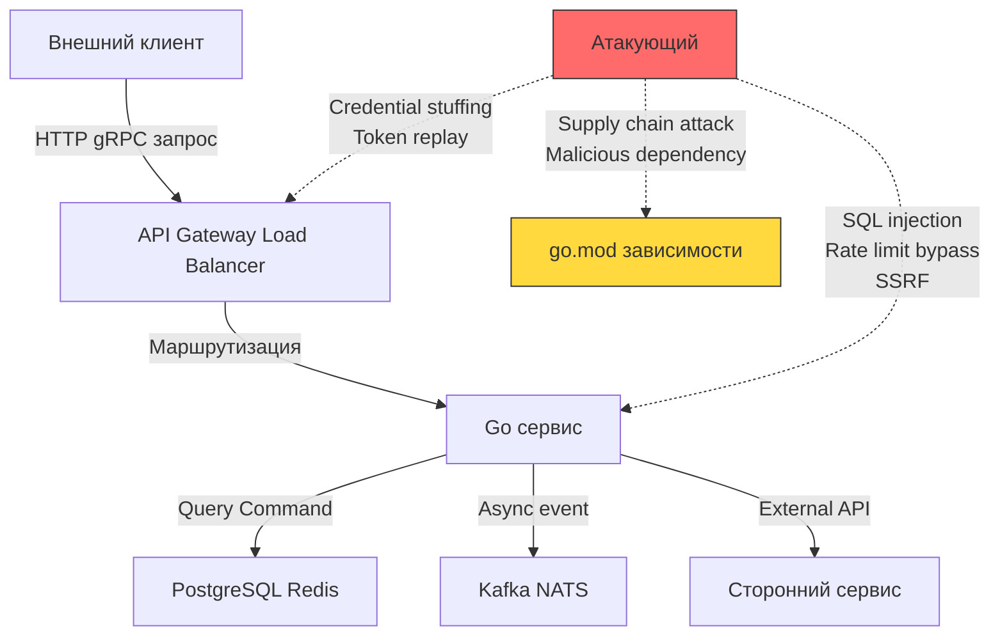
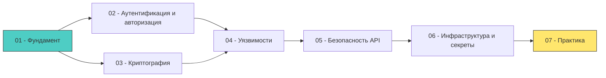

## Почему безопасность — это не фича, а фундамент

Когда мы говорим о разработке высоконагруженного бэкенда на Go, первое, что приходит в голову — производительность, масштабируемость, отказоустойчивость. Но есть аспект, который часто откладывают «на потом», считая его отдельной фичей или задачей команды безопасности: **безопасность приложений (Application Security, AppSec)**.

Это фундаментальная ошибка архитектуры.

Безопасность нельзя «добавить» в конце разработки как плагин. Уязвимость в обработке входных данных, неправильная конфигурация TLS или утечка секретов в логах — это не баги, это **архитектурные дефекты**, которые требуют переписывания значительных частей системы.

> [!info] Под капотом
> Почему «добавить безопасность потом» технически невозможно?
> 
> Представьте, что вы проектируете сетевой сервис на Go. Вы используете `net/http` сервер, обрабатываете JSON через `encoding/json`, храните данные в PostgreSQL. На этапе архитектуры вы решили: «Аутентификацию добавим позже, сейчас главное — функционал».
> 
> Когда приходит время «добавить безопасность», вы обнаруживаете:
> - Все хендлеры принимают данные без валидации → нужен middleware, но он ломает существующие сигнатуры функций
> - Конфигурация приложения хардкодится в коде → секреты нельзя вынести в Vault без рефакторинга всей системы загрузки конфига
> - Логи пишут `fmt.Printf("%v", userInput)` → потенциальная утечка чувствительных данных, нужен структурированный логгер с фильтрацией
> 
> Каждый из этих «мелких» вопросов требует изменения контрактов между компонентами. В распределённой системе это экспоненциально усложняет рефакторинг.

## Безопасность как архитектурный примитив

В идеальной архитектуре безопасность — это не слой, который накладывается поверх, а **неотъемлемое свойство каждого компонента**. Это означает, что при проектировании любой сущности — от структуры данных до микросервиса — вы задаёте вопросы:

1. **Кто имеет право доступа?** (Аутентификация и авторизация)
2. **Какие данные обрабатываются и как они защищены?** (Конфиденциальность, целостность)
3. **Что происходит при ошибке или атаке?** (Fail-secure, аудит, мониторинг)
4. **Как компонент взаимодействует с внешним миром?** (Границы доверия, валидация на входе)

Эти вопросы должны быть в чек-листе код-ревью наравне с «нет ли утечек памяти» или «корректно ли обрабатываются ошибки».

### Модель угроз (Threat Modeling) на старте

Прежде чем писать первую строчку кода, полезно провести сессию **Threat Modeling** — систематический анализ того, что может пойти не так. Для бэкенда на Go это особенно важно из-за специфики языка:



> [!tip] Собеседование
> **Вопрос:** Почему в Go особенно важно проводить threat modeling на этапе дизайна, а не после написания кода?
> 
> **Ответ:** 
> 1. Go поощряет композицию через интерфейсы — если интерфейс не предусматривает контекст авторизации или валидации, добавить это постфактум сложно без нарушения контрактов.
> 2. Планировщик горутин и модель конкурентности могут создавать race condition, которые становятся уязвимостями (например, TOCTOU — Time-of-Check-Time-of-Use).
> 3. Статическая линковка и минимализм рантайма означают, что «добавить библиотеку безопасности потом» может потребовать пересборки всего бинарника и перетестирования.

## Go и безопасность: преимущества и ловушки

Язык Go был создан с акцентом на простоту, читаемость и безопасность памяти. Это даёт ряд преимуществ для AppSec:

### ✅ Что помогает

| Особенность Go | Влияние на безопасность |
|---------------|------------------------|
| **Garbage Collector** | Нет use-after-free, double-free, buffer overflow через ручное управление памятью (как в C/C++) |
| **Статическая типизация + компиляция** | Многие классы уязвимостей отлавливаются на этапе компиляции, а не в продакшене |
| **Модель конкурентности (goroutines, channels)** | При правильном использовании снижает риск race condition по сравнению с ручным управлением потоками |
| **Стандартная библиотека криптографии** (`crypto/*`) | Аудированные, безопасные по умолчанию реализации, меньше шансов «изобрести свой велосипед» |
| **Простота синтаксиса** | Меньше «магии» → код легче аудировать, ревьювить и понимать |

### ⚠️ Что требует внимания

| Особенность Go | Потенциальный риск |
|---------------|-------------------|
| **Отсутствие исключений** | Ошибки могут быть проигнорированы (`_ = err`), что приводит к продолжению выполнения в невалидном состоянии |
| **interface{} и отражение (reflect)** | Динамическая типизация «задним числом» может обойти компилятор и создать уязвимости десериализации |
| **Глобальные переменные и инициализация (init)** | Скрытые зависимости и состояние могут усложнить аудит и тестирование |
| **Модель памяти и escape analysis** | Неочевидные аллокации в куче могут привести к утечке чувствительных данных через GC или дампы памяти |

> [!warning] Ловушка / Gotcha
> **Утечка чувствительных данных через кучу**
> 
> В Go строки и слайсы могут «убежать» в кучу из-за Escape Analysis. Если вы храните пароль или токен в строке, а затем передаёте её в функцию, которая может сохранить ссылку — данные останутся в куче даже после выхода из функции.
> 
> ```go
> func processToken(token string) {
>     // token может уйти в кучу, если, например, 
>     // его передают в логгер или сохраняют в структуре
>     log.Printf("Processing: %s", token) // 🔴 Потенциальная утечка!
> }
> ```
> 
> **Решение:** 
> - Используйте `[]byte` для чувствительных данных и явно обнуляйте после использования:
> ```go
> func processToken(token []byte) {
>     defer func() {
>         for i := range token {
>             token[i] = 0 // 🔒 Затирание чувствительных данных
>         }
>     }()
>     // ... работа с токеном
> }
> ```
> - Для строк рассмотрите использование `strings.Builder` с последующим сбросом, или специализированные типы из `crypto/subtle`.

## Ключевые принципы для бэкенда на Go

При проектировании безопасной системы на Go придерживайтесь следующих принципов:

### Многоуровневая защита (Defense in Depth)

Не надейтесь на один барьер. Если атакующий обойдёт валидацию на уровне API, его должна остановить проверка прав в бизнес-логике, а затем — ограничения на уровне БД.

```go
// Пример: многоуровневая проверка прав доступа
func (s *UserService) GetUser(ctx context.Context, userID string) (*User, error) {
    // Уровень 1: Аутентификация (из контекста)
    auth, ok := auth.FromContext(ctx)
    if !ok || !auth.isAuthenticated {
        return nil, ErrUnauthenticated
    }
    
    // Уровень 2: Авторизация (бизнес-правила)
    if !s.authz.CanReadUser(auth.Subject, userID) {
        return nil, ErrForbidden
    }
    
    // Уровень 3: Ограничения БД (row-level security, если поддерживается)
    // ... запрос к БД с дополнительными условиями
}
```

### Отказ в безопасном состоянии (Fail Secure)

При любой ошибке система должна возвращаться в состояние, которое не раскрывает информацию и не даёт привилегий.

```go
// ❌ Неправильно: утечка информации через ошибку
func validateToken(token string) error {
    if !isValid(token) {
        return fmt.Errorf("invalid token for user %s", userID) // 🔴 Раскрывает userID
    }
    return nil
}

// ✅ Правильно: общая ошибка без деталей
func validateToken(token string) error {
    if !isValid(token) {
        // Логируем детали внутри, но наружу — общая ошибка
        log.Debug("Token validation failed", "reason", "expired")
        return ErrInvalidToken // 🔒 Без деталей
    }
    return nil
}
```

### Наименьшие привилегии (Least Privilege)

Каждый компонент должен иметь ровно столько прав, сколько нужно для работы, и не больше. Это касается:
- Пользователей БД (не `SUPERUSER` для приложения)
- Токенов сервисов (scope-limited JWT)
- Системных вызовов (запуск контейнера без `--privileged`)
- Доступа к файловой системе

В Go это особенно важно при работе с `os/exec`, `net/http` и системными вызовами.

### Observability как элемент безопасности

Без логов, метрик и трейсов вы не увидите атаку. Но логи сами по себе могут стать вектором атаки (инъекции в логи, утечка данных).

```go
// ✅ Безопасное логирование с экранированием
type SafeLogger struct {
    logger *slog.Logger
}

func (l *SafeLogger) Info(msg string, userInput string) {
    // Экранируем пользовательский ввод перед логированием
    sanitized := strings.ReplaceAll(userInput, "\n", "\\n")
    sanitized = strings.ReplaceAll(sanitized, "\r", "\\r")
    l.logger.Info(msg, "input", sanitized)
}
```

> [!info] Под капотом
> **Почему `slog` предпочтительнее `log.Println` для безопасности?**
> 
> Пакет `slog` (стандартный с Go 1.21) предоставляет структурированное логирование с явными ключами. Это позволяет:
> 1. Централизованно применять фильтры к чувствительным полям (например, автоматическое маскирование `password`, `token`)
> 2. Избегать инъекций через формат-строки (в `fmt.Printf` можно случайно подставить пользовательские данные в формат)
> 3. Легко интегрировать с системами аудита и SIEM через экспорт в JSON
> 
> Подробнее: [[17. Безопасность (AppSec в Go).07. Практика.3. Логирование и аудит]]

## Структура раздела: что мы разберём

Этот раздел построен как практическое руководство по внедрению безопасности в бэкенд на Go. Мы движемся от фундамента к практике:



1. **Фундамент**: концепции, моделирование угроз, принципы (эта статья + следующие)
2. **Аутентификация и авторизация**: пароли, JWT, OAuth 2.0, RBAC/ABAC
3. **Криптография**: симметричное/асимметричное шифрование, TLS, работа с `crypto/*`
4. **Уязвимости**: разбор OWASP Top 10 в контексте Go, SQLi, XSS, SSRF, race condition
5. **Безопасность API**: валидация, rate limiting, CORS, защита от replay-атак
6. **Инфраструктура**: управление секретами, Vault, безопасность Docker и supply chain
7. **Практика**: security testing, static analysis, аудит, инцидент-менеджмент

## Итог и следующий шаг

Безопасность — это не список чек-боксов, а **образ мышления (security mindset)**. Каждый раз, когда вы пишете код, задавайте себе: «Что может пойти не так, если этот вход контролирует атакующий?».

В следующей статье мы перейдём от теории к практике и разберём, как проводить **Threat Modeling** для бэкенда на Go: как выявлять attack surface, классифицировать угрозы по STRIDE и документировать контрмеры в коде.

[[2. Threat modeling и attack surface]]