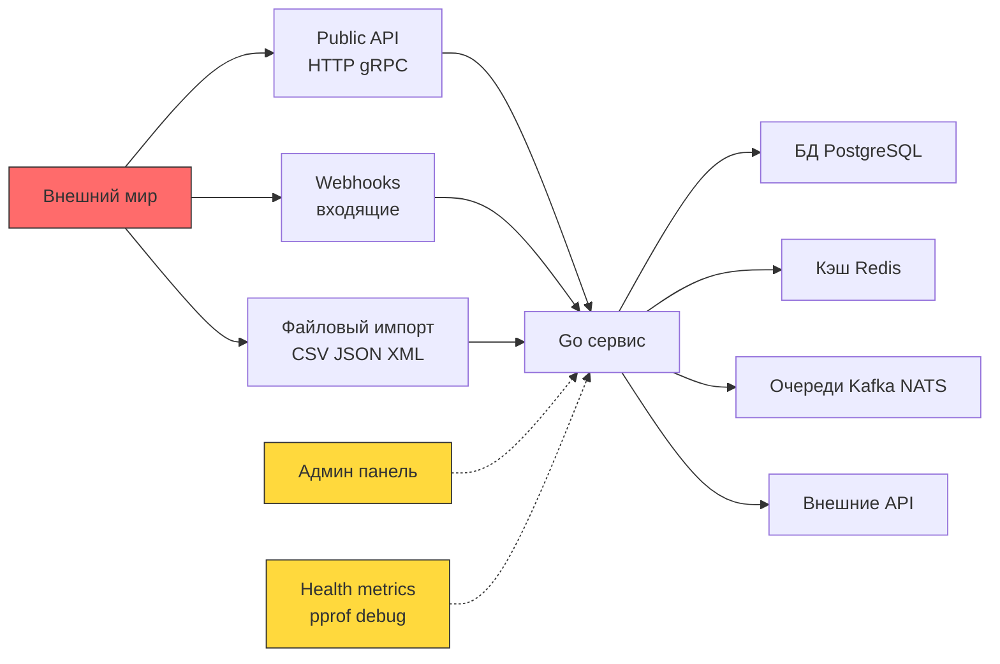
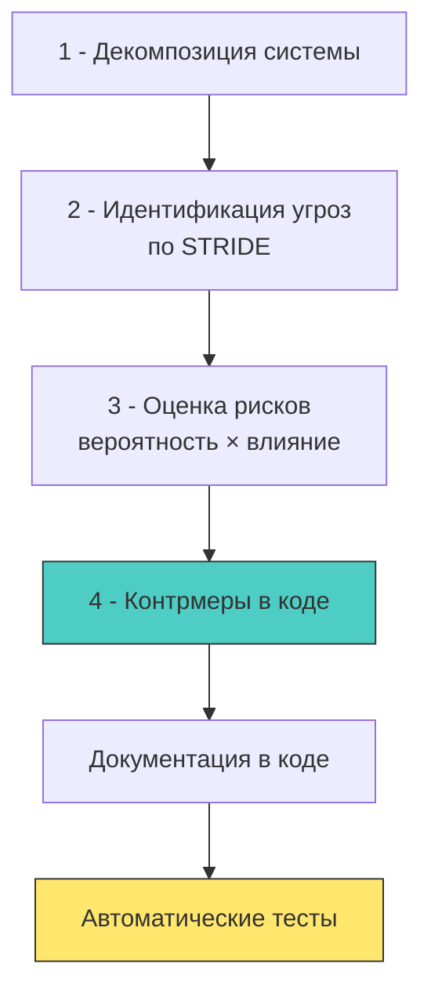
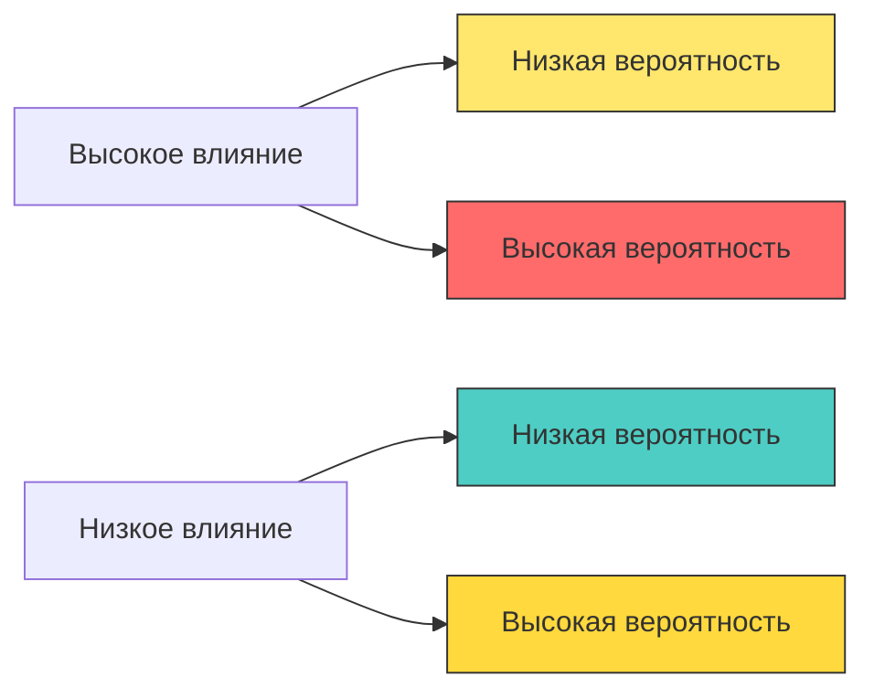

## От абстрактных угроз к конкретным уязвимостям

В предыдущей статье [[1. Обзор раздела. Безопасность как часть архитектуры]] мы договорились, что безопасность — это архитектурный примитив, а не фича. Но как превратить эту философскую установку в конкретные инженерные решения?

Ответ: **Threat Modeling** (моделирование угроз) и анализ **Attack Surface** (поверхности атаки).

Это два взаимодополняющих процесса, которые позволяют перейти от «мы должны быть безопасными» к «вот список из 7 конкретных векторов атаки на наш сервис, и вот как мы их закрываем».

> [!info] Под капотом
> Почему это особенно важно для бэкенда на Go?
> 
> Go-сервисы часто работают в высоконагруженных распределённых системах с множеством точек входа: HTTP-хендлеры, gRPC-методы, консьюмеры очередей, cron-задачи. Каждая из этих точек — потенциальный вход для атаки.
> 
> Кроме того, модель конкурентности Go создаёт уникальные классы уязвимостей:
> - Race condition в проверке прав доступа (TOCTOU)
> - Утечка контекста авторизации между горутинами
> - Блокировки и дедлоки как вектор для DoS-атак
> 
> Без систематического подхода эти нюансы легко упустить.

## Что такое Attack Surface (поверхность атаки)

**Attack Surface** — это совокупность всех точек, через которые злоумышленник может попытаться взаимодействовать с вашей системой, передать данные или вызвать нежелательное поведение.

Для бэкенда на Go поверхность атаки обычно включает:



### Классификация точек входа в Go-сервисе

| Тип точки входа | Пример в коде | Риск |
|----------------|-------------|------|
| **HTTP-хендлер** | `http.HandleFunc("/api/users", handler)` | Injection, auth bypass, DoS |
| **gRPC-метод** | `func (s *srv) GetUser(ctx, req) (*Resp, error)` | Те же риски + protobuf-десериализация |
| **Консьюмер очереди** | `ch, _ := amqp.Consume(...)` | Malicious payload, replay-атаки |
| **CLI-аргументы / env** | `os.Args`, `os.Getenv("DB_PASSWORD")` | Command injection, утечка секретов |
| **Файловая система** | `os.ReadFile(configPath)` | Path traversal, symlink attacks |
| **Сетевые сокеты** | `net.Dial`, `net.Listen` | SSRF, port scanning, MITM |
| **Debug-эндпоинты** | `net/http/pprof`, `expvar` | Information disclosure, DoS |

> [!warning] Ловушка / Gotcha
> **Debug-эндпоинты в продакшене**
> 
> В Go очень легко случайно экспонировать чувствительную информацию:
> 
> ```go
> // ❌ Опасно: pprof доступен публично
> func main() {
>     go func() {
>         // 🔴 Любой может получить дампы памяти, трассировки горутин
>         log.Println(http.ListenAndServe("0.0.0.0:6060", nil))
>     }()
>     // ... основной сервер
> }
> ```
> 
> **Решение:**
> ```go
> // ✅ Безопасно: отдельный сервер на localhost с auth
> func setupDebugServer() {
>     mux := http.NewServeMux()
>     mux.Handle("/debug/pprof/", 
>         httpBasicAuth(pprof.Index(), "admin", getDebugPassword()))
>     
>     srv := &http.Server{
>         Addr:    "127.0.0.1:6060", // 🔒 Только localhost
>         Handler: mux,
>     }
>     go srv.ListenAndServe()
> }
> 
> func httpBasicAuth(handler http.Handler, user, pass string) http.Handler {
>     return http.HandlerFunc(func(w http.ResponseWriter, r *http.Request) {
>         u, p, ok := r.BasicAuth()
>         if !ok || !subtle.ConstantTimeCompare([]byte(u), []byte(user)) == 1 ||
>             !subtle.ConstantTimeCompare([]byte(p), []byte(pass)) == 1 {
>             w.WriteHeader(http.StatusUnauthorized)
>             return
>         }
>         handler.ServeHTTP(w, r)
>     })
> }
> ```
> 
> Используйте `crypto/subtle.ConstantTimeCompare` для сравнения паролей, чтобы избежать timing-атак.

## Что такое Threat Modeling (моделирование угроз)

**Threat Modeling** — это структурированный процесс выявления, оценки и документирования потенциальных угроз безопасности для системы.

Самая популярная методология — **STRIDE**, разработанная Microsoft:

| Буква | Угроза | Вопрос для бэкенда на Go | Пример контрмеры |
|-------|--------|-------------------------|-----------------|
| **S**poofing | Выдача себя за другого | «Может ли атакующий подделать JWT-токен или сессию?» | Подпись токенов криптографически, валидация подписи на каждом запросе |
| **T**ampering | Несанкционированное изменение данных | «Можно ли изменить SQL-запрос через пользовательский ввод?» | Parameterized queries, валидация входных данных |
| **R**epudiation | Отказ от действий | «Может ли пользователь отрицать, что совершил действие?» | Аудит-логирование с неизменяемыми записями, подпись событий |
| **I**nformation Disclosure | Утечка информации | «Что попадёт в логи при ошибке? Не утекут ли токены?» | Структурированное логирование с фильтрацией чувствительных полей |
| **D**enial of Service | Отказ в обслуживании | «Можно ли исчерпать память или горутины одним запросом?» | Rate limiting, timeouts, ограничение размера запросов |
| **E**levation of Privilege | Повышение привилегий | «Может ли обычный пользователь получить доступ к админ-функциям?» | RBAC на уровне бизнес-логики, проверка прав в каждом хендлере |

### Практический процесс: 4 шага для Go-разработчика



#### Шаг 1: Декомпозиция

Разбейте систему на компоненты и потоки данных. Для Go-сервиса это может выглядеть так:

```go
// Пример: структура сервиса с явными границами доверия
type UserService struct {
    // 🔒 Внутренние зависимости - доверенные
    db     *sql.DB        // PostgreSQL с ограниченными правами
    cache  *redis.Client  // Только для чтения, кроме сессий
    logger *slog.Logger   // С фильтрацией чувствительных данных
    
    // ⚠️ Внешние зависимости - недоверенные
    httpClient *http.Client  // С настроенными таймаутами и TLS
    authClient *AuthClient   // Валидация токенов
    
    // 🎯 Граница: публичный API
    router *http.ServeMux  // Регистрация хендлеров с middleware
}

// Контракт хендлера: явные зависимости и контекст
func (s *UserService) GetUserHandler(w http.ResponseWriter, r *http.Request) {
    // 1. Извлечение и валидация контекста безопасности
    ctx := r.Context()
    auth, err := auth.FromContext(ctx)
    if err != nil {
        // 🔒 Fail secure: общая ошибка, детали в лог
        s.logger.ErrorContext(ctx, "auth extraction failed", "err", err)
        http.Error(w, http.StatusText(http.StatusUnauthorized), http.StatusUnauthorized)
        return
    }
    
    // 2. Проверка прав ДО доступа к данным
    userID := chi.URLParam(r, "id")
    if !s.authz.CanReadUser(auth.Subject, userID) {
        http.Error(w, http.StatusText(http.StatusForbidden), http.StatusForbidden)
        return
    }
    
    // 3. Только теперь - бизнес-логика
    user, err := s.db.QueryRowContext(ctx, "SELECT ... WHERE id = $1", userID)
    // ... обработка
}
```

#### Шаг 2: Идентификация угроз по STRIDE

Для каждого компонента задайте вопросы из таблицы STRIDE. Пример для хендлера выше:

| Компонент | S | T | R | I | D | E |
|-----------|---|---|---|---|---|---|
| `auth.FromContext` | Может ли токен быть подделан? | Может ли контекст быть изменён между горутинами? | Логируется ли успешная/неудачная аутентификация? | Не попадёт ли токен в лог при ошибке? | Можно ли завалить сервис фейковыми токенами? | Может ли пользователь получить чужой контекст? |
| `db.QueryRowContext` | Может ли атакующий подключиться к БД напрямую? | Возможен ли SQL injection? | Логируются ли запросы для аудита? | Не утекут ли данные через ошибки БД? | Можно ли исчерпать connection pool? | Может ли обычный пользователь выполнить админ-запрос? |

#### Шаг 3: Оценка рисков

Используйте простую матрицу: **Вероятность × Влияние**.



Приоритет исправления: 
1. 🔴 Высокая вероятность + Высокое влияние (исправлять немедленно)
2. 🟡 Низкая вероятность + Высокое влияние (планировать, иметь workaround)
3. 🟡 Высокая вероятность + Низкое влияние (автоматизировать защиту)
4. 🟢 Низкая вероятность + Низкое влияние (принять риск или мониторить)

#### Шаг 4: Контрмеры в коде

Превращайте угрозы в конкретные проверки и паттерны:

```go
// Пример: защита от нескольких угроз одновременно
func (s *UserService) UpdateEmail(ctx context.Context, userID, newEmail string) error {
    // 🔒 D: Rate limiting на уровне сервиса
    if !s.rateLimiter.Allow(userID, "update_email") {
        return ErrRateLimitExceeded
    }
    
    // 🔒 T: Валидация входных данных
    if !isValidEmail(newEmail) {
        return ErrInvalidEmail // 🔒 I: без деталей в ошибке
    }
    
    // 🔒 E: Проверка прав перед операцией
    auth, ok := auth.FromContext(ctx)
    if !ok || auth.Subject != userID {
        return ErrForbidden
    }
    
    // 🔒 R: Аудит изменения
    s.auditLog(ctx, "email_changed", userID, map[string]any{
        "old": s.getCurrentUserEmail(userID),
        "new": maskEmail(newEmail), // 🔒 I: маскировка в логе
    })
    
    // 🔒 T: Parameterized query против SQL injection
    _, err := s.db.ExecContext(ctx, 
        "UPDATE users SET email = $1 WHERE id = $2", 
        newEmail, userID)
    
    // 🔒 I: Обработка ошибки без утечки
    if err != nil {
        s.logger.ErrorContext(ctx, "db update failed", "err", sanitizeDBError(err))
        return ErrInternal // общая ошибка клиенту
    }
    
    return nil
}
```

## Уникальные аспекты Go: конкурентность и безопасность

Модель горутин создаёт специфические векторы атак, которые нужно учитывать при моделировании угроз.

### Race Condition как уязвимость (TOCTOU)

**Time-of-Check-Time-of-Use** — классическая проблема, когда между проверкой права и использованием ресурса состояние меняется.

```go
// ❌ Уязвимый код: проверка и использование не атомарны
func (s *FileService) ReadFile(ctx context.Context, path string) ([]byte, error) {
    // Проверка прав
    if !s.acl.CanRead(auth.FromContext(ctx), path) {
        return nil, ErrForbidden
    }
    
    // 🔴 Race window: между проверкой и чтением файл может быть заменён
    // или путь может быть изменён (symlink attack)
    return os.ReadFile(path) // 🔴 Path traversal риск
}

// ✅ Безопасный подход: атомарная операция или блокировка
func (s *FileService) ReadFile(ctx context.Context, path string) ([]byte, error) {
    // 1. Нормализация пути (защита от ../)
    cleanPath, err := filepath.Abs(filepath.Join(s.rootDir, path))
    if err != nil || !strings.HasPrefix(cleanPath, s.rootDir) {
        return nil, ErrInvalidPath
    }
    
    // 2. Проверка и чтение в одной критической секции
    var data []byte
    err = s.fileMutex.Do(cleanPath, func() error {
        if !s.acl.CanRead(auth.FromContext(ctx), cleanPath) {
            return ErrForbidden
        }
        var readErr error
        data, readErr = os.ReadFile(cleanPath)
        return readErr
    })
    
    return data, err
}
```

> [!tip] Собеседование
> **Вопрос:** Как race condition в Go может стать уязвимостью безопасности, а не просто багом?
> 
> **Ответ:** 
> 1. Если проверка прав и доступ к ресурсу разделены во времени, атакующий может изменить состояние между этими операциями (TOCTOU).
> 2. В конкурентной среде без правильной синхронизации флаг авторизации может быть прочитан неактуальным.
> 3. **Решение:** использовать атомарные операции, транзакции БД с правильным уровнем изоляции, или явные блокировки (`sync.Mutex`, `singleflight.Group`) для критических секций.
> 4. Инструмент `go run -race` помогает найти гонки, но не все гонки — уязвимости; нужен контекстный анализ.

### Утечка контекста между горутинами

Контекст в Go — мощный инструмент, но его неправильное использование может привести к утечке данных авторизации.

```go
// ❌ Опасно: передача контекста с чувствительными данными в фон
func (s *Handler) Process(w http.ResponseWriter, r *http.Request) {
    ctx := r.Context()
    auth := auth.FromContext(ctx) // 🔒 Содержит userID, роли, токены
    
    // 🔴 Горутина живёт дольше запроса, контекст может быть использован неверно
    go func() {
        s.backgroundJob(ctx, auth) // 🔴 auth может устареть или быть скомпрометирован
    }()
}

// ✅ Безопасно: копирование только необходимых данных
func (s *Handler) Process(w http.ResponseWriter, r *http.Request) {
    ctx := r.Context()
    auth := auth.FromContext(ctx)
    
    // Извлекаем только идентификатор, без токенов и чувствительных данных
    userID := auth.Subject
    
    go func() {
        // Создаём новый контекст без чувствительных данных
        bgCtx := context.WithValue(context.Background(), userIDKey, userID)
        s.backgroundJob(bgCtx, userID) // 🔒 Минимум привилегий
    }()
}
```

## Инструменты для автоматизации threat modeling в Go

Ручной анализ — это важно, но автоматизация помогает масштабировать безопасность.

### Статический анализ с `gosec`

```bash
# Установка
go install github.com/securego/gosec/v2/cmd/gosec@latest

# Запуск с настройками для продакшена
gosec -exclude=G104,G115 -fmt=sarif -out=security-report.sarif ./...
```

| Правило | Что ищет | Пример уязвимости |
|---------|----------|------------------|
| **G101** | Хардкод секретов | `password := "admin123"` |
| **G104** | Игнорирование ошибок | `_ = file.Close()` |
| **G109** | Потенциальный integer overflow | `int32(a) + int32(b)` без проверок |
| **G201/G202** | SQL injection | `db.Query("SELECT * FROM users WHERE id = " + id)` |
| **G306** | Неправильные права на файлы | `os.WriteFile(path, data, 0644)` вместо `0600` |

### Интеграция в CI/CD

```yaml
# .github/workflows/security.yml
name: Security Scan
on: [push, pull_request]
jobs:
  gosec:
    runs-on: ubuntu-latest
    steps:
      - uses: actions/checkout@v3
      - name: Run Gosec
        uses: securego/gosec@master
        with:
          args: '-exclude=G104 -fmt=sarif -out=results.sarif ./...'
      - name: Upload SARIF
        uses: github/codeql-action/upload-sarif@v2
        with:
          sarif_file: results.sarif
```

### Документирование угроз в коде

Используйте комментарии и godoc для фиксации принятых решений:

```go
// Security: Threat Model Reference
// - STRIDE: [T]ampering via SQL injection -> mitigated by parameterized queries
// - STRIDE: [I]nformation disclosure via error messages -> generic errors to client
// - Last reviewed: 2024-01-15 by @security-team
func (s *UserService) GetUser(ctx context.Context, id string) (*User, error) {
    // ...
}
```

## Чек-лист для код-ревью с фокусом на безопасность

Добавьте эти пункты в процесс ревью кода:

```markdown
## Security Checklist
- [ ] Все пользовательские данные валидируются на входе (allowlist, не blocklist)
- [ ] Ошибки не раскрывают внутреннюю структуру системы или данные
- [ ] Чувствительные данные не логируются (или маскируются)
- [ ] Контекст авторизации проверяется перед каждым доступом к ресурсу
- [ ] Нет хардкода секретов, токенов, паролей
- [ ] Используется `crypto/subtle` для сравнения секретов
- [ ] Таймауты настроены для всех внешних вызовов (БД, HTTP, Redis)
- [ ] Rate limiting реализован для публичных эндпоинтов
- [ ] Зависимости проверены на уязвимости (`govulncheck`, `osv-scanner`)
- [ ] Debug-эндпоинты отключены или защищены в продакшене
```

> [!tip] Собеседование
> **Вопрос:** Как бы вы провели threat modeling для нового микросервиса на Go с нуля?
> 
> **Ответ (структурированный подход):**
> 1. **Декомпозиция**: нарисовать диаграмму потоков данных, выделить trust boundaries.
> 2. **Идентификация**: пройтись по STRIDE для каждого компонента, записать угрозы.
> 3. **Приоритизация**: оценить риски по матрице вероятность/влияние.
> 4. **Контрмеры**: для каждого высокого риска — конкретная реализация в коде (валидация, authZ, логирование).
> 5. **Документация**: зафиксировать решения в ADR (Architecture Decision Record) или в godoc.
> 6. **Верификация**: написать тесты на негативные сценарии, добавить статический анализ в CI.
> 7. **Повтор**: обновлять модель при изменении архитектуры.

## Итог

Threat modeling и анализ attack surface — это не разовое упражнение, а **непрерывный процесс**, который должен быть встроен в цикл разработки.

Ключевые выводы:
1. **Attack Surface** — карта всех точек входа; чем она меньше, тем проще защищать.
2. **STRIDE** — практическая рамка для систематического поиска угроз.
3. **Go-специфика**: конкурентность создаёт уникальные риски (race condition, утечка контекста), которые нужно учитывать явно.
4. **Автоматизация**: `gosec`, CI-интеграции, чек-листы для ревью помогают масштабировать безопасность.
5. **Документация в коде**: фиксируйте принятые решения о безопасности рядом с реализацией.

В следующей статье мы перейдём к конкретным уязвимостям и разберём **OWASP Top 10** с примерами на Go: как эти атаки выглядят в коде, как их обнаружить и как защитить приложение.

[[3. OWASP Top 10 для backend разработчика]]